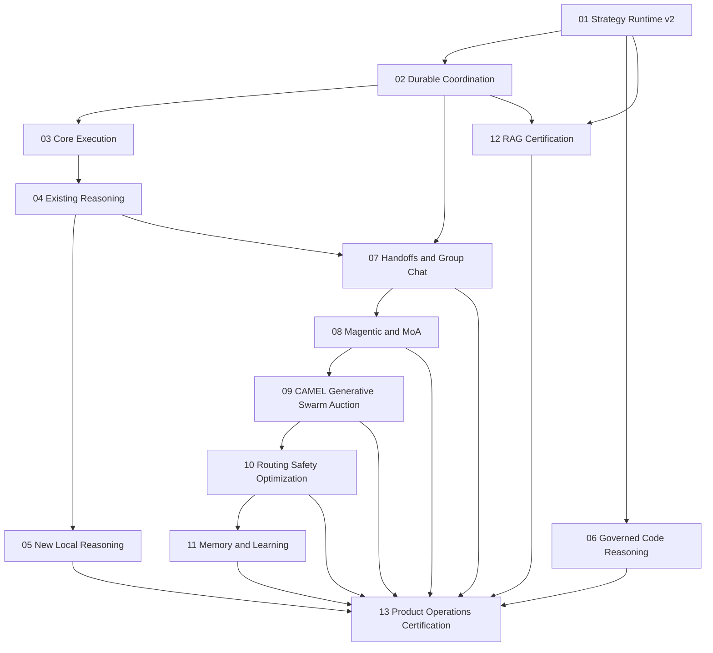

# Agent Pattern Completion Master Implementation Plan

> **For agentic workers:** REQUIRED SUB-SKILL: Use superpowers:subagent-driven-development
> (recommended) or superpowers:executing-plans to implement this plan task-by-task. Steps use
> checkbox (`- [ ]`) syntax for tracking.

**Goal:** Complete and production-certify every planned, partial, scaffold-level, aliased, and
materially misclassified AgentVerse capability across the six learning phases.

**Architecture:** Introduce a versioned Strategy Runtime over `AgentGraph`, a durable
Coordination Runtime under Civilization, a single governed execution boundary for generated
code, and an evidence-backed memory/certification lifecycle. Thirteen independently testable
programs deliver the system behind feature flags and converge in one end-to-end product and
operations certification gate.

**Tech Stack:** Python 3.12, FastAPI, Pydantic 2, LangGraph, SQLAlchemy 2, PostgreSQL with RLS
and pgvector, Redis Streams, Celery, MCP/A2A, React 19, TypeScript, Vite, TanStack Query,
Zustand, pytest, Ruff, mypy, Vitest, Playwright, OpenTelemetry, Prometheus, Alembic.

---

## Source Of Truth

- Approved design: [Agent Pattern Completion Program Design](../specs/2026-08-03-agent-pattern-completion-program-design.md)
- Repository guidance: `AGENTS.md`, `CLAUDE.md`
- Canonical strategy catalogue: `agent-verse-backend/app/orchestration/strategy_registry.py`
- Canonical single-agent kernel: `agent-verse-backend/app/agent/graph.py`
- Canonical multi-agent boundary: `agent-verse-backend/app/civilization/`
- Canonical generated-code boundary: `agent-verse-backend/app/execution_environment/`

The approved design and the thirteen child plans are normative. This master plan owns dependency
ordering, migration ownership, integration gates, release sequencing, and complete coverage.

## Program Index

| Program | Plan | Primary outcome | Migration |
|---|---|---|---|
| 01 | [Strategy Runtime v2](2026-08-03-agent-pattern-program-01-strategy-runtime-v2.md) | Executable versioned adapters, authoritative profiles, readiness and certification evidence | `0096_strategy_runtime_v2` |
| 02 | [Durable Coordination Runtime](2026-08-03-agent-pattern-program-02-durable-coordination-runtime.md) | Canonical sessions, messages, work, leases, checkpoints, outbox, replay | `0097_coordination_runtime` |
| 03 | [Core Execution](2026-08-03-agent-pattern-program-03-core-execution.md) | ReAct/plan/wave/loop/workflow consolidation and legacy-loop retirement | `0098_core_execution_certification` |
| 04 | [Existing Reasoning And Evaluation](2026-08-03-agent-pattern-program-04-existing-reasoning-evaluation.md) | Existing reasoning selection, truthful scorecards, regression gates | `0099_reasoning_evaluation_evidence` |
| 05 | [New Local Reasoning](2026-08-03-agent-pattern-program-05-new-local-reasoning.md) | Few-Shot CoT, GoT, Least-to-Most, ReWOO, LATS, LLM Compiler | None |
| 06 | [Governed Code Reasoning](2026-08-03-agent-pattern-program-06-governed-code-reasoning.md) | Sandbox hardening, PoT, CodeAct, governed code tool | None |
| 07 | [Handoffs And Group Chat](2026-08-03-agent-pattern-program-07-handoffs-group-chat.md) | Same-civilization handoffs, canonical transcript, durable existing multi-agent modes | `0100_handoffs_group_chat` |
| 08 | [Magentic And Mixture-of-Agents](2026-08-03-agent-pattern-program-08-magentic-mixture-of-agents.md) | Progress ledger, stalls/replans, layered proposal aggregation | `0101_magentic_moa` |
| 09 | [CAMEL, Generative Agents, Swarm, Auction](2026-08-03-agent-pattern-program-09-camel-generative-swarm-auction.md) | Role collaboration, simulations, governed peer coordination, deterministic markets | `0102_camel_generative_swarm_auction` |
| 10 | [Routing, Safety, Optimization](2026-08-03-agent-pattern-program-10-routing-safety-optimization.md) | Unified routing, safety compilation, optimization, BabyAGI and AutoGPT | `0103_routing_safety_optimization` |
| 11 | [Memory And Learning](2026-08-03-agent-pattern-program-11-memory-learning.md) | Full Reflexion, canonical memory lifecycle, experiments and Voyager | `0104_memory_learning` |
| 12 | [RAG Readiness Certification](2026-08-03-agent-pattern-program-12-rag-readiness-certification.md) | Truthful readiness and live certification for all 18 RAG strategies | None |
| 13 | [Product And Operations Certification](2026-08-03-agent-pattern-program-13-product-operations-certification.md) | APIs, SDKs, frontend, accessibility, operations, canary and final certification | None |

## Dependency Model

### Integration spine

The migration and authority-changing integration spine is strictly ordered:

```text
01 -> 02 -> 03 -> 04 -> 07 -> 08 -> 09 -> 10 -> 11 -> 13
```

Programs 05, 06, and 12 are parallel capability tracks:

- Program 05 starts after Programs 01 and 04.
- Program 06 starts after Program 01 and merges before Program 13.
- Program 12 starts after Programs 01 and 02 and merges before Program 13.
- Program 13 starts only after every applicable child-plan definition of done passes.



## Migration Ownership

The implementation must maintain exactly one Alembic head:

```text
0095_raft_lifecycle
  -> 0096_strategy_runtime_v2
  -> 0097_coordination_runtime
  -> 0098_core_execution_certification
  -> 0099_reasoning_evaluation_evidence
  -> 0100_handoffs_group_chat
  -> 0101_magentic_moa
  -> 0102_camel_generative_swarm_auction
  -> 0103_routing_safety_optimization
  -> 0104_memory_learning
```

Programs 05, 06, 12, and 13 must not create speculative migrations. If implementation discovers
a necessary schema change, amend the owning predecessor plan before coding rather than creating
an unreviewed branch head.

## Execution Waves

### Wave 0: Baseline And Isolation

- [ ] Create a dedicated worktree using the repository worktree workflow.
- [ ] Record `git status --short`, `git rev-parse HEAD`, and `uv run alembic heads`.
- [ ] Run backend baseline:

  ```bash
  cd agent-verse-backend
  uv run ruff check .
  uv run mypy app
  uv run pytest -m "not slow" -q
  ```

  Expected: all commands pass before feature work. Record unrelated failures without changing
  program scope.

- [ ] Run frontend baseline:

  ```bash
  cd agent-verse-frontend
  npm run lint
  npm run typecheck
  npm run test -- --run
  npm run build
  ```

  Expected: all commands pass before feature work.

- [ ] Capture current OpenAPI, Python SDK, TypeScript SDK, migration-head, bundle-size, and
  performance baselines as Program 13 certification inputs.
- [ ] Execute Program 01 Task 12 to generate `docs/architecture/agent-pattern-capability-inventory.json`; review and freeze one row for every six-phase registry entry, scaffold, alias, stale classification, and verified non-registry capability before feature implementation begins.

### Wave 1: Strategy Authority

- [ ] Execute every checkbox in Program 01 using TDD.
- [ ] Run Program 01 focused validation and the backend orchestration/goal regression suites.
- [ ] Verify runtime profiles are built once for the correct goal before graph construction.
- [ ] Verify catalogue state cannot become `implemented` without canonical execution evidence.
- [ ] Apply `0096_strategy_runtime_v2` in a disposable integration database and downgrade to
  `0095_raft_lifecycle`.
- [ ] Review API compatibility, RLS, trace redaction, budget, deadline, and cancellation evidence.
- [ ] Commit Program 01 only after its definition of done passes.

### Wave 2: Durable Coordination And Parallel Foundations

- [ ] Execute Program 02 and apply `0097_coordination_runtime`.
- [ ] In parallel after Program 01, begin Program 06 contract/policy/runner work with code
  execution disabled.
- [ ] In parallel after Programs 01-02, begin Program 12 readiness/state derivation in shadow
  mode without changing production RAG selection.
- [ ] Prove Postgres reconstruction with Redis unavailable.
- [ ] Prove duplicate Celery delivery cannot duplicate accepted transitions or side effects.
- [ ] Prove RLS denies cross-tenant reads and writes for every coordination table.
- [ ] Verify replay uses monotonic sequence and resumes from persisted cursors.
- [ ] Commit Program 02 only after its definition of done passes.

### Wave 3: Kernel And Existing Reasoning

- [ ] Execute Program 03 and apply `0098_core_execution_certification`.
- [ ] Consolidate workflow executors before retiring any legacy path.
- [ ] Prove ReAct, plan, structured dependencies, waves, loops, persistence rotation, restart,
  cancellation, and rollback behavior.
- [ ] Execute Program 04 and apply `0099_reasoning_evaluation_evidence`.
- [ ] Wire Self-Refine, Self-Consistency, Tree of Thoughts, and Peer Review through the selected
  production profile.
- [ ] Correct runtime scorecard evidence and establish immutable regression baselines.
- [ ] Preserve safe summaries only; verify private reasoning is absent from API, DB, logs, traces,
  and events.
- [ ] Commit Programs 03 and 04 separately after their definitions of done pass.

### Wave 4: New Reasoning And First Durable Collaboration

- [ ] Execute Program 05 after Program 04.
- [ ] Execute Program 07 after Programs 02 and 04; apply `0100_handoffs_group_chat`.
- [ ] Continue Program 06 PoT/CodeAct adapters only after the production-equivalent sandbox,
  artifact, cancellation, policy, and audit probes pass.
- [ ] Complete Program 12 delegated-readiness closure, persistence, recovery, and live-report
  scaffolding.
- [ ] Prove handoff reauthorization, context minimization, budget/deadline propagation, expiry,
  rejection, cancellation, and source resume.
- [ ] Prove group-chat ordering, compaction invariants, speaker policies, human pause/resume, and
  replay.
- [ ] Prove all new reasoning adapters stop on token, cost, call, node, depth, time, and
  cancellation limits.
- [ ] Commit Programs 05, 06, 07, and 12 independently after their definitions of done pass.

### Wave 5: Adaptive Multi-Agent Coordination

- [ ] Execute Program 08 and apply `0101_magentic_moa`.
- [ ] Prove immutable ledger revisions, satisfaction criteria, stall detection, bounded resets,
  replanning, next-speaker selection, and optional human review.
- [ ] Prove MoA diversity, proposal validation, quorum, deadline, cost reservation, replacement,
  degradation, aggregation, provenance, and cancellation.
- [ ] Execute Program 09 and apply `0102_camel_generative_swarm_auction`.
- [ ] Prove CAMEL role boundaries and termination.
- [ ] Prove Generative Agent simulation clocks, observation/reflection/planning memory, and
  bounded advancement.
- [ ] Prove swarm deduplication, TTL, hop limits, leases, fencing, reclaim, convergence, and
  Governor authority.
- [ ] Prove sealed bids, deterministic scoring, fairness metrics, collusion defenses, winner
  lease, no-bid fallback, and rebid.
- [ ] Commit Programs 08 and 09 separately after their definitions of done pass.

### Wave 6: Routing, Safety, Memory, And Learning

- [ ] Execute Program 10 and apply `0103_routing_safety_optimization`.
- [ ] Unify model routing ownership and wire agent, skill, tool, trust, embedding, cost, latency,
  compression, and context-budget decisions through one traceable policy.
- [ ] Prove deterministic policy denial precedes Constitutional AI critique/revision.
- [ ] Wire plan verification, data classification, provenance verification, and sandbox
  certification before BabyAGI or AutoGPT enablement.
- [ ] Prove BabyAGI and AutoGPT use durable bounded work items rather than unrestricted loops.
- [ ] Execute Program 11 and apply `0104_memory_learning`.
- [ ] Unify Reflexion stores/writers and prove awaited semantic recall, evidence quarantine,
  usefulness feedback, retention, deletion, and tenant isolation.
- [ ] Complete long-term extraction, semantic episodic recall, procedural validation, KG memory,
  prospective memory, consolidation, experiments, Voyager, and self-improvement actions.
- [ ] Commit Programs 10 and 11 separately after their definitions of done pass.

### Wave 7: Product And Operations Certification

- [ ] Execute Program 13 only after Programs 01-12 meet their implementation gates.
- [ ] Add backward-compatible REST, SSE replay, and authorized/backpressured WebSocket contracts.
- [ ] Regenerate OpenAPI and update Python and TypeScript SDKs with contract parity.
- [ ] Build strategy, timeline, transcript, ledger, topology, bid, code, memory, and explain views.
- [ ] Pass automated accessibility plus documented VoiceOver and NVDA checks.
- [ ] Add safe metrics/traces, dashboards, alerts, and runbooks before traffic expansion.
- [ ] Pass load, soak, chaos, restart, duplicate, RLS, security, cost, and canary suites.
- [ ] Generate capability documentation from runtime evidence rather than manually maintained
  registry labels.
- [ ] Promote one strategy at a time from `partial` to `implemented`, then to `certified` only
  when its evidence gate passes.

## Cross-Program Quality Gates

### Gate A: Contract And Compatibility

- Public changes are additive until a separately approved major version.
- Existing goal creation, result, SSE, and SDK methods remain operational.
- Strategy, state, checkpoint, event, and artifact schemas are versioned.
- Resume rejects incompatible adapter/state versions with `resume_blocked`.

### Gate B: Security And Governance

- Every new table uses tenant-leading indexes and enforced RLS `USING` plus `WITH CHECK`.
- Every child action rechecks identity, authorization, classification, connector allowlist,
  policy, budget, deadline, and HITL.
- Handoffs do not transfer privilege.
- Shared messages carry trust labels and prompt-injection screening.
- Generated code never executes on the host or bypasses the governed dispatcher.
- Logs, traces, events, APIs, and evidence exclude secrets, unnecessary PII, and private
  chain-of-thought.

### Gate C: Reliability

- PostgreSQL is canonical for accepted state.
- Redis loss delays but does not lose accepted work.
- Commands and consumers are idempotent.
- Worker crashes resume from accepted checkpoints without repeating side effects.
- Leases use fencing tokens and deterministic reclaim.
- Cancellation propagates to children, claims, model calls, tools, and sandboxes.

### Gate D: Bounded Autonomy

- Every strategy has hard fan-out, depth, rounds, calls, nodes, edges, tokens, time, and cost
  limits appropriate to its algorithm.
- Admission reserves budget before fan-out.
- Live metering can terminate work before the ceiling is exceeded.
- Tenant feature flags and global kill switches work without redeployment.

### Gate E: Evidence And Certification

- Unit success alone cannot change registry state.
- Canonical production-path, readiness, restart, RLS, policy, cost, observability, and canary
  evidence is required for certification.
- Historical rows without evidence remain `historical_unverified`.
- Readiness and certification expire when dependencies, adapter versions, policy versions, or
  baselines change.

### Gate F: Exhaustive Capability Ownership

- `docs/architecture/agent-pattern-capability-inventory.json` is the normative completeness manifest.
- Every row has exactly one owning program/task and one intended final state: certified, implemented, partial with explicit blocker, reconciled alias, or deprecated with rationale.
- Program 13 fails when a row is missing, duplicated, unowned, unresolved, linked to a missing source/task, or claims a stronger state than its evidence.
- Runtime-derived capability documentation and the registry must reconcile to the manifest before general availability.

## Six-Phase Coverage Matrix

| Learning phase | Plans | Completion evidence |
|---|---|---|
| 1. Core execution | 01, 03 | Authoritative profile, consolidated kernel, durable replay, legacy retirement |
| 2. Reasoning and evaluation | 04, 05, 06 | Existing selection closure, new adapters, sandbox certification, regression evidence |
| 3. Retrieval | 12, 13 | All 18 adapters have truthful readiness, recovery, policy, cost, and live evidence |
| 4. Multi-agent | 02, 07, 08, 09 | Durable protocols, transcript/ledger/lease/market state, recovery and UI |
| 5. Routing/control/safety/optimization | 01, 06, 10, 13 | Unified bounded decisions, compiled policy, safe code, operator controls |
| 6. Memory and learning | 04, 11, 13 | Evidence-backed recall, lifecycle, experiments, explainability and governance |

## Named-Gap Traceability

| Requested gap | Owning plan |
|---|---|
| True agent handoffs | 07 |
| Canonical shared-context group chat | 02, 07, 13 |
| Magentic-One progress ledger | 08, 13 |
| Fully decentralized swarm/network coordination | 09, constrained by Governor |
| Mixture-of-Agents | 08 |
| CodeAct | 06 |
| Graph of Thoughts | 05 |
| ReWOO | 05 |
| Program of Thought | 06 |
| Least-to-Most | 05 |
| Market/auction task allocation | 09 |
| Full Reflexion recall integration | 11, 13 |

## Final Validation Commands

Run from the repository root after Program 13:

```bash
cd agent-verse-backend
uv run alembic heads
uv run alembic upgrade head
uv run ruff check .
uv run mypy app
uv run pytest -m "not slow" --cov=app --cov-report=term-missing

cd ../agent-verse-sdk-python
uv run pytest

cd ../agent-verse-sdk-typescript
npm run build
npm test

cd ../agent-verse-frontend
npm run lint
npm run typecheck
npm run test -- --run
npm run build
npm run test:e2e
```

Expected:

- Alembic reports one head, `0104_memory_learning`.
- Ruff, mypy, backend tests, both SDK suites, frontend lint/typecheck/unit/build/E2E pass.
- New-code line coverage is at least 80% and branch coverage at least 75%.
- No test, migration, API, SDK, accessibility, security, readiness, or certification gate is
  skipped.

## Release Sequence

1. Deploy additive migrations and disabled code paths.
2. Run runtime/profile/readiness resolution in shadow mode.
3. Enable persistence writes and replay reads for internal tenants.
4. Enable low-risk local strategies one at a time.
5. Enable handoffs/group chat, then Magentic/MoA, then swarm/auction.
6. Enable PoT/CodeAct only after production sandbox certification.
7. Enable optimization, long-horizon controllers, and learning actions last.
8. Expand by tenant cohort only when quality, cost, latency, safety, and reliability baselines
   pass.
9. Retain global and per-strategy kill switches plus legacy fallback for one stable release.
10. Remove legacy paths only after the rollback window and compatibility telemetry are clean.

## Rollback Strategy

- Prefer feature-flag and adapter-selection rollback over schema downgrade.
- Stop new admissions before disabling a strategy.
- Cancel or drain active runs according to the adapter contract.
- Preserve accepted state, evidence, transcripts, ledgers, bids, allocations, and lessons.
- Do not downgrade forward-only migrations after production writes are accepted.
- Restore legacy AgentGraph selection only for compatible goals during the declared rollback
  window.
- Run replay and reconciliation before re-enabling any rolled-back capability.

## Master Definition Of Done

- [ ] All thirteen child-plan definitions of done pass.
- [ ] The migration chain has one head and passes upgrade/downgrade tests at every reversible
  boundary.
- [ ] Every planned, partial, scaffold-level, alias, and stale capability has an implemented,
  certified, reconciled, or explicitly deprecated outcome.
- [ ] Every named gap is executable through the canonical production path.
- [ ] No capability bypasses governance, RLS, budgets, HITL, audit, or sandbox controls.
- [ ] All long-running capabilities survive API, worker, and Redis restarts without losing
  accepted work or repeating side effects.
- [ ] Public APIs remain backward compatible; OpenAPI and both SDKs have parity.
- [ ] Frontend experiences are responsive and meet WCAG 2.2 AA with automated and manual
  screen-reader evidence.
- [ ] Operators can explain, replay, approve, cancel, recover, disable, and measure every
  capability.
- [ ] Runtime-derived capability documentation exactly matches implementation, readiness, and
  certification evidence.
- [ ] Canary quality, cost, latency, security, and reliability meet approved baselines before
  general availability.