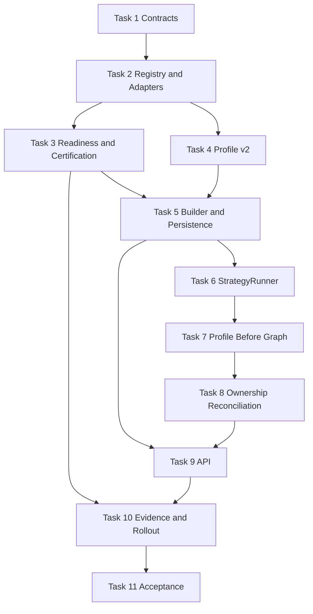

# Agent Pattern Program 01: Strategy Runtime v2 Implementation Plan

> **For agentic workers:** REQUIRED SUB-SKILL: Use superpowers:subagent-driven-development (recommended) or superpowers:executing-plans to implement this plan task-by-task. Steps use checkbox (`- [ ]`) syntax for tracking.

**Goal:** Replace catalogue-label strategy selection with one versioned, executable, readiness-gated strategy runtime whose immutable runtime profile is selected and persisted before any execution graph is compiled.

**Architecture:** Keep `AgentGraph` as the governed single-agent kernel and put versioned adapter resolution, lifecycle, limits, compatibility, readiness, and certification in `app/orchestration/`. `RuntimeProfileBuilder` selects one primary reasoning strategy plus compatible auxiliaries, `StrategyRunner` dispatches the resolved adapter, and a profile-aware graph factory compiles topology only after selection. Existing workflow modes, dynamic graph assembly, model routers, and registry IDs remain supported through explicit compatibility adapters during one stable-release migration window.

**Tech Stack:** Python 3.12, FastAPI, Pydantic v2, LangGraph, SQLAlchemy 2 async, PostgreSQL JSONB/RLS, pytest/pytest-asyncio, Ruff, mypy, Alembic, uv

---

## Planning Assumptions

- The approved source of truth is `docs/superpowers/specs/2026-08-03-agent-pattern-completion-program-design.md`.
- This plan is independently executable and must be completed before Program 02 uses strategy execution IDs and checkpoints.
- Public goal submission remains backward compatible: omitting strategy fields preserves current automatic selection.
- `AgentGraph` remains the local execution kernel; distributed adapters may depend on Program 02 and remain `partial` until that dependency is ready.
- No adapter may claim `implemented` unless it resolves and executes through `StrategyRunner`; no adapter may claim `certified` without persisted evidence.
- Revision `0095_raft_lifecycle` is the current Alembic head. This plan reserves `0096_strategy_runtime_v2`.
- All backend commands run from `agent-verse-backend/` with `uv run` because system Python is not the project interpreter.
- Integration commands require Colima and the repository's documented testcontainers environment variables.

## Source Final Documents

- `docs/superpowers/specs/2026-08-03-agent-pattern-completion-program-design.md`
- `AGENTS.md`
- `CLAUDE.md`
- `agent-verse-backend/app/orchestration/strategy_registry.py`
- `agent-verse-backend/app/orchestration/runtime_profile.py`
- `agent-verse-backend/app/orchestration/runtime_profile_builder.py`
- `agent-verse-backend/app/orchestration/pattern_selector.py`
- `agent-verse-backend/app/agent/graph.py`
- `agent-verse-backend/app/agent/dynamic_graph.py`
- `agent-verse-backend/app/agent/workflow_executor.py`
- `agent-verse-backend/app/agent/model_router.py`
- `agent-verse-backend/app/ai_router/model_orchestrator.py`
- `agent-verse-backend/app/services/goal_service.py`
- `agent-verse-backend/app/api/goals.py`
- `agent-verse-backend/app/main.py`

## Existing Wiring Defects That Must Be Fixed

1. `StrategyState` has no `certified` state, and registry state is manually declared instead of derived from executable and operational evidence.
2. Agent strategies marked `implemented` often have an empty `adapter_path` or a class label that cannot be resolved or invoked through a common contract. Only RAG has executable adapter resolution.
3. `PatternSelector.select_agent_patterns()` returns a list of reasoning patterns without declaring one primary strategy, compatibility, exclusions, or rejected alternatives.
4. `RuntimeProfileBuilder` creates unversioned profiles without strategy versions, limits, dependency readiness, policy snapshots, or compatibility evidence.
5. `AgentGraph.__init__()` calls `_build()` immediately, but `_node_initialize()` may build the runtime profile later. Profile-selected topology therefore cannot affect the already compiled graph.
6. `GoalService._make_agent_loop_for_tenant()` inspects the most recently inserted value in `self._goals` rather than the goal being executed. Concurrent goals can compile with another goal's strategy flags.
7. `GoalService` computes `_enable_supervisor` and `_enable_debate` but does not pass either value to `AgentGraph`; the graph checks undeclared attributes with `getattr`.
8. `GoalService._check_readiness()` fabricates a default profile, ignores the selected profile, and fails open on readiness errors.
9. Profile persistence is split between in-memory `execution_context`, raw SQL, and unused goal columns. `runtime_profile_id`, `patterns_used`, and `rag_strategy_used` are not the authoritative versioned snapshot.
10. Model selection is split across `app.ai_router.router`, `ModelOrchestratorAdapter`, and `app.agent.model_router.ModelRouter`; workflow ownership is split across `workflow_mode`, static `WorkflowExecutor.run()`, DAG `WorkflowExecutor.execute()`, and `DynamicGraphAssembler`.
11. `ModelOrchestrator` still states that it is not wired even though `GoalService` now constructs its adapter, indicating stale ownership documentation and incomplete production-path tests.
12. Runtime-profile failures are broadly swallowed, allowing execution to proceed with an unknown topology.

## Epics

| Epic | Outcome | Depends On |
|---|---|---|
| STRAT-1 Contract and registry truth | Versioned contracts, executable adapter resolution, evidence-derived state | None |
| STRAT-2 Profile v2 | Deterministic primary/auxiliary selection, limits, compatibility, rejection trace | STRAT-1 |
| STRAT-3 Canonical execution | Runner lifecycle and profile-before-compile graph construction | STRAT-1, STRAT-2 |
| STRAT-4 Ownership reconciliation | One model policy owner and explicit legacy workflow adapters | STRAT-3 |
| STRAT-5 Product and rollout | Additive API, persistence, shadow/canary, migration, certification | STRAT-1 through STRAT-4 |

## Workstreams

| Workstream | Tasks | Parallelism |
|---|---|---|
| Contracts and registry | Tasks 1-3 | Task 2 follows Task 1; Task 3 follows Task 2 |
| Profile and persistence | Tasks 4-5 | Task 5 follows Task 4 |
| Execution and graph timing | Tasks 6-7 | Sequential |
| Router/workflow reconciliation | Task 8 | Starts after Task 7 |
| API, wiring, migration | Tasks 9-10 | Task 9 and migration portion of Task 10 can proceed after Task 5; final wiring follows Task 8 |
| Certification and release gate | Task 11 | Final |

## File Map

| Action | Exact path | Responsibility |
|---|---|---|
| Create | `agent-verse-backend/app/orchestration/strategy_contracts.py` | Versioned strategy request, result, limits, checkpoint, readiness, and certification contracts |
| Create | `agent-verse-backend/app/orchestration/strategy_adapters.py` | Adapter protocol, import-safe adapter factory, and legacy local/workflow compatibility adapters |
| Create | `agent-verse-backend/app/orchestration/strategy_runner.py` | Lifecycle, deadline, cancellation, idempotency, limits, checkpoint, and trace enforcement |
| Create | `agent-verse-backend/app/orchestration/strategy_readiness.py` | Static and operational readiness probes with fail-closed production decisions |
| Create | `agent-verse-backend/app/orchestration/strategy_certification.py` | Evidence requirements and evidence-derived registry state |
| Create | `agent-verse-backend/app/orchestration/compatibility.py` | Primary/auxiliary compatibility and exclusion matrix |
| Create | `agent-verse-backend/app/orchestration/graph_factory.py` | Compile `AgentGraph` from one immutable profile and injected services |
| Create | `agent-verse-backend/app/api/strategies.py` | Catalogue, readiness, certification, and goal explain read endpoints |
| Create | `agent-verse-backend/app/db/migrations/versions/0096_strategy_runtime_v2.py` | Versioned profile snapshot columns, evidence table, and RLS |
| Modify | `agent-verse-backend/app/orchestration/strategy_registry.py` | Reconciled IDs, aliases, versions, adapter descriptors, resolution, derived state |
| Modify | `agent-verse-backend/app/orchestration/runtime_profile.py` | Immutable profile v2 and explicit primary/auxiliary/rejection fields |
| Modify | `agent-verse-backend/app/orchestration/runtime_profile_builder.py` | Goal-specific compatibility/readiness-aware selection |
| Modify | `agent-verse-backend/app/orchestration/pattern_selector.py` | Candidate scoring only; no final topology authority |
| Modify | `agent-verse-backend/app/agent/graph.py` | Accept profile before compilation; remove in-node profile building |
| Modify | `agent-verse-backend/app/agent/dynamic_graph.py` | Compatibility translation into profile v2, not a second assembler |
| Modify | `agent-verse-backend/app/agent/workflow_executor.py` | Legacy static API delegated through a registered workflow adapter |
| Modify | `agent-verse-backend/app/agent/model_router.py` | Deprecation shim delegating to canonical model orchestration policy |
| Modify | `agent-verse-backend/app/ai_router/model_orchestrator.py` | Canonical per-role assignment from profile v2 and live health/budget state |
| Modify | `agent-verse-backend/app/services/goal_service.py` | Build/persist exact goal profile before graph factory invocation |
| Modify | `agent-verse-backend/app/api/goals.py` | Additive strategy override/limits and explain link |
| Modify | `agent-verse-backend/app/db/models/goal.py` | Runtime profile version/revision/rejection columns |
| Modify | `agent-verse-backend/app/db/models/orchestration.py` | Certification evidence ORM model |
| Modify | `agent-verse-backend/app/db/models/__init__.py` | Import new ORM model for metadata discovery |
| Modify | `agent-verse-backend/app/main.py` | Construct one registry/readiness/runner/factory and include strategy API |
| Create | `agent-verse-backend/tests/orchestration/test_strategy_contracts.py` | Contract validation and serialization |
| Create | `agent-verse-backend/tests/orchestration/test_strategy_adapters.py` | Executable resolution and legacy adapter behavior |
| Create | `agent-verse-backend/tests/orchestration/test_strategy_runner.py` | Lifecycle, limits, deadline, cancellation, idempotency, checkpoint tests |
| Create | `agent-verse-backend/tests/orchestration/test_strategy_readiness.py` | Dependency and fail-closed readiness tests |
| Create | `agent-verse-backend/tests/orchestration/test_strategy_certification.py` | State derivation and evidence gate tests |
| Create | `agent-verse-backend/tests/orchestration/test_compatibility.py` | Primary/auxiliary acceptance and deterministic rejection |
| Create | `agent-verse-backend/tests/orchestration/test_graph_factory.py` | Profile-before-compilation topology tests |
| Create | `agent-verse-backend/tests/api/test_strategies.py` | Tenant-scoped catalogue/readiness/explain API tests |
| Create | `agent-verse-backend/tests/integration/test_strategy_runtime_persistence.py` | Migration, RLS, profile snapshot, evidence persistence |
| Modify | `agent-verse-backend/tests/orchestration/test_strategy_registry.py` | Reconciled catalogue and executable state assertions |
| Modify | `agent-verse-backend/tests/orchestration/test_runtime_profile.py` | Profile v2 validation and serialization |
| Modify | `agent-verse-backend/tests/orchestration/test_runtime_profile_builder.py` | Selection, rejection, readiness, and override behavior |
| Modify | `agent-verse-backend/tests/agent/test_dynamic_graph_activation.py` | Exact-goal concurrency and compiled topology regression tests |
| Modify | `agent-verse-backend/tests/services/test_goal_service.py` | Profile persistence and graph factory wiring |

## Task Breakdown

### Task 1: Define Versioned Strategy Runtime Contracts

**Files:**
- Create: `agent-verse-backend/app/orchestration/strategy_contracts.py`
- Create: `agent-verse-backend/tests/orchestration/test_strategy_contracts.py`

- [ ] **Step 1: Write the failing contract tests**

  Add tests named `test_strategy_spec_requires_semver_and_state_schema`, `test_pattern_limits_reject_non_positive_bounds`, `test_execution_request_requires_deadline_idempotency_and_policy`, `test_execution_result_excludes_private_reasoning`, and `test_checkpoint_records_adapter_and_state_schema_versions`. Assert JSON round-trip stability and exact validation failures for invalid versions, missing tenant/goal IDs, unbounded limits, and absent idempotency keys.

- [ ] **Step 2: Run the focused tests and verify failure**

  Run: `cd agent-verse-backend && uv run pytest tests/orchestration/test_strategy_contracts.py -v --no-cov`

  Expected: collection fails with `ModuleNotFoundError: No module named 'app.orchestration.strategy_contracts'`.

- [ ] **Step 3: Implement the minimal contracts**

  Define immutable Pydantic models/enums for `StrategyFamily`, `StrategySpec`, `PatternLimits`, `StrategyExecutionRequest`, `StrategyExecutionResult`, `StrategyCheckpoint`, `ReadinessProbe`, `CertificationEvidence`, and terminal/lifecycle states. Require semantic adapter versions, integer state-schema versions, UTC deadlines, non-empty idempotency keys, bounded positive limits, safe-rationale summaries, typed evidence/artifact references, and migration metadata. Do not include a private reasoning or chain-of-thought field.

- [ ] **Step 4: Run tests and verify pass**

  Run: `cd agent-verse-backend && uv run pytest tests/orchestration/test_strategy_contracts.py -v --no-cov`

  Expected: all contract tests pass with no warnings.

- [ ] **Step 5: Commit**

  Run: `cd agent-verse-backend && git add app/orchestration/strategy_contracts.py tests/orchestration/test_strategy_contracts.py && git commit -m "feat(orchestration): add strategy runtime contracts"`

### Task 2: Reconcile Registry IDs, Versions, Aliases, and Executable Resolution

**Files:**
- Create: `agent-verse-backend/app/orchestration/strategy_adapters.py`
- Create: `agent-verse-backend/tests/orchestration/test_strategy_adapters.py`
- Modify: `agent-verse-backend/app/orchestration/strategy_registry.py`
- Modify: `agent-verse-backend/tests/orchestration/test_strategy_registry.py`

- [ ] **Step 1: Write failing registry and adapter tests**

  Assert that every `implemented` or `certified` entry has a semantic version, state schema version, importable adapter factory, execution tier, default limits, compatibility metadata, and readiness requirements. Assert canonical aliases (`cot` to `chain_of_thought`, `plan_and_execute` to `plan_execute`, existing RAG historical IDs through the existing boundary resolver) resolve once and are recorded as aliases. Assert `loop_engineering` is a bundle, not an executable strategy; `session_memory` and `execution_memory` have an explicit canonical ownership decision; empty adapter paths cannot be `implemented`.

- [ ] **Step 2: Run tests and verify failure**

  Run: `cd agent-verse-backend && uv run pytest tests/orchestration/test_strategy_registry.py tests/orchestration/test_strategy_adapters.py -v --no-cov`

  Expected: failures show missing `CERTIFIED`, version fields, adapter resolution, and incorrect implemented classifications.

- [ ] **Step 3: Implement minimal reconciliation**

  Replace `StrategyCapability`'s label-only shape with `StrategySpec` ownership while retaining read-only compatibility properties used by existing callers. Add `CERTIFIED`; add canonical alias lookup; reject duplicate IDs/aliases at registry construction; resolve adapter factories without arbitrary user-controlled imports. Implement executable compatibility adapters for the current local `AgentGraph`, current RAG runtime adapter, and current static/DAG workflow executor. Reclassify every empty or non-callable `implemented` entry to `partial` or `planned`; do not promote any entry in this task.

- [ ] **Step 4: Run tests and verify pass**

  Run: `cd agent-verse-backend && uv run pytest tests/orchestration/test_strategy_registry.py tests/orchestration/test_strategy_adapters.py -v --no-cov`

  Expected: all tests pass; no implemented/certified entry lacks an executable factory.

- [ ] **Step 5: Commit**

  Run: `cd agent-verse-backend && git add app/orchestration/strategy_registry.py app/orchestration/strategy_adapters.py tests/orchestration/test_strategy_registry.py tests/orchestration/test_strategy_adapters.py && git commit -m "refactor(orchestration): reconcile executable strategy registry"`

### Task 3: Add Readiness and Evidence-Backed Certification

**Files:**
- Create: `agent-verse-backend/app/orchestration/strategy_readiness.py`
- Create: `agent-verse-backend/app/orchestration/strategy_certification.py`
- Create: `agent-verse-backend/tests/orchestration/test_strategy_readiness.py`
- Create: `agent-verse-backend/tests/orchestration/test_strategy_certification.py`
- Modify: `agent-verse-backend/app/orchestration/strategy_registry.py`

- [ ] **Step 1: Write failing readiness and certification tests**

  Cover static contract evidence, live dependency probes, degraded dependencies, disabled strategies, probe exceptions, stale evidence, version mismatch, and all required certification evidence categories: unit, integration, restart/resume, duplicate delivery, tenant isolation, authorization/policy, budget/timeout/cancellation, observability/explainability, load, and canary. Assert production readiness fails closed and registry state cannot exceed the available evidence.

- [ ] **Step 2: Run tests and verify failure**

  Run: `cd agent-verse-backend && uv run pytest tests/orchestration/test_strategy_readiness.py tests/orchestration/test_strategy_certification.py -v --no-cov`

  Expected: collection fails because readiness/certification modules do not exist.

- [ ] **Step 3: Implement minimal readiness and state derivation**

  Implement dependency probe registration by stable dependency ID, bounded probe timeout, readiness cache TTL, explicit degraded versus blocking outcomes, and fail-closed production decisions. Derive `planned`, `partial`, `implemented`, `certified`, or `disabled` from adapter executability, production-path evidence, required evidence freshness, adapter version, and administrative status. Keep RAG contract probes as static evidence only; do not treat them as operational readiness.

- [ ] **Step 4: Run tests and verify pass**

  Run: `cd agent-verse-backend && uv run pytest tests/orchestration/test_strategy_readiness.py tests/orchestration/test_strategy_certification.py -v --no-cov`

  Expected: all tests pass, including fail-closed probe-error cases.

- [ ] **Step 5: Commit**

  Run: `cd agent-verse-backend && git add app/orchestration/strategy_readiness.py app/orchestration/strategy_certification.py app/orchestration/strategy_registry.py tests/orchestration/test_strategy_readiness.py tests/orchestration/test_strategy_certification.py && git commit -m "feat(orchestration): gate strategy readiness and certification"`

### Task 4: Implement Runtime Profile v2 Compatibility and Limits

**Files:**
- Create: `agent-verse-backend/app/orchestration/compatibility.py`
- Create: `agent-verse-backend/tests/orchestration/test_compatibility.py`
- Modify: `agent-verse-backend/app/orchestration/runtime_profile.py`
- Modify: `agent-verse-backend/app/orchestration/pattern_selector.py`
- Modify: `agent-verse-backend/tests/orchestration/test_runtime_profile.py`

- [ ] **Step 1: Write failing profile v2 tests**

  Assert a profile has `profile_version=2`, registry revision, one primary reasoning strategy/version, ordered compatible auxiliaries, execution tier, effective `PatternLimits`, readiness snapshot, policy/budget/deadline snapshot references, selected and rejected alternatives with reason codes, model role assignment, and immutable serialization. Assert incompatible primary/auxiliary pairs, multiple primaries, expired deadlines, and limits above tenant ceilings are rejected deterministically.

- [ ] **Step 2: Run tests and verify failure**

  Run: `cd agent-verse-backend && uv run pytest tests/orchestration/test_runtime_profile.py tests/orchestration/test_compatibility.py -v --no-cov`

  Expected: failures show the current list-only profile has no primary/version/compatibility/limits fields.

- [ ] **Step 3: Implement minimal profile v2**

  Make `GoalRuntimeProfile` immutable and versioned. Preserve a `to_dict()` compatibility surface while making primary strategy authoritative. Encode explicit rules: one primary local/distributed strategy; safety, memory, retrieval, and evaluation capabilities may be auxiliaries only when their specs allow the primary family/tier; generated-code strategies require sandbox readiness; distributed strategies require coordination readiness; disabled or unready candidates are rejected with stable reason codes. Change `PatternSelector` to return scored candidates and reasons, leaving final acceptance to compatibility/readiness evaluation.

- [ ] **Step 4: Run tests and verify pass**

  Run: `cd agent-verse-backend && uv run pytest tests/orchestration/test_runtime_profile.py tests/orchestration/test_compatibility.py -v --no-cov`

  Expected: all tests pass and serialized profiles are stable under round trip.

- [ ] **Step 5: Commit**

  Run: `cd agent-verse-backend && git add app/orchestration/runtime_profile.py app/orchestration/pattern_selector.py app/orchestration/compatibility.py tests/orchestration/test_runtime_profile.py tests/orchestration/test_compatibility.py && git commit -m "feat(orchestration): add runtime profile v2 composition"`

### Task 5: Build One Goal-Specific Profile and Persist Its Versioned Snapshot

**Files:**
- Modify: `agent-verse-backend/app/orchestration/runtime_profile_builder.py`
- Modify: `agent-verse-backend/tests/orchestration/test_runtime_profile_builder.py`
- Modify: `agent-verse-backend/app/db/models/goal.py`
- Create: `agent-verse-backend/app/db/migrations/versions/0096_strategy_runtime_v2.py`
- Create: `agent-verse-backend/tests/integration/test_strategy_runtime_persistence.py`

- [ ] **Step 1: Write failing builder and persistence tests**

  Test automatic selection, valid explicit override, unknown override, incompatible auxiliary override, dependency-not-ready rejection, tenant ceiling intersection, deterministic repeated builds, and persistence of the exact profile snapshot/version/revision/rejections on the submitted goal. Add migration assertions for `runtime_profile_version`, `strategy_registry_revision`, `runtime_profile_snapshot`, and `rejected_strategies`; add `strategy_certification_evidence` with tenant scope, adapter version, evidence type, result, artifact reference, observed time, expiry, and RLS `USING` plus `WITH CHECK`.

- [ ] **Step 2: Run focused tests and verify failure**

  Run: `cd agent-verse-backend && uv run pytest tests/orchestration/test_runtime_profile_builder.py tests/integration/test_strategy_runtime_persistence.py -v --no-cov`

  Expected: profile-v2 assertions and migration-table assertions fail.

- [ ] **Step 3: Implement minimal builder and migration**

  Build exactly once from the submitted goal ID, tenant plan ceilings, explicit overrides, agent capabilities, live readiness snapshot, and registry revision. Persist the complete immutable snapshot and trace in one goal transaction; retain existing columns as denormalized compatibility fields. Make invalid explicit overrides a typed client error and make automatic unready candidates fall back with a recorded rejection. Create revision `0096_strategy_runtime_v2` with `down_revision = "0095_raft_lifecycle"`, indexes beginning with `tenant_id`, reversible downgrade, and forced RLS with both clauses.

- [ ] **Step 4: Run unit and integration tests and verify pass**

  Run: `cd agent-verse-backend && uv run pytest tests/orchestration/test_runtime_profile_builder.py -v --no-cov`

  Expected: builder tests pass.

  Run: `cd agent-verse-backend && DOCKER_HOST="unix:///Users/harsh.kumar01/.colima/default/docker.sock" TESTCONTAINERS_RYUK_DISABLED=true uv run pytest tests/integration/test_strategy_runtime_persistence.py -m integration -v --no-cov`

  Expected: migration, round-trip, and cross-tenant denial tests pass.

- [ ] **Step 5: Commit**

  Run: `cd agent-verse-backend && git add app/orchestration/runtime_profile_builder.py app/db/models/goal.py app/db/migrations/versions/0096_strategy_runtime_v2.py tests/orchestration/test_runtime_profile_builder.py tests/integration/test_strategy_runtime_persistence.py && git commit -m "feat(orchestration): persist runtime profile v2 snapshots"`

### Task 6: Implement StrategyRunner Lifecycle and Enforcement

**Files:**
- Create: `agent-verse-backend/app/orchestration/strategy_runner.py`
- Create: `agent-verse-backend/tests/orchestration/test_strategy_runner.py`

- [ ] **Step 1: Write failing runner tests**

  Test adapter resolution by exact ID/version, admission readiness, idempotent duplicate request handling, maximum calls/nodes/edges/depth/fan-out/rounds/tokens/duration/cost, deadline timeout, cancellation before and during execution, checkpoint after bounded phases, adapter-version resume validation, state migration invocation, safe terminal result, and trace events. Assert no adapter executes when admission fails.

- [ ] **Step 2: Run tests and verify failure**

  Run: `cd agent-verse-backend && uv run pytest tests/orchestration/test_strategy_runner.py -v --no-cov`

  Expected: collection fails because `StrategyRunner` is absent.

- [ ] **Step 3: Implement minimal runner**

  Implement the lifecycle `pending -> admitted -> running -> completed|failed|cancelled|timed_out`. Resolve the pinned adapter version, verify readiness and compatibility, reserve budget before dispatch, pass a cancellation token and deadline, meter every bounded dimension, persist checkpoint callbacks after authority-changing or bounded phases, sanitize the safe rationale and traces, and release reservations exactly once. Reject incompatible checkpoints unless the adapter provides the exact state-schema migration chain.

- [ ] **Step 4: Run tests and verify pass**

  Run: `cd agent-verse-backend && uv run pytest tests/orchestration/test_strategy_runner.py -v --no-cov`

  Expected: all lifecycle, cancellation, limits, and resume tests pass.

- [ ] **Step 5: Commit**

  Run: `cd agent-verse-backend && git add app/orchestration/strategy_runner.py tests/orchestration/test_strategy_runner.py && git commit -m "feat(orchestration): execute strategies through bounded runner"`

### Task 7: Make Runtime Profile Authoritative Before Graph Compilation

**Files:**
- Create: `agent-verse-backend/app/orchestration/graph_factory.py`
- Create: `agent-verse-backend/tests/orchestration/test_graph_factory.py`
- Modify: `agent-verse-backend/app/agent/graph.py`
- Modify: `agent-verse-backend/app/services/goal_service.py`
- Modify: `agent-verse-backend/tests/agent/test_dynamic_graph_activation.py`
- Modify: `agent-verse-backend/tests/services/test_goal_service.py`

- [ ] **Step 1: Write failing topology and concurrency tests**

  Assert profile v2 is required by the canonical graph factory, the compiled node set exactly reflects the profile, `_node_initialize()` never constructs or changes a profile, and two concurrent goal submissions compile from their own goal IDs rather than `self._goals` insertion order. Add regressions proving supervisor/debate cannot be hidden local graph flags and graph construction fails before dispatch when the selected profile is missing or invalid.

- [ ] **Step 2: Run tests and verify failure**

  Run: `cd agent-verse-backend && uv run pytest tests/orchestration/test_graph_factory.py tests/agent/test_dynamic_graph_activation.py tests/services/test_goal_service.py -k "profile or topology or concurrent" -v --no-cov`

  Expected: tests fail because graph compilation precedes profile selection and latest-goal lookup leaks configuration.

- [ ] **Step 3: Implement minimal profile-aware construction**

  Add `AgentGraph(runtime_profile=...)`; derive local nodes only from that immutable profile before `_build()`. Remove runtime-profile construction from `_node_initialize()`. Add a `GraphFactory.create(profile, services, agent_config)` that intersects agent capabilities without changing selected strategy identity. Change `GoalService._make_agent_loop_for_tenant()` to accept the exact goal record/profile and remove `self._goals.values()[-1]`. Route distributed primary strategies to `StrategyRunner`/their adapter rather than pretending supervisor/debate are local graph nodes.

- [ ] **Step 4: Run tests and verify pass**

  Run: `cd agent-verse-backend && uv run pytest tests/orchestration/test_graph_factory.py tests/agent/test_dynamic_graph_activation.py tests/services/test_goal_service.py -k "profile or topology or concurrent" -v --no-cov`

  Expected: all selected tests pass; concurrent goals compile different intended topologies deterministically.

- [ ] **Step 5: Commit**

  Run: `cd agent-verse-backend && git add app/orchestration/graph_factory.py app/agent/graph.py app/services/goal_service.py tests/orchestration/test_graph_factory.py tests/agent/test_dynamic_graph_activation.py tests/services/test_goal_service.py && git commit -m "fix(orchestration): select profile before graph compilation"`

### Task 8: Reconcile Model Router and Workflow Ownership

**Files:**
- Modify: `agent-verse-backend/app/ai_router/model_orchestrator.py`
- Modify: `agent-verse-backend/app/agent/model_router.py`
- Modify: `agent-verse-backend/app/agent/dynamic_graph.py`
- Modify: `agent-verse-backend/app/agent/workflow_executor.py`
- Modify: `agent-verse-backend/app/services/goal_service.py`
- Create: `agent-verse-backend/tests/orchestration/test_ownership_reconciliation.py`

- [ ] **Step 1: Write failing ownership tests**

  Assert `RuntimeProfileBuilder` owns desired model constraints, `ModelOrchestrator` is the only component that resolves live provider/model assignments, and `ModelRouter` delegates without independent complexity classification. Assert `DynamicGraphAssembler` translates legacy `PatternConfig` into profile v2 and calls `GraphFactory`; `workflow_mode` translates to a registered strategy override; static and DAG workflow APIs execute through the same workflow adapter/runner lifecycle.

- [ ] **Step 2: Run tests and verify failure**

  Run: `cd agent-verse-backend && uv run pytest tests/orchestration/test_ownership_reconciliation.py -v --no-cov`

  Expected: failures identify independent router decisions and direct legacy workflow execution.

- [ ] **Step 3: Implement minimal ownership reconciliation**

  Remove duplicate goal complexity selection from the legacy model router and make it a compatibility facade. Update stale `ModelOrchestrator` status documentation and resolve assignments before adapter execution from profile requirements, tenant policy, provider health, latency, cost, and fallback. Make `workflow_mode` an API compatibility input translated once at submission; eliminate direct `_run_workflow()` authority after parity tests, while retaining response compatibility for one release.

- [ ] **Step 4: Run tests and verify pass**

  Run: `cd agent-verse-backend && uv run pytest tests/orchestration/test_ownership_reconciliation.py tests/agent/test_dynamic_graph.py tests/agent/test_dynamic_graph_activation.py tests/agent/test_workflow_executor_comprehensive.py tests/agent/test_workflow_executor_dispatch.py -v --no-cov`

  Expected: all ownership and existing compatibility tests pass.

- [ ] **Step 5: Commit**

  Run: `cd agent-verse-backend && git add app/ai_router/model_orchestrator.py app/agent/model_router.py app/agent/dynamic_graph.py app/agent/workflow_executor.py app/services/goal_service.py tests/orchestration/test_ownership_reconciliation.py && git commit -m "refactor(orchestration): unify router and workflow ownership"`

### Task 9: Add Strategy Overrides, Readiness, Catalogue, and Explain APIs

**Files:**
- Create: `agent-verse-backend/app/api/strategies.py`
- Create: `agent-verse-backend/tests/api/test_strategies.py`
- Modify: `agent-verse-backend/app/api/goals.py`
- Modify: `agent-verse-backend/app/main.py`

- [ ] **Step 1: Write failing API tests**

  Test additive `strategy_override`, `auxiliary_strategies`, and bounded `pattern_limits` on goal submission; unknown/incompatible/unready explicit selections return sanitized 422 responses; catalogue and readiness responses expose derived state, version, required dependencies, and reason codes; explain returns selected/rejected strategies, profile version, readiness, safe trace, limits, and cost but no private reasoning. Verify tenant authorization and existing request bodies remain accepted.

- [ ] **Step 2: Run tests and verify failure**

  Run: `cd agent-verse-backend && uv run pytest tests/api/test_strategies.py tests/api/test_goals.py -k "strategy or existing_goal_request" -v --no-cov`

  Expected: new routes are 404 and new goal fields are absent.

- [ ] **Step 3: Implement minimal additive API and app wiring**

  Add `GET /strategies`, `GET /strategies/{strategy_id}`, `GET /strategies/{strategy_id}/readiness`, `GET /strategies/{strategy_id}/certification`, and `GET /goals/{goal_id}/explain`. Extend `GoalRequest` with bounded typed fields and pass them only to profile construction. Wire singleton registry, readiness, certification, runner, and graph factory on `app.state` in both in-memory assembly and lifespan-backed production assembly.

- [ ] **Step 4: Run tests and verify pass**

  Run: `cd agent-verse-backend && uv run pytest tests/api/test_strategies.py tests/api/test_goals.py -k "strategy or existing_goal_request" -v --no-cov`

  Expected: additive API tests pass and existing goal request compatibility remains green.

- [ ] **Step 5: Commit**

  Run: `cd agent-verse-backend && git add app/api/strategies.py app/api/goals.py app/main.py tests/api/test_strategies.py && git commit -m "feat(api): expose strategy runtime controls and evidence"`

### Task 10: Persist Certification Evidence and Run Shadow/Canary Migration

**Files:**
- Modify: `agent-verse-backend/app/db/models/orchestration.py`
- Modify: `agent-verse-backend/app/db/models/__init__.py`
- Modify: `agent-verse-backend/app/orchestration/strategy_certification.py`
- Modify: `agent-verse-backend/app/services/goal_service.py`
- Create: `agent-verse-backend/tests/integration/test_strategy_certification_persistence.py`

- [ ] **Step 1: Write failing persistence and shadow comparison tests**

  Assert certification evidence is tenant-scoped, append-only, version-matched, expiry-aware, and cannot be read or written across tenants. Assert shadow mode records old versus v2 selection, topology, readiness, expected cost/latency, and mismatch reason without changing execution. Assert canary mode chooses v2 only for allowlisted tenants and falls back only before authority-changing work.

- [ ] **Step 2: Run tests and verify failure**

  Run: `cd agent-verse-backend && DOCKER_HOST="unix:///Users/harsh.kumar01/.colima/default/docker.sock" TESTCONTAINERS_RYUK_DISABLED=true uv run pytest tests/integration/test_strategy_certification_persistence.py -m integration -v --no-cov`

  Expected: failures show missing ORM persistence and rollout comparison behavior.

- [ ] **Step 3: Implement minimal persistence and rollout controls**

  Map the migration's evidence table, persist immutable evidence records, and query only unexpired evidence matching adapter/state-schema versions. Add runtime flags `STRATEGY_RUNTIME_V2_SHADOW`, `STRATEGY_RUNTIME_V2_TENANT_ALLOWLIST`, and `STRATEGY_RUNTIME_V2_KILL_SWITCH`; shadow must never dispatch v2, canary must record the chosen path, and the kill switch must reject new v2 admissions while allowing already accepted executions to cancel or finish according to policy.

- [ ] **Step 4: Run integration tests and verify pass**

  Run: `cd agent-verse-backend && DOCKER_HOST="unix:///Users/harsh.kumar01/.colima/default/docker.sock" TESTCONTAINERS_RYUK_DISABLED=true uv run pytest tests/integration/test_strategy_runtime_persistence.py tests/integration/test_strategy_certification_persistence.py -m integration -v --no-cov`

  Expected: all persistence, RLS, shadow, canary, and kill-switch tests pass.

- [ ] **Step 5: Commit**

  Run: `cd agent-verse-backend && git add app/db/models/orchestration.py app/db/models/__init__.py app/orchestration/strategy_certification.py app/services/goal_service.py tests/integration/test_strategy_certification_persistence.py && git commit -m "feat(orchestration): persist strategy evidence and rollout state"`

### Task 11: Full Regression, OpenAPI, and Certification Gate

**Files:**
- Modify: `agent-verse-backend/openapi.json`
- Modify: `docs/CAPABILITIES.md`
- Modify: `RUNBOOK.md`
- Create: `agent-verse-backend/tests/orchestration/test_strategy_program_acceptance.py`

- [ ] **Step 1: Write failing end-to-end acceptance tests**

  Cover automatic local strategy execution, explicit compatible selection, explicit rejection, exact profile replay, graph restart with pinned adapter version, disabled strategy admission, shadow comparison, canary execution, and legacy request/workflow compatibility. Assert registry documentation is generated from derived state rather than hand-maintained labels.

- [ ] **Step 2: Run acceptance tests and verify failure**

  Run: `cd agent-verse-backend && uv run pytest tests/orchestration/test_strategy_program_acceptance.py -v --no-cov`

  Expected: acceptance tests fail until documentation generation and complete wiring are present.

- [ ] **Step 3: Implement the minimal operational documentation and generated contract**

  Regenerate OpenAPI, generate the capability state/version/readiness table in `docs/CAPABILITIES.md`, and document shadow mismatch triage, readiness failures, evidence expiry, canary expansion, kill switch, and rollback in `RUNBOOK.md`. Do not mark distributed strategies implemented; Program 02 readiness remains blocking for them.

- [ ] **Step 4: Run complete validation and verify pass**

  Run: `cd agent-verse-backend && uv run python scripts/export_openapi.py`

  Expected: `openapi.json` is regenerated without errors and includes additive strategy fields/routes.

  Run: `cd agent-verse-backend && uv run pytest tests/orchestration/ tests/agent/test_dynamic_graph.py tests/agent/test_dynamic_graph_activation.py tests/services/test_goal_service.py tests/api/test_strategies.py -v --no-cov`

  Expected: all selected tests pass.

  Run: `cd agent-verse-backend && uv run ruff check app/orchestration app/agent/graph.py app/agent/dynamic_graph.py app/agent/workflow_executor.py app/agent/model_router.py app/ai_router/model_orchestrator.py app/services/goal_service.py app/api/strategies.py app/api/goals.py tests/orchestration tests/api/test_strategies.py`

  Expected: `All checks passed!`

  Run: `cd agent-verse-backend && uv run mypy app`

  Expected: mypy exits 0 with no errors.

- [ ] **Step 5: Commit**

  Run: `git add agent-verse-backend/openapi.json docs/CAPABILITIES.md RUNBOOK.md agent-verse-backend/tests/orchestration/test_strategy_program_acceptance.py && git commit -m "docs(orchestration): certify strategy runtime v2"`

### Task 12: Generate The Normative Six-Phase Capability Inventory

**Files:**
- Create: `agent-verse-backend/scripts/export_strategy_inventory.py`
- Create: `agent-verse-backend/tests/orchestration/test_strategy_inventory.py`
- Create: `docs/architecture/agent-pattern-capability-inventory.json`

- [ ] **Step 1: Write failing inventory tests.** Require one row for every six-phase registry entry plus every approved scaffold, alias, stale classification, and production capability not represented in the registry. Each row contains canonical ID, aliases, learning phase, current registry state, actual production state, exact source evidence, owning program/task, intended final state, deprecation rationale when applicable, dependencies, readiness requirements, and certification requirements. Fail on duplicate IDs, missing owners, unknown evidence paths, unresolved aliases, or an allowed final state without evidence criteria.
- [ ] **Step 2: Run red tests.** Run `cd agent-verse-backend && uv run pytest tests/orchestration/test_strategy_inventory.py -q`. Expected: exporter and inventory are missing.
- [ ] **Step 3: Implement deterministic export.** Combine StrategyRegistry metadata with an explicit reviewed supplement for non-registry capabilities; sort by phase and canonical ID; validate source paths and task links; never infer `implemented` from catalogue labels alone.
- [ ] **Step 4: Run and verify.** Run `cd agent-verse-backend && uv run python scripts/export_strategy_inventory.py --check && uv run pytest tests/orchestration/test_strategy_inventory.py -q`. Expected: generated content is stable and every row has one owner and an evidence-backed intended outcome.
- [ ] **Step 5: Commit.** Run `git add agent-verse-backend/scripts/export_strategy_inventory.py agent-verse-backend/tests/orchestration/test_strategy_inventory.py docs/architecture/agent-pattern-capability-inventory.json && git commit -m "docs(architecture): generate agent pattern capability inventory"`.

## Dependency Graph

## Jira Mapping Plan

| Type | Key | Title | Description | Depends On | Acceptance Notes | Labels |
|---|---|---|---|---|---|---|
| Epic | STRAT-1 | Deliver executable versioned strategy registry | Replace label-only catalogue state with resolvable versioned adapters and evidence-derived status | None | No implemented/certified entry lacks an executable adapter | `agent-pattern-program`, `strategy-runtime-v2` |
| Story | STRAT-101 | Define strategy runtime contracts | Deliver Task 1 contracts and validation | None | Contract tests and JSON round trips pass | `backend`, `contracts` |
| Story | STRAT-102 | Reconcile strategy catalogue and adapters | Deliver Task 2 aliases, bundles, reclassification, and adapter factories | STRAT-101 | Duplicate IDs fail; empty adapters cannot overstate state | `backend`, `registry` |
| Story | STRAT-103 | Gate readiness and certification | Deliver Task 3 operational probes and evidence state machine | STRAT-102 | Probe errors fail closed; evidence expiry demotes state | `reliability`, `certification` |
| Epic | STRAT-2 | Make runtime profile v2 authoritative | Deliver deterministic composition and immutable persistence | STRAT-1 | One primary, compatible auxiliaries, limits, rejected alternatives persisted | `runtime-profile-v2` |
| Story | STRAT-201 | Compose compatible runtime profiles | Deliver Task 4 | STRAT-102 | Invalid combinations are rejected with stable reasons | `backend`, `selection` |
| Story | STRAT-202 | Persist goal-specific profile snapshots | Deliver Task 5 and migration 0096 | STRAT-103, STRAT-201 | Exact snapshot survives restart and RLS isolation passes | `database`, `migration` |
| Epic | STRAT-3 | Execute through canonical strategy lifecycle | Deliver bounded runner and profile-aware graph factory | STRAT-2 | No graph compiles before profile selection | `execution`, `langgraph` |
| Story | STRAT-301 | Add bounded StrategyRunner | Deliver Task 6 | STRAT-202 | Limits, cancellation, idempotency, checkpoints pass | `backend`, `reliability` |
| Story | STRAT-302 | Fix graph construction timing | Deliver Task 7 | STRAT-301 | Concurrent goals cannot leak topology | `bug`, `langgraph` |
| Epic | STRAT-4 | Reconcile routing and workflow ownership | Deliver Task 8 | STRAT-3 | One live model policy and one workflow strategy path | `refactor`, `routing` |
| Epic | STRAT-5 | Expose and roll out strategy runtime v2 | Deliver Tasks 9-11 | STRAT-1 through STRAT-4 | API, RLS, shadow, canary, OpenAPI, lint, mypy pass | `api`, `rollout`, `observability` |

## Migration Plan

1. Deploy revision `0096_strategy_runtime_v2` with nullable/additive goal columns and the empty evidence table.
2. Build and persist profile v2 in shadow mode while legacy execution remains authoritative.
3. Compare selected strategy, topology, model roles, limits, readiness, and expected cost/latency for at least the approved observation window.
4. Backfill existing goals only with `profile_version=1` compatibility snapshots derived from their stored execution context; never fabricate v2 readiness or certification evidence.
5. Enable v2 for internal tenant allowlists, then low-risk plans, then broader cohorts.
6. Preserve `workflow_mode`, `PatternConfig`, `ModelRouter`, and current response fields as compatibility adapters for one stable release.
7. Promote individual strategy states only from matching, unexpired evidence.
8. Remove the in-graph profile builder and latest-goal lookup in the same release that enables canonical v2 execution; neither remains as fallback.
9. Remove compatibility adapters only after telemetry shows no use through the documented rollback window.

## Test Plan

- Unit: contracts, registry aliases, duplicate rejection, compatibility matrix, limits, readiness, certification, runner lifecycle.
- Graph: exact compiled topology, immutable profile, checkpoint version, concurrent-goal isolation.
- Persistence: Alembic upgrade/downgrade, profile round trip, evidence append-only behavior, RLS `USING` and `WITH CHECK`.
- API: automatic and explicit selection, sanitized errors, explainability without private reasoning, backward compatibility.
- Reliability: timeout, cancellation, kill switch, duplicate request, adapter migration, restart/resume.
- Regression: current orchestration, dynamic graph, workflow, goal service, and RAG adapter tests.
- Static: focused Ruff plus strict `mypy app`.

## Release Plan

1. Release contracts, registry reconciliation, and migration with all execution disabled.
2. Enable shadow selection globally and alert on mismatch/failure rate.
3. Enable internal canary tenants for low-risk local strategies.
4. Expand by tenant plan only after quality, cost, latency, policy, and restart baselines pass.
5. Keep distributed adapters `partial` until Program 02 reports ready.
6. Generate capability documentation from registry evidence at release time.

## Rollback Plan

1. Set `STRATEGY_RUNTIME_V2_KILL_SWITCH=true` to stop new v2 admissions.
2. Remove tenant IDs from `STRATEGY_RUNTIME_V2_TENANT_ALLOWLIST` to restore legacy compatibility adapters.
3. Allow accepted executions to finish or cancel through `StrategyRunner`; never switch an execution's adapter version mid-run.
4. Retain profile/evidence rows for diagnosis; additive schema does not require immediate downgrade.
5. If schema rollback is required before Program 02, run `uv run alembic downgrade 0095_raft_lifecycle` only after confirming no Program 02 migration depends on `0096_strategy_runtime_v2`.
6. Revert generated OpenAPI and capability docs with the application rollback artifact.

## Risks and Blockers

| Risk or blocker | Mitigation / exit condition |
|---|---|
| Existing registry states overstate production behavior | Reclassify before enabling v2; promotion is evidence-derived only |
| Adapter contract changes break checkpoints | Pin adapter/state-schema versions and require explicit migration chains |
| Profile selection adds submission latency | Bound readiness probes, cache operational results, measure assembly p95 |
| Duplicate routing policies disagree | Make model orchestrator the live resolver and convert others to facades |
| Legacy workflow behavior changes | Preserve request/response compatibility and prove parity through adapter tests |
| Program 02 is not ready | Distributed strategies remain `partial` and fail readiness admission |
| Fail-open exception handling hides defects | Typed selection/readiness failures; automatic fallback is recorded, explicit overrides fail |

## Definition of Done

- [ ] Every strategy has one canonical ID, version, family, tier, schema version, limits, and explicit adapter/readiness metadata.
- [ ] Every `implemented` or `certified` strategy executes through `StrategyRunner` on the canonical production path.
- [ ] Registry state is evidence-derived and supports `planned`, `partial`, `implemented`, `certified`, and `disabled`.
- [ ] One immutable profile v2 is selected and persisted for the exact goal before graph compilation.
- [ ] Compatibility and readiness decisions, including rejected alternatives, are persisted and explainable.
- [ ] The latest-goal topology leak, unused supervisor/debate flags, fabricated readiness profile, and in-graph profile build are removed.
- [ ] Model and workflow ownership is unambiguous and legacy paths are compatibility adapters only.
- [ ] Goal APIs remain backward compatible and additive strategy controls are validated.
- [ ] Migration, RLS, unit, graph, API, integration, Ruff, and mypy checks pass.
- [ ] Shadow, canary, kill-switch, release, and rollback procedures are documented and tested.
