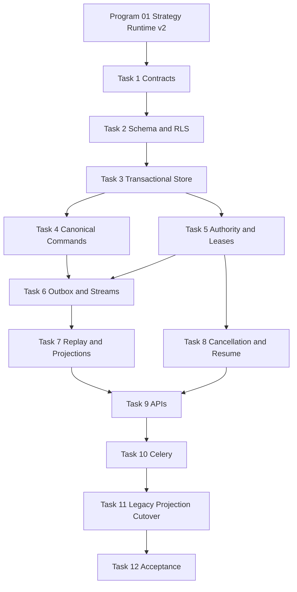

# Agent Pattern Program 02: Durable Coordination Runtime Implementation Plan

> **For agentic workers:** REQUIRED SUB-SKILL: Use superpowers:subagent-driven-development (recommended) or superpowers:executing-plans to implement this plan task-by-task. Steps use checkbox (`- [ ]`) syntax for tracking.

**Goal:** Deliver a tenant-isolated, PostgreSQL-canonical coordination runtime with durable sessions, messages, assignments, leases, checkpoints, transactional outbox delivery, Redis Streams, replay, cancellation, APIs, and idempotent Celery recovery.

**Architecture:** Civilization remains the multi-agent coordination boundary, but accepted state moves into canonical coordination tables and services. Every authority-changing mutation writes domain state, a monotonic event, and an outbox row in one PostgreSQL transaction under RLS; an outbox publisher fans events to tenant/session Redis Streams, while consumers remain at-least-once and idempotent and fall back to PostgreSQL polling. Existing civilization events, bus messages, blackboard entries, and endpoints become compatibility projections during migration.

**Tech Stack:** Python 3.12, FastAPI REST/SSE/WebSocket, Pydantic v2, SQLAlchemy 2 async, PostgreSQL JSONB/RLS, Redis Streams, Celery, Alembic, pytest/pytest-asyncio/testcontainers, Ruff, mypy, uv

---

## Planning Assumptions

- Program 01 is complete, revision `0096_strategy_runtime_v2` is deployed, and distributed strategies use `StrategyExecutionRequest`, `StrategyCheckpoint`, and `StrategyRunner` contracts.
- This plan reserves Alembic revision `0097_coordination_runtime` with `down_revision = "0096_strategy_runtime_v2"`.
- Same-civilization handoffs are the only supported trust boundary in this release; cross-civilization and cross-tenant handoffs are rejected.
- PostgreSQL is authoritative. Redis contains delivery, wakeup, lease cache, and checkpoint acceleration only.
- At-least-once delivery is required; all consumers and Celery tasks must be idempotent.
- Existing `civilizations` and `civilization_agents` remain the civilization/membership source during this plan.
- Existing `bus_messages`, `civilization_events`, and `blackboard_entries` are migrated into compatibility projections and are not dual authorities.
- Integration tests require Colima plus `DOCKER_HOST` and `TESTCONTAINERS_RYUK_DISABLED` as documented in `AGENTS.md`.
- All accepted coordination work must survive API, worker, and Redis restart.

## Source Final Documents

- `docs/superpowers/specs/2026-08-03-agent-pattern-completion-program-design.md`
- `docs/superpowers/plans/2026-08-03-agent-pattern-program-01-strategy-runtime-v2.md`
- `agent-verse-backend/app/civilization/orchestrator.py`
- `agent-verse-backend/app/civilization/bus.py`
- `agent-verse-backend/app/civilization/events.py`
- `agent-verse-backend/app/civilization/blackboard.py`
- `agent-verse-backend/app/civilization/governor.py`
- `agent-verse-backend/app/civilization/society.py`
- `agent-verse-backend/app/db/models/civilization.py`
- `agent-verse-backend/app/db/models/goal.py`
- `agent-verse-backend/app/db/migrations/versions/0045_civilization.py`
- `agent-verse-backend/app/db/migrations/versions/0011_goal_events_checkpoints.py`
- `agent-verse-backend/app/api/civilization.py`
- `agent-verse-backend/app/scaling/tasks.py`
- `agent-verse-backend/app/scaling/celery_app.py`

## Existing Wiring Defects That Must Be Fixed

1. `CivilizationBus.publish()` commits `bus_messages`, then publishes Redis Pub/Sub, then separately commits `civilization_events`; domain mutation and delivery intent are not atomic.
2. Redis Pub/Sub is ephemeral and has no consumer groups, pending-entry recovery, acknowledgements, or durable cursor.
3. Civilization replay is timestamp-based. Equal timestamps, clock skew, and reconnects cannot guarantee gap-free ordered replay.
4. `civilization_events` has no session/run ID, monotonic sequence, schema version, correlation/causation IDs, idempotency key, classification, or expiry.
5. `bus_messages`, `civilization_events`, and blackboard content overlap without a declared canonical conversation log.
6. Migration `0045_civilization.py` creates RLS policies with `USING` only and omits `WITH CHECK`, unlike later migration `0063_civilization_history.py`.
7. Migration `0011_goal_events_checkpoints.py` also omits `WITH CHECK`; its checkpoint `recovery_status` defaults to `not_implemented`.
8. Several civilization DB reads/writes use raw sessions without `rls_context()`, relying on explicit tenant predicates instead of proving the database tenant context is set.
9. `CivilizationOrchestrator.submit_goal()` creates an orchestration goal ID in memory, may synchronously execute supervisor work, and does not first commit a canonical coordination session/execution/assignment.
10. Supervisor/debate state, assignments, messages, rounds, handoffs, claims, bids, and allocations are not durable or resumable.
11. Pause/resume is a civilization-wide Redis signal, not a persisted session cancellation/resume state with propagation to children, leases, and strategy executions.
12. The civilization WebSocket accepts before authorization is established, supports API-key query parameters, and does not validate governed group-chat commands or backpressure.
13. Existing Celery civilization tasks catch exceptions and return `{"error": ...}`, preventing Celery retry semantics and durable failure handling.
14. `discover_and_tick_civilizations()` scans all tenants without an explicit per-tenant RLS execution design.
15. No transactional outbox, dead-letter store, lease fencing token, heartbeat/reclaim protocol, or duplicate-delivery protection exists for coordination work.

## Epics

| Epic | Outcome | Depends On |
|---|---|---|
| COORD-1 Canonical data model | Tenant-scoped sessions, executions, messages, ledgers, work, handoffs, leases, bids, allocations, artifacts, checkpoints, events, outbox | Program 01 |
| COORD-2 Transactional state service | Atomic state transition/event/outbox writes and optimistic concurrency | COORD-1 |
| COORD-3 Delivery and recovery | Redis Streams, consumer groups, polling fallback, DLQ, replay | COORD-2 |
| COORD-4 Control plane | Cancellation/resume, leases/fencing, APIs, group-chat socket | COORD-2, COORD-3 |
| COORD-5 Workers and migration | Idempotent Celery execution, legacy projections, rollout and operations | COORD-1 through COORD-4 |

## Workstreams

| Workstream | Tasks | Parallelism |
|---|---|---|
| Schema/RLS | Tasks 1-2 | Sequential |
| Store and state machines | Tasks 3-5 | Task 4 and Task 5 follow Task 3 |
| Delivery/replay | Tasks 6-7 | Task 7 follows Task 6 |
| Cancellation/API | Tasks 8-9 | Task 8 follows Task 5; Task 9 follows Tasks 7-8 |
| Celery/migration/operations | Tasks 10-12 | Sequential after APIs |

## File Map

| Action | Exact path | Responsibility |
|---|---|---|
| Create | `agent-verse-backend/app/coordination/__init__.py` | Coordination package exports |
| Create | `agent-verse-backend/app/coordination/contracts.py` | Session, event, message, assignment, lease, checkpoint, command/read-model contracts |
| Create | `agent-verse-backend/app/coordination/state_machines.py` | Allowed lifecycle transitions and authorization predicates |
| Create | `agent-verse-backend/app/coordination/store.py` | RLS-scoped transactional repository and optimistic sequence allocation |
| Create | `agent-verse-backend/app/coordination/service.py` | Canonical command service and transaction boundary |
| Create | `agent-verse-backend/app/coordination/outbox.py` | Claim/publish/confirm/retry/dead-letter outbox operations |
| Create | `agent-verse-backend/app/coordination/streams.py` | Redis Stream names, publisher, groups, ack, pending reclaim, backpressure |
| Create | `agent-verse-backend/app/coordination/replay.py` | Sequence-cursor replay and projection rebuild |
| Create | `agent-verse-backend/app/coordination/leases.py` | Claim acquisition, heartbeat, fencing, expiry, deterministic reclaim |
| Create | `agent-verse-backend/app/coordination/cancellation.py` | Persisted cancellation/resume and propagation |
| Create | `agent-verse-backend/app/coordination/projections.py` | Read models and legacy civilization/blackboard projections |
| Create | `agent-verse-backend/app/api/coordination.py` | Session commands, read models, SSE, governed group-chat WebSocket |
| Create | `agent-verse-backend/app/scaling/coordination_tasks.py` | Idempotent execute, outbox, reclaim, recovery, and projection Celery tasks |
| Create | `agent-verse-backend/app/db/models/coordination.py` | ORM models for all canonical coordination entities |
| Create | `agent-verse-backend/app/db/migrations/versions/0097_coordination_runtime.py` | Tables, constraints, indexes, RLS policies, legacy-policy repair |
| Modify | `agent-verse-backend/app/db/models/__init__.py` | Register coordination ORM metadata |
| Modify | `agent-verse-backend/app/civilization/orchestrator.py` | Delegate accepted work and transitions to `CoordinationService` |
| Modify | `agent-verse-backend/app/civilization/bus.py` | Compatibility facade over canonical message/event/outbox path |
| Modify | `agent-verse-backend/app/civilization/events.py` | Compatibility replay projection using sequence cursor |
| Modify | `agent-verse-backend/app/civilization/blackboard.py` | Projection over canonical messages/artifacts, no parallel authority |
| Modify | `agent-verse-backend/app/api/civilization.py` | Compatibility links/redirected replay and secured socket deprecation |
| Modify | `agent-verse-backend/app/scaling/celery_app.py` | Queue routes and beat schedule for coordination tasks |
| Modify | `agent-verse-backend/app/scaling/tasks.py` | Delegate legacy civilization tasks and stop swallowing retryable failures |
| Modify | `agent-verse-backend/app/main.py` | Wire coordination store/service/streams/outbox and API in both service phases |
| Create | `agent-verse-backend/tests/coordination/test_contracts.py` | Envelope and command validation |
| Create | `agent-verse-backend/tests/coordination/test_state_machines.py` | Lifecycle and authorization transitions |
| Create | `agent-verse-backend/tests/coordination/test_store.py` | Atomic writes, sequence, idempotency, optimistic concurrency |
| Create | `agent-verse-backend/tests/coordination/test_leases.py` | Fencing, heartbeat, expiry, reclaim |
| Create | `agent-verse-backend/tests/coordination/test_cancellation.py` | Propagation and resume behavior |
| Create | `agent-verse-backend/tests/coordination/test_outbox.py` | Claim, retry, duplicate, DLQ behavior |
| Create | `agent-verse-backend/tests/coordination/test_streams.py` | Stream/group/ack/pending/backpressure behavior |
| Create | `agent-verse-backend/tests/coordination/test_replay.py` | Gap-free cursor replay and projection rebuild |
| Create | `agent-verse-backend/tests/api/test_coordination.py` | REST/SSE authorization, cursors, read models |
| Create | `agent-verse-backend/tests/api/test_coordination_websocket.py` | Group-chat auth, commands, backpressure, disconnect |
| Create | `agent-verse-backend/tests/scaling/test_coordination_tasks.py` | Celery idempotency, retry, crash, resume, cancellation |
| Create | `agent-verse-backend/tests/integration/test_coordination_migration.py` | Migration shape, constraints, indexes, upgrade/downgrade |
| Create | `agent-verse-backend/tests/integration/test_coordination_rls.py` | Cross-tenant read/write denial on every new table |
| Create | `agent-verse-backend/tests/integration/test_coordination_outbox_streams.py` | Postgres/Redis delivery, Redis loss, restart, duplicate delivery |
| Create | `agent-verse-backend/tests/integration/test_coordination_recovery.py` | Worker crash, lease expiry, replay, cancellation recovery |

## Canonical Schema Contract

Revision `0097_coordination_runtime` must create the following tenant-scoped tables. Every mutable table carries `version`; every table enables and forces RLS and has one policy with both `USING` and `WITH CHECK` against `current_setting('app.tenant_id', true)`.

| Table | Required columns and constraints | Dominant indexes |
|---|---|---|
| `coordination_sessions` | `id`, `tenant_id`, `civilization_id`, `goal_id`, `pattern_id`, `state`, participant/policy/budget snapshots, deadline, cancellation fields, `next_sequence`, `version`, timestamps; same-tenant composite FKs | `(tenant_id, state, updated_at)`, `(tenant_id, civilization_id, created_at)` |
| `strategy_executions` | `id`, tenant/session/goal IDs, adapter ID/version, state schema version, profile snapshot, state, checkpoint ID, result, cost, idempotency key, deadline, cancellation, `version`, timestamps; unique tenant/idempotency | `(tenant_id, session_id, state)`, `(tenant_id, goal_id)` |
| `context_messages` | `id`, tenant/session IDs, monotonic `sequence`, sender, recipients, type, content/artifact reference, provenance, classification, trust/redaction state, idempotency key, expiry, timestamp; unique tenant/session/sequence and idempotency | `(tenant_id, session_id, sequence)`, `(tenant_id, expiry)` |
| `progress_ledger_revisions` | tenant/session IDs, objective, facts, assumptions, completed/open work, blockers, satisfaction criteria/results, stall/reset counts, next actor, transition reason, predecessor version, triggering event, immutable `version`, timestamps; append-only unique tenant/session/version | `(tenant_id, session_id, version DESC)` |
| `work_items` | tenant/session IDs, parent ID, dependencies, priority, state, owner, deadline, provenance, idempotency, `version`, timestamps | `(tenant_id, session_id, state, priority)`, `(tenant_id, owner_agent_id, state)` |
| `handoffs` | source/target agents, context/policy/budget snapshots, state, expiry, idempotency, `version`, timestamps; target must belong to same civilization | `(tenant_id, session_id, state)`, `(tenant_id, target_agent_id, state)` |
| `claims` | work item, owner, lease ID, fencing token, heartbeat, state, `version`; one active claim per work item | `(tenant_id, work_item_id, state)`, `(tenant_id, lease_expires_at)` |
| `agent_bids` | work item, bidder, capability, quality/cost/latency/confidence, signature, sealed state, idempotency, timestamp | `(tenant_id, work_item_id, created_at)` |
| `allocations` | work item, selected bid, score policy/explanation, lease, fallback reason, state, idempotency, `version`, timestamps | `(tenant_id, session_id, state)`, `(tenant_id, work_item_id)` |
| `thought_nodes` | tenant/session/execution IDs, node type, safe summary, score, depth, state, provenance, timestamp; bounded by profile limits | `(tenant_id, execution_id, depth)` |
| `thought_edges` | tenant/session/execution IDs, source/target IDs, edge type, provenance; unique source/target/type | `(tenant_id, execution_id, source_node_id)` |
| `strategy_artifacts` | tenant/session/execution IDs, artifact type, content reference, hash, classification, provenance, metadata, expiry, timestamp | `(tenant_id, session_id, artifact_type)`, `(tenant_id, expiry)` |
| `strategy_checkpoints` | tenant/session/execution IDs, adapter/state-schema versions, cursor, state reference, migration metadata, sequence, idempotency, timestamp; immutable | `(tenant_id, execution_id, sequence DESC)` |
| `event_inbox` | tenant/event/consumer IDs, state `received|executing|completed|failed`, fencing token, external idempotency key, result/error reference, attempts, `version`, timestamps; unique tenant/event/consumer | `(tenant_id, consumer, state, updated_at)` |
| `approval_grants` | tenant/session/action digest, parameter/context/policy/profile/budget digests, approver, nonce digest, expiry, state `issued|consumed|revoked|expired`, consumed event, `version`, timestamps; one-time transactional consumption | `(tenant_id, session_id, state, expiry)` |
| `budget_accounts`, `budget_reservations`, `budget_entries` | tenant/parent/child ownership, currency, ceiling, reserved/committed/released amounts, expiry, idempotency, provider reconciliation reference, state, `version`, timestamps; parent-child conservation checks | `(tenant_id, session_id, state)`, `(tenant_id, expires_at)` |
| `coordination_events` | full versioned event envelope and typed JSONB payload; unique tenant/session/sequence, event ID, and idempotency | `(tenant_id, session_id, sequence)`, `(tenant_id, occurred_at)` |
| `coordination_outbox` | event ID, tenant/session IDs, stream, payload, state, attempt count, available/claimed/published times, claim owner, last error; unique event ID | `(state, available_at)`, `(tenant_id, session_id, state)` |
| `coordination_dead_letters` | original outbox/event IDs, tenant/session IDs, payload, attempts, error class/message, failed time, replay status/operator | `(tenant_id, replay_status, failed_at)` |
| `coordination_consumptions` | tenant/event/consumer IDs, outcome, consumed time; unique consumer/event for idempotency | `(tenant_id, consumer_name, consumed_at)` |

## Task Breakdown

### Task 1: Define Coordination Contracts and State Machines

**Files:**
- Create: `agent-verse-backend/app/coordination/__init__.py`
- Create: `agent-verse-backend/app/coordination/contracts.py`
- Create: `agent-verse-backend/app/coordination/state_machines.py`
- Create: `agent-verse-backend/tests/coordination/test_contracts.py`
- Create: `agent-verse-backend/tests/coordination/test_state_machines.py`

- [ ] **Step 1: Write failing contract and transition tests**

  Test the exact event envelope fields from the approved spec, positive sequence, schema version, UTC occurrence time, typed payload, classification, idempotency, and expiry. Cover session lifecycle, strategy execution lifecycle, handoff lifecycle, group-chat lifecycle, claim/allocation states, terminal-state immutability, optimistic version, same-civilization handoff, and command authorization requirements.

- [ ] **Step 2: Run tests and verify failure**

  Run: `cd agent-verse-backend && uv run pytest tests/coordination/test_contracts.py tests/coordination/test_state_machines.py -v --no-cov`

  Expected: collection fails because `app.coordination` does not exist.

- [ ] **Step 3: Implement minimal contracts and transition maps**

  Define immutable Pydantic contracts for sessions, participants, messages, ledgers, work items, handoffs, claims, bids, allocations, artifacts, checkpoints, commands, read models, and `CoordinationEvent`. Implement explicit transition maps and predicates; reject cross-civilization handoffs, terminal mutations, missing authorization context, invalid classification, and expiry/deadline violations. Persist safe summaries only.

- [ ] **Step 4: Run tests and verify pass**

  Run: `cd agent-verse-backend && uv run pytest tests/coordination/test_contracts.py tests/coordination/test_state_machines.py -v --no-cov`

  Expected: all contract and state-machine tests pass.

- [ ] **Step 5: Commit**

  Run: `cd agent-verse-backend && git add app/coordination tests/coordination/test_contracts.py tests/coordination/test_state_machines.py && git commit -m "feat(coordination): add durable runtime contracts"`

### Task 2: Create Canonical Schema, Constraints, Indexes, and RLS

**Files:**
- Create: `agent-verse-backend/app/db/models/coordination.py`
- Create: `agent-verse-backend/app/db/migrations/versions/0097_coordination_runtime.py`
- Create: `agent-verse-backend/tests/integration/test_coordination_migration.py`
- Create: `agent-verse-backend/tests/integration/test_coordination_rls.py`
- Modify: `agent-verse-backend/app/db/models/__init__.py`

- [ ] **Step 1: Write failing migration and RLS tests**

  Assert every table and required column/constraint/index in the Canonical Schema Contract exists after upgrade. For each table, set tenant A context, insert/read tenant A, switch to tenant B, and assert tenant A rows are invisible and tenant A IDs cannot be inserted or updated. Assert repaired RLS policies for the seven `0045` civilization tables and `goal_events`/`goal_checkpoints` include `WITH CHECK`. Assert downgrade returns to `0096_strategy_runtime_v2`.

- [ ] **Step 2: Run tests and verify failure**

  Run: `cd agent-verse-backend && DOCKER_HOST="unix:///Users/harsh.kumar01/.colima/default/docker.sock" TESTCONTAINERS_RYUK_DISABLED=true uv run pytest tests/integration/test_coordination_migration.py tests/integration/test_coordination_rls.py -m integration -v --no-cov`

  Expected: migration revision and canonical tables are missing; existing policy repair assertions fail.

- [ ] **Step 3: Implement minimal models and migration**

  Create revision `0097_coordination_runtime` exactly as specified. Use composite tenant/entity uniqueness and composite foreign keys where a reference could otherwise cross tenants. Add checks for positive sequences, nonnegative costs, valid fencing tokens, deadline/expiry consistency, and allowed state values. Enable and force RLS on all new tables with `USING` and `WITH CHECK`; drop/recreate deficient legacy policies in this new forward migration without editing deployed migrations `0011` or `0045`. Keep downgrade complete and dependency-ordered.

- [ ] **Step 4: Run integration tests and verify pass**

  Run: `cd agent-verse-backend && DOCKER_HOST="unix:///Users/harsh.kumar01/.colima/default/docker.sock" TESTCONTAINERS_RYUK_DISABLED=true uv run pytest tests/integration/test_coordination_migration.py tests/integration/test_coordination_rls.py -m integration -v --no-cov`

  Expected: upgrade/downgrade, constraints, index, and all cross-tenant denial tests pass.

- [ ] **Step 5: Commit**

  Run: `cd agent-verse-backend && git add app/db/models/coordination.py app/db/models/__init__.py app/db/migrations/versions/0097_coordination_runtime.py tests/integration/test_coordination_migration.py tests/integration/test_coordination_rls.py && git commit -m "feat(database): add canonical coordination schema"`

### Task 3: Implement Transactional Store, Sequence Allocation, and Idempotency

**Files:**
- Create: `agent-verse-backend/app/coordination/store.py`
- Create: `agent-verse-backend/tests/coordination/test_store.py`

- [ ] **Step 1: Write failing store tests**

  Test transaction-scoped RLS context, atomic session mutation plus event plus outbox insertion, row-locked `next_sequence` allocation, concurrent sequence writers without gaps/duplicates, idempotency replay returning the accepted result, optimistic version conflict, rollback on outbox failure, terminal-state protection, and selected-column queries without full-table scans.

- [ ] **Step 2: Run tests and verify failure**

  Run: `cd agent-verse-backend && uv run pytest tests/coordination/test_store.py -v --no-cov`

  Expected: collection fails because `CoordinationStore` is absent.

- [ ] **Step 3: Implement minimal transactional repository**

  Require `TenantContext` on every public method and enter `sqlalchemy_rls_context()` inside every transaction. Lock the session row, validate expected version and transition, allocate `sequence = next_sequence`, increment `next_sequence` and version, write domain rows, one `coordination_events` row, and one `coordination_outbox` row before commit. Resolve repeated idempotency keys to the original event/result and never retry a partially committed transaction outside the transaction boundary.

- [ ] **Step 4: Run tests and verify pass**

  Run: `cd agent-verse-backend && uv run pytest tests/coordination/test_store.py -v --no-cov`

  Expected: all atomicity, sequence, concurrency, and idempotency tests pass.

- [ ] **Step 5: Commit**

  Run: `cd agent-verse-backend && git add app/coordination/store.py tests/coordination/test_store.py && git commit -m "feat(coordination): add transactional coordination store"`

### Task 4: Implement Canonical Session, Message, Ledger, Assignment, and Checkpoint Commands

**Files:**
- Create: `agent-verse-backend/app/coordination/service.py`
- Modify: `agent-verse-backend/app/coordination/state_machines.py`
- Create: `agent-verse-backend/tests/coordination/test_service.py`

- [ ] **Step 1: Write failing command-service tests**

  Cover create/read session, start execution, append ordered message, update ledger with expected version, create dependency-validated work item, assign owner, write immutable checkpoint, create artifact reference, complete/fail execution, and complete/fail session. Assert policy/budget/deadline snapshots are fixed at admission, parent/child IDs correlate, each authority change emits one event/outbox row, and private reasoning/content beyond classification policy is rejected.

- [ ] **Step 2: Run tests and verify failure**

  Run: `cd agent-verse-backend && uv run pytest tests/coordination/test_service.py -v --no-cov`

  Expected: collection fails because `CoordinationService` is absent.

- [ ] **Step 3: Implement minimal command service**

  Implement one method per command contract and centralize authorization, classification, policy, budget, deadline, transition, and idempotency checks before calling the store. Validate work-item dependency IDs belong to the same session and reject cycles. Store message content inline only when classification permits; otherwise require an encrypted content/artifact reference. Write checkpoints using Program 01 adapter/state-schema versions.

- [ ] **Step 4: Run tests and verify pass**

  Run: `cd agent-verse-backend && uv run pytest tests/coordination/test_service.py -v --no-cov`

  Expected: all canonical command tests pass.

- [ ] **Step 5: Commit**

  Run: `cd agent-verse-backend && git add app/coordination/service.py app/coordination/state_machines.py tests/coordination/test_service.py && git commit -m "feat(coordination): add canonical session command service"`

### Task 5: Implement Handoffs, Claims, Leases, Bids, and Allocations

**Files:**
- Create: `agent-verse-backend/app/coordination/leases.py`
- Create: `agent-verse-backend/tests/coordination/test_leases.py`
- Modify: `agent-verse-backend/app/coordination/service.py`
- Create: `agent-verse-backend/tests/coordination/test_authority_commands.py`

- [ ] **Step 1: Write failing authority and lease tests**

  Test the full handoff lifecycle, least-context snapshot, target reauthorization, remaining budget/deadline/policy intersection, same-civilization restriction, expiry, and source resume. Test claim acquisition, monotonic fencing token, heartbeat, stale-owner rejection, expiry reclaim, single active claim, sealed bids until deadline, signature validation hook, deterministic score/tie-break, winner lease, no-bid fallback, and bounded rebid.

- [ ] **Step 2: Run tests and verify failure**

  Run: `cd agent-verse-backend && uv run pytest tests/coordination/test_leases.py tests/coordination/test_authority_commands.py -v --no-cov`

  Expected: lease and authority command APIs are missing.

- [ ] **Step 3: Implement minimal authority-changing operations**

  Allocate fencing tokens transactionally from the claim/work-item version, require the current token for heartbeat/complete/release, and reject stale workers. Make reclaim deterministic after DB expiry regardless of Redis state. Add handoff, bid, and allocation commands to `CoordinationService`; intersect parent/child privileges and connector allowlists, never transfer source privileges, and record scoring/fallback explanations as safe summaries.

- [ ] **Step 4: Run tests and verify pass**

  Run: `cd agent-verse-backend && uv run pytest tests/coordination/test_leases.py tests/coordination/test_authority_commands.py -v --no-cov`

  Expected: handoff, fencing, reclaim, sealed bid, deterministic allocation, and fallback tests pass.

- [ ] **Step 5: Commit**

  Run: `cd agent-verse-backend && git add app/coordination/leases.py app/coordination/service.py tests/coordination/test_leases.py tests/coordination/test_authority_commands.py && git commit -m "feat(coordination): add governed authority transitions"`

### Task 6: Deliver Transactional Outbox, Redis Streams, and Dead Letters

**Files:**
- Create: `agent-verse-backend/app/coordination/outbox.py`
- Create: `agent-verse-backend/app/coordination/streams.py`
- Create: `agent-verse-backend/tests/coordination/test_outbox.py`
- Create: `agent-verse-backend/tests/coordination/test_streams.py`
- Create: `agent-verse-backend/tests/integration/test_coordination_outbox_streams.py`

- [ ] **Step 1: Write failing delivery tests**

  Test `FOR UPDATE SKIP LOCKED` outbox claiming, bounded batches, claim expiry, exponential backoff with deterministic jitter bounds, publish confirmation, duplicate publish, maximum attempts, dead-letter transition, operator replay marker, Redis stream key/group naming, `XADD`, `XREADGROUP`, `XACK`, `XPENDING`/`XAUTOCLAIM`, consumer idempotency, stream trimming only after PostgreSQL retention guarantees, saturation backpressure, Redis outage, and Postgres polling fallback.

- [ ] **Step 2: Run tests and verify failure**

  Run: `cd agent-verse-backend && uv run pytest tests/coordination/test_outbox.py tests/coordination/test_streams.py -v --no-cov`

  Expected: outbox and stream modules are absent.

- [ ] **Step 3: Implement minimal outbox and stream delivery**

  Claim pending outbox rows transactionally with owner/expiry; publish the unchanged event envelope to `coord:{tenant_id}:{session_id}`; confirm only after Redis accepts `XADD`. Use consumer group names by bounded service role, not per process. For PostgreSQL side effects, write the inbox/consumption marker and all domain mutations in one transaction, then acknowledge after commit. For external side effects, atomically persist an inbox command in `received`, execute with a stable external idempotency key and fencing token, then atomically persist `completed` plus result and consumption marker. Connector capability metadata must declare durable idempotency and/or operation-status reconciliation. A crash after provider success but before local completion moves the inbox item to `outcome_unknown`; recovery queries provider status when supported. When outcome cannot be determined, automatic redispatch is prohibited and the item enters an audited operator reconciliation workflow. Redelivery resumes or reconciles nonterminal inbox work; it never suppresses accepted work merely because a marker exists. Reclaim idle pending entries with fencing, move poison events to PostgreSQL dead letters, and switch to ordered PostgreSQL polling when Redis is unavailable.

- [ ] **Step 4: Run unit and integration tests and verify pass**

  Run: `cd agent-verse-backend && uv run pytest tests/coordination/test_outbox.py tests/coordination/test_streams.py -v --no-cov`

  Expected: unit tests pass.

  Run: `cd agent-verse-backend && DOCKER_HOST="unix:///Users/harsh.kumar01/.colima/default/docker.sock" TESTCONTAINERS_RYUK_DISABLED=true uv run pytest tests/integration/test_coordination_outbox_streams.py -m integration -v --no-cov`

  Expected: real PostgreSQL/Redis delivery, duplicate suppression, crash recovery before and after inbox insertion, pending reclaim, and Redis-loss fallback tests pass. Include crashes exactly between inbox insertion and dispatch, and immediately after provider success but before local completion persistence. Assert status reconciliation for capable connectors and `outcome_unknown` plus no redispatch for connectors without deterministic reconciliation.

- [ ] **Step 5: Commit**

  Run: `cd agent-verse-backend && git add app/coordination/outbox.py app/coordination/streams.py tests/coordination/test_outbox.py tests/coordination/test_streams.py tests/integration/test_coordination_outbox_streams.py && git commit -m "feat(coordination): add outbox and redis streams delivery"`

### Task 7: Implement Gap-Free Replay and Projection Rebuild

**Files:**
- Create: `agent-verse-backend/app/coordination/replay.py`
- Create: `agent-verse-backend/app/coordination/projections.py`
- Create: `agent-verse-backend/tests/coordination/test_replay.py`

- [ ] **Step 1: Write failing replay tests**

  Test replay after sequence cursor, inclusive/exclusive cursor semantics, invalid cursor, 10,000-event ordered replay, pagination without full-table scans, duplicate event suppression, schema upcasting, expired payload handling, checkpoint-plus-tail reconstruction, projection rebuild, and PostgreSQL-only replay while Redis is down. Assert timestamp is never used as the ordering cursor.

- [ ] **Step 2: Run tests and verify failure**

  Run: `cd agent-verse-backend && uv run pytest tests/coordination/test_replay.py -v --no-cov`

  Expected: replay/projection modules are absent.

- [ ] **Step 3: Implement minimal replay and projections**

  Query by `(tenant_id, session_id, sequence)` with bounded pages and `sequence > cursor`. Upcast supported older schema versions through explicit functions and fail with an operator-visible unsupported-version error otherwise. Rebuild session/message/ledger/work/claim/allocation read models from the latest compatible checkpoint plus subsequent events. Keep blackboard and civilization timeline as projections from canonical messages/events.

- [ ] **Step 4: Run tests and verify pass**

  Run: `cd agent-verse-backend && uv run pytest tests/coordination/test_replay.py -v --no-cov`

  Expected: replay and projection tests pass, including the 10,000-event query-count assertion.

- [ ] **Step 5: Commit**

  Run: `cd agent-verse-backend && git add app/coordination/replay.py app/coordination/projections.py tests/coordination/test_replay.py && git commit -m "feat(coordination): add sequence replay and projections"`

### Task 8: Implement Persisted Cancellation, Resume, and Propagation

**Files:**
- Create: `agent-verse-backend/app/coordination/cancellation.py`
- Create: `agent-verse-backend/tests/coordination/test_cancellation.py`
- Modify: `agent-verse-backend/app/coordination/service.py`
- Create: `agent-verse-backend/tests/integration/test_coordination_recovery.py`

- [ ] **Step 1: Write failing cancellation/recovery tests**

  Test idempotent cancel before start, cancel during execution, parent-to-child propagation, handoff cancellation, claim release, lease invalidation, stream wakeup, sandbox/strategy cancellation callback, cancellation checkpoint, resume from compatible checkpoint, resume rejection after terminal completion, adapter/state-schema mismatch, API/worker restart, and cancellation within the configured SLO.

- [ ] **Step 2: Run tests and verify failure**

  Run: `cd agent-verse-backend && uv run pytest tests/coordination/test_cancellation.py -v --no-cov`

  Expected: persisted cancellation coordinator is absent.

- [ ] **Step 3: Implement minimal cancellation coordinator**

  Persist cancellation intent and event before emitting wakeups. Traverse active child executions/work/handoffs in bounded pages, mark them cancelling, invalidate current leases by advancing fencing tokens, and invoke Program 01 cancellation tokens. Resume only from the latest compatible checkpoint after reauthorization/readiness/budget/deadline checks; create a new execution attempt linked to the prior execution rather than mutating history.

- [ ] **Step 4: Run unit and integration tests and verify pass**

  Run: `cd agent-verse-backend && uv run pytest tests/coordination/test_cancellation.py -v --no-cov`

  Expected: unit tests pass.

  Run: `cd agent-verse-backend && DOCKER_HOST="unix:///Users/harsh.kumar01/.colima/default/docker.sock" TESTCONTAINERS_RYUK_DISABLED=true uv run pytest tests/integration/test_coordination_recovery.py -m integration -v --no-cov`

  Expected: worker/Redis restart, cancellation propagation, lease reclaim, and resume tests pass.

- [ ] **Step 5: Commit**

  Run: `cd agent-verse-backend && git add app/coordination/cancellation.py app/coordination/service.py tests/coordination/test_cancellation.py tests/integration/test_coordination_recovery.py && git commit -m "feat(coordination): persist cancellation and resume"`

### Task 9: Add The Canonical Versioned Coordination REST, SSE, And WebSocket API

**Files:**
- Create: `agent-verse-backend/app/api/coordination.py`
- Create: `agent-verse-backend/tests/api/test_coordination.py`
- Create: `agent-verse-backend/tests/api/test_coordination_websocket.py`
- Modify: `agent-verse-backend/app/main.py`

- [ ] **Step 1: Write failing API and socket tests**

  Cover create/read/list/cancel/resume session endpoints; message, ledger, work item, handoff, claim, bid, allocation, artifact, checkpoint, and explain read models; approval/human-response commands; `Last-Event-ID` sequence replay; heartbeat and disconnect; tenant authorization; same-civilization participation; socket auth before accept; no API key in query string; typed human message/approval commands only; payload size/rate/backpressure limits; Escape/disconnect equivalent cleanup; and no arbitrary privileged control message.

- [ ] **Step 2: Run tests and verify failure**

  Run: `cd agent-verse-backend && uv run pytest tests/api/test_coordination.py tests/api/test_coordination_websocket.py -v --no-cov`

  Expected: `/api/v1/coordination/sessions` routes and socket are missing.

- [ ] **Step 3: Implement minimal additive APIs**

  Freeze the public prefix as `/api/v1/coordination/sessions`. `POST` create/cancel/resume commands return `202 Accepted`; session creation includes `Location`, reads return `200`, tenant-safe misses return `404`, version/state conflicts return `409`, and semantic validation returns `422`. Freeze stable operation IDs here. SSE must emit `id: {sequence}` and replay `sequence > Last-Event-ID` before live Stream consumption; during Redis loss it polls PostgreSQL without ending the response. Authenticate and authorize WebSocket before `accept()`, use header/subprotocol short-lived credentials, allow only group-chat human message/approval command schemas, apply size/rate/queue bounds, and persist every accepted command before fan-out. Programs 07-09 may extend this router through feature modules; Program 13 certifies and consolidates it but must not create a competing router or status-code contract.

- [ ] **Step 4: Run tests and verify pass**

  Run: `cd agent-verse-backend && uv run pytest tests/api/test_coordination.py tests/api/test_coordination_websocket.py -v --no-cov`

  Expected: REST, replay, auth, typed socket, and backpressure tests pass.

- [ ] **Step 5: Commit**

  Run: `cd agent-verse-backend && git add app/api/coordination.py app/main.py tests/api/test_coordination.py tests/api/test_coordination_websocket.py && git commit -m "feat(api): expose durable coordination runtime"`

### Task 10: Add Idempotent Celery Execution, Outbox, Reclaim, and Recovery Tasks

**Files:**
- Create: `agent-verse-backend/app/scaling/coordination_tasks.py`
- Create: `agent-verse-backend/tests/scaling/test_coordination_tasks.py`
- Modify: `agent-verse-backend/app/scaling/celery_app.py`
- Modify: `agent-verse-backend/app/scaling/tasks.py`

- [ ] **Step 1: Write failing Celery tests**

  Test queue routing by tenant plan for `execute_coordination_work`, maintenance routing for `publish_coordination_outbox`, `reclaim_coordination_leases`, `recover_coordination_executions`, and `rebuild_coordination_projection`; duplicate task delivery; worker crash after domain commit and before ack; autoretry on transient DB/Redis errors; no retry on validation/policy errors; cancellation; stale fencing token; soft/hard time limits; and dead-letter escalation after bounded retries.

- [ ] **Step 2: Run tests and verify failure**

  Run: `cd agent-verse-backend && uv run pytest tests/scaling/test_coordination_tasks.py tests/scaling/test_celery_routing.py -v --no-cov`

  Expected: coordination tasks/routes are missing and legacy civilization tasks swallow retryable failures.

- [ ] **Step 3: Implement minimal Celery tasks and routing**

  Make task arguments identifiers only, reload canonical state under tenant RLS context, acquire a fenced claim, record consumption/idempotency before side effects, execute through Program 01 `StrategyRunner`, checkpoint, and commit result/event/outbox before acknowledging. Configure bounded autoretry/backoff for transient exceptions and raise retryable failures instead of returning error dictionaries. Add beat schedules for outbox publishing, lease reclaim, and execution recovery; retain civilization task names as delegating compatibility wrappers.

- [ ] **Step 4: Run tests and verify pass**

  Run: `cd agent-verse-backend && uv run pytest tests/scaling/test_coordination_tasks.py tests/scaling/test_celery_routing.py tests/scaling/test_celery_app.py -v --no-cov`

  Expected: task idempotency, retry, routing, cancellation, and recovery tests pass.

- [ ] **Step 5: Commit**

  Run: `cd agent-verse-backend && git add app/scaling/coordination_tasks.py app/scaling/celery_app.py app/scaling/tasks.py tests/scaling/test_coordination_tasks.py && git commit -m "feat(scaling): run coordination through durable celery tasks"`

### Task 11: Migrate Civilization Bus, Events, Blackboard, and Orchestrator to Projections

**Files:**
- Modify: `agent-verse-backend/app/civilization/orchestrator.py`
- Modify: `agent-verse-backend/app/civilization/bus.py`
- Modify: `agent-verse-backend/app/civilization/events.py`
- Modify: `agent-verse-backend/app/civilization/blackboard.py`
- Modify: `agent-verse-backend/app/api/civilization.py`
- Create: `agent-verse-backend/tests/coordination/test_legacy_projection_compatibility.py`
- Modify: `agent-verse-backend/tests/civilization/test_bus.py`
- Modify: `agent-verse-backend/tests/civilization/test_events.py`
- Modify: `agent-verse-backend/tests/civilization/test_blackboard.py`
- Modify: `agent-verse-backend/tests/civilization/test_orchestrator.py`

- [ ] **Step 1: Write failing compatibility/migration tests**

  Assert civilization goal submission first commits a coordination session/execution/assignment and only then enqueues work. Assert bus publish creates one canonical message/event/outbox transaction, civilization replay uses sequence, blackboard reads canonical projections, legacy endpoint response fields remain available, and no code writes directly to `bus_messages`, `civilization_events`, or `blackboard_entries` after cutover. Assert the legacy WebSocket returns a documented deprecation/upgrade path and no longer accepts query-string API keys.

- [ ] **Step 2: Run tests and verify failure**

  Run: `cd agent-verse-backend && uv run pytest tests/coordination/test_legacy_projection_compatibility.py tests/civilization/test_bus.py tests/civilization/test_events.py tests/civilization/test_blackboard.py tests/civilization/test_orchestrator.py -v --no-cov`

  Expected: direct legacy table writes and timestamp replay violate the new assertions.

- [ ] **Step 3: Implement minimal compatibility projection cutover**

  Delegate `CivilizationOrchestrator.submit_goal()` to `CoordinationService`; enqueue only the committed strategy execution ID. Make `CivilizationBus` and event helpers compatibility facades that issue canonical commands/read projections. Build blackboard findings from typed message/artifact projections while preserving current response shape and conflict-trigger behavior. Add sequence cursor support to civilization replay and link clients to canonical session IDs/streams.

- [ ] **Step 4: Run tests and verify pass**

  Run: `cd agent-verse-backend && uv run pytest tests/coordination/test_legacy_projection_compatibility.py tests/civilization/test_bus.py tests/civilization/test_events.py tests/civilization/test_blackboard.py tests/civilization/test_orchestrator.py -v --no-cov`

  Expected: all canonical and compatibility projection tests pass.

- [ ] **Step 5: Commit**

  Run: `cd agent-verse-backend && git add app/civilization/orchestrator.py app/civilization/bus.py app/civilization/events.py app/civilization/blackboard.py app/api/civilization.py tests/coordination/test_legacy_projection_compatibility.py tests/civilization && git commit -m "refactor(civilization): use canonical coordination projections"`

### Task 12: End-to-End Recovery, OpenAPI, Runbooks, and Release Gate

**Files:**
- Modify: `agent-verse-backend/openapi.json`
- Modify: `RUNBOOK.md`
- Modify: `docs/architecture/01-platform-overview-and-architecture.md`
- Create: `agent-verse-backend/tests/coordination/test_program_acceptance.py`

- [ ] **Step 1: Write failing end-to-end acceptance tests**

  Cover accepted session survival across API/worker/Redis restart, ordered 10,000-event replay, duplicate Celery delivery, stale lease rejection, worker crash/reclaim, parent cancellation, resume from checkpoint, Redis-to-Postgres degraded delivery, outbox poison event/DLQ/operator replay, cross-tenant denial, backward-compatible civilization reads, and event-write p95 measurement below 100 ms excluding model latency in the integration environment.

- [ ] **Step 2: Run acceptance tests and verify failure**

  Run: `cd agent-verse-backend && uv run pytest tests/coordination/test_program_acceptance.py -v --no-cov`

  Expected: acceptance tests fail until recovery wiring and operational metadata are complete.

- [ ] **Step 3: Implement the minimal contract and operational documentation**

  Regenerate OpenAPI. Document canonical state, stream/group naming, polling fallback, outbox lag, pending reclaim, DLQ inspection/replay, stuck leases, cancellation SLO, Redis outage, worker restart, migration verification, rollback constraints, and dashboards/alerts in `RUNBOOK.md`. Update the architecture index to identify canonical tables and mark civilization bus/blackboard/event tables as compatibility projections.

- [ ] **Step 4: Run complete validation and verify pass**

  Run: `cd agent-verse-backend && uv run python scripts/export_openapi.py`

  Expected: OpenAPI generation succeeds and contains `/api/v1/coordination/sessions` contracts.

  Run: `cd agent-verse-backend && uv run pytest tests/coordination/ tests/api/test_coordination.py tests/api/test_coordination_websocket.py tests/scaling/test_coordination_tasks.py tests/civilization/ -v --no-cov`

  Expected: all unit/API/Celery/compatibility tests pass.

  Run: `cd agent-verse-backend && DOCKER_HOST="unix:///Users/harsh.kumar01/.colima/default/docker.sock" TESTCONTAINERS_RYUK_DISABLED=true uv run pytest tests/integration/test_coordination_migration.py tests/integration/test_coordination_rls.py tests/integration/test_coordination_outbox_streams.py tests/integration/test_coordination_recovery.py -m integration -v --no-cov`

  Expected: all PostgreSQL/Redis/restart/RLS integration tests pass.

  Run: `cd agent-verse-backend && uv run ruff check app/coordination app/api/coordination.py app/scaling/coordination_tasks.py app/civilization app/db/models/coordination.py tests/coordination tests/api/test_coordination.py tests/api/test_coordination_websocket.py tests/scaling/test_coordination_tasks.py`

  Expected: `All checks passed!`

  Run: `cd agent-verse-backend && uv run mypy app`

  Expected: mypy exits 0 with no errors.

- [ ] **Step 5: Commit**

  Run: `git add agent-verse-backend/openapi.json RUNBOOK.md docs/architecture/01-platform-overview-and-architecture.md agent-verse-backend/tests/coordination/test_program_acceptance.py && git commit -m "docs(coordination): certify durable coordination runtime"`

### Task 11: Add Approval, Budget, Privileged-RLS, And Replay Control Plane

**Files:**
- Create: `agent-verse-backend/app/coordination/approvals.py`
- Create: `agent-verse-backend/app/coordination/budgets.py`
- Create: `agent-verse-backend/app/coordination/operator_replay.py`
- Modify: `agent-verse-backend/app/db/rls.py`
- Create: `agent-verse-backend/tests/coordination/test_approval_grants.py`
- Create: `agent-verse-backend/tests/coordination/test_budget_ledger.py`
- Create: `agent-verse-backend/tests/security/test_coordination_privileged_paths.py`
- Create: `agent-verse-backend/tests/security/test_operator_replay.py`

- [ ] **Step 1: Write failing control-plane tests.** Bind each approval to tenant, approver, action and parameter digests, context/policy/profile/budget versions, deadline, expiry, nonce, and one-time state. Require immediate pre-side-effect reauthorization and invalidation after any bound input changes. Define PostgreSQL-canonical reserve/commit/release entries with parent-child conservation, reservation expiry, overdraft denial, delayed provider reconciliation, and fail-closed metering outage. Separate user replay, projection rebuild, and operator redrive; require current authorization/redaction, RBAC, reason, dry run, schema validation, dual approval for authority-changing redrive, and side-effect suppression. Prohibit `BYPASSRLS` for app/worker roles; require `SET LOCAL` per transaction and tenant-by-tenant maintenance.
- [ ] **Step 2: Run red tests.** Run `cd agent-verse-backend && uv run pytest tests/coordination/test_approval_grants.py tests/coordination/test_budget_ledger.py tests/security/test_coordination_privileged_paths.py tests/security/test_operator_replay.py -q`. Expected: missing modules/contracts and failing role/pool contamination assertions.
- [ ] **Step 3: Implement minimal control plane.** Consume approval grants transactionally with the authority-changing state transition. Reserve budget before fan-out and atomically conserve parent/child totals under concurrency. Make missing/stale metering fail closed. Use separate least-privilege control-plane roles for migration/operator jobs; reset pooled transaction context on success and failure. Redrive through the inbox state machine with a new audited command, never direct event re-execution.
- [ ] **Step 4: Run integration and adversarial tests.** Add concurrent MoA/swarm/auction/retry/cancel/crash budget fixtures, stale/replayed/modified/concurrently consumed approvals, pool reuse contamination, cross-tenant maintenance, revoked-data replay, and poison-event redrive. Run the Step 2 command plus the corresponding integration suite with Colima. Expected: all tests pass with no duplicate side effect or budget overspend.
- [ ] **Step 5: Commit.** Run `cd agent-verse-backend && git add app/coordination app/db/rls.py tests/coordination tests/security && git commit -m "feat(coordination): add approval budget and replay control plane"`.

## Dependency Graph

## Jira Mapping Plan

| Type | Key | Title | Description | Depends On | Acceptance Notes | Labels |
|---|---|---|---|---|---|---|
| Epic | COORD-1 | Create canonical coordination data model | Deliver contracts, revision 0097, constraints, indexes, RLS | Program 01 | Every new table passes cross-tenant read/write denial | `agent-pattern-program`, `coordination`, `database` |
| Story | COORD-101 | Define coordination contracts and state machines | Deliver Task 1 | Program 01 | Invalid transitions and cross-civilization handoffs fail | `backend`, `contracts` |
| Story | COORD-102 | Add canonical coordination schema | Deliver Task 2 | COORD-101 | Upgrade/downgrade and full RLS suite pass | `migration`, `rls` |
| Epic | COORD-2 | Make coordination transitions transactional | Deliver Tasks 3-5 | COORD-1 | State/event/outbox atomicity and fencing pass | `backend`, `reliability` |
| Story | COORD-201 | Add transactional store and sequence allocation | Deliver Task 3 | COORD-102 | Concurrent sequences are gap-free and unique | `postgresql`, `idempotency` |
| Story | COORD-202 | Add canonical session commands | Deliver Task 4 | COORD-201 | Sessions/messages/ledgers/work/checkpoints durable | `coordination`, `state-machine` |
| Story | COORD-203 | Add handoffs, leases, claims, and allocations | Deliver Task 5 | COORD-201 | Fencing and deterministic reclaim pass | `leases`, `handoff`, `auction` |
| Epic | COORD-3 | Deliver durable event transport and replay | Deliver Tasks 6-7 | COORD-2 | Redis loss cannot lose accepted work; 10k replay avoids scans | `redis-streams`, `outbox`, `replay` |
| Story | COORD-301 | Add outbox, Streams, and DLQ | Deliver Task 6 | COORD-202, COORD-203 | Ack/reclaim/duplicate/polling tests pass | `redis`, `celery` |
| Story | COORD-302 | Add cursor replay and projections | Deliver Task 7 | COORD-301 | Sequence replay and rebuild pass | `sse`, `projections` |
| Epic | COORD-4 | Expose recoverable coordination control plane | Deliver Tasks 8-9 | COORD-3 | Persisted cancel/resume and authorized APIs pass | `api`, `cancellation` |
| Epic | COORD-5 | Run and migrate coordination in production | Deliver Tasks 10-12 | COORD-4 | Worker crash, legacy projection, OpenAPI, lint, mypy pass | `celery`, `migration`, `operations` |

## Migration Plan

1. Deploy `0097_coordination_runtime` with empty canonical tables and repaired legacy RLS policies.
2. Start the outbox publisher and Streams consumers in observe-only mode; no civilization writes are redirected yet.
3. Backfill historical `civilization_events` and `bus_messages` into canonical events/messages per civilization using deterministic sequence ordered by `(ts, id)`, mark each payload as `legacy.v1`, and record a migration checkpoint. Do not infer missing causation, policy, or certification evidence.
4. Build and compare canonical projections against civilization timeline/blackboard reads.
5. Enable dual-read comparison, but keep one write authority: legacy writes before cutover, canonical writes after cutover. Never dual-write independently.
6. Cut over internal tenants so civilization commands commit canonical sessions/events/outbox first and legacy surfaces read projections.
7. Expand allowlists after outbox lag, duplicate rate, replay parity, cancellation SLO, and RLS metrics meet baseline.
8. Keep legacy tables read-only for one stable release and retain projection rebuild tooling.
9. Stop legacy Pub/Sub delivery after all clients use sequence SSE/Streams and the WebSocket migration window closes.
10. Archive legacy tables only in a later approved migration; this plan does not drop them.

## Test Plan

- Contract/state machine: every allowed and forbidden lifecycle transition.
- Database: all tables, checks, composite FKs, indexes, upgrade/downgrade, optimistic versions.
- Security: RLS `USING`/`WITH CHECK`, authorization, same-civilization handoff, classification, socket auth.
- Transactionality: domain/event/outbox atomic commit and rollback.
- Delivery: outbox claim/retry, Redis Streams groups/ack/pending/reclaim, duplicate suppression, DLQ.
- Replay: cursor semantics, 10,000 events, schema upcast, checkpoint plus tail, Postgres fallback.
- Reliability: worker/API/Redis restart, lease expiry/fencing, cancellation, resume, duplicate Celery delivery.
- API: REST read/command semantics, replayable SSE, typed/backpressured group-chat WebSocket.
- Compatibility: civilization endpoint shapes, blackboard/timeline projections, legacy task names.
- Static/performance: Ruff, strict mypy, event-write p95, indexed query-count assertions.

## Release Plan

1. Release schema and dormant services.
2. Enable observe-only outbox/stream workers and migration parity checks.
3. Canary internal tenants with low fan-out sessions.
4. Enable group chat only after socket authorization/backpressure tests pass in staging.
5. Enable handoffs and leases, then supervisor/debate, then later distributed patterns in their own capability plans.
6. Expand cohorts only when no accepted work is lost under restart drills and operational SLOs pass.
7. Mark Program 02 readiness available for Program 01 only after the full Definition of Done is met.

## Rollback Plan

1. Set `COORDINATION_RUNTIME_KILL_SWITCH=true` to reject new sessions and new authority-changing commands.
2. Remove tenant IDs from `COORDINATION_RUNTIME_TENANT_ALLOWLIST` to route new civilization requests through the legacy compatibility path during the rollback window.
3. Continue outbox publication and cancellation for already accepted canonical sessions; never abandon committed rows.
4. Stop new Stream consumers only after pending entries are drained or reclaimed and PostgreSQL polling workers are active.
5. Restore legacy reads from retained tables if projection parity fails; preserve canonical rows for diagnosis.
6. Do not downgrade `0097` while canonical sessions exist. If no canonical data exists and Program 03+ migrations are absent, run `uv run alembic downgrade 0096_strategy_runtime_v2`.
7. Roll back API/OpenAPI and workers as one release artifact so clients never target missing routes.

## Risks and Blockers

| Risk or blocker | Mitigation / exit condition |
|---|---|
| High write amplification | Bounded event payloads, artifact references, correct indexes, measured retention/partitioning |
| Duplicate at-least-once delivery | Unique idempotency/consumption keys and fenced side effects |
| Redis outage or stream loss | PostgreSQL outbox/events remain canonical; polling fallback is continuously tested |
| Lease split brain | Database expiry and monotonic fencing token are authoritative |
| Cross-tenant raw SQL leakage | Mandatory RLS context plus composite tenant FKs and integration denial tests |
| Legacy/canonical divergence | One write authority at a time and projection parity gates |
| Celery tasks swallow errors | Typed retry policy; retryable exceptions are raised, not returned |
| WebSocket privilege or overload | Authenticate before accept, typed commands, bounded queues/rates/sizes |
| 10,000-event replay degrades | Sequence index, pagination, checkpoint-plus-tail, query-count/load gate |
| Program 01 checkpoint incompatibility | Pin adapter/state-schema versions and reject unsupported resume |

## Definition of Done

- [ ] Revision `0097_coordination_runtime` creates every canonical entity, required constraint/index, and reversible downgrade.
- [ ] Every new and repaired legacy tenant table uses forced RLS with both `USING` and `WITH CHECK`.
- [ ] Every accepted mutation atomically commits domain state, one monotonic event, and one outbox row.
- [ ] Sessions, messages, ledgers, work items, assignments, handoffs, claims, leases, bids, allocations, artifacts, and checkpoints are durable and replayable.
- [ ] Redis Streams delivery supports groups, acknowledgement, pending reclaim, backpressure, duplicate suppression, and PostgreSQL fallback.
- [ ] Replay uses sequence cursors, handles 10,000 events without full-table scans, and rebuilds projections from checkpoint plus tail.
- [ ] Cancellation propagates to children, handoffs, claims, leases, streams, strategy runners, and sandboxes; resume reauthorizes from a compatible checkpoint.
- [ ] REST, replayable SSE, and governed group-chat WebSocket APIs are tenant-authorized and backward compatible where required.
- [ ] Celery tasks are idempotent, fenced, retry correctly, survive worker crash, and expose dead letters.
- [ ] Civilization bus/events/blackboard/orchestrator use canonical commands/projections and no longer form parallel write authorities.
- [ ] Unit, API, Celery, migration, RLS, Redis/Postgres integration, restart/recovery, Ruff, and mypy checks pass.
- [ ] Runbooks, OpenAPI, migration, release, and rollback procedures are complete and exercised.
