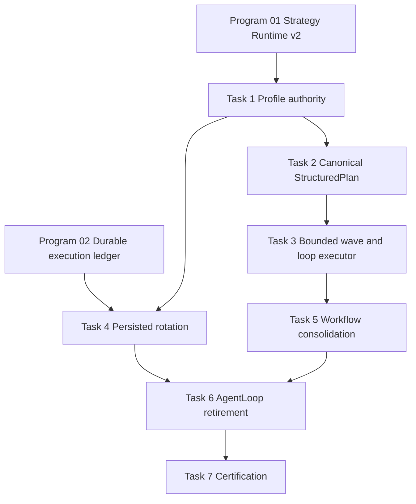

# Agent Pattern Program 03: Core Execution Implementation Plan

> **For agentic workers:** REQUIRED SUB-SKILL: Use superpowers:subagent-driven-development (recommended) or superpowers:executing-plans to implement this plan task-by-task. Steps use checkbox (`- [ ]`) syntax for tracking.

**Goal:** Certify ReAct and Plan-and-Execute on the canonical production path, consolidate structured planning, wave/loop/persistence execution, unify workflow DAG execution, and retire `AgentLoop` without losing governance or recovery behavior.

**Architecture:** Build the goal-specific runtime profile before `AgentGraph` compilation and use it as the sole topology authority. Make `StructuredPlan` the canonical dependency model, route agent plans and workflow plans through one bounded executor, persist attempt and loop transitions, and migrate every `AgentLoop` caller to `AgentGraph` before deleting the legacy implementation.

**Tech Stack:** Python 3.12, FastAPI, LangGraph, SQLAlchemy 2 async, PostgreSQL RLS, Redis/LangGraph checkpoints, Celery, pytest, Ruff, mypy.

---

# Planning Assumptions

- Program 01 has landed the versioned strategy-runtime contracts described in the approved design: `StrategySpec`, `StrategyExecutionRequest`, `StrategyExecutionResult`, `StrategyCheckpoint`, `PatternLimits`, `ReadinessProbe`, and `CertificationEvidence`.
- Program 02 has landed durable `strategy_executions`, coordination events, transactional outbox delivery, and replay primitives. This plan may consume those contracts but must not create a second execution ledger.
- `AgentGraph` remains the single-agent execution kernel. `WorkflowExecutor` becomes a façade over the same structured-plan executor rather than a second orchestration engine.
- PostgreSQL is canonical for accepted attempts and transitions. Redis/LangGraph checkpoints accelerate resume but are not sufficient certification evidence by themselves.
- Existing public goal and workflow request/response fields remain backward compatible.
- Program 02 is complete and `0097_coordination_runtime` is the current head. This plan owns `0098_core_execution_certification` with `down_revision = "0097_coordination_runtime"`.
- Commit commands are checkpoints for the implementation session. Do not execute them while reviewing or approving this plan.

# Source Final Documents

- Approved design: `docs/superpowers/specs/2026-08-03-agent-pattern-completion-program-design.md`, especially sections 4, 5, 7.1, 10, 14, 15, and 16.
- Repository operating guidance: `AGENTS.md` and `CLAUDE.md`.
- Current kernel: `agent-verse-backend/app/agent/graph.py:AgentGraph`.
- Legacy kernel: `agent-verse-backend/app/agent/loop.py:AgentLoop`.
- Structured planning: `agent-verse-backend/app/agent/structured_plan.py:StructuredPlan` and `StructuredStep`.
- Duplicate workflow planning: `agent-verse-backend/app/agent/workflow_planner.py:WorkflowPlan`, `WorkflowStep`, `_StaticWorkflowPlan`, `_StaticWorkflowStep`, and `build_static_workflow`.
- Duplicate workflow execution: `agent-verse-backend/app/agent/workflow_executor.py:WorkflowExecutor.execute` and `WorkflowExecutor.run`.
- Persistence rotation: `agent-verse-backend/app/agent/persistence.py:GoalPersistenceEngine`, `PersistenceConfig`, `AttemptRecord`, and `RetryStrategy`.
- Production assembly: `agent-verse-backend/app/services/goal_service.py:GoalService._build_runtime_profile`, `_make_agent_loop_for_tenant`, `_run_agent_loop`, `_run_agent_loop_persistent`, and `_run_workflow`.
- Worker assembly: `agent-verse-backend/app/scaling/tasks.py:run_goal`, `agent-verse-backend/app/execution_environment/worker_entrypoint.py`, and `agent-verse-backend/app/execution_environment/fake_runner.py`.
- Registry declarations: `agent-verse-backend/app/orchestration/strategy_registry.py:build_default_registry` entries `react`, `plan_execute`, and `loop_engineering`.
- Existing tests: `tests/agent/test_agent_graph.py`, `test_structured_plan.py`, `test_structured_plan_comprehensive.py`, `test_workflow_executor_comprehensive.py`, `test_workflow_planner.py`, `test_persistence.py`, `test_persistence_comprehensive.py`, `test_graph_persistence_wiring.py`, `tests/scaling/test_celery_agentgraph.py`, and `tests/integration/test_agent_graph_full_run.py`.

# Epics

| Epic | Outcome | Depends on |
|---|---|---|
| CORE-03-E1 | ReAct and Plan-and-Execute use a persisted, versioned profile before graph compilation | Programs 01 and 02 |
| CORE-03-E2 | One validated structured-plan contract drives agent and workflow DAG execution | CORE-03-E1 |
| CORE-03-E3 | Waves and loop-until are bounded, cancellable, checkpointed, and resumable | CORE-03-E2 |
| CORE-03-E4 | Persistent strategy rotation records attempts, transitions, budgets, and terminal evidence | CORE-03-E1, CORE-03-E3 |
| CORE-03-E5 | Legacy workflow and `AgentLoop` paths are migrated, canaried, and removed | CORE-03-E2 through E4 |
| CORE-03-E6 | ReAct/Plan-and-Execute certification is evidence-backed | CORE-03-E5 |

# Workstreams

| Workstream | Owner boundary | Parallelism |
|---|---|---|
| WS-A Profile authority and core adapters | `orchestration`, `strategy_runtime`, `GoalService` | Starts first |
| WS-B Plan validation and DAG consolidation | `agent/structured_plan.py`, workflow planner/executor | Starts after WS-A contracts stabilize |
| WS-C Bounded wave/loop runtime | `AgentGraph._node_execute`, checkpoints | Parallel with WS-D after WS-B validation API lands |
| WS-D Attempt rotation and persistence | `agent/persistence.py`, DB migration | Parallel with WS-C |
| WS-E Legacy retirement and call-site migration | services, workers, simulation, tests | Starts after WS-C and WS-D pass |
| WS-F Certification and rollout | readiness, evidence, integration tests | Final workstream |

# Task Breakdown

## Task 1: Establish ReAct and Plan-and-Execute production-path contract tests

**Files:**
- Create: `agent-verse-backend/tests/agent/test_core_execution_certification.py`
- Modify: `agent-verse-backend/tests/orchestration/test_runtime_profile_builder.py`
- Modify: `agent-verse-backend/tests/orchestration/test_strategy_registry.py`
- Modify later after red tests: `agent-verse-backend/app/orchestration/runtime_profile.py:GoalRuntimeProfile`
- Modify later after red tests: `agent-verse-backend/app/orchestration/runtime_profile_builder.py:RuntimeProfileBuilder.build_with_trace`
- Modify later after red tests: `agent-verse-backend/app/services/goal_service.py:GoalService._build_runtime_profile` and `_make_agent_loop_for_tenant`

- [ ] **Step 1.1: Write failing profile-authority tests.** Add `test_goal_service_compiles_graph_from_the_current_goal_profile`, `test_agent_graph_does_not_rebuild_a_supplied_profile`, and `test_profile_records_primary_strategy_and_version`. Assert that two goals with different profiles compile different node sets, that `_node_initialize` preserves the supplied profile object and version, and that the selected primary is exactly one of `react` or `plan_execute`.
- [ ] **Step 1.2: Write failing registry contract tests.** Add `test_react_and_plan_execute_have_executable_adapter_paths` and `test_loop_engineering_is_a_bundle_not_an_adapter`. Require non-empty adapter paths and versions for `react` and `plan_execute`; require `loop_engineering` to declare component capabilities rather than a separately executable runtime.
- [ ] **Step 1.3: Run the red tests.**

  ```bash
  cd agent-verse-backend
  uv run pytest tests/agent/test_core_execution_certification.py tests/orchestration/test_runtime_profile_builder.py tests/orchestration/test_strategy_registry.py -q --no-cov
  ```

  Expected: FAIL because `GoalRuntimeProfile` has no profile version/primary strategy contract, registry adapter evidence is incomplete, and `GoalService._make_agent_loop_for_tenant` infers flags from the latest in-memory goal instead of accepting the current goal profile.

- [ ] **Step 1.4: Implement the minimum profile-authority change.** Add immutable profile version and primary-strategy fields to `GoalRuntimeProfile`; select them in `RuntimeProfileBuilder.build_with_trace`; pass the current goal's deserialized profile directly into `_make_agent_loop_for_tenant`; compile `AgentGraph` from that profile before `run`; remove the `_all_goals[-1]` lookup. `GraphFactory.create` and every direct `AgentGraph` construction must require a persisted profile v2. A missing profile fails before graph compilation; `_node_initialize` must never build or replace a profile.
- [ ] **Step 1.5: Add core strategy adapters.** Create `agent-verse-backend/app/agent/patterns/core_execution.py` with `ReActStrategyAdapter` and `PlanExecuteStrategyAdapter`, implementing the protocol from `app/orchestration/strategy_adapters.py`. Both delegate to `AgentGraph`; the Plan-and-Execute adapter requires a validated `StructuredPlan`, while ReAct permits incremental replan. Register exact adapter paths and version `1.0.0` in `build_default_registry`.
- [ ] **Step 1.6: Run focused tests.**

  ```bash
  cd agent-verse-backend
  uv run pytest tests/agent/test_core_execution_certification.py tests/orchestration/test_runtime_profile_builder.py tests/orchestration/test_strategy_registry.py -q --no-cov
  ```

  Expected: PASS; profile authority tests prove topology is compiled from the current goal, not mutable service-global state.

- [ ] **Step 1.7: Run static checks for touched modules.**

  ```bash
  cd agent-verse-backend
  uv run ruff check app/agent/patterns/core_execution.py app/orchestration/runtime_profile.py app/orchestration/runtime_profile_builder.py app/services/goal_service.py tests/agent/test_core_execution_certification.py
  uv run mypy app/agent/patterns/core_execution.py app/orchestration/runtime_profile.py app/orchestration/runtime_profile_builder.py
  ```

  Expected: both commands exit 0.

- [ ] **Step 1.8: Commit checkpoint.**

  ```bash
  git add agent-verse-backend/app/agent/patterns/core_execution.py agent-verse-backend/app/orchestration/runtime_profile.py agent-verse-backend/app/orchestration/runtime_profile_builder.py agent-verse-backend/app/orchestration/strategy_registry.py agent-verse-backend/app/services/goal_service.py agent-verse-backend/tests/agent/test_core_execution_certification.py agent-verse-backend/tests/orchestration/test_runtime_profile_builder.py agent-verse-backend/tests/orchestration/test_strategy_registry.py
  git commit -m "feat(agent): make core strategy profile authoritative"
  ```

## Task 2: Make `StructuredPlan` the validated canonical DAG contract

**Files:**
- Modify: `agent-verse-backend/app/agent/structured_plan.py:StructuredPlan`, `StructuredStep`, `_safe_eval_condition`
- Modify: `agent-verse-backend/app/agent/workflow_planner.py:WorkflowPlanner`, `WorkflowPlan`, `WorkflowStep`, `build_static_workflow`
- Modify: `agent-verse-backend/tests/agent/test_structured_plan.py`
- Modify: `agent-verse-backend/tests/agent/test_structured_plan_comprehensive.py`
- Modify: `agent-verse-backend/tests/agent/test_workflow_planner.py`

- [ ] **Step 2.1: Replace permissive-cycle expectations with failing validation tests.** Add tests named `test_validate_rejects_duplicate_step_ids`, `test_validate_rejects_unknown_dependencies`, `test_validate_rejects_cycles`, `test_validate_rejects_self_dependencies`, and `test_validate_rejects_non_positive_loop_limit`. Change existing `test_execution_waves_circular_dependency_dumps_remaining` and `test_execution_waves_unknown_dep_dumps_remaining` to require a typed plan-validation error before execution.
- [ ] **Step 2.2: Add conversion tests for legacy workflow plans.** Require `build_static_workflow` and `WorkflowPlanner.plan` to return `StructuredPlan`; preserve connector intent, approval requirement, arguments/config, and dependency IDs in `StructuredStep` fields.
- [ ] **Step 2.3: Run the red tests.**

  ```bash
  cd agent-verse-backend
  uv run pytest tests/agent/test_structured_plan.py tests/agent/test_structured_plan_comprehensive.py tests/agent/test_workflow_planner.py -q --no-cov
  ```

  Expected: FAIL because both current `execution_waves` implementations append invalid remnants as an executable final wave and workflow planning uses separate dataclasses.

- [ ] **Step 2.4: Implement strict validation.** Add a typed `PlanValidationError` and `StructuredPlan.validate`; call it from `from_llm_response`, workflow conversion, and immediately before execution. Reject invalid conditions and loop expressions rather than defaulting to execution. Preserve legacy text-list parsing by assigning sequential dependencies explicitly.
- [ ] **Step 2.5: Consolidate workflow types.** Remove behavior from `WorkflowPlan.execution_waves`; make `WorkflowPlan` and `WorkflowStep` temporary import aliases to `StructuredPlan` and `StructuredStep` for one release; change `WorkflowPlanner.plan`, `_heuristic_plan`, and `build_static_workflow` to produce `StructuredPlan` directly.
- [ ] **Step 2.6: Run focused tests and type checks.**

  ```bash
  cd agent-verse-backend
  uv run pytest tests/agent/test_structured_plan.py tests/agent/test_structured_plan_comprehensive.py tests/agent/test_workflow_planner.py -q --no-cov
  uv run ruff check app/agent/structured_plan.py app/agent/workflow_planner.py tests/agent/test_structured_plan.py tests/agent/test_structured_plan_comprehensive.py tests/agent/test_workflow_planner.py
  uv run mypy app/agent/structured_plan.py app/agent/workflow_planner.py
  ```

  Expected: all tests pass and both static-check commands exit 0.

- [ ] **Step 2.7: Commit checkpoint.**

  ```bash
  git add agent-verse-backend/app/agent/structured_plan.py agent-verse-backend/app/agent/workflow_planner.py agent-verse-backend/tests/agent/test_structured_plan.py agent-verse-backend/tests/agent/test_structured_plan_comprehensive.py agent-verse-backend/tests/agent/test_workflow_planner.py
  git commit -m "refactor(agent): unify structured plan validation"
  ```

## Task 3: Extract bounded wave execution and resumable loop-until control

**Files:**
- Create: `agent-verse-backend/app/agent/structured_executor.py`
- Create: `agent-verse-backend/tests/agent/test_structured_executor.py`
- Modify: `agent-verse-backend/app/agent/graph.py:AgentGraph._node_execute`, `_execute_step_with_loop`, `_write_checkpoint`, `_load_checkpoint`
- Modify: `agent-verse-backend/app/agent/workflow_executor.py:WorkflowExecutor.execute`
- Modify: `agent-verse-backend/tests/agent/test_workflow_executor_comprehensive.py`

- [ ] **Step 3.1: Write failing wave-limit tests.** Add `test_wave_executor_never_exceeds_max_concurrency`, `test_wave_executor_cancels_siblings_after_non_ignorable_failure`, and `test_wave_executor_preserves_dependency_order`. Use an instrumented async step runner and assert peak concurrency equals the requested `PatternLimits.fan_out` ceiling.
- [ ] **Step 3.2: Write failing resume tests.** Add `test_resume_skips_completed_steps`, `test_resume_retries_only_incomplete_wave`, and `test_checkpoint_records_plan_hash_wave_and_step_cursor`. Require a mismatched plan hash or state-schema version to fail resume explicitly.
- [ ] **Step 3.3: Write failing loop tests.** Add `test_loop_until_stops_on_true`, `test_loop_until_exhaustion_is_terminal_evidence`, `test_loop_honors_cancellation_during_backoff`, `test_loop_uses_profile_iteration_budget`, and `test_invalid_loop_expression_fails_closed`. Patch sleep; do not make this test group wait in real time.
- [ ] **Step 3.4: Run the red tests.**

  ```bash
  cd agent-verse-backend
  uv run pytest tests/agent/test_structured_executor.py tests/agent/test_workflow_executor_comprehensive.py -q --no-cov
  ```

  Expected: FAIL because no shared executor exists, parallel waves are unbounded `asyncio.gather`, loop cancellation is not propagated during backoff, and checkpoint cursors are step-index-only.

- [ ] **Step 3.5: Implement `StructuredPlanExecutor`.** Give it one execution method accepting a validated plan, async step callback, `PatternLimits`, cancellation token, checkpoint callback, and prior checkpoint. Use a semaphore for fan-out, cancel siblings on terminal failure, and emit typed wave/step/loop transitions. Checkpoint after every completed step and loop iteration.
- [ ] **Step 3.6: Delegate both callers.** Replace the wave loop in `AgentGraph._node_execute` and the parallel branch in `WorkflowExecutor.execute` with `StructuredPlanExecutor`. Keep tool execution, cache, governance, and event emission in caller-provided callbacks so the new executor cannot bypass policy.
- [ ] **Step 3.7: Standardize loop outcomes.** Replace the silent “return last output” behavior at max iterations with an explicit exhausted outcome carried into verification and certification evidence. Use profile duration, iteration, call, token, and cost limits; cancellation must interrupt backoff immediately.
- [ ] **Step 3.8: Run focused and regression tests.**

  ```bash
  cd agent-verse-backend
  uv run pytest tests/agent/test_structured_executor.py tests/agent/test_structured_plan.py tests/agent/test_workflow_executor_comprehensive.py tests/agent/test_graph_persistence_wiring.py -q --no-cov
  uv run ruff check app/agent/structured_executor.py app/agent/graph.py app/agent/workflow_executor.py tests/agent/test_structured_executor.py
  uv run mypy app/agent/structured_executor.py app/agent/workflow_executor.py
  ```

  Expected: all tests pass; static checks exit 0; no invalid plan reaches a tool callback.

- [ ] **Step 3.9: Commit checkpoint.**

  ```bash
  git add agent-verse-backend/app/agent/structured_executor.py agent-verse-backend/app/agent/graph.py agent-verse-backend/app/agent/workflow_executor.py agent-verse-backend/tests/agent/test_structured_executor.py agent-verse-backend/tests/agent/test_workflow_executor_comprehensive.py
  git commit -m "feat(agent): add bounded resumable structured executor"
  ```

## Task 4: Persist strategy attempts and make profile-selected rotation authoritative

**Files:**
- Create: `agent-verse-backend/app/db/migrations/versions/0098_core_execution_certification.py`
- Modify: `agent-verse-backend/app/agent/persistence.py:AttemptRecord`, `PersistenceConfig`, `GoalPersistenceEngine.run`, `_pick_strategy`
- Modify: `agent-verse-backend/app/services/goal_service.py:GoalService._run_agent_loop_persistent` and `submit_goal`
- Modify: `agent-verse-backend/tests/agent/test_persistence.py`
- Modify: `agent-verse-backend/tests/agent/test_persistence_comprehensive.py`
- Create: `agent-verse-backend/tests/integration/test_core_execution_persistence.py`

- [ ] **Step 4.1: Write failing selection tests.** Add `test_profile_persistence_mode_selects_persistent_runner`, `test_request_cannot_raise_attempts_above_profile_limit`, and `test_non_persistent_profile_ignores_legacy_request_toggle_without_override_permission`. The authoritative source is `record.execution_context["runtime_profile"]["agent_patterns"]`, not the raw `execution_context` argument.
- [ ] **Step 4.2: Write failing attempt-ledger tests.** Require each attempt to persist `goal_id`, `strategy_execution_id`, strategy ID/version, profile ID/version, attempt number, transition reason, checkpoint reference, budget consumed, terminal evidence, and idempotency key. Add an idempotent duplicate-delivery test.
- [ ] **Step 4.3: Write restart and tenant-isolation integration tests.** Start an attempt, simulate worker termination after a checkpoint, instantiate a new engine, and assert resume starts from the persisted attempt/cursor without repeating completed tool work. Under a second tenant context, assert the first tenant's attempt is invisible and cannot be updated.
- [ ] **Step 4.4: Run the red tests.**

  ```bash
  cd agent-verse-backend
  uv run pytest tests/agent/test_persistence.py tests/agent/test_persistence_comprehensive.py tests/integration/test_core_execution_persistence.py -q --no-cov
  ```

  Expected: unit tests fail because rotation is an in-memory enum cycle and the integration test fails because `goal_attempts` lacks versioned execution evidence and replay-safe uniqueness.

- [ ] **Step 4.5: Add the forward migration.** Extend `goal_attempts` rather than creating a competing table when Program 02 links it to `strategy_executions`. Add tenant-leading indexes and a unique `(tenant_id, goal_id, attempt_number)` constraint; apply `USING` and `WITH CHECK` RLS policies. The downgrade removes only columns, constraints, indexes, and policies introduced by this revision.
- [ ] **Step 4.6: Implement persisted rotation.** Seed `PersistenceConfig` from the runtime profile and `PatternLimits`; persist start and terminal transitions transactionally; pass `goal_id` from `_run_agent_loop_persistent` into `GoalPersistenceEngine.run`; restore attempt history before choosing the next strategy; preserve cancellation and deadline across attempts.
- [ ] **Step 4.7: Validate migration and tests.**

  ```bash
  cd agent-verse-backend
  uv run alembic upgrade head
  uv run pytest tests/agent/test_persistence.py tests/agent/test_persistence_comprehensive.py -q --no-cov
  DOCKER_HOST="unix:///Users/harsh.kumar01/.colima/default/docker.sock" TESTCONTAINERS_RYUK_DISABLED=true uv run pytest tests/integration/test_core_execution_persistence.py -q --no-cov -m integration
  uv run alembic downgrade 0095_raft_lifecycle
  uv run alembic upgrade head
  ```

  Expected: migrations upgrade/downgrade cleanly; unit and integration tests pass; duplicate delivery produces one attempt row and one accepted terminal transition.

- [ ] **Step 4.8: Commit checkpoint.**

  ```bash
  git add agent-verse-backend/app/db/migrations/versions/0098_core_execution_certification.py agent-verse-backend/app/agent/persistence.py agent-verse-backend/app/services/goal_service.py agent-verse-backend/tests/agent/test_persistence.py agent-verse-backend/tests/agent/test_persistence_comprehensive.py agent-verse-backend/tests/integration/test_core_execution_persistence.py
  git commit -m "feat(agent): persist bounded strategy rotation"
  ```

## Task 5: Consolidate workflow execution on the canonical DAG executor

**Files:**
- Modify: `agent-verse-backend/app/agent/workflow_executor.py:WorkflowExecutor.run`, `execute`, `_run_step`
- Modify: `agent-verse-backend/app/services/goal_service.py:GoalService._run_workflow`
- Modify: `agent-verse-backend/app/api/workflows.py`
- Modify: `agent-verse-backend/tests/api/test_workflows.py`
- Modify: `agent-verse-backend/tests/api/test_workflows_comprehensive.py`
- Modify: `agent-verse-backend/tests/agent/test_workflow_executor_comprehensive.py`

- [ ] **Step 5.1: Write failing parity tests.** For Jira-to-Confluence-to-email and RPA workflows, submit the legacy request and canonical DAG request, then assert identical dependency order, approval behavior, tool arguments, sanitized events, terminal status, and replay cursor.
- [ ] **Step 5.2: Write failing invalid-DAG API tests.** Assert API validation returns 422 for duplicate IDs, missing dependencies, cycles, excessive nodes, and fan-out above tenant limits. No tool mock may be called.
- [ ] **Step 5.3: Run the red tests.**

  ```bash
  cd agent-verse-backend
  uv run pytest tests/api/test_workflows.py tests/api/test_workflows_comprehensive.py tests/agent/test_workflow_executor_comprehensive.py -q --no-cov
  ```

  Expected: FAIL because `GoalService._run_workflow` still calls the static sequential `WorkflowExecutor.run` path and invalid graphs are not rejected at the boundary.

- [ ] **Step 5.4: Convert legacy static workflows at the boundary.** Keep request compatibility, convert `build_static_workflow` output to `StructuredPlan`, validate it, and call only `WorkflowExecutor.execute` backed by `StructuredPlanExecutor`. Preserve existing SSE event names through an event translation layer for one release.
- [ ] **Step 5.5: Remove duplicate runtime behavior.** Delete sequential execution logic from `WorkflowExecutor.run`; retain a deprecated forwarding method only if SDK/API compatibility tests require the Python symbol. Remove `_StaticWorkflowPlan` and `_StaticWorkflowStep` after all imports use aliases or canonical types.
- [ ] **Step 5.6: Run focused tests and API contract checks.**

  ```bash
  cd agent-verse-backend
  uv run pytest tests/api/test_workflows.py tests/api/test_workflows_comprehensive.py tests/api/test_workflows_comprehensive2.py tests/agent/test_workflow_executor_comprehensive.py -q --no-cov
  uv run python scripts/export_openapi.py
  git diff --exit-code openapi.json
  ```

  Expected: tests pass; OpenAPI remains unchanged unless invalid-DAG error details are additive. If the export changes, review and include the generated contract in this task's commit.

- [ ] **Step 5.7: Commit checkpoint.**

  ```bash
  git add agent-verse-backend/app/agent/workflow_executor.py agent-verse-backend/app/agent/workflow_planner.py agent-verse-backend/app/services/goal_service.py agent-verse-backend/app/api/workflows.py agent-verse-backend/tests/api/test_workflows.py agent-verse-backend/tests/api/test_workflows_comprehensive.py agent-verse-backend/tests/agent/test_workflow_executor_comprehensive.py agent-verse-backend/openapi.json
  git commit -m "refactor(workflows): consolidate on structured DAG execution"
  ```

## Task 6: Migrate callers and retire `AgentLoop`

**Files:**
- Modify: `agent-verse-backend/app/scaling/tasks.py:run_goal`
- Modify: `agent-verse-backend/app/execution_environment/fake_runner.py`
- Modify: `agent-verse-backend/app/execution_environment/worker_entrypoint.py`
- Modify: `agent-verse-backend/app/enterprise/simulation.py`
- Modify: `agent-verse-backend/app/testing/harness.py`
- Delete after parity gate: `agent-verse-backend/app/agent/loop.py`
- Replace/delete: `agent-verse-backend/tests/agent/test_agent_loop.py`, `test_agent_loop_comprehensive.py`
- Modify: `agent-verse-backend/tests/e2e/test_goal_flow.py`, `test_governance_e2e.py`
- Modify: `agent-verse-backend/tests/execution_environment/test_flag_passthrough.py`, `test_worker_entrypoint.py`
- Modify: `agent-verse-backend/tests/scaling/test_celery_agentgraph.py`, `test_priority_queue.py`
- Modify: `agent-verse-backend/tests/security/test_hitl_enforcement.py`

- [ ] **Step 6.1: Add an import-ban test.** Extend `test_core_execution_certification.py` with `test_production_and_test_support_modules_do_not_import_agent_loop`; scan `app/` and active tests for `app.agent.loop` and `AgentLoop`, excluding migration documentation only.
- [ ] **Step 6.2: Run the import-ban test red.**

  ```bash
  cd agent-verse-backend
  uv run pytest tests/agent/test_core_execution_certification.py::test_production_and_test_support_modules_do_not_import_agent_loop -q --no-cov
  ```

  Expected: FAIL with current imports in worker entrypoint, fake runner, scaling fallback, E2E, execution-environment, security, and priority-queue tests.

- [ ] **Step 6.3: Migrate production callers.** Construct `AgentGraph` through the profile-aware core adapter factory in every caller. Preserve dry-run short-circuiting, isolated-runner flags, Celery retry behavior, HITL enforcement, audit events, checkpointer selection, and fake-provider production guard.
- [ ] **Step 6.4: Migrate tests to behavior, not the legacy class.** Replace `AgentLoop` fixtures with profile-aware `AgentGraph` fixtures and retain assertions for plan/execute/verify, budget denial, deduplication, circuit breaking, HITL, rollback, audit, result processing, and execution-memory recording.
- [ ] **Step 6.5: Remove the legacy implementation.** Delete `app/agent/loop.py` only after no runtime or active test imports it. Remove the monkey-patch fallback branch from `scaling/tasks.py`; a graph-construction failure must fail explicitly rather than silently selecting a second kernel.
- [ ] **Step 6.6: Run retirement and parity tests.**

  ```bash
  cd agent-verse-backend
  uv run pytest tests/agent/test_core_execution_certification.py tests/e2e/test_goal_flow.py tests/e2e/test_governance_e2e.py tests/execution_environment/test_flag_passthrough.py tests/execution_environment/test_worker_entrypoint.py tests/scaling/test_celery_agentgraph.py tests/scaling/test_priority_queue.py tests/security/test_hitl_enforcement.py -q --no-cov
  uv run ruff check app tests/agent/test_core_execution_certification.py tests/e2e/test_goal_flow.py tests/e2e/test_governance_e2e.py tests/execution_environment tests/scaling/test_celery_agentgraph.py tests/scaling/test_priority_queue.py tests/security/test_hitl_enforcement.py
  ```

  Expected: all tests pass; Ruff exits 0; repository search finds no active `AgentLoop` import.

- [ ] **Step 6.7: Commit checkpoint.**

  ```bash
  git add -A agent-verse-backend/app/agent/loop.py agent-verse-backend/app/scaling/tasks.py agent-verse-backend/app/execution_environment agent-verse-backend/app/enterprise/simulation.py agent-verse-backend/app/testing/harness.py agent-verse-backend/tests/agent agent-verse-backend/tests/e2e/test_goal_flow.py agent-verse-backend/tests/e2e/test_governance_e2e.py agent-verse-backend/tests/execution_environment agent-verse-backend/tests/scaling/test_celery_agentgraph.py agent-verse-backend/tests/scaling/test_priority_queue.py agent-verse-backend/tests/security/test_hitl_enforcement.py
  git commit -m "refactor(agent): retire legacy AgentLoop kernel"
  ```

## Task 7: Produce certification evidence and regression gates for core execution

**Files:**
- Create: `agent-verse-backend/tests/integration/test_core_execution_restart.py`
- Create: `agent-verse-backend/tests/e2e/test_core_execution_production_path.py`
- Modify: `agent-verse-backend/app/orchestration/strategy_registry.py:StrategyRegistry`
- Modify: Program 01 certification store and readiness probe implementation
- Modify: `docs/CAPABILITIES.md`
- Modify: `RUNBOOK.md`

- [ ] **Step 7.1: Write failing certification tests.** For `react@1.0.0` and `plan_execute@1.0.0`, require unit, production-path integration, restart/resume, duplicate-delivery, tenant isolation, authorization, budget, timeout, cancellation, observability, and canary evidence before registry state can become `certified`.
- [ ] **Step 7.2: Add restart/Redis-loss tests.** Accept a plan and complete one step, restart the worker with Redis unavailable, resume from PostgreSQL-backed execution/attempt evidence, and assert no accepted tool work repeats.
- [ ] **Step 7.3: Run certification tests red.**

  ```bash
  cd agent-verse-backend
  DOCKER_HOST="unix:///Users/harsh.kumar01/.colima/default/docker.sock" TESTCONTAINERS_RYUK_DISABLED=true uv run pytest tests/integration/test_core_execution_restart.py tests/e2e/test_core_execution_production_path.py -q --no-cov
  ```

  Expected: FAIL until evidence collection and readiness enforcement are wired to actual test results.

- [ ] **Step 7.4: Wire evidence-backed state transitions.** Registry state must remain `implemented` when any required evidence is absent or stale. Promotion to `certified` records adapter version, profile version, test run ID, commit SHA, dependency readiness snapshot, and canary metrics.
- [ ] **Step 7.5: Update operator documentation.** Document profile inspection, attempt replay, cancellation, invalid-plan diagnosis, Redis-loss recovery, core-strategy kill switches, and the one-release rollback window in `RUNBOOK.md`; generate `docs/CAPABILITIES.md` from registry evidence rather than hand-editing capability status.
- [ ] **Step 7.6: Run the complete core gate.**

  ```bash
  cd agent-verse-backend
  uv run pytest tests/agent/test_core_execution_certification.py tests/agent/test_structured_executor.py tests/agent/test_structured_plan.py tests/agent/test_workflow_executor_comprehensive.py tests/agent/test_persistence.py tests/orchestration/test_runtime_profile_builder.py tests/orchestration/test_strategy_registry.py -q --no-cov
  DOCKER_HOST="unix:///Users/harsh.kumar01/.colima/default/docker.sock" TESTCONTAINERS_RYUK_DISABLED=true uv run pytest tests/integration/test_core_execution_persistence.py tests/integration/test_core_execution_restart.py tests/e2e/test_core_execution_production_path.py -q --no-cov
  uv run ruff check app tests
  uv run mypy app
  ```

  Expected: all tests pass; Ruff and mypy exit 0; both core strategies are `implemented`, and only become `certified` when the complete evidence set is present.

- [ ] **Step 7.7: Commit checkpoint.**

  ```bash
  git add agent-verse-backend/app/orchestration/strategy_registry.py agent-verse-backend/tests/integration/test_core_execution_restart.py agent-verse-backend/tests/e2e/test_core_execution_production_path.py docs/CAPABILITIES.md RUNBOOK.md
  git commit -m "test(agent): certify canonical core execution"
  ```

# Dependency Graph



# Jira Mapping Plan

| Type | Title | Description | Dependencies | Acceptance notes | Labels |
|---|---|---|---|---|---|
| Epic | CORE-03 Canonical core execution | Deliver profile-authoritative ReAct/Plan-and-Execute, one DAG executor, durable rotation, and legacy retirement | Programs 01, 02 | All CORE-03 definition-of-done items pass | `agent-patterns`, `core-execution`, `backend` |
| Story | CORE-03-01 Make runtime profile authoritative | Build and persist the current goal profile before graph compilation; register executable core adapters | Program 01 | No latest-goal lookup; versioned profile controls nodes | `runtime-profile`, `react`, `plan-execute` |
| Story | CORE-03-02 Consolidate structured planning | Validate IDs/dependencies/cycles/loops and make `StructuredPlan` canonical | CORE-03-01 | Invalid DAGs fail before tools | `planning`, `dag` |
| Story | CORE-03-03 Bound waves and loops | Add concurrency, cancellation, checkpoint, and resume controls | CORE-03-02 | Limits and restart tests pass | `reliability`, `langgraph` |
| Story | CORE-03-04 Persist strategy rotation | Make profile-selected persistence authoritative and replay-safe | CORE-03-01, CORE-03-03, Program 02 | Attempt ledger is tenant-safe and idempotent | `persistence`, `postgres` |
| Story | CORE-03-05 Consolidate workflow execution | Route legacy and new workflow APIs through one executor | CORE-03-02, CORE-03-03 | API parity and invalid-DAG tests pass | `workflow`, `api` |
| Story | CORE-03-06 Retire AgentLoop | Migrate all callers and remove the second kernel | CORE-03-04, CORE-03-05 | Import-ban and parity tests pass | `deprecation`, `cleanup` |
| Story | CORE-03-07 Certify core strategies | Collect readiness, restart, policy, cost, and canary evidence | CORE-03-06 | Evidence-backed certification only | `certification`, `canary` |

# Migration Plan

1. Land profile fields and adapters without changing default execution; compare selected nodes in shadow logs.
2. Land strict plan validation and canonical conversion while retaining workflow type aliases.
3. Enable `StructuredPlanExecutor` behind `CORE_STRUCTURED_EXECUTOR_V2` for internal tenants.
4. Apply `0098_core_execution_certification`; backfill existing open `goal_attempts` with profile/strategy version `legacy-v1` and leave terminal historical rows immutable.
5. Dual-write attempt transitions to the Program 02 execution ledger and existing `goal_attempts`; compare counts and terminal states.
6. Canary workflow conversion and persistent rotation; verify quality, cost, latency, retries, and duplicate-tool metrics.
7. Migrate workers and test support to `AgentGraph`; retain deployment rollback to the previous release, not a runtime fallback to `AgentLoop`.
8. Delete `AgentLoop` and duplicate workflow behavior after one stable release and rollback-window expiry.

# Test Plan

- Unit: profile selection, adapter resolution, plan validation, topological waves, loop conditions, limits, cancellation, attempt strategy, and idempotency.
- Component: `AgentGraph` topology from supplied profile; workflow façade over `StructuredPlanExecutor`; governance and cache callbacks preserved.
- Integration: PostgreSQL RLS, attempt persistence, restart/resume, Redis loss, duplicate Celery delivery, and migration downgrade/upgrade.
- E2E: ReAct and Plan-and-Execute through goal submission, SSE progress, cancellation, replay, and terminal evidence.
- Static: `uv run ruff check app tests` and `uv run mypy app`.
- Regression: active goal, workflow, execution-environment, security, and scaling suites listed in Tasks 5 through 7.

# Release Plan

1. Deploy schema and shadow profile compilation with execution unchanged.
2. Enable strict validation and executor v2 for internal tenants.
3. Enable ReAct canary, then Plan-and-Execute canary, with per-strategy kill switches.
4. Enable persistent rotation for expert profiles after attempt-ledger parity reaches 100%.
5. Migrate workflow traffic by cohort.
6. Release caller migration with `AgentLoop` still absent from the new artifact but previous artifact retained for deployment rollback.
7. Promote registry state from `implemented` to `certified` only after the complete evidence gate passes.

# Rollback Plan

- Disable `CORE_STRUCTURED_EXECUTOR_V2` and route new runs to the previous `AgentGraph` structured execution implementation while retaining accepted checkpoints.
- Stop canary expansion if success falls more than 2 percentage points, p95 non-model latency rises more than 20%, duplicate tool calls exceed zero, or policy-denial behavior changes.
- Roll back the application artifact to the previous stable release during the one-release window; do not switch individual in-flight runs between state-schema versions.
- Resume compatible checkpoints only when adapter and state-schema versions match; otherwise terminate with a recorded incompatibility reason and operator action.
- Downgrade `0098` only after all application instances stop writing its columns and evidence has been exported; the downgrade must not delete `goal_attempts` rows.

# Risks and Blockers

| Risk/blocker | Mitigation |
|---|---|
| Program 01 adapter names differ | Resolve before Task 1; update imports consistently without creating parallel contracts |
| Program 02 execution ledger is not available | Block Task 4 integration; do not make Redis or `goal_attempts` a competing canonical ledger |
| Strict validation rejects historically tolerated malformed plans | Shadow-log rejections, measure, and provide deterministic legacy conversion before enforcement |
| Cancelling a parallel wave leaves an external tool running | Require tool cancellation/idempotency contract and record late results as ignored evidence |
| Existing tests depend on `AgentLoop` internals | Rewrite around public behavior before deleting the class |
| Migration chain changes before implementation | Rebase revision identifier after `uv run alembic heads`; preserve operations and tests |
| Resume across adapter versions is unsafe | Require exact compatibility or an explicit checkpoint migrator; never guess |

# Definition of Done

- [ ] A goal-specific, versioned runtime profile is persisted and supplied before `AgentGraph` compilation.
- [ ] `react@1.0.0` and `plan_execute@1.0.0` resolve to executable adapters through the canonical production path.
- [ ] `StructuredPlan.validate` rejects duplicate IDs, unknown dependencies, self-dependencies, cycles, invalid conditions, and invalid loop limits before any tool call.
- [ ] Agent and workflow execution use one bounded, cancellable, checkpointed structured executor.
- [ ] Loop exhaustion, cancellation, timeout, and budget exhaustion are explicit terminal evidence.
- [ ] Persistence attempts and strategy transitions are tenant-scoped, idempotent, versioned, and resumable after worker/Redis restart.
- [ ] Legacy workflow inputs preserve API behavior through canonical conversion.
- [ ] No active source or test imports `app.agent.loop.AgentLoop`; `app/agent/loop.py` is removed.
- [ ] Unit, integration, restart, duplicate-delivery, policy, cost, timeout, cancellation, and canary gates pass.
- [ ] Registry state cannot report `certified` without current evidence for the exact adapter/profile versions.
- [ ] Ruff and strict mypy pass for the backend.
- [ ] No commit has been created during plan authoring.