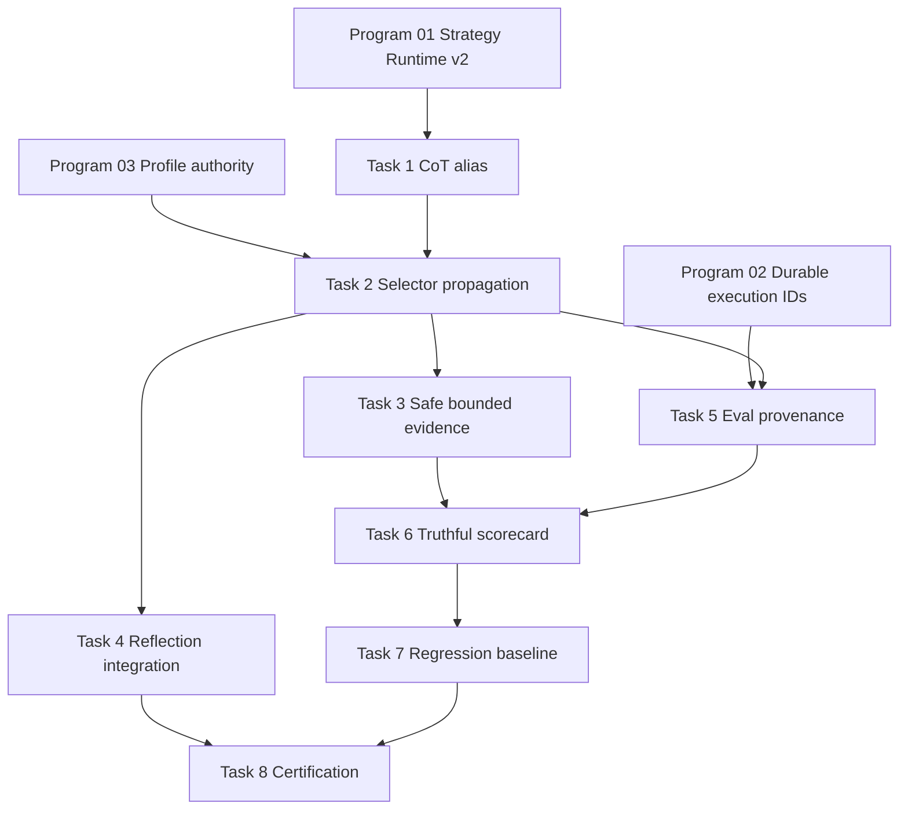

# Agent Pattern Program 04: Existing Reasoning and Evaluation Implementation Plan

> **For agentic workers:** REQUIRED SUB-SKILL: Use superpowers:subagent-driven-development (recommended) or superpowers:executing-plans to implement this plan task-by-task. Steps use checkbox (`- [ ]`) syntax for tracking.

**Goal:** Reconcile CoT aliases, propagate existing reasoning selections into production topology, preserve bounded Reflection, correlate EvalRunner results to strategy versions, make runtime scorecards evidence-truthful, and enforce versioned regression promotion gates.

**Architecture:** Treat Zero-Shot CoT as a configuration alias of the canonical Chain-of-Thought adapter, not a second runtime. Select Self-Refine, Self-Consistency, Tree of Thoughts, Peer Review, and Reflection through the goal profile before graph compilation; collect safe structured evidence from each node; persist measured and unavailable score states explicitly; gate promotion/canary expansion against versioned baselines.

**Tech Stack:** Python 3.12, LangGraph, SQLAlchemy 2 async, PostgreSQL RLS, pytest, existing provider abstraction, existing evaluation and orchestration persistence modules.

---

# Planning Assumptions

- Program 01 provides executable strategy contracts, alias resolution, versions, readiness probes, and certification evidence.
- Program 03 has landed profile-authoritative graph compilation and core strategy version propagation. Task 2 in this plan must not recreate graph assembly.
- Few-Shot CoT, Graph of Thoughts, Least-to-Most, ReWOO, LATS, LLM Compiler, Program of Thought, and CodeAct are outside this plan; they belong to Programs 05 and 06.
- Private chain-of-thought is never persisted, logged, returned, or used as certification evidence. Only safe rationale summaries, votes, scores, selected/pruned node metadata, critique categories, and bounded trace references are retained.
- Existing `EvalRunner` remains the seven-dimension persisted evaluator. `RuntimeScorecard` remains the operational nine-dimension scorecard. They gain shared provenance and evidence semantics but are not collapsed into one class.
- Program 03 is complete and `0098_core_execution_certification` is the current head. This plan owns `0099_reasoning_evaluation_evidence` with `down_revision = "0098_core_execution_certification"`.
- Commit commands are implementation checkpoints and are not to be executed during plan authoring or review.

# Source Final Documents

- Approved design: `docs/superpowers/specs/2026-08-03-agent-pattern-completion-program-design.md`, especially sections 3, 4, 5, 7.2, 11.3, 14, 15, and 16.
- Current selector: `agent-verse-backend/app/orchestration/pattern_selector.py:PatternSelector.select_agent_patterns`.
- Current profile builder: `agent-verse-backend/app/orchestration/runtime_profile_builder.py:RuntimeProfileBuilder.build_with_trace`.
- Registry aliases/states: `agent-verse-backend/app/orchestration/strategy_registry.py:build_default_registry` entries `chain_of_thought`, `zero_shot_cot`, `reflection`, `self_refine`, `self_consistency`, `tree_of_thoughts`, and `peer_review`.
- Graph topology/nodes: `agent-verse-backend/app/agent/graph.py:AgentGraph._build`, `_node_think`, `_node_reflect`, `_node_refine`, `_node_self_consistency`, `_node_tree_of_thoughts`, `_node_peer_review`, `_route`.
- Existing assemblers: `agent-verse-backend/app/agent/dynamic_graph.py:DynamicGraphAssembler` and forwarding module `app/agent/patterns/dynamic_graph_assembler.py`.
- Pattern implementations: `app/agent/patterns/self_refine.py:SelfRefinePattern`, `self_consistency.py:SelfConsistencyPattern`, `tree_of_thoughts.py:TreeOfThoughtsPattern`, `peer_review.py:PeerReviewPattern`, and `reflection.py:ReflectionPattern`.
- Prompt boundary: `agent-verse-backend/app/agent/prompts.py:CHAIN_OF_THOUGHT_SYSTEM`, `REFLECTION_SYSTEM`, and `SELF_REFINE_SYSTEM`.
- Evaluation: `agent-verse-backend/app/intelligence/eval_runner.py:EvalRunner`, `app/intelligence/eval.py:EvalScorecard`, `app/evals/runtime_scorecard.py:RuntimeScorecard`, `ScorecardResult`, `app/evals/regression_gate.py:RegressionGate`.
- Score components: `app/evals/rag_score.py:RAGScorer`, `model_score.py:ModelScorer`, `agent_score.py:AgentScorer`, and `goal_score.py:GoalScorer`.
- Persistence: `agent-verse-backend/app/services/orchestration_persistence.py:OrchestrationPersistence.persist_scorecard` and `persist_regression_case`.
- Existing tests: `tests/agent/patterns/test_agent_patterns_complete.py`, `tests/agent/test_dynamic_graph_activation.py`, `tests/orchestration/test_pattern_selector.py`, `tests/evals/test_runtime_scorecard.py`, `tests/evals/test_evals_comprehensive.py`, `tests/intelligence/test_eval_runner.py`, `test_eval_runner_comprehensive2.py`, `test_eval_dimensions.py`, and `test_eval_persist.py`.

# Epics

| Epic | Outcome | Depends on |
|---|---|---|
| REASON-04-E1 | CoT and Zero-Shot CoT have one canonical executable identity | Program 01 |
| REASON-04-E2 | Existing reasoning selections alter the current goal's production graph | Program 03, E1 |
| REASON-04-E3 | Reflection and advanced nodes are bounded and emit safe evidence | E2 |
| REASON-04-E4 | EvalRunner and RuntimeScorecard persist strategy/profile provenance | Program 02, E2 |
| REASON-04-E5 | Missing evidence cannot inflate operational scores | E4 |
| REASON-04-E6 | Versioned regression baselines gate promotion and canary expansion | E4, E5 |

# Workstreams

| Workstream | Owner boundary | Parallelism |
|---|---|---|
| WS-A Alias and selector reconciliation | registry, selector, runtime profile | Starts first |
| WS-B Production topology propagation | profile-aware graph factory and graph nodes | After WS-A |
| WS-C Safe reasoning evidence | pattern nodes and trace schema | Parallel with WS-D after WS-B |
| WS-D Evaluation provenance and truthful scorecard | intelligence/evals/persistence | Parallel with WS-C |
| WS-E Regression promotion gate | baselines, canary decisions, certification | After WS-D |

# Task Breakdown

## Task 1: Reconcile Chain-of-Thought and Zero-Shot CoT identity

**Files:**
- Modify: `agent-verse-backend/app/orchestration/strategy_registry.py:StrategyRegistry`, `build_default_registry`
- Modify: Program 01 canonical alias resolver
- Modify: `agent-verse-backend/app/orchestration/runtime_profile.py:AgentPatternConfig`
- Modify: `agent-verse-backend/tests/orchestration/test_strategy_registry.py`
- Create: `agent-verse-backend/tests/orchestration/test_reasoning_aliases.py`

- [ ] **Step 1.1: Write failing alias tests.** Add `test_zero_shot_cot_resolves_to_chain_of_thought`, `test_alias_does_not_create_second_adapter`, `test_alias_preserves_requested_id_in_decision_trace`, and `test_canonical_profile_contains_chain_of_thought_once`. Require requested ID `zero_shot_cot`, resolved ID `chain_of_thought`, configuration `mode="zero_shot"`, and one adapter/version identity.
- [ ] **Step 1.2: Write a private-reasoning boundary test.** Add `test_cot_profile_and_trace_do_not_contain_private_reasoning_fields`; serialize profile and decision trace and reject keys `thoughts`, `chain_of_thought`, `cot_reasoning`, and `hidden_reasoning` as persisted content fields. Strategy IDs may still contain the literal `chain_of_thought`.
- [ ] **Step 1.3: Run the red tests.**

  ```bash
  cd agent-verse-backend
  uv run pytest tests/orchestration/test_reasoning_aliases.py tests/orchestration/test_strategy_registry.py -q --no-cov
  ```

  Expected: FAIL because `zero_shot_cot` is currently a separate partial registry entry with no implementation path or canonical alias metadata.

- [ ] **Step 1.4: Implement canonical alias resolution.** Keep `chain_of_thought@1.0.0` as the executable strategy. Convert `zero_shot_cot` into an alias/configuration that resolves before compatibility/readiness checks; retain requested and resolved IDs in `DecisionTrace` for explainability. Do not add a Zero-Shot adapter class.
- [ ] **Step 1.5: Update registry state semantics.** `zero_shot_cot` derives readiness and certification from the exact canonical adapter/version plus its configuration-contract tests. It cannot be independently promoted.
- [ ] **Step 1.6: Run focused tests and static checks.**

  ```bash
  cd agent-verse-backend
  uv run pytest tests/orchestration/test_reasoning_aliases.py tests/orchestration/test_strategy_registry.py -q --no-cov
  uv run ruff check app/orchestration/strategy_registry.py app/orchestration/runtime_profile.py tests/orchestration/test_reasoning_aliases.py
  uv run mypy app/orchestration/strategy_registry.py app/orchestration/runtime_profile.py
  ```

  Expected: all tests pass and both static checks exit 0.

- [ ] **Step 1.7: Commit checkpoint.**

  ```bash
  git add agent-verse-backend/app/orchestration/strategy_registry.py agent-verse-backend/app/orchestration/runtime_profile.py agent-verse-backend/tests/orchestration/test_strategy_registry.py agent-verse-backend/tests/orchestration/test_reasoning_aliases.py
  git commit -m "refactor(reasoning): canonicalize zero-shot CoT alias"
  ```

## Task 2: Propagate Self-Refine, Self-Consistency, ToT, Peer Review, and Reflection selections

**Files:**
- Modify: `agent-verse-backend/app/orchestration/pattern_selector.py:PatternSelector.select_agent_patterns`
- Modify: `agent-verse-backend/app/orchestration/runtime_profile_builder.py:RuntimeProfileBuilder.build_with_trace`
- Modify: Program 03 profile-aware `AgentGraph` factory
- Modify: `agent-verse-backend/app/agent/graph.py:AgentGraph.__init__`, `_build`
- Modify: `agent-verse-backend/app/agent/dynamic_graph.py:DynamicGraphAssembler`
- Modify: `agent-verse-backend/tests/orchestration/test_pattern_selector.py`
- Modify: `agent-verse-backend/tests/agent/test_dynamic_graph_activation.py`
- Create: `agent-verse-backend/tests/integration/test_reasoning_selector_propagation.py`

- [ ] **Step 2.1: Write failing selector matrix tests.** Add deterministic cases: coding/generative selects `self_refine`; complex analytical with adequate cost/deadline selects `self_consistency`; expert search-space reasoning selects `tree_of_thoughts`; high-impact generated output selects `peer_review`; complex failed verification enables `reflection`. Assert selection reasons and exact per-pattern limits.
- [ ] **Step 2.2: Write exclusion tests.** Require no Self-Consistency or ToT for realtime/low-budget goals, no Peer Review when reviewer independence cannot be satisfied, and no incompatible duplicate primary reasoning strategy. Require rejected alternatives and reasons in `DecisionTrace`.
- [ ] **Step 2.3: Write production propagation integration tests.** Build the profile, construct the graph for that same goal, and inspect compiled nodes. Add `test_selected_self_refine_compiles_refine_node`, `test_selected_self_consistency_compiles_vote_node`, `test_selected_tot_compiles_tree_node`, `test_selected_peer_review_compiles_review_node`, and `test_selected_reflection_compiles_reflect_node`.
- [ ] **Step 2.4: Run the red tests.**

  ```bash
  cd agent-verse-backend
  uv run pytest tests/orchestration/test_pattern_selector.py tests/agent/test_dynamic_graph_activation.py tests/integration/test_reasoning_selector_propagation.py -q --no-cov
  ```

  Expected: FAIL because the selector currently automatically adds only CoT, Reflection, and Self-Refine; production assembly relies on agent flags/latest-goal string inspection; Self-Consistency, ToT, and Peer Review have no automatic selection policy.

- [ ] **Step 2.5: Implement deterministic selection policies.** Select only registry-available/readiness-compatible strategies and apply profile limits for calls, fan-out, depth, rounds, tokens, duration, and cost. Record all selected and rejected alternatives. Reviewer independence must require a provider/model identity different from the producing executor when the profile requests Peer Review.
- [ ] **Step 2.6: Consolidate topology assembly.** Make the Program 03 graph factory the only compiler from `GoalRuntimeProfile`; reduce `DynamicGraphAssembler` to a backward-compatible adapter that first converts `PatternConfig` into a profile. Remove post-construction flag mutation and latest-goal inference.
- [ ] **Step 2.7: Run focused tests and static checks.**

  ```bash
  cd agent-verse-backend
  uv run pytest tests/orchestration/test_pattern_selector.py tests/agent/test_dynamic_graph.py tests/agent/test_dynamic_graph_activation.py tests/integration/test_reasoning_selector_propagation.py -q --no-cov
  uv run ruff check app/orchestration/pattern_selector.py app/orchestration/runtime_profile_builder.py app/agent/dynamic_graph.py app/agent/graph.py tests/integration/test_reasoning_selector_propagation.py
  uv run mypy app/orchestration/pattern_selector.py app/orchestration/runtime_profile_builder.py app/agent/dynamic_graph.py
  ```

  Expected: tests pass; every selected strategy changes the current goal's compiled graph; static checks exit 0.

- [ ] **Step 2.8: Commit checkpoint.**

  ```bash
  git add agent-verse-backend/app/orchestration/pattern_selector.py agent-verse-backend/app/orchestration/runtime_profile_builder.py agent-verse-backend/app/agent/dynamic_graph.py agent-verse-backend/app/agent/graph.py agent-verse-backend/tests/orchestration/test_pattern_selector.py agent-verse-backend/tests/agent/test_dynamic_graph_activation.py agent-verse-backend/tests/integration/test_reasoning_selector_propagation.py
  git commit -m "feat(reasoning): propagate selected patterns into topology"
  ```

## Task 3: Bound reasoning nodes and emit safe structured evidence

**Files:**
- Create: `agent-verse-backend/app/agent/reasoning_evidence.py`
- Create: `agent-verse-backend/tests/agent/test_reasoning_evidence.py`
- Modify: `agent-verse-backend/app/agent/graph.py:_node_think`, `_node_reflect`, `_node_refine`, `_node_self_consistency`, `_node_tree_of_thoughts`, `_node_peer_review`
- Modify: `agent-verse-backend/app/agent/patterns/self_refine.py:SelfRefinePattern`
- Modify: `agent-verse-backend/app/agent/patterns/self_consistency.py:SelfConsistencyPattern`
- Modify: `agent-verse-backend/app/agent/patterns/tree_of_thoughts.py:TreeOfThoughtsPattern`, `ThoughtNode`
- Modify: `agent-verse-backend/app/agent/patterns/peer_review.py:PeerReviewPattern`, `PeerReviewResult`
- Modify: `agent-verse-backend/app/agent/patterns/reflection.py:ReflectionPattern`
- Modify: `agent-verse-backend/tests/agent/patterns/test_agent_patterns_complete.py`

- [ ] **Step 3.1: Correct stale Reflection tests first.** The current test file expects `ReflectionPattern(reflexion_store=...)`, `store_lesson`, and `recall_lessons`, but the class is only a graph-node adapter. Move persistent Reflexion expectations to the Program 11 scope; in this plan test Reflection only as failed-step critique and bounded replan integration.
- [ ] **Step 3.2: Write failing limits tests.** Require Self-Refine to stop at configured rounds/calls, Self-Consistency to enforce sample quorum and call/cost limits, ToT to enforce depth/beam/node/call limits and checkpoint cursor, Peer Review to fail closed when reviewer independence is unavailable, and Reflection to stop after the configured replan count.
- [ ] **Step 3.3: Write failing safe-evidence tests.** Persisted/returned evidence may include strategy ID/version, call count, quorum, disagreement categories, selected/pruned thought IDs and scores, critique categories, approval, limit reason, and safe rationale summary. Assert prompts, raw thought text, raw private critique, and `cot_reasoning` are absent.
- [ ] **Step 3.4: Run the red tests.**

  ```bash
  cd agent-verse-backend
  uv run pytest tests/agent/test_reasoning_evidence.py tests/agent/patterns/test_agent_patterns_complete.py -q --no-cov
  ```

  Expected: FAIL because pattern classes swallow provider errors, expose raw text as their primary result, lack shared limits/evidence, and Reflection test expectations do not match the implementation boundary.

- [ ] **Step 3.5: Add typed reasoning evidence.** Define one safe evidence model and sanitizer. Pattern execution returns answer/result plus evidence; graph nodes store only sanitized evidence and bounded trace references in `AgentState.context`. Keep final answer text separate from evidence.
- [ ] **Step 3.6: Enforce limits and explicit degraded outcomes.** Replace broad exception swallowing with typed degraded/failure results. Self-Consistency records valid/invalid samples and quorum; ToT checkpoints frontier metadata without thought content; Peer Review verifies reviewer identity; Reflection records failure category and replan count.
- [ ] **Step 3.7: Run focused tests.**

  ```bash
  cd agent-verse-backend
  uv run pytest tests/agent/test_reasoning_evidence.py tests/agent/patterns/test_agent_patterns_complete.py tests/agent/test_graph_node_coverage.py tests/agent/test_graph_comprehensive_coverage.py -q --no-cov
  uv run ruff check app/agent/reasoning_evidence.py app/agent/patterns app/agent/graph.py tests/agent/test_reasoning_evidence.py tests/agent/patterns/test_agent_patterns_complete.py
  uv run mypy app/agent/reasoning_evidence.py app/agent/patterns
  ```

  Expected: tests pass; static checks exit 0; serialized evidence contains no private reasoning.

- [ ] **Step 3.8: Commit checkpoint.**

  ```bash
  git add agent-verse-backend/app/agent/reasoning_evidence.py agent-verse-backend/app/agent/graph.py agent-verse-backend/app/agent/patterns agent-verse-backend/tests/agent/test_reasoning_evidence.py agent-verse-backend/tests/agent/patterns/test_agent_patterns_complete.py
  git commit -m "feat(reasoning): add bounded safe pattern evidence"
  ```

## Task 4: Preserve Reflection as bounded failed-step critique and replan

**Files:**
- Modify: `agent-verse-backend/app/agent/graph.py:_node_reflect`, `_route`, `_build`
- Modify: `agent-verse-backend/app/agent/prompts.py:REFLECTION_SYSTEM`
- Create: `agent-verse-backend/tests/agent/test_reflection_integration.py`
- Modify: `agent-verse-backend/tests/agent/test_agent_graph.py`

- [ ] **Step 4.1: Write failing routing tests.** Add `test_failed_verification_routes_once_through_reflection`, `test_reflection_feedback_is_injected_into_replan`, `test_reflection_never_runs_after_success`, `test_reflection_limit_terminates_replan`, and `test_reflection_does_not_replace_original_verification_evidence`.
- [ ] **Step 4.2: Write failing privacy test.** Capture emitted events, checkpoints, audit records, and persisted context; assert only a bounded safe critique summary and failure category appear, never raw model reasoning.
- [ ] **Step 4.3: Run the red tests.**

  ```bash
  cd agent-verse-backend
  uv run pytest tests/agent/test_reflection_integration.py tests/agent/test_agent_graph.py -q --no-cov
  ```

  Expected: FAIL because `_route` reflects every failed verification when enabled without a profile-level reflection counter/terminal evidence contract.

- [ ] **Step 4.4: Implement bounded reflection routing.** Track reflection attempts independently from global graph iterations; require failed verification evidence; produce a safe critique summary; route to plan while under limit; terminate or select another compatible strategy when exhausted. Preserve the verifier's original result and correlation IDs.
- [ ] **Step 4.5: Run focused tests.**

  ```bash
  cd agent-verse-backend
  uv run pytest tests/agent/test_reflection_integration.py tests/agent/test_agent_graph.py tests/agent/test_graph_critical.py -q --no-cov
  ```

  Expected: all tests pass; successful verification never invokes Reflection; exhaustion is explicit.

- [ ] **Step 4.6: Commit checkpoint.**

  ```bash
  git add agent-verse-backend/app/agent/graph.py agent-verse-backend/app/agent/prompts.py agent-verse-backend/tests/agent/test_reflection_integration.py agent-verse-backend/tests/agent/test_agent_graph.py
  git commit -m "fix(reasoning): bound reflection and preserve verification"
  ```

## Task 5: Correlate `EvalRunner` with strategy and profile versions

**Files:**
- Create: `agent-verse-backend/app/db/migrations/versions/0099_reasoning_evaluation_evidence.py`
- Modify: `agent-verse-backend/app/intelligence/eval.py:EvalScorecard`
- Modify: `agent-verse-backend/app/intelligence/eval_runner.py:EvalRunner.score`, `score_async`, `score_and_persist`
- Modify: `agent-verse-backend/app/db/models/eval.py`
- Modify: `agent-verse-backend/tests/intelligence/test_eval_dimensions.py`
- Modify: `agent-verse-backend/tests/intelligence/test_eval_persist.py`
- Create: `agent-verse-backend/tests/integration/test_eval_strategy_provenance.py`

- [ ] **Step 5.1: Write failing provenance tests.** Require every `EvalScorecard` to contain primary strategy ID/version, auxiliary strategy versions, profile ID/version, strategy execution ID, evaluator version, evidence-completeness map, and run correlation IDs.
- [ ] **Step 5.2: Write failing persistence tests.** Assert `score_and_persist` writes provenance and evaluator version to `evaluations`; duplicate `(tenant_id, goal_id, strategy_execution_id, evaluator_version)` delivery is idempotent; RLS prevents cross-tenant reads/writes.
- [ ] **Step 5.3: Run red tests.**

  ```bash
  cd agent-verse-backend
  uv run pytest tests/intelligence/test_eval_dimensions.py tests/intelligence/test_eval_persist.py tests/integration/test_eval_strategy_provenance.py -q --no-cov
  ```

  Expected: FAIL because `EvalScorecard` currently carries goal, scores, and iterations only, and the `evaluations` insert has no strategy/profile/evaluator provenance.

- [ ] **Step 5.4: Add migration and ORM fields.** Extend `evaluations`, `eval_scorecards`, and `regression_cases` with version/provenance/evidence-completeness fields and tenant-leading indexes. Add replay-safe unique constraints. Add `USING` and `WITH CHECK` RLS for any table not already covered.
- [ ] **Step 5.5: Propagate provenance.** Read the immutable supplied runtime profile and strategy execution context from `AgentState`; do not infer strategy from node output. Persist the exact evaluator version and evidence availability used to compute each dimension.
- [ ] **Step 5.6: Validate migration and tests.**

  ```bash
  cd agent-verse-backend
  uv run alembic upgrade head
  uv run pytest tests/intelligence/test_eval_dimensions.py tests/intelligence/test_eval_persist.py -q --no-cov
  DOCKER_HOST="unix:///Users/harsh.kumar01/.colima/default/docker.sock" TESTCONTAINERS_RYUK_DISABLED=true uv run pytest tests/integration/test_eval_strategy_provenance.py -q --no-cov -m integration
  uv run alembic downgrade 0098_core_execution_certification
  uv run alembic upgrade head
  ```

  Expected: migration round-trip and all tests pass; duplicate persistence creates one evaluation per versioned execution/evaluator identity.

- [ ] **Step 5.7: Commit checkpoint.**

  ```bash
  git add agent-verse-backend/app/db/migrations/versions/0099_reasoning_evaluation_evidence.py agent-verse-backend/app/db/models/eval.py agent-verse-backend/app/intelligence/eval.py agent-verse-backend/app/intelligence/eval_runner.py agent-verse-backend/tests/intelligence/test_eval_dimensions.py agent-verse-backend/tests/intelligence/test_eval_persist.py agent-verse-backend/tests/integration/test_eval_strategy_provenance.py
  git commit -m "feat(evals): persist versioned strategy provenance"
  ```

## Task 6: Make `RuntimeScorecard` truthful about missing evidence

**Files:**
- Modify: `agent-verse-backend/app/evals/runtime_scorecard.py:ScorecardResult`, `RuntimeScorecard.score`
- Modify: `agent-verse-backend/app/evals/rag_score.py:RAGScorer.score`
- Modify: `agent-verse-backend/app/evals/model_score.py:ModelScorer.score_cost`, `score_latency`
- Modify: `agent-verse-backend/app/evals/agent_score.py:AgentScorer`
- Modify: `agent-verse-backend/app/agent/graph.py` scorecard invocation near goal completion
- Modify: `agent-verse-backend/app/services/orchestration_persistence.py:OrchestrationPersistence.persist_scorecard`
- Modify: `agent-verse-backend/tests/evals/test_runtime_scorecard.py`
- Modify: `agent-verse-backend/tests/evals/test_evals_comprehensive.py`

- [ ] **Step 6.1: Replace neutral-default tests with failing truthfulness tests.** Rename `test_rag_scorer_none_returns_mid` to `test_rag_scorer_none_is_unavailable`; add missing-cost, missing-latency, missing-retrieval, missing-citation, missing-tool, and not-applicable dimension cases. Require explicit status `measured`, `not_applicable`, or `unavailable`; unavailable values cannot contribute a synthetic positive score.
- [ ] **Step 6.2: Add retrieval propagation test.** Run a goal with a known `RetrievalResult` and assert the same evidence reference reaches `RuntimeScorecard.score`. Run a non-retrieval goal and assert RAG/citation dimensions are `not_applicable`, not `0.5`.
- [ ] **Step 6.3: Add denominator and threshold tests.** Overall score uses only measured/applicable dimensions and reports coverage. A score with coverage below the configured minimum cannot pass a promotion gate regardless of numeric average.
- [ ] **Step 6.4: Run red tests.**

  ```bash
  cd agent-verse-backend
  uv run pytest tests/evals/test_runtime_scorecard.py tests/evals/test_evals_comprehensive.py -q --no-cov
  ```

  Expected: FAIL because missing retrieval currently scores `0.5`, missing cost scores `0.8`, missing latency scores `0.75`, and the graph invokes `RuntimeScorecard.score` without the actual retrieval result, cost, or violation count.

- [ ] **Step 6.5: Implement typed dimension evidence.** Extend `ScorecardResult` with per-dimension status, evidence references, coverage, evaluator version, and strategy/profile provenance. Keep numeric compatibility in `scores` for measured dimensions; omit unavailable dimensions from the weighted denominator and retain status separately.
- [ ] **Step 6.6: Wire actual execution evidence.** Pass retrieval evidence, accumulated cost, measured latency, guardrail violations, citations, grounding, and tool outcomes from `AgentState`/execution trace. Do not substitute fallback constants when source evidence is absent.
- [ ] **Step 6.7: Persist truthful scorecards.** Store statuses, coverage, and evidence references with scores. Update readers to distinguish unavailable from zero. Preserve old rows by backfilling `evidence_status="legacy_unknown"`; never reinterpret historical neutral defaults as measured.
- [ ] **Step 6.8: Run focused tests and static checks.**

  ```bash
  cd agent-verse-backend
  uv run pytest tests/evals/test_runtime_scorecard.py tests/evals/test_evals_comprehensive.py tests/evals/test_scorecard_comprehensive.py tests/agent/test_graph_persistence_wiring.py -q --no-cov
  uv run ruff check app/evals app/agent/graph.py app/services/orchestration_persistence.py tests/evals
  uv run mypy app/evals app/services/orchestration_persistence.py
  ```

  Expected: tests pass; missing evidence is never represented as a positive measured score; static checks exit 0.

- [ ] **Step 6.9: Commit checkpoint.**

  ```bash
  git add agent-verse-backend/app/evals agent-verse-backend/app/agent/graph.py agent-verse-backend/app/services/orchestration_persistence.py agent-verse-backend/tests/evals agent-verse-backend/tests/agent/test_graph_persistence_wiring.py
  git commit -m "fix(evals): score only observed runtime evidence"
  ```

## Task 7: Add versioned regression baselines and promotion gates

**Files:**
- Create: `agent-verse-backend/app/evals/regression_baseline.py`
- Create: `agent-verse-backend/tests/evals/test_regression_baseline.py`
- Modify: `agent-verse-backend/app/evals/regression_gate.py:RegressionGate`
- Modify: `agent-verse-backend/app/services/orchestration_persistence.py:OrchestrationPersistence.persist_regression_case`
- Modify: Program 01 certification/promotion service
- Modify: `agent-verse-backend/tests/evals/test_runtime_scorecard.py`
- Create: `agent-verse-backend/tests/integration/test_reasoning_regression_gate.py`

- [ ] **Step 7.1: Write failing baseline tests.** A baseline key includes tenant/cohort, canonical strategy ID/version, profile version, evaluator version, eval suite/dataset version, and limits policy version. Require immutable baseline revisions and minimum sample counts.
- [ ] **Step 7.2: Write failing gate tests.** Reject promotion when quality regresses beyond 2 percentage points, safety decreases at all, policy/tenant tests fail, cost rises more than 10%, p95 latency rises more than 15%, coverage is below 0.9, sample size is insufficient, or evidence versions do not match. Require explicit pass/fail reasons.
- [ ] **Step 7.3: Write failing canary test.** Simulate successive canary windows; expansion occurs only after all windows pass. A failed window freezes expansion and records the kill-switch recommendation without mutating the previous certified version.
- [ ] **Step 7.4: Run red tests.**

  ```bash
  cd agent-verse-backend
  uv run pytest tests/evals/test_regression_baseline.py tests/integration/test_reasoning_regression_gate.py tests/evals/test_runtime_scorecard.py -q --no-cov
  ```

  Expected: FAIL because `RegressionGate` currently creates low-score candidates only and has no versioned baseline or promotion decision contract.

- [ ] **Step 7.5: Implement baseline comparison.** Keep `maybe_create_regression` for dataset capture, and add a separate promotion decision that compares candidate aggregate evidence with an immutable baseline. Persist reasons and metric deltas; never overwrite certified evidence.
- [ ] **Step 7.6: Wire certification and canary expansion.** Program 01 promotion requires the gate result for the exact strategy/profile/evaluator versions. `implemented` may remain available after a quality regression; `certified` promotion or canary expansion must stop.
- [ ] **Step 7.7: Run focused and integration tests.**

  ```bash
  cd agent-verse-backend
  uv run pytest tests/evals/test_regression_baseline.py tests/evals/test_runtime_scorecard.py tests/evals/test_evals_comprehensive.py -q --no-cov
  DOCKER_HOST="unix:///Users/harsh.kumar01/.colima/default/docker.sock" TESTCONTAINERS_RYUK_DISABLED=true uv run pytest tests/integration/test_reasoning_regression_gate.py -q --no-cov -m integration
  ```

  Expected: all tests pass; unsafe, under-sampled, low-coverage, stale-version, or regressed candidates cannot promote.

- [ ] **Step 7.8: Commit checkpoint.**

  ```bash
  git add agent-verse-backend/app/evals/regression_baseline.py agent-verse-backend/app/evals/regression_gate.py agent-verse-backend/app/services/orchestration_persistence.py agent-verse-backend/tests/evals/test_regression_baseline.py agent-verse-backend/tests/evals/test_runtime_scorecard.py agent-verse-backend/tests/integration/test_reasoning_regression_gate.py
  git commit -m "feat(evals): gate promotion on versioned baselines"
  ```

## Task 8: Certify existing reasoning production paths

**Files:**
- Create: `agent-verse-backend/tests/e2e/test_existing_reasoning_production_path.py`
- Create: `agent-verse-backend/tests/security/test_reasoning_trace_privacy.py`
- Modify: `agent-verse-backend/app/orchestration/strategy_registry.py`
- Modify: `docs/CAPABILITIES.md`
- Modify: `RUNBOOK.md`

- [ ] **Step 8.1: Add production-path E2E matrix.** For CoT/Zero-Shot alias, Self-Refine, Self-Consistency, ToT, Peer Review, and Reflection, submit a goal that deterministically selects the pattern, assert the compiled node executes, verify limits/evidence, persist EvalRunner and RuntimeScorecard records, and evaluate the regression gate.
- [ ] **Step 8.2: Add privacy/adversarial tests.** Use provider responses containing secrets, prompt injection, and explicit private reasoning markers. Assert persisted DB rows, logs, SSE events, API responses, audit records, and checkpoints contain only sanitized summaries and evidence references.
- [ ] **Step 8.3: Add restart and budget tests.** Restart during ToT/Self-Consistency execution and resume from safe cursor metadata; assert completed calls are not repeated. Exhaust each pattern's call/token/cost budget and assert explicit bounded termination.
- [ ] **Step 8.4: Run the red certification suite.**

  ```bash
  cd agent-verse-backend
  uv run pytest tests/e2e/test_existing_reasoning_production_path.py tests/security/test_reasoning_trace_privacy.py -q --no-cov
  ```

  Expected: FAIL until every pattern has canonical selection, safe evidence, persistence, restart, and scorecard provenance.

- [ ] **Step 8.5: Wire certification evidence.** Record exact strategy/profile/evaluator versions, readiness snapshot, restart/policy/privacy/budget test run IDs, and canary aggregate. Do not certify aliases independently from their canonical adapter.
- [ ] **Step 8.6: Update generated capability and operator documentation.** Document selection/rejection reasons, safe evidence fields, unavailable score semantics, baseline comparison, privacy controls, kill switches, and rollback criteria.
- [ ] **Step 8.7: Run the complete program gate.**

  ```bash
  cd agent-verse-backend
  uv run pytest tests/orchestration/test_reasoning_aliases.py tests/orchestration/test_pattern_selector.py tests/agent/test_dynamic_graph_activation.py tests/agent/test_reasoning_evidence.py tests/agent/test_reflection_integration.py tests/agent/patterns/test_agent_patterns_complete.py tests/intelligence/test_eval_dimensions.py tests/intelligence/test_eval_persist.py tests/evals/test_runtime_scorecard.py tests/evals/test_regression_baseline.py -q --no-cov
  DOCKER_HOST="unix:///Users/harsh.kumar01/.colima/default/docker.sock" TESTCONTAINERS_RYUK_DISABLED=true uv run pytest tests/integration/test_reasoning_selector_propagation.py tests/integration/test_eval_strategy_provenance.py tests/integration/test_reasoning_regression_gate.py tests/e2e/test_existing_reasoning_production_path.py tests/security/test_reasoning_trace_privacy.py -q --no-cov
  uv run ruff check app tests
  uv run mypy app
  ```

  Expected: all tests pass; static checks exit 0; registry state reflects actual evidence for exact versions and does not expose private reasoning.

- [ ] **Step 8.8: Commit checkpoint.**

  ```bash
  git add agent-verse-backend/app/orchestration/strategy_registry.py agent-verse-backend/tests/e2e/test_existing_reasoning_production_path.py agent-verse-backend/tests/security/test_reasoning_trace_privacy.py docs/CAPABILITIES.md RUNBOOK.md
  git commit -m "test(reasoning): certify existing reasoning and eval gates"
  ```

# Dependency Graph



# Jira Mapping Plan

| Type | Title | Description | Dependencies | Acceptance notes | Labels |
|---|---|---|---|---|---|
| Epic | REASON-04 Existing reasoning and evaluation truth | Reconcile aliases, wire selectors, preserve safe bounded reasoning, and gate promotion on observed evidence | Programs 01, 02, 03 | All REASON-04 definition-of-done checks pass | `agent-patterns`, `reasoning`, `evals` |
| Story | REASON-04-01 Canonicalize Zero-Shot CoT | Resolve Zero-Shot to configured CoT adapter while retaining request trace | Program 01 | One adapter/version identity | `cot`, `aliases` |
| Story | REASON-04-02 Propagate reasoning selectors | Automatically select and compile existing reasoning nodes | Program 03, REASON-04-01 | Selector-to-node E2E tests pass | `selector`, `langgraph` |
| Story | REASON-04-03 Add safe bounded reasoning evidence | Enforce limits and persist only safe structured traces | REASON-04-02 | Privacy and limits tests pass | `privacy`, `explainability` |
| Story | REASON-04-04 Bound Reflection | Preserve failed-step critique and bounded replan | REASON-04-02 | No success-path reflection or infinite replans | `reflection`, `reliability` |
| Story | REASON-04-05 Version evaluation provenance | Correlate EvalRunner and scorecards to strategy/profile/evaluator versions | Programs 02, 03 | Idempotent tenant-safe persistence | `evalrunner`, `postgres` |
| Story | REASON-04-06 Remove synthetic score evidence | Represent measured, unavailable, and not-applicable dimensions truthfully | REASON-04-05 | Missing data cannot inflate overall score | `scorecard`, `quality` |
| Story | REASON-04-07 Gate promotion on baselines | Compare versioned quality/safety/cost/latency evidence | REASON-04-06 | Canary expansion freezes on any blocking regression | `regression`, `canary` |
| Story | REASON-04-08 Certify existing reasoning | Run production-path, restart, privacy, policy, cost, and canary gates | REASON-04-03 through 07 | Evidence-backed status only | `certification`, `security` |

# Migration Plan

1. Land alias metadata and selector decisions in shadow mode; do not change production topology until Program 03 profile authority is active.
2. Enable selector propagation for internal tenants one pattern at a time: Self-Refine, Reflection, Self-Consistency, Peer Review, then ToT.
3. Apply `0099_reasoning_evaluation_evidence`; backfill existing rows with `strategy_version="legacy_unknown"`, `profile_version="legacy_unknown"`, `evaluator_version="legacy"`, and evidence status `legacy_unknown`.
4. Dual-write old numeric score fields and new dimension-evidence fields for one release; readers prefer new fields when present.
5. Build baselines only from new measured evidence with matching versions and minimum coverage; exclude legacy-neutral rows.
6. Enable promotion gates in report-only mode, compare decisions with operators, then make them blocking.
7. Canary each reasoning strategy by tenant cohort and preserve per-strategy kill switches.

# Test Plan

- Unit: alias resolution, selector/exclusion rules, per-pattern limits, safe evidence serialization, Reflection routing, dimension evidence, and baseline comparison.
- Graph integration: selected profile produces expected nodes before compilation; rejected strategies do not appear.
- Persistence integration: evaluation/scorecard/regression provenance, uniqueness, RLS, migration round-trip, and restart cursors.
- Security: no private reasoning or secrets in logs, events, checkpoints, API, audit, or DB.
- E2E: deterministic production selection and execution for all in-scope patterns.
- Regression/canary: quality, safety, cost, latency, coverage, sample size, and version compatibility thresholds.
- Static: Ruff and strict mypy for the backend.

# Release Plan

1. Deploy schema and alias reconciliation with no selection changes.
2. Shadow selector decisions and rejected reasons for one observation window.
3. Canary Self-Refine and Reflection for internal tenants.
4. Canary Self-Consistency and Peer Review where budget and reviewer independence are available.
5. Canary ToT only for expert, non-realtime goals with strict limits.
6. Enable truthful scorecard reads and report-only regression decisions.
7. Make regression gates blocking after baseline quality and coverage are verified.
8. Promote exact strategy versions to `certified` only after all evidence gates pass.

# Rollback Plan

- Disable individual reasoning strategies through registry administration/kill switches without disabling ReAct core execution.
- Roll back selector propagation to the last certified profile version; in-flight executions retain their original immutable profile and adapter versions.
- If new scorecard readers fail, fall back to old numeric fields for display only; promotion remains blocked because legacy fields lack sufficient evidence status.
- Freeze canary expansion immediately on safety regression, private-reasoning leakage, duplicate calls after restart, cost/latency breach, or evidence coverage below 0.9.
- Downgrade `0099` only after writers are rolled back; preserve exported evidence and never relabel legacy neutral scores as measured.

# Risks and Blockers

| Risk/blocker | Mitigation |
|---|---|
| Program 03 profile authority is incomplete | Block Task 2; post-construction flags do not count as propagation |
| Pattern tests currently overstate implementation | Replace registry-label assertions with production-path and evidence assertions |
| Current Reflection tests mix Reflection with persistent Reflexion | Keep Reflection in this plan; move cross-session lesson storage to Program 11 |
| Missing evidence lowers apparent historical scores | Mark historical data `legacy_unknown`; communicate the semantic correction and rebuild baselines |
| Self-Consistency/ToT amplify cost | Enforce pre-dispatch calls, fan-out, token, duration, and cost limits with cancellation |
| Peer reviewer is not independent | Reject selection or record degraded unavailability; never call the same model identity “peer” evidence |
| Safe summaries leak private reasoning | Central sanitizer plus adversarial persistence/log/API tests |
| Baselines compare incompatible versions | Version-key every baseline and block mismatched comparison |

# Definition of Done

- [ ] `zero_shot_cot` resolves to configured `chain_of_thought` and does not own a duplicate adapter or independent certification state.
- [ ] Selector decisions for Self-Refine, Self-Consistency, ToT, Peer Review, and Reflection propagate into the current goal's graph before compilation.
- [ ] Incompatible, unavailable, over-budget, realtime, and non-independent-review alternatives are rejected with recorded reasons.
- [ ] All in-scope patterns enforce calls, fan-out/depth/rounds, tokens, duration, cost, cancellation, and checkpoint limits appropriate to the algorithm.
- [ ] Reflection runs only after failed verification, preserves original evidence, and stops after its bounded replan count.
- [ ] No private chain-of-thought, raw thought tree, secret, or unnecessary PII is persisted or returned.
- [ ] `EvalRunner` and `RuntimeScorecard` records identify exact strategy, profile, execution, evaluator, and evidence versions.
- [ ] Missing and not-applicable evidence are explicit and cannot inflate overall scores.
- [ ] Regression baselines are immutable, version-compatible, sufficiently sampled, and coverage-qualified.
- [ ] Promotion and canary expansion stop on quality, safety, policy, cost, latency, privacy, coverage, or version regressions.
- [ ] Production-path, restart, duplicate-delivery, tenant isolation, privacy, policy, budget, and canary tests pass.
- [ ] Ruff and strict mypy pass for the backend.
- [ ] No commit has been created during plan authoring.