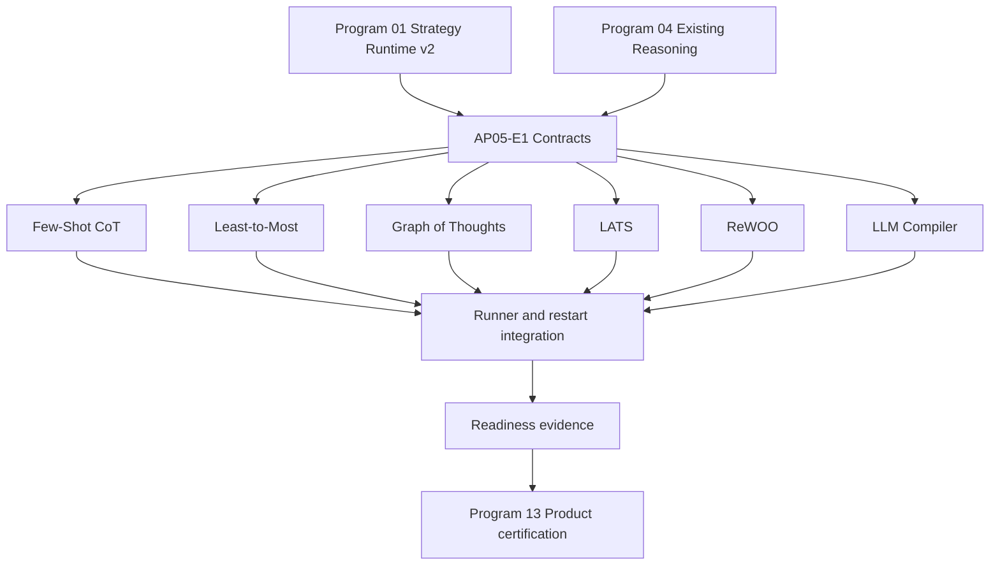

# Agent Pattern Program 05: New Local Reasoning Implementation Plan

> **For agentic workers:** REQUIRED SUB-SKILL: Use superpowers:subagent-driven-development
> (recommended) or superpowers:executing-plans to implement this plan task-by-task. Steps use
> checkbox (`- [ ]`) syntax for tracking.

**Goal:** Deliver production-path Few-Shot CoT, Graph of Thoughts, Least-to-Most, ReWOO,
LATS, and LLM Compiler adapters with bounded execution, durable checkpoints, safe traces, and
evidence-backed registry readiness.

**Architecture:** Each capability is a versioned local-reasoning adapter resolved by Strategy
Runtime v2 and executed by `StrategyRunner`; no capability adds a boolean branch to
`AgentGraph`. Shared contracts represent examples, thought DAGs, decompositions, frozen tool
plans, search state, and compiled tasks, while each adapter owns its deterministic state machine
and checkpoint cursor. `AgentGraph` remains the governed single-agent/tool kernel used for
individual tool tasks.

**Tech Stack:** Python 3.12, dataclasses/Pydantic 2, FastAPI application services, LangGraph
checkpoints supplied by Strategy Runtime v2, existing provider abstractions, existing governed
tool dispatch, PostgreSQL canonical checkpoints, Redis wakeups, pytest, Ruff, strict mypy.

---

# Planning Assumptions

- Program 01 has created the canonical flat modules `app/orchestration/strategy_contracts.py`,
  `strategy_adapters.py`, `strategy_runner.py`, `strategy_readiness.py`,
  `strategy_certification.py`, and `strategy_registry.py` with the
  approved `StrategySpec`, `StrategyExecutionRequest`, `StrategyExecutionResult`,
  `StrategyCheckpoint`, `PatternLimits`, `StrategyAdapter`, and `StrategyRunner` contracts.
- Program 04 has certified existing CoT, Self-Consistency, Tree of Thoughts, Peer Review, and
  evaluation behavior. This plan reuses their provider/tool boundaries but does not extend their
  raw-string `execute()` APIs.
- `StrategyExecutionRequest.runtime_profile` contains one primary reasoning strategy; auxiliary
  strategies are accepted only when the registry declares compatibility.
- PostgreSQL is canonical for accepted checkpoints and artifacts. Redis may wake a runner but is
  not required to reconstruct state.
- Safe rationale means stage names, scores, selected/pruned identifiers, tool outcomes, and
  evidence references. Prompts, hidden reasoning text, and private chain-of-thought are excluded.
- This plan changes backend implementation and tests only. Program 13 owns public API, SDK,
  frontend, and final cross-program certification.
- No new third-party package is required. JSON schema validation uses Pydantic models and the
  existing provider `response_schema` support.

# Source Final Documents

- Approved source: `docs/superpowers/specs/2026-08-03-agent-pattern-completion-program-design.md`
- Required predecessor: `docs/superpowers/plans/2026-08-03-agent-pattern-program-01-strategy-runtime-v2.md`
- Required predecessor: `docs/superpowers/plans/2026-08-03-agent-pattern-program-04-existing-reasoning-evaluation.md`
- Existing catalogue: `agent-verse-backend/app/orchestration/strategy_registry.py`
- Existing pattern convention: `agent-verse-backend/app/agent/patterns/base.py`
- Existing bounded-search reference: `agent-verse-backend/app/agent/patterns/tree_of_thoughts.py`
- Existing governed graph/tool kernel: `agent-verse-backend/app/agent/graph.py`
- Existing provider contracts: `agent-verse-backend/app/providers/base.py`

# Epics

| Epic | Title | Outcome | Depends on |
|---|---|---|---|
| AP05-E1 | Local reasoning contracts and registration | Shared typed state, hard defaults, and six resolvable adapter specs | Program 01 |
| AP05-E2 | Example-grounded CoT and progressive decomposition | Few-Shot CoT and Least-to-Most execute with provenance and injection controls | AP05-E1 |
| AP05-E3 | Bounded graph and Monte Carlo search | GoT and LATS prune deterministically, checkpoint, resume, and stop on limits | AP05-E1 |
| AP05-E4 | Frozen and compiled tool planning | ReWOO and LLM Compiler validate dependencies and use governed wave dispatch | AP05-E1 |
| AP05-E5 | Production-path evidence | Integration, restart, adversarial, metrics, and registry evidence gates pass | AP05-E2, AP05-E3, AP05-E4 |

# Workstreams

| Workstream | Parallelism | Owned paths |
|---|---|---|
| WS-A contracts/registry | Starts first | `app/agent/patterns/reasoning_contracts.py`, runtime-v2 registry integration |
| WS-B Few-Shot/Least-to-Most | Parallel after WS-A | two adapters, example source, two unit suites |
| WS-C GoT/LATS | Parallel after WS-A | two adapters and bounded-search unit suites |
| WS-D ReWOO/LLM Compiler | Parallel after WS-A | two adapters, tool DAG executor integration, two unit suites |
| WS-E certification | Starts after B/C/D | integration, restart, adversarial, observability, registry evidence |

# Task Breakdown

## Typed Contracts And Limits

**Files:**

- Create: `agent-verse-backend/app/agent/patterns/reasoning_contracts.py`
- Modify: `agent-verse-backend/app/agent/patterns/__init__.py`
- Modify: `agent-verse-backend/app/orchestration/strategy_registry.py`
- Modify: `agent-verse-backend/app/orchestration/strategy_registry.py`
- Test: `agent-verse-backend/tests/agent/patterns/test_reasoning_contracts.py`
- Test: `agent-verse-backend/tests/orchestration/test_strategy_registry.py`

The implementation must define these exact immutable/validated contracts:

```python
class ReasoningPhase(StrEnum):
    CREATED = "created"
    PREPARING = "preparing"
    GENERATING = "generating"
    EVALUATING = "evaluating"
    EXECUTING = "executing"
    SYNTHESIZING = "synthesizing"
    COMPLETED = "completed"
    FAILED = "failed"
    CANCELLED = "cancelled"
    LIMIT_EXCEEDED = "limit_exceeded"

class ReasoningExample(BaseModel):
    example_id: str
    problem: str
    safe_rationale: str
    answer: str
    source_ref: str
    provenance_ref: str
    trust_label: Literal["curated", "tenant_verified"]
    relevance_score: float = Field(ge=0.0, le=1.0)
    content_sha256: str

class ThoughtNodeState(BaseModel):
    node_id: str
    content_ref: str
    safe_summary: str
    score: float = Field(ge=0.0, le=1.0)
    depth: int = Field(ge=0)
    status: Literal["candidate", "selected", "pruned", "merged", "terminal"]
    parent_ids: tuple[str, ...]

class ThoughtEdgeState(BaseModel):
    source_id: str
    target_id: str
    relation: Literal["expands", "refines", "combines", "contradicts"]

class SubproblemState(BaseModel):
    subproblem_id: str
    question: str
    depends_on: tuple[str, ...]
    status: Literal["pending", "ready", "running", "complete", "failed"]
    answer_ref: str | None

class ToolPlanStep(BaseModel):
    step_id: str
    tool_name: str
    arguments: dict[str, JsonValue]
    depends_on: tuple[str, ...]
    output_variable: str
    schema_version: int = 1

class SearchNodeState(BaseModel):
    node_id: str
    parent_id: str | None
    action_ref: str
    observation_ref: str | None
    visits: int = Field(ge=0)
    value_sum: float
    depth: int = Field(ge=0)
    is_terminal: bool

class CompiledTask(BaseModel):
    task_id: str
    tool_name: str
    arguments: dict[str, JsonValue]
    depends_on: tuple[str, ...]
    output_schema: dict[str, JsonValue]
    status: Literal["pending", "ready", "running", "complete", "failed", "cancelled"]
```

`PatternLimits` must enforce the following defaults before the first provider or tool call.
Tenant/plan policy may lower them; only operator configuration may raise them up to Program 01
hard ceilings.

| Strategy | Calls | Nodes | Edges | Depth | Fan-out | Rounds | Tokens | Duration | Cost |
|---|---:|---:|---:|---:|---:|---:|---:|---:|---:|
| `few_shot_cot` | 3 | 0 | 0 | 1 | 1 | 1 | 6,000 | 60 s | $0.08 |
| `graph_of_thoughts` | 24 | 24 | 48 | 4 | 4 | 6 | 24,000 | 180 s | $0.40 |
| `least_to_most` | 10 | 8 | 12 | 8 | 1 | 8 | 12,000 | 120 s | $0.20 |
| `rewoo` | 12 | 12 | 24 | 6 | 4 | 8 | 12,000 | 180 s | $0.30 |
| `lats` | 32 | 32 | 31 | 6 | 4 | 24 | 32,000 | 240 s | $0.60 |
| `llm_compiler` | 16 | 16 | 32 | 8 | 4 | 8 | 16,000 | 180 s | $0.35 |

- [ ] **AP05-T01 Red:** Add contract tests for invalid scores, duplicate IDs, unknown dependency
  IDs, graph cycles, duplicate output variables, and every default limit row.
- [ ] **AP05-T02 Verify red:** Run
  `cd agent-verse-backend && uv run pytest tests/agent/patterns/test_reasoning_contracts.py tests/orchestration/test_strategy_registry.py -q`.
  Expected: collection or assertion failures naming missing contracts and unresolved adapters.
- [ ] **AP05-T03 Green:** Implement contracts, topological validation helpers, adapter exports,
  exact specs with `version="1.0.0"`, `state_schema_version=1`, compatible family
  `local_reasoning`, and adapter paths under `app.agent.patterns`.
- [ ] **AP05-T04 Verify green:** Repeat AP05-T02. Expected: all selected tests pass and all six
  registry entries resolve executable adapters but remain `partial` until AP05-T43.
- [ ] **AP05-T05 Quality:** Run
  `cd agent-verse-backend && uv run ruff check app/agent/patterns/reasoning_contracts.py app/orchestration/strategy_registry.py tests/agent/patterns/test_reasoning_contracts.py && uv run mypy app/agent/patterns/reasoning_contracts.py`.
  Expected: both commands exit 0.

## Few-Shot CoT

**Files:**

- Create: `agent-verse-backend/app/agent/patterns/few_shot_cot.py`
- Create: `agent-verse-backend/app/agent/reasoning_example_source.py`
- Test: `agent-verse-backend/tests/agent/patterns/test_few_shot_cot.py`

Contract: `ReasoningExampleSource.retrieve(tenant_id, query, limit, minimum_score) ->
tuple[ReasoningExample, ...]`. Retrieval must return at most four examples, require score
`>= 0.72`, deduplicate by `content_sha256`, preserve provenance, accept only `curated` or
`tenant_verified`, and pass each example through the existing injection scanner and data
classifier. An unsafe example is excluded and traced by ID/reason; its text is never echoed.

Algorithm and transitions:

`created -> preparing -> generating -> synthesizing -> completed`

1. Retrieve up to four examples using remaining token budget.
2. Reject cross-tenant, untrusted, unprovenanced, duplicate, low-score, classified-forbidden,
   and injection-positive examples.
3. Build a structured prompt containing problem, safe rationale summary, and answer fields;
   delimit examples as untrusted data, never instructions.
4. Request one schema-constrained answer with `answer`, `evidence_refs`, and `safe_rationale`.
5. If no examples survive, terminate `failed` with `dependency_unready`; do not silently run
   zero-shot CoT under the Few-Shot strategy ID.

- [ ] **AP05-T06 Red:** Test ranking, four-example cap, tenant isolation, provenance retention,
  injection exclusion, token truncation, cancellation before retrieval, and no-example failure.
- [ ] **AP05-T07 Verify red:** Run
  `cd agent-verse-backend && uv run pytest tests/agent/patterns/test_few_shot_cot.py -q`.
  Expected: failures identify missing source and adapter.
- [ ] **AP05-T08 Green:** Implement the source protocol and `FewShotCoTAdapter`; meter retrieval
  plus provider calls through request budget; checkpoint after `preparing` and `generating`.
- [ ] **AP05-T09 Verify green:** Repeat AP05-T07. Expected: all tests pass; captured prompts omit
  rejected content and returned traces contain only IDs, scores, and safe summaries.

## Least-to-Most

**Files:**

- Create: `agent-verse-backend/app/agent/patterns/least_to_most.py`
- Test: `agent-verse-backend/tests/agent/patterns/test_least_to_most.py`

Algorithm and transitions:

`created -> preparing -> generating -> executing -> synthesizing -> completed`

1. Generate `1..8` typed `SubproblemState` records ordered simple-to-complex.
2. Validate unique IDs, known dependencies, acyclicity, at least one root, and every terminal
   subproblem contributing to synthesis.
3. Execute the next topological ready item. Its context includes only dependency answers and a
   bounded cumulative summary, never all hidden reasoning.
4. Checkpoint after decomposition and each completed subproblem.
5. Fail on a subproblem error unless the typed decomposition marks it optional; this version
   does not support optional items, so every failure is terminal.

- [ ] **AP05-T10 Red:** Test simple-first ordering, unknown dependencies, cycles, cumulative
  context, resume at the first incomplete subproblem, eight-item limit, cancellation, and final
  synthesis evidence.
- [ ] **AP05-T11 Verify red:** Run
  `cd agent-verse-backend && uv run pytest tests/agent/patterns/test_least_to_most.py -q`.
  Expected: failures identify missing adapter.
- [ ] **AP05-T12 Green:** Implement `LeastToMostAdapter` with deterministic topological order
  `(dependency level, original ordinal, subproblem_id)` and checkpoint cursor `subproblem_id`.
- [ ] **AP05-T13 Verify green:** Repeat AP05-T11. Expected: all tests pass and resumed execution
  does not repeat completed provider calls.

## Graph Of Thoughts

**Files:**

- Create: `agent-verse-backend/app/agent/patterns/graph_of_thoughts.py`
- Test: `agent-verse-backend/tests/agent/patterns/test_graph_of_thoughts.py`

Algorithm and transitions:

`created -> generating -> evaluating -> generating ... -> synthesizing -> completed`

1. Generate up to four root thoughts and store content as artifact references.
2. Validate every proposed edge before insertion; reject self-edges, unknown nodes, cycles,
   more than two parents, and limits beyond 24 nodes/48 edges/depth four.
3. Batch-score candidates from 0 to 1. Use stable ordering `(-score, depth, node_id)`.
4. Retain the top four frontier nodes, prune score `< 0.55`, and allow `combines` only for two
   non-pruned nodes with distinct provenance.
5. Stop when a terminal node scores `>= 0.85`, frontier is empty, or a hard limit is reached.
   Limit exhaustion returns `limit_exceeded`, not a fabricated answer.
6. Synthesize from selected terminal paths and emit node IDs, scores, prune reasons, and merge
   provenance only.

- [ ] **AP05-T14 Red:** Test cycle rejection, deterministic pruning, merge provenance,
  node/edge/depth/call limits, checkpoint round-trip, cancellation, malformed evaluator output,
  and safe trace redaction.
- [ ] **AP05-T15 Verify red:** Run
  `cd agent-verse-backend && uv run pytest tests/agent/patterns/test_graph_of_thoughts.py -q`.
  Expected: failures identify missing adapter.
- [ ] **AP05-T16 Green:** Implement `GraphOfThoughtsAdapter` and state serializer with cursor
  `(round, frontier_node_ids)`; checkpoint after every accepted generation/evaluation batch.
- [ ] **AP05-T17 Verify green:** Repeat AP05-T15. Expected: all tests pass with no duplicate
  provider calls after resume.

## LATS

**Files:**

- Create: `agent-verse-backend/app/agent/patterns/lats.py`
- Test: `agent-verse-backend/tests/agent/patterns/test_lats.py`

Algorithm: bounded Monte Carlo Tree Search using UCT
`mean_value + 1.41421356237 * sqrt(log(parent_visits) / child_visits)`, with unvisited children
selected before scored children. Stable ties resolve by `node_id`.

Transitions:

`created -> generating(selection/expansion) -> executing(rollout) -> evaluating(backpropagation)
-> generating ... -> synthesizing -> completed`

1. Select from the root using UCT; expand at most four actions per node.
2. Execute one governed rollout via the existing AgentGraph/tool boundary.
3. Evaluate outcome with a configured evaluator distinct from the generation role when the
   runtime profile provides one.
4. Backpropagate a clamped reward `[0, 1]`; checkpoint after each full simulation.
5. Stop at reward `>= 0.90`, 24 simulations, 32 nodes, depth six, deadline, cancellation, token,
   or cost limit. Deadline/cost exhaustion is a typed terminal state.

- [ ] **AP05-T18 Red:** Test UCT arithmetic, unvisited priority, deterministic ties, reward
  clamping, backpropagation, rollout/tool failure, 24-simulation stop, resume without duplicate
  rollout, evaluator-role selection, and cancellation between phases.
- [ ] **AP05-T19 Verify red:** Run
  `cd agent-verse-backend && uv run pytest tests/agent/patterns/test_lats.py -q`.
  Expected: failures identify missing adapter.
- [ ] **AP05-T20 Green:** Implement `LATSAdapter` with checkpoint cursor
  `(simulation_number, selected_node_id, phase)` and no checkpoint during an uncommitted rollout.
- [ ] **AP05-T21 Verify green:** Repeat AP05-T19. Expected: all tests pass and every completed
  simulation increments visits exactly once.

## ReWOO

**Files:**

- Create: `agent-verse-backend/app/agent/patterns/rewoo.py`
- Test: `agent-verse-backend/tests/agent/patterns/test_rewoo.py`

Algorithm and transitions:

`created -> preparing(plan frozen) -> executing(waves) -> synthesizing -> completed`

1. Generate the complete typed tool plan once. After schema/dependency/policy validation, compute
   canonical JSON SHA-256 and freeze it; no observation may alter the plan.
2. Resolve `${variable}` references only from completed dependency outputs. Reject unknown,
   forward, recursive, or non-string-template references before dispatch.
3. Execute ready steps in waves of at most four through the existing governed tool dispatcher;
   reauthorize each tool call and preserve idempotency key `{execution_id}:{step_id}`.
4. Checkpoint the frozen plan hash and completed output references after every wave.
5. Synthesize once all required steps complete. Any failed step cancels unscheduled dependents.

- [ ] **AP05-T22 Red:** Test plan hash immutability, cycle/variable/schema rejection, wave order,
  fan-out four, policy denial, idempotent resume, failed-dependency cancellation, cancellation
  propagation, and synthesis evidence.
- [ ] **AP05-T23 Verify red:** Run
  `cd agent-verse-backend && uv run pytest tests/agent/patterns/test_rewoo.py -q`.
  Expected: failures identify missing adapter.
- [ ] **AP05-T24 Green:** Implement `ReWOOAdapter`; use the canonical governed tool invocation
  interface supplied by Program 01 and never call MCP clients directly.
- [ ] **AP05-T25 Verify green:** Repeat AP05-T23. Expected: all tests pass and plan generation is
  called exactly once across restart/resume.

## LLM Compiler

**Files:**

- Create: `agent-verse-backend/app/agent/patterns/llm_compiler.py`
- Test: `agent-verse-backend/tests/agent/patterns/test_llm_compiler.py`

Algorithm and transitions:

`created -> preparing(compilation) -> executing(waves) -> synthesizing -> completed`

1. Compile `1..16` `CompiledTask` records against the request's immutable tool catalogue.
2. Validate tool existence, argument schema, output schema, dependency acyclicity, policy
   intersection, and absence of dynamic tool names.
3. Freeze the compilation hash. Execute deterministic waves with maximum concurrency four.
4. Validate every output before exposing it to dependent tasks. Schema mismatch fails the task
   and cancels dependents.
5. Aggregate only validated output references and provenance. The final model never receives raw
   credentials, unrestricted tool metadata, or private reasoning.

- [ ] **AP05-T26 Red:** Test compilation validation, unknown tool, bad arguments, cycle, stable
  wave scheduling, output-schema failure, idempotent retry, checkpoint resume, deadline,
  cancellation, and aggregate provenance.
- [ ] **AP05-T27 Verify red:** Run
  `cd agent-verse-backend && uv run pytest tests/agent/patterns/test_llm_compiler.py -q`.
  Expected: failures identify missing adapter.
- [ ] **AP05-T28 Green:** Implement `LLMCompilerAdapter` and reuse Program 03's canonical bounded
  wave executor; do not add a second DAG scheduler.
- [ ] **AP05-T29 Verify green:** Repeat AP05-T27. Expected: all tests pass and no task executes
  before all declared dependencies have validated outputs.

## Runner, Checkpoint, Cancellation, And Observability Integration

**Files:**

- Modify: `agent-verse-backend/app/orchestration/strategy_runner.py`
- Modify: `agent-verse-backend/app/observability/metrics.py`
- Create: `agent-verse-backend/tests/agent/patterns/test_new_local_reasoning_integration.py`
- Create: `agent-verse-backend/tests/agent/patterns/test_new_local_reasoning_restart.py`
- Create: `agent-verse-backend/tests/agent/patterns/test_new_local_reasoning_adversarial.py`

Every adapter must emit spans named `strategy.local_reasoning.phase` with low-cardinality
attributes `strategy_id`, `strategy_version`, `phase`, `terminal_state`, `checkpoint_version`,
and `limit_type`; IDs remain in logs/traces, never metric labels.

Required metrics:

- `agentverse_strategy_executions_total{strategy_id,version,terminal_state}`
- `agentverse_strategy_phase_duration_seconds{strategy_id,phase}` histogram
- `agentverse_strategy_provider_calls_total{strategy_id,role}`
- `agentverse_strategy_tool_calls_total{strategy_id,outcome}`
- `agentverse_strategy_limit_exceeded_total{strategy_id,limit_type}`
- `agentverse_strategy_checkpoint_total{strategy_id,outcome}`
- `agentverse_reasoning_nodes{strategy_id,status}` histogram
- `agentverse_reasoning_frontier_size{strategy_id}` histogram

- [ ] **AP05-T30 Red:** Parameterize all six adapters through `StrategyRunner`; assert selected
  profile version, terminal result shape, safe rationale, budget accounting, and correlation IDs.
- [ ] **AP05-T31 Verify red:** Run
  `cd agent-verse-backend && uv run pytest tests/agent/patterns/test_new_local_reasoning_integration.py -q`.
  Expected: failures identify missing runner wiring or metric families.
- [ ] **AP05-T32 Green:** Wire adapters through the canonical runner, add metrics/spans, and map
  adapter exceptions to Program 01 typed terminal states without swallowing failures.
- [ ] **AP05-T33 Verify green:** Repeat AP05-T31. Expected: all six parameterized cases pass.
- [ ] **AP05-T34 Red:** Add restart tests that persist after every bounded phase, reconstruct from
  PostgreSQL with Redis absent, reject adapter/state-schema mismatch, and prove completed calls are
  not repeated.
- [ ] **AP05-T35 Verify restart:** Run
  `cd agent-verse-backend && uv run pytest tests/agent/patterns/test_new_local_reasoning_restart.py -q`.
  Expected before integration completion: checkpoint/resume assertions fail; after completion:
  all cases pass.
- [ ] **AP05-T36 Red:** Add adversarial cases for cyclic graphs, dependency bombs, prompt
  injection in examples/tool output, oversized structured responses, NaN/Infinity scores,
  duplicate IDs, cost amplification, cancellation races, and hidden-rationale leakage.
- [ ] **AP05-T37 Verify adversarial:** Run
  `cd agent-verse-backend && uv run pytest tests/agent/patterns/test_new_local_reasoning_adversarial.py -q`.
  Expected after hardening: all cases terminate within limits, no forbidden tool executes, and
  snapshots contain no injected text or private rationale.

## Readiness And Registry Promotion

**Files:**

- Modify: `agent-verse-backend/app/orchestration/strategy_registry.py`
- Modify: `agent-verse-backend/tests/orchestration/test_strategy_registry.py`
- Create: `agent-verse-backend/tests/orchestration/test_new_local_reasoning_readiness.py`

- [ ] **AP05-T38 Red:** Assert each strategy remains unavailable when provider, checkpoint store,
  governed tool dispatcher (ReWOO/Compiler/LATS), or required example source (Few-Shot) is not
  ready; assert disabled/kill-switch state overrides readiness.
- [ ] **AP05-T39 Verify red:** Run
  `cd agent-verse-backend && uv run pytest tests/orchestration/test_new_local_reasoning_readiness.py -q`.
  Expected: readiness assertions fail until probes are wired.
- [ ] **AP05-T40 Green:** Add static contract and operational dependency probes. Registry
  `implemented` evidence must name canonical adapter version and production runner path.
- [ ] **AP05-T41 Verify green:** Repeat AP05-T39. Expected: unavailable dependencies fail closed;
  fully ready fixtures resolve all six adapters.
- [ ] **AP05-T42 Full focused gate:** Run
  `cd agent-verse-backend && uv run pytest tests/agent/patterns tests/orchestration/test_strategy_registry.py tests/orchestration/test_new_local_reasoning_readiness.py -q`.
  Expected: all tests pass.
- [ ] **AP05-T43 Static gate:** Run
  `cd agent-verse-backend && uv run ruff check app/agent/patterns app/orchestration tests/agent/patterns tests/orchestration && uv run mypy app/agent/patterns app/orchestration`.
  Expected: both commands exit 0. Mark adapters `implemented`; certification remains Program 13.

# Dependency Graph



# Jira Mapping Plan

| Jira type | Title | Description / acceptance notes | Dependencies | Labels |
|---|---|---|---|---|
| Epic | AP05 New local reasoning | Deliver six bounded, checkpointable runtime-v2 adapters | Programs 01, 04 | `agent-patterns`, `reasoning`, `program-05` |
| Story | AP05-E1 Contracts and registration | Exact contracts/default limits validate; six versioned adapters resolve as partial | Program 01 | `contracts`, `runtime-v2` |
| Story | AP05-E2 Few-Shot CoT and Least-to-Most | Provenanced examples and acyclic cumulative decomposition pass unit/adversarial tests | AP05-E1 | `cot`, `decomposition` |
| Story | AP05-E3 GoT and LATS | Deterministic bounded graph/MCTS search checkpoints and resumes | AP05-E1 | `search`, `checkpointing` |
| Story | AP05-E4 ReWOO and LLM Compiler | Frozen plans and schema-valid tool DAG waves use governed dispatch | AP05-E1, Program 03 | `tools`, `dag` |
| Story | AP05-E5 Production evidence | Restart, Redis-loss, cancellation, observability, and readiness gates pass | AP05-E2/E3/E4 | `certification`, `security` |

Each AP05-Txx checkbox maps to a Jira sub-task under its containing story. Preserve task IDs in
the Jira summary so automated execution reports can update the correct work item.

# Migration Plan

1. Add contracts and adapters without changing selected profiles; registry state is `partial`.
2. Shadow-resolve each adapter and compare selected limits/readiness against legacy selection;
   do not issue provider or tool calls in shadow mode.
3. Enable one strategy at a time for internal tenants with per-strategy feature flag and kill
   switch. Existing CoT/ToT remains the fallback only before execution starts.
4. Never migrate an in-flight legacy raw-string pattern into runtime v2. Let it finish on its
   original path; all newly accepted executions use the persisted adapter/version.
5. Resume only checkpoints with adapter `1.0.0` and state schema `1`; incompatible checkpoints
   move to operator-visible `resume_blocked`, not automatic restart.
6. Promote registry entries from `partial` to `implemented` only after AP05-T42/T43 evidence.

# Test Plan

- Unit: validation, deterministic ordering, UCT, graph/DAG cycles, variable resolution, schema
  checks, example filtering, limits, and state transitions.
- Integration: all adapters through `StrategyRunner`, real profile/version propagation, governed
  fake tool dispatcher, budget meter, checkpoint store, and safe trace sink.
- Restart: crash after every phase/wave/simulation, PostgreSQL resume with Redis unavailable,
  duplicate delivery, stale adapter/state schema, and cancellation during recovery.
- Adversarial: injection, dependency explosion, malformed model JSON, output flooding, NaN
  scores, cycles, duplicate IDs, untrusted examples, policy denial, and wallet amplification.
- Regression: existing 13 pattern tests, runtime-profile tests, AgentGraph tests, and registry
  catalogue tests remain green.
- Final focused command:
  `cd agent-verse-backend && uv run pytest tests/agent/patterns tests/orchestration -q`.
  Expected: all selected tests pass with no warnings (warnings are errors).

# Release Plan

1. Deploy contracts, probes, and metrics with all six execution flags disabled.
2. Run shadow readiness for seven days or at least 1,000 eligible goals, whichever is later.
3. Canary internal tenants in order: Least-to-Most, Few-Shot CoT, ReWOO, LLM Compiler, GoT,
   LATS. Search/fan-out strategies release last due to cost risk.
4. Expand 1%, 5%, 25%, then 100% only when quality does not regress, p95 non-model overhead is
   below 100 ms per phase transition, cancellation succeeds, and cost/latency remain inside the
   approved baseline.
5. Program 13 performs public-surface and certified-state promotion.

# Rollback Plan

- Disable the affected strategy's kill switch; reject new explicit overrides with a readiness
  explanation and select an allowed fallback only for automatic selection.
- Permit already running executions to finish when safe; cancel search/tool adapters immediately
  for policy, cost, or security incidents.
- Preserve checkpoints and evidence. Do not deserialize them with an older adapter.
- Roll back selection weights/profile eligibility independently of contract/database state.
- Existing CoT/ToT fallback remains available for one stable release, but explicit requests for
  a disabled strategy fail clearly rather than being relabelled as fallback execution.

# Risks and Blockers

| Risk/blocker | Control |
|---|---|
| Programs 01/04 paths or signatures differ | Block implementation until their final documents are reconciled; update this plan's references before coding |
| Model emits cyclic or oversized structures | Pydantic validation plus pre-dispatch hard limits and deterministic cycle checks |
| Search fans out cost | Meter before every call, hard fan-out/node/simulation caps, cancellation and kill switch |
| ReWOO/Compiler bypass governance | Only canonical governed tool dispatcher is accepted; direct MCP imports fail architecture tests |
| Resume duplicates calls/tools | Phase checkpoints, stable idempotency keys, frozen plan hashes, completed-output references |
| Few-shot examples inject instructions | Trust labels, provenance, classifier/scanner gate, data delimiters, rejected text omitted from traces |
| Private reasoning leaks | Persist references and safe summaries only; adversarial snapshot scans enforce absence |

# Definition of Done

- All six strategy IDs resolve versioned production adapters through Strategy Runtime v2.
- Typed inputs/state/results reject malformed graphs, plans, examples, scores, and dependencies.
- Every provider/tool call is preceded by deadline, cancellation, token, cost, and call-count
  checks; every strategy respects the limits table.
- Every bounded phase checkpoints and resumes without duplicate accepted work.
- ReWOO, LATS rollouts, and LLM Compiler use the governed AgentGraph/tool boundary only.
- Metrics, spans, structured logs, safe rationale, and correlation IDs are verified without
  private reasoning, secrets, or rejected content.
- Unit, integration, restart, Redis-loss, policy, cancellation, adversarial, Ruff, and mypy gates
  pass with the documented commands.
- Registry entries are `implemented` with readiness evidence; `certified` is deferred to Program
  13 canary and product-surface gates.
- No source code is committed as part of creating this plan.