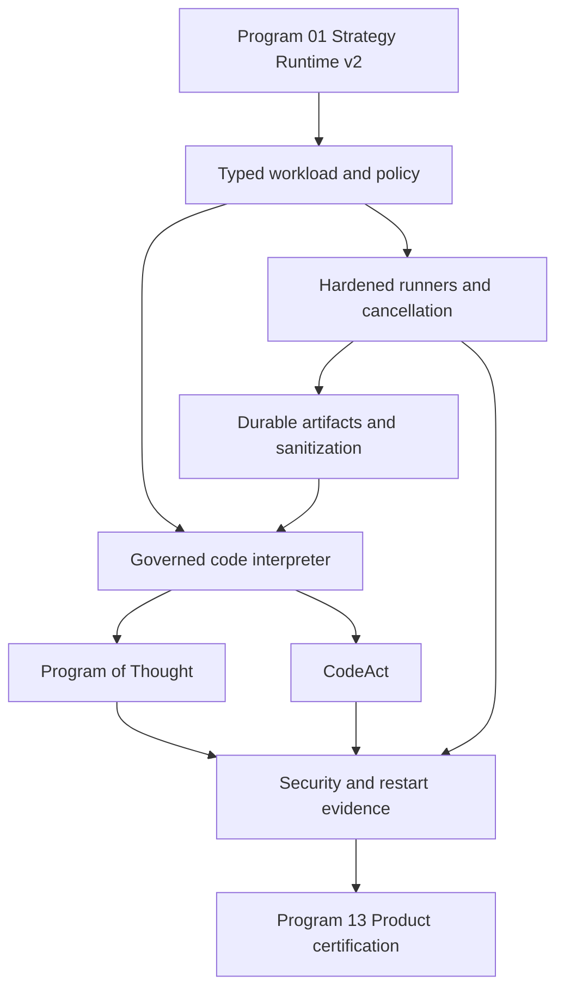

# Agent Pattern Program 06: Governed Code Reasoning Implementation Plan

> **For agentic workers:** REQUIRED SUB-SKILL: Use superpowers:subagent-driven-development
> (recommended) or superpowers:executing-plans to implement this plan task-by-task. Steps use
> checkbox (`- [ ]`) syntax for tracking.

**Goal:** Deliver sandbox-hardened Program of Thought and CodeAct adapters through one typed,
governed code-interpreter boundary with fail-closed safety, cancellation, durable checkpoints,
sanitized observations, and evidence-backed readiness.

**Architecture:** Strategy Runtime v2 owns PoT/CodeAct lifecycle and checkpoints. Both adapters
invoke `code_interpreter.execute` through the canonical governed tool dispatcher; the tool facade
authorizes and signs a typed `CodeExecutionWorkload`, then delegates only to
`ExecutionEnvironmentScheduler`. Generated code never enters `AgentGraph`, MCP transports,
provider processes, or host subprocess APIs directly. Local subprocess execution is
development-only; production readiness requires a non-stub hardened runner and durable artifact
storage.

**Tech Stack:** Python 3.12, Pydantic 2, existing MCP/tool governance, signed execution envelopes,
existing execution-environment scheduler/runners, PostgreSQL checkpoints/audit, Redis wakeups,
object artifact storage, OpenTelemetry/Prometheus, pytest, Ruff, strict mypy, Linux sandbox or
Kubernetes Job runtime.

---

# Planning Assumptions

- Program 01 provides versioned `StrategyAdapter`, `StrategyRunner`, `PatternLimits`, typed
  terminal states, cancellation token, checkpoint store, budget meter, and governed tool
  invocation interface.
- Existing `app/execution_environment` is the canonical isolation package. The lightweight
  `app/sandbox_runtime` package becomes a compatibility/profile facade and must not execute code.
- Existing `LocalSubprocessRunner` is useful for development tests but is not a production
  security boundary: it shares the host kernel/user context and currently runs the general
  `AgentLoop` worker entrypoint.
- Existing `KubernetesRunner` and artifact handling are stubs. Registry readiness must remain
  unavailable until a production runner and durable artifact store pass operational probes.
- Version 1 supports Python 3.12 only. Shell, JavaScript, native binaries, package installation,
  notebooks, dynamic interpreters, and user-selected images are denied.
- `code_interpreter.execute` is an internal governed MCP-compatible tool contract. It is not a
  public unauthenticated endpoint and cannot accept caller-supplied tenant, policy, credentials,
  runner type, image, or resource ceilings.
- Program 13 owns public APIs, SDKs, frontend code-status views, operator dashboards, and final
  canary certification.
- No source/config/infrastructure implementation occurs while creating this document.

# Source Final Documents

- Approved source: `docs/superpowers/specs/2026-08-03-agent-pattern-completion-program-design.md`
- Required predecessor: `docs/superpowers/plans/2026-08-03-agent-pattern-program-01-strategy-runtime-v2.md`
- Current execution contracts: `agent-verse-backend/app/execution_environment/models.py`
- Current policy gate: `agent-verse-backend/app/execution_environment/policy.py`
- Current scheduler: `agent-verse-backend/app/execution_environment/scheduler.py`
- Development runner: `agent-verse-backend/app/execution_environment/local_runner.py`
- Worker entrypoint: `agent-verse-backend/app/execution_environment/worker_entrypoint.py`
- Production runner stub: `agent-verse-backend/app/execution_environment/kubernetes_runner.py`
- Artifact stub: `agent-verse-backend/app/execution_environment/artifacts.py`
- Compatibility sandbox facade: `agent-verse-backend/app/sandbox_runtime/`
- Existing tests: `agent-verse-backend/tests/execution_environment/` and
  `agent-verse-backend/tests/sandbox_runtime/test_sandbox_runtime.py`

# Epics

| Epic | Title | Outcome | Depends on |
|---|---|---|---|
| AP06-E1 | Typed code workload and deny-by-default policy | One immutable request/result contract with hard ceilings and static validation | Program 01 |
| AP06-E2 | Hardened execution and artifacts | Development and production runners enforce cancellation, containment, output, cleanup, and durable artifacts | AP06-E1 |
| AP06-E3 | Governed code-interpreter boundary | Authz/policy/HITL/audit/idempotency wrap scheduler dispatch; no direct adapter-to-runner path | AP06-E1/E2 |
| AP06-E4 | Program of Thought | One generated program executes once, validates typed output, and synthesizes safely | AP06-E3 |
| AP06-E5 | CodeAct | Bounded generate/execute/observe loop detects stagnation and resumes safely | AP06-E3 |
| AP06-E6 | Security and production evidence | Escape, outage, cancellation, restart, policy, audit, and observability gates pass | AP06-E4/E5 |

# Workstreams

| Workstream | Parallelism | Owned paths |
|---|---|---|
| WS-A contracts/policy | Starts first | execution models, validator, envelope integrity, policy tests |
| WS-B runner/artifacts | Starts after WS-A | worker entrypoint, local runner, production runner, artifact store |
| WS-C governed tool | Starts after WS-A; production test waits for WS-B | MCP facade, governed dispatcher registration, audit/idempotency |
| WS-D PoT | Parallel with WS-E after WS-C | PoT adapter/state/unit tests |
| WS-E CodeAct | Parallel with WS-D after WS-C | CodeAct adapter/state/unit tests |
| WS-F certification | Starts after B/D/E | integration, restart, adversarial, readiness, operations evidence |

# Task Breakdown

## Typed Code Execution Contract

**Files:**

- Modify: `agent-verse-backend/app/execution_environment/models.py`
- Modify: `agent-verse-backend/app/execution_environment/envelope.py`
- Create: `agent-verse-backend/app/execution_environment/code_validation.py`
- Test: `agent-verse-backend/tests/execution_environment/test_code_models.py`
- Test: `agent-verse-backend/tests/execution_environment/test_code_validation.py`
- Test: `agent-verse-backend/tests/execution_environment/test_hmac_tamper.py`

Define these exact contracts; all collections serialize deterministically and all digests use
UTF-8 canonical JSON with sorted keys and compact separators:

```python
class ExecutionKind(StrEnum):
    AGENT_GOAL = "agent_goal"
    CODE_INTERPRETER = "code_interpreter"

class CodeLanguage(StrEnum):
    PYTHON_3_12 = "python_3_12"

class CodeWorkloadMode(StrEnum):
    PROGRAM_OF_THOUGHT = "program_of_thought"
    CODEACT = "codeact"

class CodeExecutionWorkload(BaseModel):
    workload_id: str
    mode: CodeWorkloadMode
    language: Literal[CodeLanguage.PYTHON_3_12]
    source: str
    stdin_json: JsonValue | None
    expected_output_schema: dict[str, JsonValue]
    requested_artifacts: tuple[str, ...]
    source_sha256: str

class CodeExecutionObservation(BaseModel):
    workload_id: str
    source_sha256: str
    exit_code: int | None
    terminal_state: Literal["completed", "failed", "cancelled", "timed_out", "denied"]
    stdout: str
    stderr: str
    stdout_truncated: bool
    stderr_truncated: bool
    result_json: JsonValue | None
    artifact_refs: tuple[str, ...]
    cpu_time_ms: int
    wall_time_ms: int
    peak_memory_bytes: int
    denial_codes: tuple[str, ...]
    observation_sha256: str

class CodeCancellationReceipt(BaseModel):
    workload_id: str
    requested_at: datetime
    acknowledged_at: datetime
    process_group_terminated: bool
    cleanup_state: Literal["complete", "quarantined", "failed"]
```

`ExecutionEnvelope` gains `execution_kind: ExecutionKind` and
`code_workload: CodeExecutionWorkload | None`. Validation requires exactly one payload:
`AGENT_GOAL` requires `goal_text` and no code workload; `CODE_INTERPRETER` requires a workload
and does not use the general AgentLoop path. The full workload and policy are covered by HMAC.

Hard ceilings for code execution:

| Limit | Default | Absolute maximum | Enforcement points |
|---|---:|---:|---|
| Source bytes | 16 KiB | 32 KiB | control-plane validator and worker |
| stdin JSON | 32 KiB | 64 KiB | control-plane validator and worker |
| stdout | 64 KiB | 256 KiB | streaming reader; truncate then terminate on continued writes |
| stderr | 32 KiB | 128 KiB | streaming reader; truncate then terminate on continued writes |
| all artifacts | 2 MiB | 5 MiB | workspace scanner and object-store writer |
| artifact count | 8 | 16 | workspace scanner |
| files created | 16 | 32 | sandbox filesystem quota |
| processes/threads | 4 | 8 | sandbox/cgroup/pid limit |
| memory | 256 MiB | 512 MiB | sandbox/cgroup and worker probe |
| CPU | 1 core, 10 s | 1 core, 30 s | cgroup/RLIMIT CPU |
| wall time | 15 s | 30 s | scheduler and runner |
| network | deny all | deny all | network namespace/policy |
| actions per CodeAct run | 6 | 8 | strategy runner before dispatch |
| programs per PoT run | 1 | 1 | strategy runner before dispatch |

- [ ] **AP06-T01 Red:** Add model tests for payload exclusivity, canonical digests, unknown
  language/mode, source/stdin/artifact limits, invalid output schema, and HMAC mutation of every
  code field.
- [ ] **AP06-T02 Verify red:** Run
  `cd agent-verse-backend && uv run pytest tests/execution_environment/test_code_models.py tests/execution_environment/test_code_validation.py tests/execution_environment/test_hmac_tamper.py -q`.
  Expected: collection/assertion failures name missing code contracts and unsigned fields.
- [ ] **AP06-T03 Green:** Implement contracts, canonical serializers, envelope reconstruction,
  HMAC inclusion, and validation at envelope construction plus worker receipt.
- [ ] **AP06-T04 Verify green:** Repeat AP06-T02. Expected: all tests pass; changing one source
  byte, policy field, schema field, or limit invalidates the signature.

## Static Code Policy And Import Boundary

**Files:**

- Modify: `agent-verse-backend/app/execution_environment/policy.py`
- Create: `agent-verse-backend/app/execution_environment/python_policy.py`
- Test: `agent-verse-backend/tests/execution_environment/test_python_policy.py`
- Test: `agent-verse-backend/tests/execution_environment/test_policy.py`

Parse source with Python `ast`; never use regex as the primary validator. Permit language syntax
needed for pure computation and data transformation. Imports are denied by default. The only
allowed imports in version 1 are `decimal`, `fractions`, `math`, `statistics`, `datetime`,
`json`, `re`, `collections`, `itertools`, and `functools`. Reject relative imports and any
submodule not explicitly listed.

Always deny AST or names enabling host/process/network/loader access, including `os`, `sys`,
`subprocess`, `socket`, `pathlib`, `shutil`, `tempfile`, `resource`, `signal`, `ctypes`,
`multiprocessing`, `threading`, `asyncio`, `inspect`, `importlib`, `builtins`, `compile`, `eval`,
`exec`, `__import__`, `open`, `input`, `breakpoint`, `help`, `globals`, `locals`, `vars`,
`getattr`, `setattr`, `delattr`, dunder attribute access, and dynamic code objects. Static
validation is defense in depth; runtime containment remains mandatory.

- [ ] **AP06-T05 Red:** Parameterize all allowed imports and denied modules/builtins; include
  aliases, `from` imports, nested functions, comprehensions, encoded strings, dunder traversal,
  oversized AST depth, syntax errors, and benign arithmetic/data cases.
- [ ] **AP06-T06 Verify red:** Run
  `cd agent-verse-backend && uv run pytest tests/execution_environment/test_python_policy.py tests/execution_environment/test_policy.py -q`.
  Expected: failures identify missing AST policy.
- [ ] **AP06-T07 Green:** Implement `PythonPolicyValidator.validate(source) ->
  tuple[CodePolicyViolation, ...]`; policy denial returns stable machine codes and no source text.
- [ ] **AP06-T08 Verify green:** Repeat AP06-T06. Expected: all cases pass and validation of a
  32 KiB source completes under 50 ms in the test environment.

## Runner Separation, Cancellation, And Cleanup

**Files:**

- Modify: `agent-verse-backend/app/execution_environment/runner_client.py`
- Modify: `agent-verse-backend/app/execution_environment/scheduler.py`
- Modify: `agent-verse-backend/app/execution_environment/local_runner.py`
- Modify: `agent-verse-backend/app/execution_environment/worker_entrypoint.py`
- Create: `agent-verse-backend/app/execution_environment/code_worker.py`
- Modify: `agent-verse-backend/app/execution_environment/kubernetes_runner.py`
- Test: `agent-verse-backend/tests/execution_environment/test_code_worker.py`
- Test: `agent-verse-backend/tests/execution_environment/test_code_cancellation.py`
- Test: `agent-verse-backend/tests/execution_environment/test_local_runner.py`
- Test: `agent-verse-backend/tests/execution_environment/test_kubernetes_runner.py`

Runner contract changes:

```python
class BaseRunner(ABC):
    async def run(self, request: ExecutionRequest, event_callback: GoalEventCallback | None = None) -> ExecutionResult: ...
    async def cancel(self, workload_id: str, reason: str) -> CodeCancellationReceipt: ...
```

`code_worker.py` receives only signed workload/policy plus a fresh ephemeral workspace. It runs
Python with isolated flags, no inherited environment, no home directory, no host mounts, no
credential variables, no package manager, deny-all network, non-root identity, read-only runtime,
and writable workspace quota. It emits newline-delimited typed events and one final observation.

Cancellation transitions:

`running -> cancellation_requested -> terminating -> cleanup -> cancelled`

1. Scheduler records cancellation and calls runner `cancel` idempotently.
2. Local development runner sends `SIGTERM` to the workload process group, waits two seconds,
   sends `SIGKILL`, drains pipes, then removes the workspace.
3. Production runner deletes/terminates the workload sandbox using a fencing token, waits for
   terminal status, stores bounded logs, and removes secret/job/workspace resources.
4. A cleanup failure quarantines the capsule and emits a P1 security event; it never reports
   successful cancellation.
5. Cancellation acknowledgement SLO is five seconds, measured from request to terminated capsule.

- [ ] **AP06-T09 Red:** Test code workloads route to `code_worker`, agent workloads remain on the
  existing worker path, and code never constructs `AgentLoop`.
- [ ] **AP06-T10 Verify red:** Run
  `cd agent-verse-backend && uv run pytest tests/execution_environment/test_code_worker.py -q`.
  Expected: routing assertions fail until the dedicated worker exists.
- [ ] **AP06-T11 Green:** Implement payload routing, double validation, isolated execution,
  bounded stream capture, output-schema parsing, and structured resource usage.
- [ ] **AP06-T12 Verify green:** Repeat AP06-T10. Expected: valid arithmetic completes; forbidden
  code is denied before execution; malformed result JSON fails closed.
- [ ] **AP06-T13 Red:** Test cancellation before dispatch, during startup, during CPU work, during
  output flood, duplicate cancellation, process-tree termination, five-second SLO, and cleanup
  failure quarantine.
- [ ] **AP06-T14 Verify red:** Run
  `cd agent-verse-backend && uv run pytest tests/execution_environment/test_code_cancellation.py tests/execution_environment/test_local_runner.py -q`.
  Expected: cancellation assertions fail until runner cancellation is implemented.
- [ ] **AP06-T15 Green:** Implement idempotent scheduler/runner cancellation and cleanup receipts.
- [ ] **AP06-T16 Verify green:** Repeat AP06-T14. Expected: all tests pass; no child process or
  workspace survives a successful cancellation.
- [ ] **AP06-T17 Production runner:** Replace the always-unhealthy Kubernetes stub with Job/pod
  creation, non-root/read-only/seccomp/AppArmor/capability-drop settings, deny-all NetworkPolicy,
  resource requests/limits, log streaming, deadline, cancellation, fencing, and cleanup.
- [ ] **AP06-T18 Verify production contract:** Run
  `cd agent-verse-backend && uv run pytest tests/execution_environment/test_kubernetes_runner.py -q`.
  Expected: manifest snapshots and fake-client lifecycle tests pass; privileged, hostPath,
  mutable image tag, missing digest, missing network policy, or cleanup omission fails.

## Durable Artifact Handling And Observation Sanitization

**Files:**

- Replace stub behavior in: `agent-verse-backend/app/execution_environment/artifacts.py`
- Create: `agent-verse-backend/app/execution_environment/observation_sanitizer.py`
- Test: `agent-verse-backend/tests/execution_environment/test_artifacts.py`
- Test: `agent-verse-backend/tests/execution_environment/test_observation_sanitizer.py`

Artifact storage contract:

```python
class ExecutionArtifactStore(Protocol):
    async def put(self, *, tenant_id: str, goal_id: str, workload_id: str,
                  name: str, content: AsyncIterator[bytes], maximum_bytes: int) -> ExecutionArtifact: ...
    async def delete_workload(self, *, tenant_id: str, workload_id: str) -> None: ...
```

Require normalized relative names under `/workspace`; reject absolute paths, `..`, symlinks,
devices, sockets, FIFOs, hard links, executables, hidden runtime files, MIME mismatch, duplicate
names, count/size excess, and reads that race path replacement. Upload through tenant-scoped
object keys with server-side encryption and checksum verification. Persist references, never
presigned external URLs, in checkpoints/results.

Observation sanitizer removes ANSI/control sequences, credential/token patterns, internal paths,
environment values, stack-frame host paths, prompt-injection directives, and content above
stdout/stderr caps. It returns `sanitization_codes` and hashes before model exposure. Raw bounded
logs are encrypted operator artifacts with stricter authorization; models see sanitized text only.

- [ ] **AP06-T19 Red:** Test successful upload/checksum, tenant key isolation, traversal,
  symlink/hard-link race, devices/FIFO, MIME mismatch, count/size limits, upload failure cleanup,
  and absence of empty `storage_url` success.
- [ ] **AP06-T20 Verify red:** Run
  `cd agent-verse-backend && uv run pytest tests/execution_environment/test_artifacts.py -q`.
  Expected: tests fail against the current non-persisting stub.
- [ ] **AP06-T21 Green:** Inject the existing application artifact store, stream bounded uploads,
  verify checksum, and fail the execution if a requested artifact cannot be persisted.
- [ ] **AP06-T22 Verify green:** Repeat AP06-T20. Expected: all tests pass and no successful
  artifact has an empty internal storage reference.
- [ ] **AP06-T23 Red/green:** Add sanitizer tests for secrets, ANSI, null bytes, host paths,
  injection strings, truncation, Unicode, and benign JSON; implement sanitizer and rerun
  `cd agent-verse-backend && uv run pytest tests/execution_environment/test_observation_sanitizer.py -q`.
  Expected: all tests pass and snapshots contain no seeded secret/path/instruction strings.

## Governed Code Interpreter MCP/Tool Boundary

**Files:**

- Create: `agent-verse-backend/app/mcp/code_interpreter.py`
- Modify: `agent-verse-backend/app/mcp/catalog.py`
- Modify: `agent-verse-backend/app/mcp/registry.py`
- Modify: canonical governed dispatcher path supplied by Program 01
- Test: `agent-verse-backend/tests/mcp/test_code_interpreter.py`
- Test: `agent-verse-backend/tests/mcp/test_code_interpreter_governance.py`

Expose one internal tool:

```python
class CodeInterpreterTool:
    name: Final[str] = "code_interpreter.execute"

    async def execute(
        self,
        *,
        invocation: GovernedToolInvocation,
        workload: CodeExecutionWorkload,
    ) -> CodeExecutionObservation: ...
```

The tool derives tenant, goal, execution, policy, deadline, idempotency, classification, feature
flags, and limits from `GovernedToolInvocation`. Caller-supplied duplicates are schema errors.
Before scheduling it must: authenticate internal caller; authorize strategy/tool; intersect parent
and tenant policy; enforce data classification; request HITL when policy requires; check remaining
budget/deadline/cancellation; validate source; write an audit `requested` record; build/sign the
envelope; and claim idempotency key `{strategy_execution_id}:{workload_id}:{source_sha256}`.
After execution it sanitizes observations, persists audit/artifact references, charges actual
usage, and returns only the typed observation. Any dependency outage fails closed.

- [ ] **AP06-T24 Red:** Test successful governed dispatch plus unauthenticated, unauthorized,
  cross-tenant, disabled, policy-denied, classification-denied, HITL-pending/rejected, budget,
  deadline, cancellation, duplicate idempotency, scheduler outage, and audit-write failure cases.
- [ ] **AP06-T25 Verify red:** Run
  `cd agent-verse-backend && uv run pytest tests/mcp/test_code_interpreter.py tests/mcp/test_code_interpreter_governance.py -q`.
  Expected: collection/assertion failures name the missing tool boundary.
- [ ] **AP06-T26 Green:** Implement and register the tool as an internal capability requiring
  `code_interpreter`; do not publish runner/image/policy override fields in its input schema.
- [ ] **AP06-T27 Verify green:** Repeat AP06-T25. Expected: all tests pass, duplicate delivery
  returns the original accepted observation, and denied calls never reach the scheduler.
- [ ] **AP06-T28 Architecture guard:** Add an import test that fails if PoT/CodeAct import runner,
  scheduler, subprocess, Kubernetes, or artifact modules directly. Run
  `cd agent-verse-backend && uv run pytest tests/mcp/test_code_interpreter_governance.py::test_code_reasoning_adapters_only_use_governed_tool_boundary -q`.
  Expected: pass.

## Program Of Thought Adapter

**Files:**

- Create: `agent-verse-backend/app/agent/patterns/program_of_thought.py`
- Test: `agent-verse-backend/tests/agent/patterns/test_program_of_thought.py`

State contract:

```python
class ProgramOfThoughtPhase(StrEnum):
    CREATED = "created"
    GENERATING = "generating"
    VALIDATING = "validating"
    AWAITING_APPROVAL = "awaiting_approval"
    EXECUTING = "executing"
    VALIDATING_OUTPUT = "validating_output"
    SYNTHESIZING = "synthesizing"
    COMPLETED = "completed"
    FAILED = "failed"
    CANCELLED = "cancelled"

class ProgramOfThoughtState(BaseModel):
    phase: ProgramOfThoughtPhase
    program_ref: str | None
    source_sha256: str | None
    workload_id: str | None
    observation_ref: str | None
    output_ref: str | None
    checkpoint_version: int = 1
```

Algorithm:

1. Generate exactly one Python program and output schema using schema-constrained provider output.
2. Store source encrypted as a strategy artifact; checkpoints contain reference and digest only.
3. Validate statically, then call governed `code_interpreter.execute` exactly once.
4. Validate `result_json` against the expected schema and reject NaN/Infinity where JSON forbids.
5. Synthesize from sanitized result/evidence only. Never feed source, raw stderr, or hidden
   rationale back to the synthesis role.
6. A validation/runtime/output failure is terminal. Version 1 does not ask the model to repair or
   regenerate, preserving the one-program limit.

- [ ] **AP06-T29 Red:** Test state transitions, one-program rule, static denial, approval pause,
  scheduler outage, timeout, resource failure, invalid output schema, sanitized synthesis,
  checkpoint after every phase, resume without regeneration/re-execution, and cancellation.
- [ ] **AP06-T30 Verify red:** Run
  `cd agent-verse-backend && uv run pytest tests/agent/patterns/test_program_of_thought.py -q`.
  Expected: failures identify missing adapter.
- [ ] **AP06-T31 Green:** Implement `ProgramOfThoughtAdapter` version `1.0.0` against Strategy
  Runtime v2 and the governed tool interface only.
- [ ] **AP06-T32 Verify green:** Repeat AP06-T30. Expected: all tests pass; provider generation
  and code execution each occur at most once across restart/resume.

## CodeAct Adapter

**Files:**

- Create: `agent-verse-backend/app/agent/patterns/codeact.py`
- Test: `agent-verse-backend/tests/agent/patterns/test_codeact.py`

State contract:

```python
class CodeActPhase(StrEnum):
    CREATED = "created"
    GENERATING_ACTION = "generating_action"
    VALIDATING_ACTION = "validating_action"
    AWAITING_APPROVAL = "awaiting_approval"
    EXECUTING_ACTION = "executing_action"
    OBSERVING = "observing"
    SYNTHESIZING = "synthesizing"
    COMPLETED = "completed"
    STALLED = "stalled"
    FAILED = "failed"
    CANCELLED = "cancelled"

class CodeActionState(BaseModel):
    action_number: int = Field(ge=1, le=8)
    action_id: str
    source_ref: str
    source_sha256: str
    workload_id: str
    observation_ref: str | None
    observation_sha256: str | None
    status: Literal["generated", "approved", "executing", "observed", "failed", "cancelled"]

class CodeActState(BaseModel):
    phase: CodeActPhase
    actions: tuple[CodeActionState, ...]
    consecutive_no_progress: int = Field(ge=0, le=2)
    result_ref: str | None
    checkpoint_version: int = 1
```

Algorithm and controls:

1. Generate one typed action from goal plus bounded sanitized observations; each action is a
   complete independent Python program because sandboxes are fresh and share no process state.
2. Validate and execute through the governed tool boundary with idempotency per action.
3. Sanitize, hash, persist, and summarize the observation before checkpointing.
4. Evaluator returns `progress`, `complete`, and safe summary. Increment no-progress when the
   observation digest repeats, source digest repeats, evaluator says no progress, or result state
   is unchanged. Two consecutive no-progress actions terminate `stalled`.
5. Stop on completion, six default/eight absolute actions, cancellation, deadline, cost, token,
   policy denial, or sandbox failure. Runtime failure is terminal; version 1 does not retry unsafe
   code automatically.
6. Resume rules: `generated/approved` action may dispatch once; `executing` reconciles by
   idempotency key before dispatch; `observed` advances to next generation. Never replay an
   accepted workload.

- [ ] **AP06-T33 Red:** Test all transitions, fresh-workspace semantics, bounded observation
  context, six/eight action caps, repeated source/observation, evaluator no-progress, complete,
  policy/runtime failure, approval pause, cancellation race, and each resume cursor.
- [ ] **AP06-T34 Verify red:** Run
  `cd agent-verse-backend && uv run pytest tests/agent/patterns/test_codeact.py -q`.
  Expected: failures identify missing adapter.
- [ ] **AP06-T35 Green:** Implement `CodeActAdapter` version `1.0.0`; checkpoint before dispatch
  and after sanitized observation; reconcile uncertain dispatch through tool idempotency lookup.
- [ ] **AP06-T36 Verify green:** Repeat AP06-T34. Expected: all tests pass and no accepted action
  executes twice after simulated worker death.

## Observability, Security, And Audit

**Files:**

- Modify: `agent-verse-backend/app/observability/metrics.py`
- Modify: existing structured audit integration selected by Program 01
- Create: `agent-verse-backend/tests/execution_environment/test_code_observability.py`
- Create: `agent-verse-backend/tests/execution_environment/test_code_audit.py`

Required spans: `strategy.code.phase`, `code_interpreter.authorize`,
`code_interpreter.validate`, `code_interpreter.schedule`, `sandbox.startup`, `sandbox.execute`,
`sandbox.cleanup`, and `sandbox.artifact.persist`. Attributes are low-cardinality strategy,
version, phase, runner type, terminal state, denial code, truncation flags, and limit type.

Required metrics:

- `agentverse_code_workloads_total{mode,runner_type,terminal_state}`
- `agentverse_code_workload_duration_seconds{mode,runner_type}` histogram
- `agentverse_code_policy_denials_total{denial_code}`
- `agentverse_code_cancellations_total{runner_type,cleanup_state}`
- `agentverse_code_cancellation_latency_seconds{runner_type}` histogram
- `agentverse_code_output_truncations_total{stream}`
- `agentverse_code_resource_limit_total{limit_type}`
- `agentverse_codeact_actions_total{terminal_state}` histogram
- `agentverse_codeact_stalls_total{reason}`
- `agentverse_code_artifact_bytes{mode}` histogram

Audit events: `code.requested`, `code.denied`, `code.approval_requested`, `code.started`,
`code.cancel_requested`, `code.cancelled`, `code.completed`, `code.failed`,
`code.artifact_persisted`, and `code.cleanup_failed`. Include tenant/goal/strategy execution,
workload/action, source/observation digests, policy version, limits, decision codes, resource usage,
artifact IDs, correlation/causation, and timestamps. Exclude source, stdin contents, stdout/stderr,
secrets, environment, and private rationale.

- [ ] **AP06-T37 Red:** Assert every terminal path emits balanced spans, exactly one terminal
  counter, resource metrics, and ordered audit events with no forbidden fields.
- [ ] **AP06-T38 Verify red:** Run
  `cd agent-verse-backend && uv run pytest tests/execution_environment/test_code_observability.py tests/execution_environment/test_code_audit.py -q`.
  Expected: failures identify missing instruments/events.
- [ ] **AP06-T39 Green:** Implement metrics, spans, and audit emission with bounded label values.
- [ ] **AP06-T40 Verify green:** Repeat AP06-T38. Expected: all tests pass; seeded source/secret
  values are absent from exported telemetry and audit payloads.

## Integration, Restart, And Adversarial Certification

**Files:**

- Create: `agent-verse-backend/tests/agent/patterns/test_code_reasoning_integration.py`
- Create: `agent-verse-backend/tests/agent/patterns/test_code_reasoning_restart.py`
- Create: `agent-verse-backend/tests/security/test_code_interpreter_adversarial.py`
- Create: `agent-verse-backend/tests/integration/test_code_interpreter_isolation.py`
- Create: `agent-verse-backend/tests/integration/test_code_interpreter_kubernetes_conformance.py`
- Modify: `agent-verse-backend/app/orchestration/strategy_registry.py`
- Create: `agent-verse-backend/tests/orchestration/test_code_reasoning_readiness.py`

- [ ] **AP06-T41 Red:** Run PoT and CodeAct end-to-end through `StrategyRunner -> governed tool ->
  scheduler -> fake/hardened runner -> sanitizer -> checkpoint/result`; assert policy, budget,
  deadline, cancellation, artifacts, traces, and safe rationale.
- [ ] **AP06-T42 Verify red:** Run
  `cd agent-verse-backend && uv run pytest tests/agent/patterns/test_code_reasoning_integration.py -q`.
  Expected: integration assertions fail until complete wiring exists.
- [ ] **AP06-T43 Green:** Wire both adapters into runtime registry as `partial`, add dependencies
  `code_interpreter`, `production_sandbox`, and `artifact_store`, and make readiness fail closed.
- [ ] **AP06-T44 Verify green:** Repeat AP06-T42. Expected: fake governed execution passes;
  production readiness remains false under stub/unhealthy fixtures.
- [ ] **AP06-T45 Restart:** Simulate crashes before dispatch, after accepted dispatch, during
  execution, after observation, and before synthesis; run
  `cd agent-verse-backend && uv run pytest tests/agent/patterns/test_code_reasoning_restart.py -q`.
  Expected: all cases resume or reconcile without duplicate workload execution.
- [ ] **AP06-T46 Adversarial:** Cover filesystem escape, symlink/hard-link race, `/proc`/`/sys`,
  network/DNS, fork/thread bomb, memory/CPU bomb, output flood, signal handling, environment/secret
  access, dynamic import, pickle/marshal loaders, bytecode tricks, package install, artifact
  traversal, Unicode/ANSI injection, fake completion events, HMAC replay/tamper, cross-tenant IDs,
  stale fencing token, and cancellation race.
- [ ] **AP06-T47 Verify adversarial unit gate:** Run
  `cd agent-verse-backend && uv run pytest tests/security/test_code_interpreter_adversarial.py -q`.
  Expected: every payload is denied or contained within limits; no secret marker, host write,
  network connection, surviving process, or cross-tenant artifact exists.
- [ ] **AP06-T48 Verify isolation gates:** First, with Colima running, run
  `cd agent-verse-backend && DOCKER_HOST="unix:///Users/harsh.kumar01/.colima/default/docker.sock" TESTCONTAINERS_RYUK_DISABLED=true uv run pytest tests/integration/test_code_interpreter_isolation.py -m integration -q`.
  Expected: portable container containment and cleanup cases pass, but this evidence cannot certify the Kubernetes production runner. Then run against the staging Kubernetes cluster using the production image and manifests:
  `cd agent-verse-backend && RUN_K8S_SANDBOX_CONFORMANCE=1 uv run pytest tests/integration/test_code_interpreter_kubernetes_conformance.py -m integration -q`.
  Expected: the cluster enforces non-root UID/GID, read-only root filesystem, seccomp/runtime class, complete capability drop, service-account token automount denial, default-deny ingress/egress NetworkPolicy, DNS policy, CPU/memory/PID/ephemeral-storage limits, immutable image digest, artifact and namespace isolation, cancellation, process cleanup, TTL cleanup, and no surviving workload or credential. Fake-client, manifest-snapshot, or Testcontainers evidence must never set `production_sandbox` to certified.
- [ ] **AP06-T49 Readiness:** Run
  `cd agent-verse-backend && uv run pytest tests/orchestration/test_code_reasoning_readiness.py -q`.
  Expected: missing runner/artifact/policy/audit dependencies and kill switches are unavailable;
  fully healthy fixtures resolve both adapters.
- [ ] **AP06-T50 Focused suite:** Run
  `cd agent-verse-backend && uv run pytest tests/execution_environment tests/sandbox_runtime tests/mcp/test_code_interpreter.py tests/mcp/test_code_interpreter_governance.py tests/agent/patterns/test_program_of_thought.py tests/agent/patterns/test_codeact.py tests/agent/patterns/test_code_reasoning_integration.py tests/agent/patterns/test_code_reasoning_restart.py tests/security/test_code_interpreter_adversarial.py tests/orchestration/test_code_reasoning_readiness.py -q`.
  Expected: all selected tests pass with no warnings.
- [ ] **AP06-T51 Static gate:** Run
  `cd agent-verse-backend && uv run ruff check app/execution_environment app/sandbox_runtime app/mcp/code_interpreter.py app/agent/patterns/program_of_thought.py app/agent/patterns/codeact.py tests/execution_environment tests/mcp tests/agent/patterns tests/security && uv run mypy app/execution_environment app/mcp/code_interpreter.py app/agent/patterns/program_of_thought.py app/agent/patterns/codeact.py`.
  Expected: both commands exit 0. Promote registry state to `implemented`; `certified` remains
  blocked on Program 13 canary evidence.

# Dependency Graph



# Jira Mapping Plan

| Jira type | Title | Description / acceptance notes | Dependencies | Labels |
|---|---|---|---|---|
| Epic | AP06 Governed code reasoning | Harden sandbox and deliver PoT/CodeAct through one governed tool boundary | Program 01 | `agent-patterns`, `sandbox`, `program-06` |
| Story | AP06-E1 Typed workload and code policy | Signed exclusive payload, AST validation, exact limits, tamper tests pass | Program 01 | `contracts`, `security` |
| Story | AP06-E2 Hardened runner and artifacts | Dedicated code worker, production isolation, cancellation SLO, cleanup, durable encrypted artifacts | AP06-E1 | `sandbox`, `reliability` |
| Story | AP06-E3 Governed code interpreter | Authz/policy/HITL/audit/idempotency gate scheduler; direct imports prohibited | AP06-E1/E2 | `mcp`, `governance` |
| Story | AP06-E4 Program of Thought | One-program lifecycle checkpoints and validates typed output | AP06-E3 | `pot`, `reasoning` |
| Story | AP06-E5 CodeAct | Bounded action/observation loop detects stalls and resumes without replay | AP06-E3 | `codeact`, `checkpointing` |
| Story | AP06-E6 Production evidence | Adversarial isolation, restart, cancellation, observability, readiness gates pass | AP06-E4/E5 | `certification`, `adversarial` |

Create one Jira sub-task for every AP06-Txx checkbox under its containing story. Include the task
ID at the start of the Jira summary and copy the command/expected outcome into acceptance notes.

# Migration Plan

1. Add workload contracts, policy validation, metrics, and probes without enabling code execution.
2. Route existing non-code `ExecutionEnvelope` payloads through `AGENT_GOAL`; compatibility tests
   prove unchanged behavior.
3. Change `sandbox_runtime.SandboxExecutor` to profile/forward only; retain imports for one stable
   release and emit a deprecation metric when legacy callers use it.
4. Deploy the governed code tool with registration disabled and shadow policy evaluation. Shadow
   mode validates generated test fixtures only; it never executes production-generated code.
5. Enable PoT and CodeAct only when production runner, artifact store, audit, cancellation, policy,
   and object encryption probes are healthy.
6. Existing in-flight general AgentLoop executions stay on their original worker. No existing
   execution is reclassified as code reasoning.
7. Checkpoint compatibility is exact: adapter `1.0.0`, state schema `1`, workload schema `1`.
   Mismatch produces `resume_blocked` and operator action, never unsafe replay.

# Test Plan

- Unit: models, HMAC, AST policy, envelope exclusivity, output schemas, sanitization, artifacts,
  state machines, stagnation, limits, idempotency, cancellation, and telemetry.
- Integration: complete PoT/CodeAct governed path with fake dependencies; production-equivalent
  sandbox containment with Testcontainers; durable object storage; PostgreSQL checkpoint resume.
- Adversarial: escape, exfiltration, resource bombs, output flooding, process survival, artifact
  races, event forgery, replay/tamper, policy bypass, prompt injection, and cross-tenant access.
- Reliability: runner/scheduler/artifact/audit outage, worker crash at every phase, Redis loss,
  duplicate Celery delivery, stale fencing token, cancellation races, cleanup quarantine.
- Regression: all existing execution-environment, sandbox-runtime, AgentGraph, MCP governance,
  strategy registry, and goal service tests remain green.
- Performance: control-plane validation p95 below 50 ms for maximum source; cancellation
  acknowledgement p95 below five seconds; no unbounded stdout/stderr buffering.

# Release Plan

1. Deploy contracts and probes with `code_interpreter`, `program_of_thought`, and `codeact` kill
   switches disabled.
2. Run policy-only shadow evaluation for at least 1,000 internal fixtures and inspect denial rates.
3. Canary PoT for internal low-risk analytical goals at 1%, then 5%, 25%, and 100%.
4. Canary CodeAct only after PoT has one stable release; use 1%, 5%, 10%, 25%, then approved
   cohorts because iterative execution has greater cost and attack surface.
5. Stop expansion on any escape/secret/cross-tenant event, cleanup failure, cancellation SLO
   breach, artifact loss, cost ceiling breach, or quality regression.
6. Program 13 adds operator/user surfaces and promotes `certified` after approved canary baselines.

# Rollback Plan

- Activate the strategy or tool kill switch to reject new code executions. Never fall back to
  in-process execution or relabel a code strategy as ordinary ReAct.
- Cancel active workloads, verify termination and cleanup receipts, and quarantine capsules with
  uncertain state.
- Preserve encrypted source/raw-log artifacts, observations, audit, and checkpoints under incident
  retention; restrict access to authorized operators.
- Roll back adapter selection independently of additive workload contracts and persisted evidence.
- If the governed tool or runner is unhealthy, explicit PoT/CodeAct requests return typed
  dependency-unavailable errors; automatic selection chooses a non-code strategy before execution.
- Keep deprecated `sandbox_runtime` forwarding for one stable release, then remove only after
  usage metrics reach zero and rollback-window approval.

# Risks and Blockers

| Risk/blocker | Control |
|---|---|
| Kubernetes runner is currently a stub | Registry remains unavailable until production runner implementation and real isolation tests pass |
| Artifact function currently does not persist | Requested artifact execution fails until durable encrypted storage and checksum verification pass |
| Local subprocess shares host kernel/user | Development-only status; never satisfies production readiness |
| Python static analysis can be bypassed | Defense in depth with runtime isolation, no credentials, deny-all network, quotas, non-root/read-only runtime |
| MCP/tool caller weakens policy | Invocation derives policy/identity/limits server-side and intersects restrictions; override fields absent |
| Cancellation leaves processes/resources | Process-tree termination, fencing, cleanup receipts, quarantine, five-second SLO and alerts |
| CodeAct amplifies cost or loops | Six default/eight hard actions, two-step stagnation stop, budget/deadline checks before every call |
| Resume repeats side effects | Fresh stateless sandboxes, stable workload idempotency, pre/post-dispatch checkpoints, reconciliation |
| Output carries injection/secrets | Bounded capture, sanitization before model exposure, encrypted raw artifact with stricter auth |
| Generated code supply-chain access | No package installation, fixed digest image, explicit standard-library allowlist, no mutable image selection |

# Definition of Done

- PoT and CodeAct resolve versioned Strategy Runtime v2 adapters and import only the governed
  code-interpreter tool interface.
- The signed typed workload is exclusive from general AgentLoop execution and validated at both
  control-plane and worker boundaries.
- Production execution is non-root, read-only, deny-all network, capability-dropped, resource
  bounded, fixed-image, ephemeral, cancellable, and fully cleaned or quarantined.
- Source, stdin, stdout, stderr, artifacts, processes, CPU, memory, duration, programs, and actions
  obey the documented defaults and absolute maxima.
- Artifact storage is durable, tenant-scoped, encrypted, checksum-verified, and no longer returns
  successful empty storage references.
- Every observation is sanitized before model exposure; source, raw logs, secrets, internal paths,
  and private rationale are absent from public results, checkpoints, metrics, and audit.
- PoT executes no more than one generated program; CodeAct executes no more than eight actions and
  stops after two no-progress observations.
- Cancellation and restart tests prove no duplicate accepted workload, surviving process,
  abandoned workspace, or lost accepted checkpoint.
- Unit, integration, real-isolation, adversarial, policy, authorization, HITL, audit,
  observability, Ruff, and mypy gates pass with the exact documented commands.
- Registry state is `implemented` only with healthy production dependencies; `certified` remains
  Program 13's canary/product gate.
- No source code is committed as part of creating this plan.