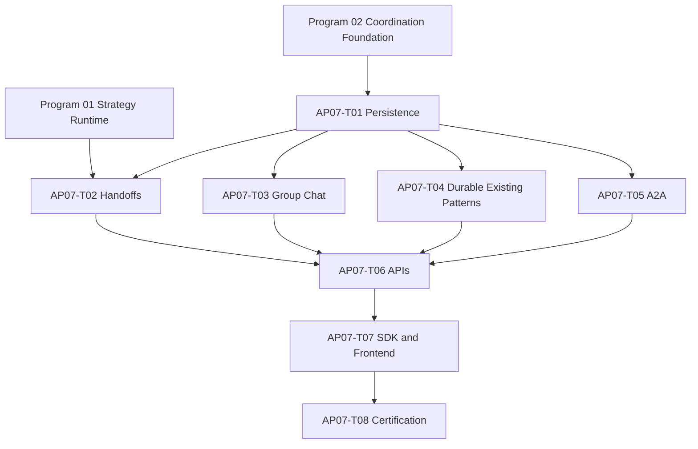

# Agent Pattern Program 07: Handoffs and Group Chat Implementation Plan

> **For agentic workers:** REQUIRED SUB-SKILL: Use `superpowers:subagent-driven-development` or `superpowers:executing-plans` to implement this plan task-by-task. Every implementation task starts with a failing test and uses the checkboxes below as the execution record.

**Goal:** Deliver same-civilization true handoffs, one canonical shared transcript, durable Supervisor/Debate/Goal Tree execution, and production-safe A2A dispatch on the versioned strategy and coordination runtimes.

**Architecture:** Civilization is the authority boundary for membership and delegation. PostgreSQL coordination records and the transactional outbox are canonical; Redis Streams and WebSocket/SSE are delivery accelerators. Existing in-memory pattern classes remain compatibility facades during canary rollout but delegate production execution to durable strategy adapters.

**Tech Stack:** Python 3.12, FastAPI, Pydantic, SQLAlchemy 2 async, PostgreSQL RLS, Redis Streams, Celery, LangGraph, React 19, TanStack Query, WebSocket/SSE, Python and TypeScript SDKs, pytest, Vitest, Playwright.

---

# Planning Assumptions

- Program 01 has delivered the flat `app/orchestration/strategy_contracts.py`, `strategy_adapters.py`, `strategy_runner.py`, `strategy_readiness.py`, `strategy_certification.py`, and `strategy_registry.py` modules, plus profile versioning, checkpoints, limits, and certification evidence. No `app/strategy_runtime` or `app/orchestration/strategy_runtime` compatibility namespace is created.
- Program 02 has delivered `app/coordination/` common models, repositories, event envelope, transactional outbox, replay service, Redis delivery, idempotent consumers, cancellation, and common coordination APIs.
- Programs 01-04 own migrations `0096` through `0099`; Programs 05-06 add no schema revision. This plan owns `0100_handoffs_group_chat.py` with `down_revision = "0099_reasoning_evaluation_evidence"`.
- A handoff target must be an active member of the source agent's civilization and tenant. Cross-civilization and cross-tenant handoffs are rejected without fallback.
- `context_messages` is the only canonical transcript. `blackboard_entries`, debate views, and legacy bus messages become projections and never compete for ordering authority.
- No persisted or public field contains hidden chain-of-thought. Safe rationale summaries, evidence references, trust labels, classifications, and decisions are allowed.
- Existing `/civilizations` and `/a2a/tasks` clients remain compatible for one stable release.

# Source Final Documents

- `docs/superpowers/specs/2026-08-03-agent-pattern-completion-program-design.md`
- `AGENTS.md`
- `agent-verse-backend/app/agent/supervisor.py`
- `agent-verse-backend/app/agent/debate.py`
- `agent-verse-backend/app/agent/goal_tree.py`
- `agent-verse-backend/app/civilization/orchestrator.py`
- `agent-verse-backend/app/civilization/a2a_dispatch.py`
- `agent-verse-backend/app/api/a2a.py`
- `agent-verse-backend/app/db/models/civilization.py`
- `agent-verse-frontend/src/lib/api/civilizationApi.ts`
- `agent-verse-frontend/src/features/civilization/CivilizationPage.tsx`
- `agent-verse-backend/tests/agent/test_supervisor.py`
- `agent-verse-backend/tests/agent/test_debate.py`
- `agent-verse-backend/tests/agent/test_goal_tree.py`
- `agent-verse-backend/tests/civilization/test_a2a_dispatch.py`

# Epics

| Epic | Outcome | Jira labels |
|---|---|---|
| AP07-E1 | Same-civilization handoff protocol with durable acceptance and resumption | `agent-patterns`, `handoff`, `backend`, `security` |
| AP07-E2 | Ordered shared transcript, compaction, replay, and human participation | `agent-patterns`, `group-chat`, `realtime`, `frontend` |
| AP07-E3 | Durable Supervisor, Debate, and Goal Tree strategy adapters | `agent-patterns`, `durability`, `strategy-runtime` |
| AP07-E4 | Signed, replay-protected, callback-safe A2A transport | `a2a`, `security`, `reliability` |
| AP07-E5 | Product contracts, operations, migration, and certification | `api`, `sdk`, `observability`, `certification` |

# Workstreams

| Workstream | Owns | Depends on | Parallelism |
|---|---|---|---|
| WS07-A Persistence | Handoffs, transcript indexes, projections, RLS | Programs 01-02 | Starts first |
| WS07-B Protocols | Handoff and group-chat state machines | WS07-A | Parallel after schema |
| WS07-C Existing patterns | Durable Supervisor/Debate/Goal Tree adapters | WS07-A | Parallel with WS07-B |
| WS07-D A2A | Signing, replay defense, callbacks, durable worker path | WS07-A | Parallel with WS07-B |
| WS07-E Product | REST, SSE, WebSocket, SDK, frontend | WS07-B/C/D | After contracts stabilize |
| WS07-F Certification | restart, adversarial, load, canary evidence | All | Final gate |

# Task Breakdown

## AP07-T01: Persist Handoffs and Canonical Transcript

**Files**
- Create: `agent-verse-backend/app/db/migrations/versions/0100_handoffs_group_chat.py`
- Modify: `agent-verse-backend/app/db/models/coordination.py`
- Modify: `agent-verse-backend/app/db/models/__init__.py`
- Create: `agent-verse-backend/app/coordination/handoffs/repository.py`
- Create: `agent-verse-backend/app/coordination/transcript/repository.py`
- Create: `agent-verse-backend/tests/db/test_handoffs_group_chat_migration.py`
- Create: `agent-verse-backend/tests/coordination/test_handoff_repository.py`
- Create: `agent-verse-backend/tests/coordination/test_transcript_repository.py`

**Persistence contract**
- Program 02 remains the only ORM owner for `handoffs` and `context_messages`. Revision `0100` uses explicit `ALTER TABLE` operations; it does not recreate either table or define competing models.
- `handoffs` adds target membership snapshot, connector-allowlist intersection, classification, result reference, one-time acceptance token digest, and transition audit fields. Backfill legacy/common rows as `schema_version=1` without making them executable until validation succeeds.
- `context_messages` adds encrypted content/artifact reference metadata, recipient-clearance decision, taint/provenance chain, source digest, compaction interval, and trust-downgrade fields while preserving append-only unique `(tenant_id, session_id, sequence)` ordering.
- RLS policies use both `USING` and `WITH CHECK`; every dominant index begins with `tenant_id`.

- [ ] Write migration tests proving all columns, constraints, tenant-first indexes, RLS enablement/forced mode, and cross-tenant read/write denial.
- [ ] Run `cd agent-verse-backend && uv run pytest tests/db/test_handoffs_group_chat_migration.py -q`; expect failures naming missing migration/tables.
- [ ] Implement exact `ALTER TABLE`, constraint/index additions, backfills, downgrade behavior, ORM mapping extensions, and repositories with compare-and-set transitions and idempotency keys. Migration tests must prove Program 02 data survives upgrade and downgrade without duplicate table ownership.
- [ ] Run `cd agent-verse-backend && uv run pytest tests/db/test_handoffs_group_chat_migration.py tests/coordination/test_handoff_repository.py tests/coordination/test_transcript_repository.py -q`; expect all tests to pass.

## AP07-T02: Implement the Handoff State Machine

**Files**
- Create: `agent-verse-backend/app/coordination/handoffs/models.py`
- Create: `agent-verse-backend/app/coordination/handoffs/state_machine.py`
- Create: `agent-verse-backend/app/coordination/handoffs/service.py`
- Create: `agent-verse-backend/app/coordination/handoffs/adapter.py`
- Create: `agent-verse-backend/tests/coordination/test_handoff_state_machine.py`
- Create: `agent-verse-backend/tests/coordination/test_handoff_service.py`

**Protocol**
`requested -> accepted | rejected | expired -> executing -> completed | failed | cancelled`.

- Request validates source and target as active members of the same civilization, snapshots only task-relevant messages/artifacts, intersects connector allowlists, carries the smaller remaining budget/deadline, and emits `handoff.requested.v1` in the same transaction.
- Acceptance reauthorizes the target under its own roles and policies; source privileges are never copied. Duplicate accept/reject/complete commands return the persisted transition.
- Completion checkpoints the child result/evidence, emits `handoff.completed.v1`, and resumes the parent strategy exactly once. Expiry and cancellation revoke pending work and propagate to child goals.

- [ ] Write table-driven tests for every legal transition and every illegal transition, duplicate command, stale version, membership change, budget exhaustion, policy mismatch, expiry, cancellation, and parent resume.
- [ ] Run `cd agent-verse-backend && uv run pytest tests/coordination/test_handoff_state_machine.py tests/coordination/test_handoff_service.py -q`; expect failures for missing handoff modules.
- [ ] Implement typed commands/results, authorization hooks, state machine, service transaction boundary, outbox emission, and strategy adapter registration for `handoff@1`.
- [ ] Run the same command; expect all tests to pass and no transition to write more than one outbox event for one idempotency key.

## AP07-T03: Implement Group Chat, Speaker Selection, and Safe Compaction

**Files**
- Create: `agent-verse-backend/app/coordination/transcript/models.py`
- Create: `agent-verse-backend/app/coordination/transcript/service.py`
- Create: `agent-verse-backend/app/coordination/group_chat/state_machine.py`
- Create: `agent-verse-backend/app/coordination/group_chat/speaker_policy.py`
- Create: `agent-verse-backend/app/coordination/group_chat/compaction.py`
- Create: `agent-verse-backend/app/coordination/group_chat/adapter.py`
- Modify: `agent-verse-backend/app/civilization/blackboard.py`
- Modify: `agent-verse-backend/app/civilization/bus.py`
- Create: `agent-verse-backend/tests/coordination/test_group_chat.py`
- Create: `agent-verse-backend/tests/coordination/test_transcript_compaction.py`
- Create: `agent-verse-backend/tests/civilization/test_transcript_projections.py`

**Protocol**
`created -> active -> awaiting_human | compacting -> completed | failed | cancelled`.

- Round-robin, rule-based, and agent-based speaker policies select only active participants and persist their decision summary before a turn.
- Every turn receives bounded messages selected by sequence, unresolved decision, citation, and participant relevance. Trust labels and injection-screening results accompany content.
- Compaction writes a new summary message and marker covering an exact sequence interval; decisions, unresolved questions, evidence, provenance, and dissent remain queryable. Original messages are retained according to policy and never overwritten.
- Termination requires an explicit condition or hard round/token/cost/deadline limit.

- [ ] Write failing tests for concurrent append ordering, duplicate append, three speaker policies, human wait/resume, backpressure, all terminal limits, poisoning quarantine, compaction invariants, and Blackboard/Bus projection ordering.
- [ ] Run `cd agent-verse-backend && uv run pytest tests/coordination/test_group_chat.py tests/coordination/test_transcript_compaction.py tests/civilization/test_transcript_projections.py -q`; expect missing-module failures.
- [ ] Implement the transcript service, policies, compactor, adapter `group_chat@1`, and read-only Blackboard/Bus projections.
- [ ] Run the same command; expect all tests to pass with contiguous sequence values and preserved decision/evidence fixtures.

## AP07-T04: Make Supervisor, Debate, and Goal Tree Durable

**Files**
- Create: `agent-verse-backend/app/coordination/patterns/supervisor_adapter.py`
- Create: `agent-verse-backend/app/coordination/patterns/debate_adapter.py`
- Create: `agent-verse-backend/app/coordination/patterns/goal_tree_adapter.py`
- Modify: `agent-verse-backend/app/agent/supervisor.py`
- Modify: `agent-verse-backend/app/agent/debate.py`
- Modify: `agent-verse-backend/app/agent/goal_tree.py`
- Modify: `agent-verse-backend/app/civilization/orchestrator.py`
- Modify: `agent-verse-backend/app/orchestration/strategy_registry.py`
- Create: `agent-verse-backend/tests/coordination/test_durable_supervisor.py`
- Create: `agent-verse-backend/tests/coordination/test_durable_debate.py`
- Create: `agent-verse-backend/tests/coordination/test_durable_goal_tree.py`
- Modify: `agent-verse-backend/tests/agent/test_supervisor.py`
- Modify: `agent-verse-backend/tests/agent/test_debate.py`
- Modify: `agent-verse-backend/tests/agent/test_goal_tree.py`

- Supervisor persists decomposed work items, assignment, child goal IDs, dependency state, retries, and synthesis evidence; restart resumes only incomplete work.
- Debate stores independent proposals, critiques, validated votes, quorum/judge policy, rounds, dissent, and HITL escalation. Participants cannot vote for nonexistent agents or overwrite another proposal.
- Goal Tree persists the parent/child DAG, validates missing/cyclic dependencies before dispatch, checkpoints each wave, and synthesizes only after required descendants terminate.
- Existing public classes become compatibility facades over the adapters; registry entry points use real class names and executable readiness probes.

- [ ] Write failing restart-at-every-checkpoint, duplicate Celery delivery, child failure, cancellation, quorum failure, cyclic DAG, and compatibility tests.
- [ ] Run `cd agent-verse-backend && uv run pytest tests/coordination/test_durable_supervisor.py tests/coordination/test_durable_debate.py tests/coordination/test_durable_goal_tree.py tests/agent/test_supervisor.py tests/agent/test_debate.py tests/agent/test_goal_tree.py -q`; expect durability tests to fail while legacy tests remain green.
- [ ] Implement adapters and compatibility delegation; remove swallowed callback exceptions from production paths and record callback failure events.
- [ ] Run the same command; expect all tests to pass and registry readiness for all three adapters to report executable.

## AP07-T05: Harden Internal and Public A2A

**Files**
- Create: `agent-verse-backend/app/civilization/a2a_security.py`
- Create: `agent-verse-backend/app/civilization/a2a_repository.py`
- Create: `agent-verse-backend/app/civilization/a2a_callbacks.py`
- Modify: `agent-verse-backend/app/civilization/a2a_dispatch.py`
- Modify: `agent-verse-backend/app/api/a2a.py`
- Modify: `agent-verse-backend/app/mcp/a2a.py`
- Modify: `agent-verse-backend/app/agent/tools/a2a_call.py`
- Modify: `agent-verse-backend/app/core/config.py`
- Modify: `agent-verse-backend/app/scaling/tasks.py`
- Create: `agent-verse-backend/tests/civilization/test_a2a_security.py`
- Modify: `agent-verse-backend/tests/civilization/test_a2a_dispatch.py`
- Modify: `agent-verse-backend/tests/api/test_a2a.py`
- Create: `agent-verse-backend/tests/integration/test_a2a_recovery.py`

- Production requires per-tenant key IDs, canonical request bytes, timestamp/nonce headers, HMAC verification, constant-time comparison, maximum clock skew, nonce uniqueness, key rotation overlap, and signed callbacks.
- Inbound tasks resolve an authorized tenant integration instead of one global `A2A_TENANT_ID`. Body context is classified and persisted, callback DNS is revalidated at delivery, redirects are disabled, and private/reserved targets remain blocked.
- Replace `asyncio.create_task` execution with a durable Celery task. Callback attempts use an outbox-backed retry schedule and terminal dead-letter state.
- Internal dispatch persists its task before submitting the goal and rejects nonmembers/cross-civilization targets.

- [ ] Write failing tests for missing/forged/stale/replayed signatures, rotated keys, context persistence, cross-tenant IDOR, callback DNS rebinding/redirects, duplicate worker delivery, crash-before-callback, and unsigned production startup.
- [ ] Run `cd agent-verse-backend && uv run pytest tests/civilization/test_a2a_security.py tests/civilization/test_a2a_dispatch.py tests/api/test_a2a.py -q`; expect new security tests to fail.
- [ ] Implement the security/repository/callback services and durable worker path while preserving response fields on existing endpoints.
- [ ] Run the unit command, then `cd agent-verse-backend && DOCKER_HOST=unix:///Users/harsh.kumar01/.colima/default/docker.sock TESTCONTAINERS_RYUK_DISABLED=true uv run pytest tests/integration/test_a2a_recovery.py -q`; expect all tests to pass.

## AP07-T06: Expose Feature-Owned APIs and Events

**Files**
- Create: `agent-verse-backend/app/api/coordination_handoffs.py`
- Create: `agent-verse-backend/app/api/coordination_transcript.py`
- Create: `agent-verse-backend/app/api/coordination_group_chat.py`
- Modify: `agent-verse-backend/app/main.py`
- Modify: `agent-verse-backend/app/main_services.py`
- Create: `agent-verse-backend/tests/api/test_coordination_handoffs.py`
- Create: `agent-verse-backend/tests/api/test_coordination_transcript.py`
- Create: `agent-verse-backend/tests/api/test_group_chat_websocket.py`

**REST and realtime contract**
- `POST /api/v1/coordination/sessions/{session_id}/handoffs`, `POST .../{handoff_id}/accept`, `reject`, and `cancel`; `GET .../{handoff_id}`.
- `GET /api/v1/coordination/sessions/{session_id}/messages?after_sequence=&limit=` and replayable SSE from the shared Program 02 endpoint.
- `WS /api/v1/coordination/sessions/{session_id}/group-chat/ws` supports authorized human messages, acknowledgements, bounded outbound queues, resume cursors, and close codes for policy/budget/session termination. No second WebSocket path or compatibility alias is exposed.
- Events: `handoff.requested|accepted|rejected|expired|executing|completed|failed|cancelled.v1`, `transcript.message_appended|compacted.v1`, and `group_chat.speaker_selected|awaiting_human|resumed|completed.v1`.

- [ ] Write failing API tests for status codes, idempotency headers, optimistic conflicts, pagination, Last-Event-ID replay, WebSocket auth/origin/backpressure, and terminal close semantics.
- [ ] Run `cd agent-verse-backend && uv run pytest tests/api/test_coordination_handoffs.py tests/api/test_coordination_transcript.py tests/api/test_group_chat_websocket.py -q`; expect route-not-found failures.
- [ ] Add routers, dependency injection, authorization, response envelopes, and OpenAPI schemas.
- [ ] Run the same command; expect all tests to pass with no cross-tenant object disclosure.

## AP07-T07: Publish Product Contract Fixtures For Program 13

**Files**
- Create: `agent-verse-backend/tests/contracts/fixtures/program07_coordination.json`
- Create: `agent-verse-backend/tests/contracts/test_program07_product_contract.py`

- The fixture freezes handoff commands/read models, message pagination, replay cursors, group-chat events, idempotency, cancellation, ordered speaker identity, trust/classification labels, citations, compaction intervals, terminal/empty/error states, and required accessibility behavior.
- Program 13 exclusively owns OpenAPI generation, Python/TypeScript SDK implementation, and frontend implementation. Program 07 must not edit SDK or frontend files.

- [ ] Write a failing contract test that validates fixture schemas against the feature API models and checks every required product state and accessibility acceptance case.
- [ ] Run `cd agent-verse-backend && uv run pytest tests/contracts/test_program07_product_contract.py -q`; expect failure until the fixture and API models agree.
- [ ] Publish the versioned fixture and stable operation/event IDs consumed by Program 13.
- [ ] Run the same command; expect all contract assertions to pass.

## AP07-T08: Recovery, Security, Load, and Certification

**Files**
- Create: `agent-verse-backend/tests/integration/test_handoff_recovery.py`
- Create: `agent-verse-backend/tests/integration/test_group_chat_recovery.py`
- Create: `agent-verse-backend/tests/security/test_multi_agent_poisoning.py`
- Create: `agent-verse-backend/tests/load/test_coordination_replay.py`
- Modify: `agent-verse-backend/app/observability/metrics.py`
- Create: `docs/deployment/runbooks/agent-pattern-program-07.md`
- Create: `docs/testing/certification/agent-pattern-program-07.md`

- [ ] Add tests for Redis loss with Postgres polling, worker crash after each authority transition, duplicate outbox/Celery delivery, cancellation propagation, poison-event dead letter and replay, 10,000-message indexed replay, instruction laundering, impersonation, data exfiltration, and denial-of-wallet limits.
- [ ] Run `cd agent-verse-backend && DOCKER_HOST=unix:///Users/harsh.kumar01/.colima/default/docker.sock TESTCONTAINERS_RYUK_DISABLED=true uv run pytest tests/integration/test_handoff_recovery.py tests/integration/test_group_chat_recovery.py tests/security/test_multi_agent_poisoning.py tests/load/test_coordination_replay.py -q`; expect all tests to pass after implementation.
- [ ] Add metrics for transition latency, handoff expiry/failure, transcript append/compaction, rounds, replay lag, WebSocket backpressure, A2A signature/replay denial, callback retries, and fallback use.
- [ ] Document operator inspection, cancellation, replay, dead-letter recovery, key rotation, kill switches, and evidence IDs; record actual command output in the certification document.

## AP07-T09: Harden Consensus Verification As A Durable Capability

**Files**
- Modify: `agent-verse-backend/app/agent/consensus.py`
- Create: `agent-verse-backend/app/coordination/consensus/adapter.py`
- Create: `agent-verse-backend/tests/coordination/test_consensus_adapter.py`
- Create: `agent-verse-backend/tests/integration/test_consensus_recovery.py`

- [ ] Persist verifier identities and model lineage, rubric/version, votes, judge decision, disagreement, quorum, evidence, cost, and HITL escalation through Program 02 state and events.
- [ ] Test production selection, independent failure domains, quorum loss, judge failure, restart, duplicate delivery, policy denial, budget exhaustion, safe rationale, and registry evidence.
- [ ] Run `cd agent-verse-backend && uv run pytest tests/coordination/test_consensus_adapter.py tests/integration/test_consensus_recovery.py -q`; expect red failures before implementation and zero failures after.
- [ ] Promote consensus only through Program 01 evidence gates; debate quorum does not satisfy this task.

## AP07-T10: Add Context-Minimization And KMS-Backed A2A Security

**Files**
- Modify: `agent-verse-backend/app/civilization/a2a_dispatch.py`
- Modify: `agent-verse-backend/app/api/a2a.py`
- Create: `agent-verse-backend/app/coordination/context_disclosure.py`
- Create: `agent-verse-backend/tests/security/test_context_disclosure.py`
- Modify: `agent-verse-backend/tests/civilization/test_a2a_security.py`

- [ ] Define field-level context allowlists, recipient-clearance checks, source digests, provenance/taint propagation, trust downgrade, and a rule that quoted untrusted instructions never become executable instructions. Test multi-hop handoff and adversarial compaction with exact retained/redacted fields.
- [ ] Require KMS-backed per-tenant request/callback keys with separate purposes, algorithm and canonicalization versions, atomic durable nonce claims retained beyond replay windows, body limits, rotation/revocation SLOs, and compromised-key incident recovery.
- [ ] Run `cd agent-verse-backend && uv run pytest tests/security/test_context_disclosure.py tests/civilization/test_a2a_security.py -q`; expect red failures before implementation and complete pass after.
- [ ] Certification remains blocked if KMS, nonce storage, clearance policy, or taint-preserving compaction probes are unavailable.

# Dependency Graph

# Jira Mapping Plan

| Jira type | Title | Description and acceptance notes | Depends on |
|---|---|---|---|
| Epic | AP07: Handoffs and canonical group chat | Deliver all AP07 outcomes and certification evidence. | Programs 01-02 |
| Story | AP07-T01: Persist handoffs and transcript | Migration `0100`, RLS, ordering, repositories, outbox. Accept when DB/RLS tests pass. | Program 02 |
| Story | AP07-T02: Implement true handoffs | Same-civilization lifecycle, reauthorization, exact-once parent resume. | AP07-T01 |
| Story | AP07-T03: Implement shared group chat | Speaker policies, canonical transcript, safe compaction, termination. | AP07-T01 |
| Story | AP07-T04: Durabilize Supervisor, Debate, Goal Tree | Restartable adapters and compatibility facades. | AP07-T01, Program 01 |
| Story | AP07-T05: Harden A2A | Required production signing, replay defense, SSRF-safe callbacks, Celery recovery. | AP07-T01 |
| Story | AP07-T06: Publish APIs and events | REST/SSE/WebSocket contracts with tenant authorization. | AP07-T02-T05 |
| Story | AP07-T07: Ship SDK/UI surfaces | Typed SDKs and accessible transcript/handoff views. | AP07-T06 |
| Story | AP07-T08: Certify Program 07 | Restart, adversarial, load, operations, and canary evidence. | AP07-T07 |

# Migration Plan

1. Apply migration `0100` with no execution-path switch.
2. Shadow-write legacy Supervisor/Debate/Goal Tree events into coordination sessions and compare terminal outcomes without reading shadow state.
3. Backfill existing civilization debate audit and goal lineage into read-only projection links; do not fabricate transcript messages.
4. Enable handoff/group-chat/A2A adapters for internal allowlisted tenants; legacy paths remain kill-switch fallback.
5. Switch Blackboard and Bus reads to transcript projections after sequence parity checks.
6. Promote registry entries from `partial` to `implemented` only after restart, security, API, and product tests pass; certify after canary thresholds pass.
7. Remove in-memory production fallback and unsigned A2A production mode after one stable-release rollback window.

# Test Plan

- Unit: legal/illegal state transitions, speaker policy, compaction, signatures, replay cache, DAG/quorum validation.
- Database: migration, RLS, tenant-first indexes, optimistic concurrency, outbox atomicity, append ordering.
- Integration: Redis outage, Celery duplication/crash, restart/resume, cancellation, callback recovery, Postgres replay.
- Security: cross-tenant/civilization denial, injection laundering, impersonation, forged/stale A2A, SSRF/rebinding, budget amplification.
- Contract: REST envelopes/status codes, SSE cursor replay, WebSocket authorization/backpressure, OpenAPI and SDK parity.
- Frontend: keyboard, screen-reader semantics, trust labels, reconnect dedupe, responsive transcript, reduced motion.
- Performance: coordination write p95 below 100 ms excluding model calls; indexed replay of 10,000 messages without sequential full-table scans.

# Release Plan

1. Deploy schema and shadow writers with all new adapters disabled.
2. Enable internal tenant A2A signing and callback delivery.
3. Canary durable Supervisor/Debate/Goal Tree, then handoffs, then group chat.
4. Release read-only frontend views before human WebSocket participation.
5. Expand by plan tier while monitoring cost, stalls, handoff latency, outbox lag, and policy denials.
6. Mark capabilities certified only after seven consecutive canary days meet quality, cost, latency, and security baselines.

# Rollback Plan

- Disable `handoff@1`, `group_chat@1`, and durable existing-pattern adapters by registry kill switch; retain all accepted rows for replay.
- Route new Supervisor/Debate/Goal Tree runs through compatibility facades; do not migrate active durable sessions backward.
- Close group-chat WebSockets with a retryable maintenance code and preserve Last-Event-ID cursors.
- Pause A2A intake independently from callback retries; never disable signature verification as rollback.
- Roll back application code only. Migration `0100` is forward-only and remains deployed.

# Risks and Blockers

| Risk or blocker | Mitigation / exit criterion |
|---|---|
| Programs 01-02 contracts are not merged | Block implementation; reconcile exact imports before AP07-T01, without duplicating runtime or outbox code. |
| Concurrent writers create transcript gaps | Allocate sequence under row lock/advisory lock and test retry behavior; gaps are forbidden for accepted messages. |
| Compaction drops dissent or evidence | Structural invariant tests compare covered messages to summary decision/evidence indexes. |
| Legacy callback swallowing hides failures | Persist callback failure events and expose metrics/dead letters. |
| A2A key rotation interrupts peers | Accept active plus previous key during bounded overlap and identify keys by `kid`. |
| WebSocket clients overwhelm sessions | Per-connection queues, rate limits, message size limits, slow-consumer closure, and REST/SSE replay recovery. |

# Definition of Done

- [ ] Same-civilization handoff lifecycle is transactional, idempotent, reauthorized, auditable, resumable, and rejects all federation attempts.
- [ ] `context_messages` is the single ordered transcript; Blackboard and Bus are projections.
- [ ] Group chat supports three speaker policies, safe compaction, human wait/resume, replay, backpressure, and hard limits.
- [ ] Supervisor, Debate, and Goal Tree survive worker/Redis restarts and duplicate delivery.
- [ ] Public/internal A2A requires production signing, prevents replay and SSRF, persists context, and uses durable workers/callback retries.
- [ ] API, OpenAPI, Python SDK, TypeScript SDK, frontend, accessibility, and E2E tests pass.
- [ ] RLS, adversarial, recovery, load, observability, runbook, and canary evidence satisfy the approved promotion gate.
- [ ] `cd agent-verse-backend && uv run ruff check . && uv run mypy app && uv run pytest -m "not slow"` exits 0.
- [ ] `cd agent-verse-frontend && npm run lint && npm run typecheck && npm run test && npm run build` exits 0.
- [ ] Program 07 contract fixtures pass; Program 13 owns and later certifies Python/TypeScript SDK and frontend parity.