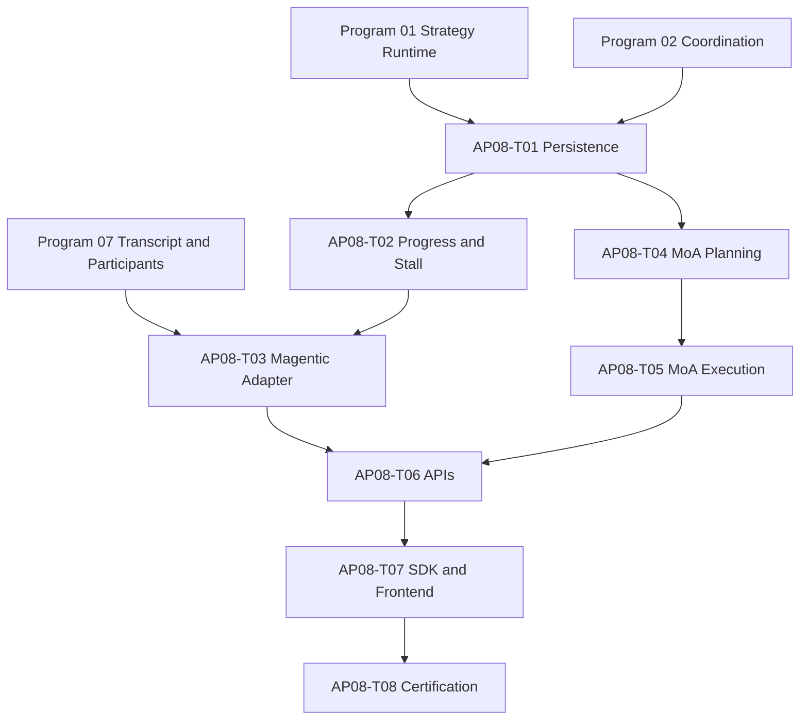

# Agent Pattern Program 08: Magentic and Mixture-of-Agents Implementation Plan

> **For agentic workers:** REQUIRED SUB-SKILL: Use `superpowers:subagent-driven-development` or `superpowers:executing-plans` to implement this plan task-by-task. Every implementation task starts with a failing test and uses checkbox (`- [ ]`) tracking.

**Goal:** Deliver a durable Magentic progress manager with stall detection and bounded replanning, plus a layered Mixture-of-Agents adapter with model diversity, quorum, aggregation, provenance, and cost-safe degradation.

**Architecture:** Both patterns execute as versioned distributed-coordination adapters. Magentic treats the progress ledger as accepted orchestration state and derives next-speaker/replan decisions from optimistic ledger revisions. MoA persists each layer, proposal, eligibility decision, and aggregate as coordination artifacts; model fan-out is admitted by policy and budget before dispatch.

**Tech Stack:** Python 3.12, Pydantic, SQLAlchemy 2 async, PostgreSQL RLS, Redis Streams, Celery, existing provider/model routing, strategy runtime v2, coordination runtime, FastAPI, React 19, Python/TypeScript SDKs, pytest, Vitest, Playwright.

---

# Planning Assumptions

- Programs 01 and 02 provide executable strategy contracts, checkpoints, common sessions, append-only `progress_ledger_revisions`, `work_items`, artifacts, event outbox, replay, cancellation, and limit enforcement.
- Program 07 provides the canonical transcript, shared-context participant model, speaker-policy primitives, and durable child-goal coordination.
- This plan owns `0101_magentic_moa.py` with `down_revision = "0100_handoffs_group_chat"`; it extends common tables rather than introducing a second ledger or proposal store.
- A Magentic reset never deletes prior ledger revisions. A replan creates a new revision linked to the triggering stall evidence.
- MoA is not debate: proposers do not critique or vote. Each layer consumes bounded prior-layer outputs and produces independent proposals; a separate aggregator creates the next-layer aggregate.
- Provider/model diversity is enforced by normalized provider, model family, and deployment identity. Alias names for the same deployment do not satisfy diversity.
- No private chain-of-thought is persisted; proposals, safe rationale summaries, scores, citations, and aggregation provenance are persisted.

# Source Final Documents

- `docs/superpowers/specs/2026-08-03-agent-pattern-completion-program-design.md`
- `docs/superpowers/plans/2026-08-03-agent-pattern-program-07-handoffs-group-chat.md`
- `agent-verse-backend/app/civilization/orchestrator.py`
- `agent-verse-backend/app/civilization/society.py`
- `agent-verse-backend/app/orchestration/strategy_registry.py`
- `agent-verse-backend/app/orchestration/runtime_profile_builder.py`
- `agent-verse-backend/app/ai_router/model_router.py`
- `agent-verse-backend/app/providers/base.py`
- `agent-verse-backend/app/governance/cost.py`
- `agent-verse-frontend/src/lib/api/civilizationApi.ts`
- `agent-verse-frontend/src/features/civilization/CivilizationPage.tsx`

# Epics

| Epic | Outcome | Jira labels |
|---|---|---|
| AP08-E1 | Versioned progress ledger and work-satisfaction evaluator | `magentic`, `persistence`, `backend` |
| AP08-E2 | Deterministic stall detector and bounded replan manager | `magentic`, `recovery`, `governance` |
| AP08-E3 | Durable Magentic strategy adapter and next-participant policy | `magentic`, `strategy-runtime`, `multi-agent` |
| AP08-E4 | Layered, diverse, quorum-aware Mixture-of-Agents | `moa`, `models`, `cost-control` |
| AP08-E5 | Product views, operations, and certification | `api`, `sdk`, `frontend`, `observability` |

# Workstreams

| Workstream | Scope | Depends on | Parallelism |
|---|---|---|---|
| WS08-A Ledger | Schema extension, repository, revision semantics | Programs 01-02 | First |
| WS08-B Magentic manager | progress/stall/replan/speaker decisions | WS08-A, Program 07 | Sequential core |
| WS08-C MoA | diversity, layers, quorum, aggregation | Programs 01-02 | Parallel with WS08-B |
| WS08-D Product | APIs/events, SDKs, ledger/layer views | WS08-B/C | After contracts |
| WS08-E Certification | failure injection, adversarial, load, canary | All | Final |

# Task Breakdown

## AP08-T01: Extend Durable Ledger and Proposal Persistence

**Files**
- Create: `agent-verse-backend/app/db/migrations/versions/0101_magentic_moa.py`
- Modify: `agent-verse-backend/app/db/models/coordination.py`
- Create: `agent-verse-backend/app/coordination/ledger/models.py`
- Create: `agent-verse-backend/app/coordination/ledger/repository.py`
- Create: `agent-verse-backend/app/coordination/moa/repository.py`
- Create: `agent-verse-backend/tests/db/test_magentic_moa_migration.py`
- Create: `agent-verse-backend/tests/coordination/test_progress_ledger_repository.py`
- Create: `agent-verse-backend/tests/coordination/test_moa_repository.py`

**Persistence contract**
- Program 02 remains the sole owner of `progress_ledger_revisions`; revision `0101` adds only Magentic-specific indexes/check constraints when missing and never replaces immutable revision semantics.
- Create distinct `moa_layers` and `moa_proposals` tables owned by Program 08. They store layer index, proposer/aggregator role, provider/model lineage/deployment/region/failure-domain identity, prompt-input references, proposal reference, evidence references, validity, rejection reason, tokens, latency, cost, and predecessor proposal IDs.
- Unique constraints cover ledger `(tenant_id, session_id, version)` and proposal `(tenant_id, strategy_execution_id, layer_index, participant_id, attempt)`. RLS and tenant-first indexes apply to all new/extended tables.

- [ ] Write migration/repository tests for constraints, RLS, optimistic revision append, immutable history, proposal idempotency, tenant isolation, and dominant explain/replay queries.
- [ ] Run `cd agent-verse-backend && uv run pytest tests/db/test_magentic_moa_migration.py tests/coordination/test_progress_ledger_repository.py tests/coordination/test_moa_repository.py -q`; expect missing migration/module failures.
- [ ] Implement exact table creation/extension, mappings, and repositories; ledger updates must append through the Program 02 repository with expected predecessor version rather than mutate history. Migration tests must upgrade from populated `0097`/`0100` state and preserve all revisions.
- [ ] Run the same command; expect all tests to pass and cross-tenant operations to be denied.

## AP08-T02: Implement Progress Evaluation and Stall Detection

**Files**
- Create: `agent-verse-backend/app/coordination/magentic/progress_evaluator.py`
- Create: `agent-verse-backend/app/coordination/magentic/stall_detector.py`
- Create: `agent-verse-backend/app/coordination/magentic/models.py`
- Create: `agent-verse-backend/tests/coordination/test_magentic_progress_evaluator.py`
- Create: `agent-verse-backend/tests/coordination/test_magentic_stall_detector.py`

**Deterministic evaluation contract**
- Progress is a typed delta: newly completed work, newly verified fact/evidence, removed blocker, materially narrowed open work, or satisfied criterion.
- Rewording, confidence-only changes, repeated tool errors, repeated assignments, and unverified claims do not count as progress.
- Stall state is derived from consecutive no-progress revisions, repeated normalized action signatures, unchanged blocker sets, and configured time/cost windows. Thresholds come from `PatternLimits` and are checkpointed.
- LLM evaluation may propose a structured delta but deterministic validation decides whether it is accepted.

- [ ] Write parameterized failing tests covering each valid delta, semantic rewording, oscillating assignments, repeated tool calls, false completion, evidence removal, threshold boundaries, and duplicate event delivery.
- [ ] Run `cd agent-verse-backend && uv run pytest tests/coordination/test_magentic_progress_evaluator.py tests/coordination/test_magentic_stall_detector.py -q`; expect missing-module failures.
- [ ] Implement typed evaluator and detector with normalized signatures and deterministic counters.
- [ ] Run the same command; expect all tests to pass with identical outcomes across repeated runs.

## AP08-T03: Implement the Replan Manager and Magentic Adapter

**Files**
- Create: `agent-verse-backend/app/coordination/magentic/replan_manager.py`
- Create: `agent-verse-backend/app/coordination/magentic/participant_policy.py`
- Create: `agent-verse-backend/app/coordination/magentic/adapter.py`
- Modify: `agent-verse-backend/app/orchestration/strategy_registry.py`
- Modify: `agent-verse-backend/app/civilization/orchestrator.py`
- Create: `agent-verse-backend/tests/coordination/test_magentic_replan_manager.py`
- Create: `agent-verse-backend/tests/coordination/test_magentic_adapter.py`
- Create: `agent-verse-backend/tests/integration/test_magentic_recovery.py`

**State machine**
`initializing -> planning -> executing -> assessing -> replanning | awaiting_human | synthesizing -> completed | failed | cancelled`.

- Initial planning creates satisfaction criteria, task ledger, progress ledger revision 1, and optional human review request.
- Participant selection scores open-work capability, current load, deadline feasibility, policy eligibility, and recent no-progress assignments; the decision and rejected candidates are persisted.
- Replan preserves accepted facts/evidence and completed work, invalidates only explicitly contradicted assumptions/tasks, increments reset count, and cannot exceed `max_resets`.
- Exhausted reset, deadline, budget, or repeated stall limits produce HITL escalation when policy allows; otherwise a structured terminal failure. Synthesis starts only after all mandatory criteria are satisfied.

- [ ] Write failing tests for initial plan, capability selection, unavailable participant, progress loop, one/multiple resets, preserved facts, reset exhaustion, HITL wait/resume, cancellation, restart at each state, and duplicate worker delivery.
- [ ] Run `cd agent-verse-backend && uv run pytest tests/coordination/test_magentic_replan_manager.py tests/coordination/test_magentic_adapter.py -q`; expect missing-module failures.
- [ ] Implement the manager, participant policy, `magentic@1` adapter, registry entry/readiness probe, checkpoints, events, and cancellation propagation.
- [ ] Run the unit command, then `cd agent-verse-backend && DOCKER_HOST=unix:///Users/harsh.kumar01/.colima/default/docker.sock TESTCONTAINERS_RYUK_DISABLED=true uv run pytest tests/integration/test_magentic_recovery.py -q`; expect all tests to pass.

## AP08-T04: Implement Model Diversity and Layer Planning

**Files**
- Create: `agent-verse-backend/app/coordination/moa/models.py`
- Create: `agent-verse-backend/app/coordination/moa/diversity_policy.py`
- Create: `agent-verse-backend/app/coordination/moa/layer_planner.py`
- Create: `agent-verse-backend/tests/coordination/test_moa_diversity_policy.py`
- Create: `agent-verse-backend/tests/coordination/test_moa_layer_planner.py`

- Normalize candidates by provider, model family, deployment endpoint identity, health, data-region eligibility, context limit, cost, latency, and policy capabilities.
- Enforce configurable minimum unique provider and model-family counts; aliases to one deployment count once.
- The layer planner admits the full worst-case fan-out cost/tokens/deadline before dispatch, sets per-proposal caps, and chooses a separate eligible aggregator. It rejects zero-layer, zero-quorum, over-limit, incompatible-region, and self-aggregation configurations.
- When requested diversity is unavailable, either fail before spend or use a persisted degraded policy explicitly permitted by the runtime profile.

- [ ] Write failing tests for aliases, unhealthy deployments, region/policy exclusions, insufficient diversity, budget admission, deadline admission, aggregator separation, and allowed/denied degraded modes.
- [ ] Run `cd agent-verse-backend && uv run pytest tests/coordination/test_moa_diversity_policy.py tests/coordination/test_moa_layer_planner.py -q`; expect missing-module failures.
- [ ] Implement normalization, diversity checks, admission calculations, and immutable layer plans.
- [ ] Run the same command; expect all tests to pass with deterministic candidate ordering.

## AP08-T05: Implement Layered MoA Execution and Aggregation

**Files**
- Create: `agent-verse-backend/app/coordination/moa/quorum.py`
- Create: `agent-verse-backend/app/coordination/moa/aggregator.py`
- Create: `agent-verse-backend/app/coordination/moa/adapter.py`
- Modify: `agent-verse-backend/app/orchestration/strategy_registry.py`
- Create: `agent-verse-backend/tests/coordination/test_moa_quorum.py`
- Create: `agent-verse-backend/tests/coordination/test_moa_aggregator.py`
- Create: `agent-verse-backend/tests/coordination/test_moa_adapter.py`
- Create: `agent-verse-backend/tests/integration/test_moa_recovery.py`

**State machine**
`admitted -> layer_dispatching -> layer_collecting -> layer_aggregating -> next_layer | synthesizing -> completed | failed | cancelled`.

- Proposers receive the original objective plus bounded, attributed prior-layer proposals/aggregate. Prompt construction excludes hidden reasoning and untrusted instructions that fail screening.
- Proposal validation enforces schema, classification, provenance/evidence, output/token limit, and successful provider completion.
- Quorum is based on valid unique deployments, not response count. If quorum fails, one bounded replacement wave may run within reserved budget.
- Final degradation selects the highest-quality valid proposal using deterministic evidence/quality policy only when the profile permits degradation; otherwise fail. Aggregation records every included/excluded proposal and reason.

- [ ] Write failing tests for two-layer execution, unique-deployment quorum, malformed/timeout/refused proposals, replacement wave, aggregate provenance, prompt injection, cancellation, cost cap, restart per phase, and highest-quality degradation.
- [ ] Run `cd agent-verse-backend && uv run pytest tests/coordination/test_moa_quorum.py tests/coordination/test_moa_aggregator.py tests/coordination/test_moa_adapter.py -q`; expect missing-module failures.
- [ ] Implement quorum, aggregator, `mixture_of_agents@1` adapter, registry readiness, events, checkpoints, and exact-once artifact writes.
- [ ] Run the unit command, then `cd agent-verse-backend && DOCKER_HOST=unix:///Users/harsh.kumar01/.colima/default/docker.sock TESTCONTAINERS_RYUK_DISABLED=true uv run pytest tests/integration/test_moa_recovery.py -q`; expect all tests to pass.

## AP08-T06: Publish APIs, Events, and Explainability

**Files**
- Create: `agent-verse-backend/app/api/coordination_magentic.py`
- Create: `agent-verse-backend/app/api/coordination_moa.py`
- Modify: `agent-verse-backend/app/main.py`
- Modify: `agent-verse-backend/app/main_services.py`
- Create: `agent-verse-backend/tests/api/test_magentic_api.py`
- Create: `agent-verse-backend/tests/api/test_moa_api.py`

**Read contracts**
- `GET /api/v1/coordination/sessions/{session_id}/ledger` returns current revision; `GET .../ledger/revisions` returns cursor-paginated immutable history.
- `POST .../magentic/human-review` supplies an authorized response for the current wait token.
- `GET .../moa/layers` and `GET .../moa/layers/{layer_index}` return proposal metadata, valid/rejected state, safe excerpts, provenance, cost, latency, quorum, and aggregation explanation.
- Events: `magentic.ledger_revised|stall_detected|replan_started|replan_completed|participant_selected|awaiting_human|satisfaction_verified.v1`; `moa.layer_planned|proposal_completed|proposal_rejected|quorum_met|quorum_failed|aggregate_completed|degraded.v1`.

- [ ] Write failing tests for authorization, pagination consistency, immutable revisions, stale human token, safe explainability redaction, event schemas, and cross-tenant denial.
- [ ] Run `cd agent-verse-backend && uv run pytest tests/api/test_magentic_api.py tests/api/test_moa_api.py -q`; expect route-not-found failures.
- [ ] Implement read/response endpoints using common session cancellation/resume APIs; do not expose direct ledger mutation or proposal submission endpoints.
- [ ] Run the same command; expect all tests to pass.

## AP08-T07: Publish Product Contract Fixtures For Program 13

**Files**
- Create: `agent-verse-backend/tests/contracts/fixtures/program08_coordination.json`
- Create: `agent-verse-backend/tests/contracts/test_program08_product_contract.py`

- The fixture freezes ledger revision ordering, human review, stall/replan events, layer/proposal reads, diversity, rejection, quorum, degradation, cursor semantics, and required accessible/responsive states.
- Program 13 exclusively owns OpenAPI, SDK, and frontend implementation. Program 08 must not edit SDK or frontend files.

- [ ] Write a failing contract test against Program 08 API/event models and every required product state.
- [ ] Run `cd agent-verse-backend && uv run pytest tests/contracts/test_program08_product_contract.py -q`; expect failure until schemas and fixture agree.
- [ ] Publish the versioned fixture and stable operation/event IDs consumed by Program 13.
- [ ] Run the same command; expect all contract assertions to pass.

## AP08-T08: Adversarial, Recovery, Load, and Certification

**Files**
- Create: `agent-verse-backend/tests/security/test_magentic_adversarial.py`
- Create: `agent-verse-backend/tests/security/test_moa_adversarial.py`
- Create: `agent-verse-backend/tests/load/test_magentic_moa_limits.py`
- Modify: `agent-verse-backend/app/observability/metrics.py`
- Create: `docs/deployment/runbooks/agent-pattern-program-08.md`
- Create: `docs/testing/certification/agent-pattern-program-08.md`

- [ ] Add adversarial tests for false progress, ledger injection, oscillation, malicious completion claims, repeated replans, sybil model aliases, aggregator injection, proposal flooding, correlated provider failure, cost amplification, and hidden-reasoning leakage.
- [ ] Require MoA quorum diversity across provider, model lineage, deployment, region, and failure domain, with minimum independent domains by risk tier. Reject aliases sharing an underlying model or failure domain. High-risk Magentic satisfaction requires an independent verifier or a human-approved rubric. Add correlated compromise/outage and false-independence fixtures.
- [ ] Add load/recovery tests for maximum allowed rounds/layers/fan-out, Redis loss, worker crash, duplicate delivery, outbox lag, cancellation SLO, and saturation backpressure.
- [ ] Run `cd agent-verse-backend && DOCKER_HOST=unix:///Users/harsh.kumar01/.colima/default/docker.sock TESTCONTAINERS_RYUK_DISABLED=true uv run pytest tests/security/test_magentic_adversarial.py tests/security/test_moa_adversarial.py tests/load/test_magentic_moa_limits.py tests/integration/test_magentic_recovery.py tests/integration/test_moa_recovery.py -q`; expect all tests to pass.
- [ ] Add metrics for ledger revisions, no-progress rounds, stalls, resets, satisfaction failures, participant selection, layer fan-out, diversity, proposal validity, quorum/replacement/degradation, tokens/cost/latency, and cancellations.
- [ ] Document inspection, forced cancellation, human escalation, stuck-run recovery, provider-disable response, kill switches, and evidence identifiers; record measured canary thresholds in certification evidence.

# Dependency Graph

# Jira Mapping Plan

| Jira type | Title | Description and acceptance notes | Depends on |
|---|---|---|---|
| Epic | AP08: Magentic and Mixture-of-Agents | Deliver ledger-driven orchestration and layered MoA through certified production paths. | Programs 01, 02, 07 |
| Story | AP08-T01: Persist ledger and MoA layers | Migration `0101`, immutable revisions, proposal/layer metadata, RLS. | Programs 01-02, 07 |
| Story | AP08-T02: Detect real progress and stalls | Deterministic deltas and repeat/stall thresholds. | AP08-T01 |
| Story | AP08-T03: Run durable Magentic manager | Bounded replans, participant policy, HITL, restart/resume. | AP08-T02, Program 07 |
| Story | AP08-T04: Plan diverse MoA layers | Identity normalization, diversity, budget/deadline admission. | AP08-T01 |
| Story | AP08-T05: Execute and aggregate MoA | Quorum, replacement, provenance, safe degradation. | AP08-T04 |
| Story | AP08-T06: Publish Magentic/MoA reads | Authorized ledger/layer APIs and versioned events. | AP08-T03, AP08-T05 |
| Story | AP08-T07: Ship SDK/UI views | Typed clients and accessible pattern-owned views. | AP08-T06 |
| Story | AP08-T08: Certify Program 08 | Adversarial, recovery, load, operations, canary evidence. | AP08-T07 |

# Migration Plan

1. Apply `0101` and validate RLS/indexes before enabling adapters.
2. Shadow-run progress evaluation against selected existing multi-agent sessions without permitting replan decisions; compare human-labelled progress/stall outcomes.
3. Run MoA in evaluation-only cohorts with strict low fan-out and no degraded final response; retain proposal artifacts for quality review.
4. Enable `magentic@1` and `mixture_of_agents@1` by internal tenant allowlist and per-pattern kill switch.
5. Expand limits by plan tier only after measured cost and latency remain within profile admission estimates.
6. Promote registry state after restart/security/product gates, then certify after canary baselines.

# Test Plan

- Unit: ledger append semantics, progress deltas, stalls, resets, participant selection, diversity, layer plans, quorum, aggregate inclusion.
- Database: migration, RLS, immutability, optimistic conflicts, proposal idempotency, indexed history/layer reads.
- Integration: checkpoints, restart at every phase, duplicate Celery/outbox events, Redis polling fallback, cancellation and HITL resume.
- Security: ledger/proposal injection, false completion, alias/sybil diversity, data-classification leakage, cost amplification.
- API/SDK/UI: event schema, pagination, safe explanation, stale human token, typed parity, accessibility and responsive states.
- Performance: admitted upper-bound fan-out, bounded context growth, backpressure, coordination write p95 below 100 ms excluding model calls.

# Release Plan

1. Deploy migration/repositories and metrics with adapters disabled.
2. Enable shadow stall classification and review precision/recall.
3. Canary Magentic with one reset and mandatory internal HITL escalation.
4. Canary two-layer MoA with three unique deployments and strict quorum.
5. Release read-only product views, then human response controls.
6. Expand tenant cohorts and pattern limits independently; retain separate kill switches.

# Rollback Plan

- Disable new strategy selection while allowing active sessions to reach a checkpoint and cancel safely.
- For Magentic, freeze the latest accepted ledger revision and return a structured interrupted result; never rewrite history.
- For MoA, stop new layers and use the highest-quality already-valid proposal only when the persisted profile permits degradation; otherwise fail explicitly.
- Keep migration `0101` and all evidence rows; roll back application selection/read paths only.
- Remove frontend panels from navigation through capability readiness responses, not by deleting persisted data.

# Risks and Blockers

| Risk or blocker | Mitigation / exit criterion |
|---|---|
| Program 07 transcript/participant contracts drift | Block AP08-T03 until imports and event schemas are reconciled; MoA can proceed independently after AP08-T01. |
| LLM labels cosmetic changes as progress | Deterministic delta validator is authoritative and evaluated against labelled adversarial fixtures. |
| Replanning loops consume budget | Reserve reset budget up front, enforce `max_resets`, and escalate/terminate deterministically. |
| Model aliases defeat diversity | Resolve deployment identity through the model registry and count unique normalized identities only. |
| MoA fan-out causes denial of wallet | Worst-case pre-admission, per-proposal caps, one bounded replacement wave, live cancellation, and kill switch. |
| Aggregator hides disagreement | Persist inclusion/exclusion and preserve all valid proposals for explainability without exposing private reasoning. |

# Definition of Done

- [ ] Ledger revisions are immutable, RLS-protected, replayable, and atomically correlated with events/checkpoints.
- [ ] Progress and stalls are deterministically validated; cosmetic/repeated actions cannot reset stall counters.
- [ ] Magentic performs bounded replans, preserves verified state, selects eligible participants, supports HITL, and survives restart/duplicates.
- [ ] MoA enforces real model diversity, pre-admits worst-case cost/deadline, executes bounded layers, meets unique-deployment quorum, and records aggregation provenance.
- [ ] APIs/events expose safe ledger and layer explanations; SDKs and accessible UI views remain pattern-owned.
- [ ] Adversarial, RLS, recovery, cancellation, load, observability, runbook, and canary evidence meet certification gates.
- [ ] `cd agent-verse-backend && uv run ruff check . && uv run mypy app && uv run pytest -m "not slow"` exits 0.
- [ ] `cd agent-verse-frontend && npm run lint && npm run typecheck && npm run test && npm run build` exits 0.
- [ ] Both SDK suites build and pass with OpenAPI parity.