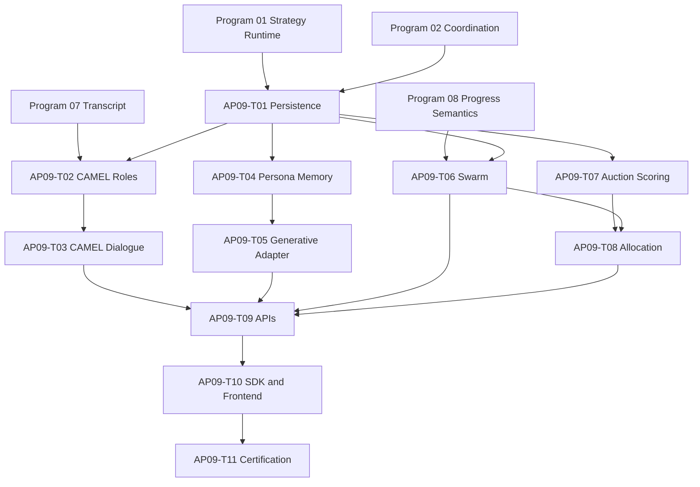

# Agent Pattern Program 09: CAMEL, Generative Agents, Swarm, and Auction Implementation Plan

> **For agentic workers:** REQUIRED SUB-SKILL: Use `superpowers:subagent-driven-development` or `superpowers:executing-plans` to implement this plan task-by-task. Every implementation task starts with a failing test and uses checkbox (`- [ ]`) tracking.

**Goal:** Deliver bounded CAMEL role dialogue, memory-grounded Generative Agents, a Governor-constrained decentralized swarm, and sealed deterministic auction allocation with fairness and anti-collusion controls.

**Architecture:** All four capabilities are versioned Civilization strategy adapters over the canonical coordination runtime. CAMEL owns role contracts and bounded dialogue; Generative Agents orchestrate existing memory stores under simulation time; swarm peers advertise and claim work but cannot create authority; auctions allocate eligible work using sealed bids and a versioned deterministic scoring policy. Governor remains the sole admission, spawning, retirement, budget, and inherited-policy authority.

**Tech Stack:** Python 3.12, Pydantic, SQLAlchemy 2 async, PostgreSQL RLS, Redis Streams/leases, Celery, existing Civilization Governor/Society, memory and provider layers, strategy/coordination runtimes, FastAPI, React 19, Python/TypeScript SDKs, pytest, Vitest, Playwright.

---

# Planning Assumptions

- Programs 01-02 provide strategy execution, sessions, work items, claims, bids, allocations, artifacts, outbox, checkpoints, replay, cancellation, and common limits.
- Program 07 provides canonical transcript, shared-context security, same-civilization participant validation, and durable child execution.
- Program 08 provides progress/stall semantics that CAMEL and swarm may consume but not mutate outside their own session.
- This plan owns `0102_camel_generative_swarm_auction.py` with `down_revision = "0101_magentic_moa"`.
- Existing `app/memory/episodic.py`, `app/memory/long_term.py`, `app/memory_v2/consolidation.py`, and `app/memory_v2/models.py` remain canonical memory owners. Generative Agents add typed persona/observation/planning orchestration, not a duplicate memory database.
- Swarm membership is limited to active agents in one civilization. Gossip cannot grant permissions, increase budget, spawn agents, alter reputation, or settle an allocation.
- Auction score inputs are fixed at announcement; bids remain sealed until deadline; scoring uses decimal/fixed-point arithmetic and stable tie-breakers.
- Fairness constraints prevent feedback-loop exclusion while never admitting an ineligible, unauthorized, or over-budget bidder.

# Source Final Documents

- `docs/superpowers/specs/2026-08-03-agent-pattern-completion-program-design.md`
- `docs/superpowers/plans/2026-08-03-agent-pattern-program-07-handoffs-group-chat.md`
- `docs/superpowers/plans/2026-08-03-agent-pattern-program-08-magentic-mixture-of-agents.md`
- `agent-verse-backend/app/civilization/governor.py`
- `agent-verse-backend/app/civilization/society.py`
- `agent-verse-backend/app/civilization/constitution.py`
- `agent-verse-backend/app/civilization/models.py`
- `agent-verse-backend/app/civilization/bus.py`
- `agent-verse-backend/app/memory/episodic.py`
- `agent-verse-backend/app/memory/long_term.py`
- `agent-verse-backend/app/memory_v2/consolidation.py`
- `agent-verse-backend/app/orchestration/strategy_registry.py`
- `agent-verse-frontend/src/features/civilization/CivilizationMap.tsx`
- `agent-verse-frontend/src/features/civilization/CivilizationPage.tsx`

# Epics

| Epic | Outcome | Jira labels |
|---|---|---|
| AP09-E1 | CAMEL role contracts, inception, dialogue, safety, and termination | `camel`, `multi-agent`, `safety` |
| AP09-E2 | Persona memory, observation, reflection, planning, and simulation time | `generative-agents`, `memory`, `simulation` |
| AP09-E3 | Typed gossip, claims, leases, fencing, reclaim, and convergence | `swarm`, `governor`, `reliability` |
| AP09-E4 | Sealed bids, deterministic scoring, fairness, allocation, settlement, rebid | `auction`, `fairness`, `allocation` |
| AP09-E5 | Product surfaces, operations, adversarial tests, and certification | `api`, `sdk`, `frontend`, `security` |

# Workstreams

| Workstream | Scope | Depends on | Parallelism |
|---|---|---|---|
| WS09-A Persistence | Pattern-specific schema extensions and repositories | Programs 01-02 | First |
| WS09-B CAMEL | role/dialogue adapter | WS09-A, Program 07 | Parallel |
| WS09-C Generative Agents | memory/simulation adapter | WS09-A | Parallel |
| WS09-D Swarm | gossip, claim/lease, convergence, Governor integration | WS09-A, Program 08 | Parallel |
| WS09-E Auction | sealed bid/scoring/fairness/settlement | WS09-A, WS09-D fallback | Parallel after schema |
| WS09-F Product/certification | API, SDK, UI, operations, promotion | B-E | Final |

# Task Breakdown

## AP09-T01: Extend Persistence for Role, Simulation, Swarm, and Auction State

**Files**
- Create: `agent-verse-backend/app/db/migrations/versions/0102_camel_generative_swarm_auction.py`
- Modify: `agent-verse-backend/app/db/models/coordination.py`
- Create: `agent-verse-backend/app/coordination/camel/repository.py`
- Create: `agent-verse-backend/app/coordination/generative/repository.py`
- Create: `agent-verse-backend/app/coordination/swarm/repository.py`
- Create: `agent-verse-backend/app/coordination/auction/repository.py`
- Create: `agent-verse-backend/tests/db/test_camel_generative_swarm_auction_migration.py`
- Create: `agent-verse-backend/tests/coordination/test_program09_repositories.py`

**Persistence contract**
- Program 02 remains the sole ORM owner of common `claims`, `agent_bids`, and `allocations`; revision `0102` extends them through explicit `ALTER TABLE`, constraint replacement, backfill, and downgrade operations.
- Create distinct `camel_dialogue_state`, `generative_agent_state`, `swarm_gossip_messages`, and `task_auctions` tables owned by Program 09. CAMEL state stores role-contract versions and termination checks; Generative state stores persona/simulation/reflection/plan cursors; gossip stores typed payload hash, Governor-issued origin credential, hop/TTL/dedupe; auctions store sealed-envelope metadata and unseal authority.
- Common claims add attempt/reclaim/convergence fields. Common bids add Governor identity attestation, encrypted sealed payload, nonce, signature, commitments, eligibility, and invalid reason. Common allocations add fairness adjustment, deterministic explanation, winner fencing lease, fallback/rebid/settlement state.

- [ ] Write failing migration/repository tests for RLS, tenant-first indexes, append-only bids, sealed read restrictions, unique claim fencing tokens, gossip dedupe/expiry, simulation checkpoint concurrency, allocation idempotency, and cross-tenant denial.
- [ ] Run `cd agent-verse-backend && uv run pytest tests/db/test_camel_generative_swarm_auction_migration.py tests/coordination/test_program09_repositories.py -q`; expect missing migration/module failures.
- [ ] Implement exact table creation/extension, constraint replacement, data backfill, downgrade behavior, ORM mapping extensions, and repositories using Program 02 transaction/outbox utilities. Upgrade tests begin with populated Program 02/08 common tables and prove no data loss or duplicate metadata ownership.
- [ ] Run the same command; expect all tests to pass, including unseal-before-deadline denial.

## AP09-T02: Implement CAMEL Role Contracts and Inception

**Files**
- Create: `agent-verse-backend/app/coordination/camel/models.py`
- Create: `agent-verse-backend/app/coordination/camel/role_contract.py`
- Create: `agent-verse-backend/app/coordination/camel/inception.py`
- Create: `agent-verse-backend/tests/coordination/test_camel_role_contract.py`
- Create: `agent-verse-backend/tests/coordination/test_camel_inception.py`

- A role contract names role, objective, responsibilities, prohibited actions, tool/connector allowlist, data scope, authority ceiling, communication schema, termination conditions, and version.
- Inception validates complementarity, task feasibility, policy intersection, classification compatibility, tool availability, and non-escalation. Generated inception prompts are screened and stored as artifacts with safe summaries.
- Conflicting roles, circular authority, unspecified termination, unavailable tools, disjoint policy envelopes, and role instructions that override platform policy are rejected before a model call.

- [ ] Write failing tests for valid complementary roles and every rejection condition, prompt injection in role text, connector escalation, context over-limit, deterministic version hash, and idempotent inception.
- [ ] Run `cd agent-verse-backend && uv run pytest tests/coordination/test_camel_role_contract.py tests/coordination/test_camel_inception.py -q`; expect missing-module failures.
- [ ] Implement typed role validation and governed inception generation.
- [ ] Run the same command; expect all tests to pass and no persisted field to contain private reasoning.

## AP09-T03: Implement Bounded CAMEL Dialogue

**Files**
- Create: `agent-verse-backend/app/coordination/camel/termination.py`
- Create: `agent-verse-backend/app/coordination/camel/adapter.py`
- Modify: `agent-verse-backend/app/orchestration/strategy_registry.py`
- Create: `agent-verse-backend/tests/coordination/test_camel_termination.py`
- Create: `agent-verse-backend/tests/coordination/test_camel_adapter.py`
- Create: `agent-verse-backend/tests/integration/test_camel_recovery.py`

**State machine**
`validating_roles -> inception -> dialoguing -> evaluating_termination -> completed | awaiting_human | failed | cancelled`.

- Dialogue alternates according to the persisted contract, appends canonical transcript messages, screens shared instructions, reauthorizes tools per turn, and checkpoints after each accepted message.
- Termination evaluates explicit completion schema, role agreement, repeated normalized utterance, no-progress threshold, max turns, token/cost/deadline, safety breach, and human escalation policy.
- A role cannot modify its own contract or the peer's contract during dialogue. Contract amendment requires an authorized external command and creates a new version/checkpoint.

- [ ] Write failing tests for successful dialogue, premature completion, role drift, repeated dialogue, tool escalation, injection laundering, hard limits, HITL wait/resume, restart each turn, duplicate delivery, and cancellation.
- [ ] Run `cd agent-verse-backend && uv run pytest tests/coordination/test_camel_termination.py tests/coordination/test_camel_adapter.py -q`; expect missing-module failures.
- [ ] Implement termination evaluator, `camel@1` adapter, registry readiness, events, checkpoints, audit, and cancellation.
- [ ] Run the unit command, then `cd agent-verse-backend && DOCKER_HOST=unix:///Users/harsh.kumar01/.colima/default/docker.sock TESTCONTAINERS_RYUK_DISABLED=true uv run pytest tests/integration/test_camel_recovery.py -q`; expect all tests to pass.

## AP09-T04: Implement Generative Agent Persona and Observation Memory

**Files**
- Create: `agent-verse-backend/app/coordination/generative/models.py`
- Create: `agent-verse-backend/app/coordination/generative/persona.py`
- Create: `agent-verse-backend/app/coordination/generative/observation.py`
- Create: `agent-verse-backend/app/coordination/generative/reflection.py`
- Modify: `agent-verse-backend/app/memory/episodic.py`
- Modify: `agent-verse-backend/app/memory/long_term.py`
- Create: `agent-verse-backend/tests/coordination/test_generative_persona.py`
- Create: `agent-verse-backend/tests/coordination/test_generative_observation.py`
- Create: `agent-verse-backend/tests/coordination/test_generative_reflection.py`

- Persona is a versioned configuration containing public traits, goals, relationships, behavioral constraints, and memory namespace; it cannot encode new permissions or secrets.
- Observations are classified, provenance-linked events scored by recency, importance, relevance, confidence, and policy eligibility. Retrieval is bounded and uses stored embeddings where available.
- Reflection is triggered by an accumulated importance threshold and minimum evidence count, produces structured conclusions with source memory IDs, and writes through canonical long-term memory quarantine/evidence rules.
- Tenant data, another persona's private memory, unverified claims, expired observations, and hidden reasoning are excluded from recall/write.

- [ ] Write failing tests for persona versioning, authority non-escalation, scoring, deterministic tie order, bounded recall, cross-persona/tenant denial, poisoned observation quarantine, reflection threshold, evidence links, and duplicate observation ingestion.
- [ ] Run `cd agent-verse-backend && uv run pytest tests/coordination/test_generative_persona.py tests/coordination/test_generative_observation.py tests/coordination/test_generative_reflection.py -q`; expect missing-module failures.
- [ ] Implement persona/observation/reflection services by extending canonical memory interfaces, without adding a separate memory store.
- [ ] Run the same command; expect all tests to pass.

## AP09-T05: Implement Simulation Clock, Planning, and Generative Adapter

**Files**
- Create: `agent-verse-backend/app/coordination/generative/simulation_clock.py`
- Create: `agent-verse-backend/app/coordination/generative/planner.py`
- Create: `agent-verse-backend/app/coordination/generative/adapter.py`
- Modify: `agent-verse-backend/app/orchestration/strategy_registry.py`
- Create: `agent-verse-backend/tests/coordination/test_simulation_clock.py`
- Create: `agent-verse-backend/tests/coordination/test_generative_planner.py`
- Create: `agent-verse-backend/tests/coordination/test_generative_adapter.py`
- Create: `agent-verse-backend/tests/integration/test_generative_agent_recovery.py`

**State machine**
`initializing -> observing -> reflecting | planning -> acting -> advancing_time -> observing | completed | failed | cancelled`.

- Simulation time is explicit and monotonic, separate from wall-clock time, timezone-aware, bounded by horizon and event count, and advanced only by accepted events.
- Plans are time-slotted work items linked to goals/memories; conflicts, impossible duration, expired prerequisites, and policy/tool failures trigger bounded replanning.
- Actions execute through governed AgentGraph/coordination children, never directly from persona text. Results become observations only after classification and provenance checks.

- [ ] Write failing tests for monotonic/frozen/manual clocks, DST/timezone boundaries, horizon/event limits, plan conflicts, bounded replans, action governance, restart/catch-up, duplicate event, and cancellation.
- [ ] Run `cd agent-verse-backend && uv run pytest tests/coordination/test_simulation_clock.py tests/coordination/test_generative_planner.py tests/coordination/test_generative_adapter.py -q`; expect missing-module failures.
- [ ] Implement clock, planner, `generative_agents@1` adapter, registry readiness, checkpoints, and events.
- [ ] Run unit tests, then `cd agent-verse-backend && DOCKER_HOST=unix:///Users/harsh.kumar01/.colima/default/docker.sock TESTCONTAINERS_RYUK_DISABLED=true uv run pytest tests/integration/test_generative_agent_recovery.py -q`; expect all tests to pass.

## AP09-T06: Implement Typed Gossip and Governor-Constrained Swarm Claims

**Files**
- Create: `agent-verse-backend/app/coordination/swarm/models.py`
- Create: `agent-verse-backend/app/coordination/swarm/gossip.py`
- Create: `agent-verse-backend/app/coordination/swarm/claims.py`
- Create: `agent-verse-backend/app/coordination/swarm/convergence.py`
- Create: `agent-verse-backend/app/coordination/swarm/adapter.py`
- Modify: `agent-verse-backend/app/civilization/governor.py`
- Modify: `agent-verse-backend/app/civilization/society.py`
- Modify: `agent-verse-backend/app/orchestration/strategy_registry.py`
- Create: `agent-verse-backend/tests/coordination/test_swarm_gossip.py`
- Create: `agent-verse-backend/tests/coordination/test_swarm_claims.py`
- Create: `agent-verse-backend/tests/coordination/test_swarm_adapter.py`
- Create: `agent-verse-backend/tests/integration/test_swarm_recovery.py`

**State machine**
`advertising -> discovering -> claiming -> executing -> publishing_result -> converged | reclaiming | failed | cancelled`.

- Advertisements identify bounded work, eligibility, deadline, lease duration, budget ceiling, classification, and hop limit. Society returns eligible active peers; only Governor may authorize a missing-capability spawn.
- Gossip accepts typed schemas only, deduplicates by content/event identity, decrements TTL/hop count, rate limits each origin, and never carries privileged control commands.
- Claim acquisition is atomic; each ownership change increments a fencing token. Heartbeats extend only the current token. Stale workers cannot publish/settle. Expired claims are deterministically reclaimed within attempt limits.
- Convergence requires all mandatory work terminal plus objective criteria; repeated equivalent work/results, budget, deadline, or no-progress thresholds stop the swarm.

- [ ] Write failing tests for gossip dedupe/TTL/hops/rate limits, forged origin, storm suppression, atomic competing claims, stale heartbeat/result, lease reclaim, split brain, Governor-only spawn, convergence, budget/deadline, restart, and cancellation.
- [ ] Bind every swarm and auction participant to a Governor-issued credential and deployment attestation. Define bid-envelope encryption, KMS-backed sealing keys, authorized unseal roles, immutable unseal audit, collusion confidence thresholds, quarantine versus rejection semantics, false-positive review, and reputation rollback. Add forged-attestation, compromised-key, unauthorized-unseal, detector-threshold, and appeal fixtures.
- [ ] Run `cd agent-verse-backend && uv run pytest tests/coordination/test_swarm_gossip.py tests/coordination/test_swarm_claims.py tests/coordination/test_swarm_adapter.py -q`; expect missing-module failures.
- [ ] Implement services and `decentralized_swarm@1` adapter; Governor changes expose authorization methods but never delegate authority to peers.
- [ ] Run unit tests, then `cd agent-verse-backend && DOCKER_HOST=unix:///Users/harsh.kumar01/.colima/default/docker.sock TESTCONTAINERS_RYUK_DISABLED=true uv run pytest tests/integration/test_swarm_recovery.py -q`; expect all tests to pass.

## AP09-T07: Implement Sealed Bid Intake and Deterministic Scoring

**Files**
- Create: `agent-verse-backend/app/coordination/auction/models.py`
- Create: `agent-verse-backend/app/coordination/auction/sealed_bids.py`
- Create: `agent-verse-backend/app/coordination/auction/scoring.py`
- Create: `agent-verse-backend/app/coordination/auction/fairness.py`
- Create: `agent-verse-backend/app/coordination/auction/threat_detection.py`
- Create: `agent-verse-backend/tests/coordination/test_sealed_bids.py`
- Create: `agent-verse-backend/tests/coordination/test_auction_scoring.py`
- Create: `agent-verse-backend/tests/coordination/test_auction_fairness.py`
- Create: `agent-verse-backend/tests/security/test_auction_threats.py`

- Announcement freezes work requirements, eligibility, deadline, scoring-policy version, weights for quality/cost/latency/confidence/fairness/load, normalization bounds, exploration quota, and stable tie-break order.
- Signed bids are encrypted/sealed until deadline. Replacements are allowed only by explicit monotonic bid version before deadline; bidder count/content is hidden from peers.
- Scoring validates signatures, membership, capability, freshness, capacity, cost/budget, and conflicts before fixed-point normalization. Stable tie-break: total score, quality score, lower cost, earlier valid submission, bidder ID.
- Fairness adjustment is bounded, auditable, and computed from opportunity/exposure windows; it cannot overcome eligibility or minimum quality. Threat detection rejects sybil identity, duplicate deployment identity, reciprocal/collusive patterns, stale/forged bids, and impossible commitments.

- [ ] Write failing known-answer tests proving byte-for-byte deterministic rankings, weight validation, normalization boundaries, ties, bid secrecy, early unseal denial, replacement, signatures, fairness cap/exploration, and each threat class.
- [ ] Run `cd agent-verse-backend && uv run pytest tests/coordination/test_sealed_bids.py tests/coordination/test_auction_scoring.py tests/coordination/test_auction_fairness.py tests/security/test_auction_threats.py -q`; expect missing-module failures.
- [ ] Implement sealed bid service, fixed-point scorer, fairness policy, and threat detector.
- [ ] Run the same command twice; expect identical rankings and all tests to pass both times.

## AP09-T08: Implement Allocation, Settlement, Rebid, and Fallback

**Files**
- Create: `agent-verse-backend/app/coordination/auction/state_machine.py`
- Create: `agent-verse-backend/app/coordination/auction/allocator.py`
- Create: `agent-verse-backend/app/coordination/auction/adapter.py`
- Modify: `agent-verse-backend/app/orchestration/strategy_registry.py`
- Create: `agent-verse-backend/tests/coordination/test_auction_state_machine.py`
- Create: `agent-verse-backend/tests/coordination/test_auction_allocator.py`
- Create: `agent-verse-backend/tests/integration/test_auction_recovery.py`

**State machine**
`announced -> bidding -> sealed -> scored -> allocated -> executing -> settled | rebid -> bidding | failed | cancelled`.

- Allocation creates a fenced winner lease and explanation in one transaction. Only the current winner token can start, report, or settle work.
- Invalid/no bids fall back first to Society routing, then a Governor spawn request if constitution/policy/budget allow. Rebid changes deadline/eligible pool only through a new auction round linked to the prior round and bounded by `max_rebids`.
- Failed/expired winner leases trigger bounded rebid; settlement records delivered quality/cost/latency against commitments and sends outcome to reputation/fairness learning through governed events, not direct score mutation.

- [ ] Write failing tests for every legal/illegal transition, duplicate allocation/settlement, stale winner, no-bid fallback order, Governor denial, bounded rebid, winner failure, cancellation, restart each state, and outcome recording.
- [ ] Run `cd agent-verse-backend && uv run pytest tests/coordination/test_auction_state_machine.py tests/coordination/test_auction_allocator.py -q`; expect missing-module failures.
- [ ] Implement `market_auction@1` adapter, allocator, state machine, registry readiness, outbox events, and fallback integration.
- [ ] Run unit tests, then `cd agent-verse-backend && DOCKER_HOST=unix:///Users/harsh.kumar01/.colima/default/docker.sock TESTCONTAINERS_RYUK_DISABLED=true uv run pytest tests/integration/test_auction_recovery.py -q`; expect all tests to pass.

## AP09-T09: Publish Feature-Owned APIs and Events

**Files**
- Create: `agent-verse-backend/app/api/coordination_camel.py`
- Create: `agent-verse-backend/app/api/coordination_generative.py`
- Create: `agent-verse-backend/app/api/coordination_swarm.py`
- Create: `agent-verse-backend/app/api/coordination_auction.py`
- Modify: `agent-verse-backend/app/main.py`
- Modify: `agent-verse-backend/app/main_services.py`
- Create: `agent-verse-backend/tests/api/test_program09_coordination_api.py`

**Contracts**
- Read role contracts/dialogue status, persona/simulation/plan state, swarm advertisements/claims/topology, and auction announcement/bid summary/allocation/explanation/settlement under `/api/v1/coordination/sessions/{session_id}`.
- Bid submission is an authenticated command endpoint accepting an idempotency key and signed sealed payload; API never returns bid content before seal and never reveals competitors' raw bids afterward.
- Common session endpoints own create/cancel/resume. Pattern endpoints expose only feature-owned reads and authorized commands such as role amendment, clock advance/pause, heartbeat, bid, and rebid approval.
- Versioned events cover role/inception/turn/termination, observation/reflection/plan/time, advertisement/gossip suppression/claim/reclaim/convergence, and auction announcement/seal/score/allocation/rebid/settlement/fallback.

- [ ] Write failing tests for authorization, state-command conflicts, pagination/replay, sealed bid disclosure, safe explanation, data redaction, event schemas, and cross-tenant/civilization denial.
- [ ] Run `cd agent-verse-backend && uv run pytest tests/api/test_program09_coordination_api.py -q`; expect route-not-found failures.
- [ ] Implement routers, dependencies, response models, rate/message limits, and OpenAPI contracts.
- [ ] Run the same command; expect all tests to pass.

## AP09-T10: Publish Product Contract Fixtures For Program 13

**Files**
- Create: `agent-verse-backend/tests/contracts/fixtures/program09_coordination.json`
- Create: `agent-verse-backend/tests/contracts/test_program09_product_contract.py`

- The fixture freezes role/simulation/swarm/auction reads and commands, idempotency, pagination/replay, bid-signing inputs, claim heartbeat, cancellation, event unions, secret redaction, deterministic scoring, list-equivalent topology, and accessible/responsive states.
- Program 13 exclusively owns OpenAPI, SDK, and frontend implementation. Program 09 must not edit SDK or frontend files.

- [ ] Write a failing contract test against Program 09 API/event models and every required product state.
- [ ] Run `cd agent-verse-backend && uv run pytest tests/contracts/test_program09_product_contract.py -q`; expect failure until schemas and fixture agree.
- [ ] Publish the versioned fixture and stable operation/event IDs consumed by Program 13.
- [ ] Run the same command; expect all contract assertions to pass.

## AP09-T11: Adversarial, Recovery, Load, Fairness, and Certification

**Files**
- Create: `agent-verse-backend/tests/security/test_camel_generative_adversarial.py`
- Create: `agent-verse-backend/tests/security/test_swarm_adversarial.py`
- Create: `agent-verse-backend/tests/load/test_swarm_auction_limits.py`
- Create: `agent-verse-backend/tests/evals/test_auction_fairness_regression.py`
- Modify: `agent-verse-backend/app/observability/metrics.py`
- Create: `docs/deployment/runbooks/agent-pattern-program-09.md`
- Create: `docs/testing/certification/agent-pattern-program-09.md`

- [ ] Test role/inception injection, persona memory poisoning, identity leakage, simulated-time runaway, forged gossip, replay loops, storm amplification, split-brain/stale claims, sybil/reciprocal/collusive/forged bids, strategic underbidding, reputation feedback bias, and denial of wallet.
- [ ] Test Redis loss, worker crash at every authority transition, duplicate events, lease expiry/reclaim, cancellation SLO, no-bid fallback, bounded rebid, maximum peers/hops/events/bids, and 10,000-event replay without full-table scans.
- [ ] Run `cd agent-verse-backend && DOCKER_HOST=unix:///Users/harsh.kumar01/.colima/default/docker.sock TESTCONTAINERS_RYUK_DISABLED=true uv run pytest tests/security/test_camel_generative_adversarial.py tests/security/test_swarm_adversarial.py tests/security/test_auction_threats.py tests/load/test_swarm_auction_limits.py tests/evals/test_auction_fairness_regression.py -q`; expect all tests to pass.
- [ ] Add metrics for dialogue turns/termination, observation/reflection/plan quality, simulation lag, gossip accepted/deduped/dropped, claim contention/reclaim/stale rejection, bid validity, no-bid/rebid, score components, allocation/settlement, fairness exposure/opportunity, threat denials, cost, and latency.
- [ ] Document pause/cancel/replay, lease repair, gossip storm response, auction dispute evidence, scoring-policy rollback, fairness monitoring, kill switches, and certification evidence IDs.

# Dependency Graph

# Jira Mapping Plan

| Jira type | Title | Description and acceptance notes | Depends on |
|---|---|---|---|
| Epic | AP09: CAMEL, Generative Agents, swarm, and auctions | Deliver all four governed patterns and certification evidence. | Programs 01, 02, 07, 08 |
| Story | AP09-T01: Persist Program 09 state | Migration `0102`, repositories, RLS, sealing and fencing invariants. | Programs 01-02, 08 |
| Story | AP09-T02: Validate CAMEL role inception | Versioned role contracts and preflight rejection. | AP09-T01, Program 07 |
| Story | AP09-T03: Run bounded CAMEL dialogue | Canonical turns, safety, termination, restart/resume. | AP09-T02 |
| Story | AP09-T04: Ground generative personas in memory | Persona, observation, reflection using canonical stores. | AP09-T01 |
| Story | AP09-T05: Run simulation-time plans | Explicit clock, governed actions, bounded replan/recovery. | AP09-T04 |
| Story | AP09-T06: Coordinate governed swarm work | Typed gossip, fenced claims, reclaim, convergence, Governor authority. | AP09-T01, Program 08 |
| Story | AP09-T07: Score sealed fair auctions | Deterministic weights, secrecy, fairness, threat rejection. | AP09-T01 |
| Story | AP09-T08: Allocate and settle auction work | Winner lease, rebid, Society/Governor fallback, outcome evidence. | AP09-T06-T07 |
| Story | AP09-T09: Publish feature APIs/events | Authorized pattern-owned reads/commands and event schemas. | AP09-T03/T05/T06/T08 |
| Story | AP09-T10: Ship SDK/UI touchpoints | Typed SDKs and accessible pattern panels. | AP09-T09 |
| Story | AP09-T11: Certify Program 09 | Adversarial, restart, load, fairness, operations, canary evidence. | AP09-T10 |

# Migration Plan

1. Apply `0102`; verify RLS, sealed-read, fencing, and index tests before enabling writes.
2. Shadow-evaluate role contracts, observation scoring, gossip dedupe, and auction ranking against fixed fixtures without executing actions or allocations.
3. Canary CAMEL and Generative Agents independently with short horizons/turn limits and mandatory internal review.
4. Canary swarm in advertisement/read-only mode, then claims with spawning disabled, then Governor-authorized fallback.
5. Run auctions in shadow allocation mode against Society routing; compare quality, cost, latency, exposure, and opportunity fairness before allowing winner execution.
6. Enable settlement/reputation outcome events only after deterministic scoring and fairness regression gates pass.
7. Promote and certify each adapter independently; one pattern failure must not block kill-switch rollback of another.

# Test Plan

- Unit: role contracts, inception, termination, persona/scoring/reflection, clock/plans, gossip/claims/convergence, bid sealing/scoring/fairness/threats, allocation state.
- Database: migration, RLS, bid secrecy, immutable versions, optimistic checkpoints, fencing, idempotent allocation/settlement, tenant-first indexes.
- Integration: restart every phase, Redis polling fallback, duplicate delivery, lease reclaim, cancellation, Society/Governor fallback, dead letters.
- Adversarial: prompt/memory poisoning, impersonation, sybil/collusion, gossip storms/replay, stale workers, budget amplification, fairness feedback loops.
- Product: API conflict/auth/redaction, OpenAPI/SDK parity, accessible topology/list equivalence, responsive states, Playwright end-to-end.
- Performance/fairness: bounded peers/hops/events/bids, replay without full scans, fixed-point reproducibility, exposure/opportunity thresholds across protected evaluation cohorts where lawful and available.

# Release Plan

1. Deploy schema, repositories, metrics, and shadow evaluators with all adapters disabled.
2. Enable CAMEL and Generative Agents for internal simulation-only tenants.
3. Enable swarm claims for a fixed roster with Governor spawning disabled.
4. Enable shadow auctions, then allocation without reputation feedback, then settlement feedback.
5. Release read-only product panels before command controls.
6. Expand cohorts and limits independently based on security, quality, cost, latency, convergence, and fairness dashboards.

# Rollback Plan

- Disable each strategy adapter independently through registry kill switches; retain canonical state and evidence.
- CAMEL stops at the next turn checkpoint; Generative Agents freeze simulation time and persist the current plan cursor.
- Swarm rejects new advertisements/claims, allows current fenced claims to cancel or expire, and routes remaining work through Society.
- Auction stops new announcements/bids, cancels unallocated rounds, permits current valid winner settlement, and routes unassigned work through Society; signature/sealing checks remain enabled.
- Roll back application paths only. Migration `0102` remains deployed and forward-compatible.

# Risks and Blockers

| Risk or blocker | Mitigation / exit criterion |
|---|---|
| Canonical memory APIs cannot store evidence links | Block AP09-T04 and extend the canonical interface; do not create a parallel persona-memory database. |
| Role contracts become prompt-only policy | Deterministic preflight and per-turn tool authorization remain authoritative over role text. |
| Simulated time runs away from wall-clock operations | Explicit clock authority, horizon/event limits, no implicit catch-up, and operator pause/advance controls. |
| Peer swarm bypasses Governor | Peers receive no spawn/retire/budget mutation capability; tests assert Governor is the only authority path. |
| Gossip causes amplification | Typed schemas, origin quotas, dedupe, TTL/hop decrement, backpressure, and storm kill switch. |
| Auction scoring differs across workers | Fixed-point arithmetic, policy/version snapshot, stable sorting, and known-answer regression fixtures. |
| Reputation creates allocation bias | Bounded fairness adjustment, exploration quota, exposure/opportunity monitoring, and delayed governed outcome updates. |
| Collusion detector produces false positives | Quarantine suspicious bids with auditable reason and operator review; do not silently alter score weights. |

# Definition of Done

- [ ] CAMEL validates versioned non-escalating roles, persists canonical turns, enforces hard limits/safety, and survives restart/duplicates.
- [ ] Generative Agents use canonical memory with classified observations, evidence-backed reflection, explicit simulation time, governed plans/actions, and bounded recovery.
- [ ] Swarm uses typed deduplicated TTL-limited gossip, atomic fenced claims, deterministic reclaim/convergence, and Governor-only spawning/retirement/budget authority.
- [ ] Auctions seal bids to deadline, verify identity/commitments, score deterministically, apply bounded fairness, reject threats, allocate fenced leases, settle idempotently, and follow no-bid fallback order.
- [ ] Feature APIs/events, SDKs, accessible frontend panels, observability, runbooks, and safe explanations pass contract tests.
- [ ] RLS, adversarial, recovery, load, cancellation, fairness regression, and canary evidence meet certification gates.
- [ ] `cd agent-verse-backend && uv run ruff check . && uv run mypy app && uv run pytest -m "not slow"` exits 0.
- [ ] `cd agent-verse-frontend && npm run lint && npm run typecheck && npm run test && npm run build` exits 0.
- [ ] Both SDK suites build and pass with regenerated OpenAPI parity.