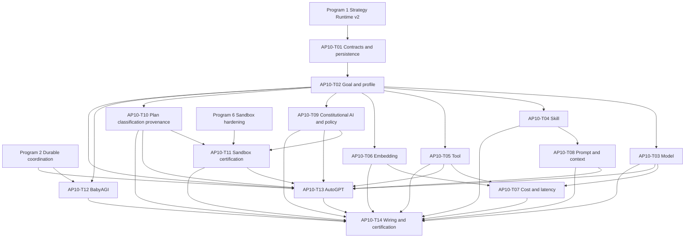

# Agent Pattern Program 10: Routing, Safety, and Optimization Implementation Plan

> **For agentic workers:** REQUIRED SUB-SKILL: use `superpowers:subagent-driven-development`
> or `superpowers:executing-plans` to execute this plan task by task. Every implementation task
> starts with a failing test and uses checkbox (`- [ ]`) tracking.

**Goal:** Complete the canonical production path for goal/profile classification, model/tool/
skill/embedding routing, trust-aware dispatch, cost/latency/token/context optimization,
Constitutional AI, compiled policy, plan verification, data classification, provenance,
sandbox certification, BabyAGI, and AutoGPT.

**Architecture:** Add a typed `routing_runtime` decision pipeline around the existing
orchestration, AI router, selectors, policy runtime, plan runtime, provenance, and sandbox
modules. `RuntimeProfileBuilder` remains the entry point before `AgentGraph` construction;
every downstream selector consumes the same immutable profile and policy envelope, and every
selection is persisted as tenant-scoped evidence. BabyAGI and AutoGPT are bounded Strategy
Runtime v2 adapters: they use canonical work items/checkpoints and governed `AgentGraph`
execution rather than unrestricted loops.

**Tech Stack:** Python 3.12, FastAPI, Pydantic v2, SQLAlchemy 2 async, asyncpg,
PostgreSQL/pgvector, Redis, LangGraph, Celery, MCP, pytest, Ruff, mypy.

---

## Planning Assumptions

- Program 1 provides `StrategySpec`, `StrategyExecutionRequest`, `StrategyExecutionResult`,
  `StrategyCheckpoint`, `PatternLimits`, `ReadinessProbe`, `CertificationEvidence`, and the
  canonical `StrategyRunner` in `agent-verse-backend/app/orchestration/strategy_runner.py`.
- Program 2 provides durable `strategy_executions`, `work_items`, coordination events,
  checkpoints, cancellation, idempotency, and outbox delivery.
- Program 6 owns sandbox implementation and hardening. This program owns production-path
  readiness probes and certification evidence for routing a strategy into that sandbox.
- Programs 01-04 own revisions `0096` through `0099`; Programs 05-06 add no schema revision.
  Program 07 owns `0100`, Program 08 owns `0101`, and Program 09 owns
  `0102_camel_generative_swarm_auction`. This plan creates
  `0103_routing_safety_optimization` with
  `down_revision = "0102_camel_generative_swarm_auction"`. The runtime work depends only on
  Programs 1, 2, and 6; the Program 9 dependency is migration ordering, not behavior coupling.
- Program 11 follows this plan at `0104_memory_learning`; implementations must not create a
  competing Alembic head.
- PostgreSQL is authoritative. In-memory registries may cache accepted state but may not be
  the sole source for routing decisions, health, trust, experiments, or certification.
- Public API, OpenAPI, SDK, frontend, and broad operator UX changes are deferred to Program 13.
  This plan may extend internal goal/profile data consumed by those later surfaces.
- Existing `app/civilization/constitution.py` remains civilization governance. It is not the
  Constitutional AI critique/revision adapter created here.
- No implementation task may expose private chain-of-thought. Persist safe rationale,
  candidates, scores, policy findings, evidence references, and rejected alternatives only.
- Implementation agents must not commit unless the delivery owner separately requests it.

## Source Final Documents

- Approved design: `docs/superpowers/specs/2026-08-03-agent-pattern-completion-program-design.md`
- Repository guidance: `AGENTS.md`, `CLAUDE.md`
- Existing orchestration: `agent-verse-backend/app/orchestration/runtime_profile_builder.py`,
  `agent-verse-backend/app/orchestration/goal_classifier.py`,
  `agent-verse-backend/app/orchestration/pattern_selector.py`,
  `agent-verse-backend/app/orchestration/runtime_profile.py`
- Existing routers/selectors: `agent-verse-backend/app/agent/model_router.py`,
  `agent-verse-backend/app/ai_router/router.py`,
  `agent-verse-backend/app/agent/router.py`,
  `agent-verse-backend/app/agent/skill_selector.py`,
  `agent-verse-backend/app/agent/tool_selector.py`,
  `agent-verse-backend/app/tool_runtime/tool_ranker.py`,
  `agent-verse-backend/app/embedding/router.py`
- Existing optimization/safety: `agent-verse-backend/app/agent/prompt_compressor.py`,
  `agent-verse-backend/app/context/context_budget.py`,
  `agent-verse-backend/app/plan_runtime/plan_verifier.py`,
  `agent-verse-backend/app/policy_runtime/compiler.py`,
  `agent-verse-backend/app/data_classification/classifier.py`,
  `agent-verse-backend/app/provenance/provenance_verifier.py`,
  `agent-verse-backend/app/sandbox_runtime/`,
  `agent-verse-backend/app/execution_environment/`
- Existing persistence: `agent-verse-backend/app/db/models/orchestration.py`,
  `agent-verse-backend/app/db/migrations/versions/0087_add_orchestration_tables.py`,
  `agent-verse-backend/app/db/migrations/versions/0095_raft_lifecycle.py`
- Existing focused tests: `agent-verse-backend/tests/orchestration/`,
  `agent-verse-backend/tests/ai_router/`, `agent-verse-backend/tests/agent/`,
  `agent-verse-backend/tests/policy_runtime/`,
  `agent-verse-backend/tests/data_classification/`,
  `agent-verse-backend/tests/provenance/`,
  `agent-verse-backend/tests/sandbox_runtime/`

## Epics

| Epic | Title | Outcome |
|---|---|---|
| AP10-E1 | Canonical routing evidence | One typed, persisted, tenant-scoped decision contract for all selectors. |
| AP10-E2 | Profile and resource routing | Goal, strategy, agent, model, skill, tool, and embedding selections use live constraints. |
| AP10-E3 | Closed-loop optimization | Actual quality, cost, latency, saturation, and token outcomes influence bounded future choices. |
| AP10-E4 | Pre-execution safety | Classification, compiled policy, plan verification, Constitutional AI, provenance, and sandbox readiness fail closed. |
| AP10-E5 | Long-horizon controllers | BabyAGI and AutoGPT execute through Strategy Runtime v2 with durable limits and checkpoints. |
| AP10-E6 | Production certification | Restart, RLS, policy, budget, cancellation, observability, and canary evidence controls registry state. |

## Workstreams

| Workstream | Tasks | Parallelism |
|---|---|---|
| Contracts and persistence | AP10-T01 | First; blocks all workstreams. |
| Goal/profile and routing | AP10-T02 through AP10-T06 | T03-T06 can run in parallel after T02 contracts stabilize. |
| Optimization | AP10-T07 and AP10-T08 | Parallel after T03-T06. |
| Safety | AP10-T09 through AP10-T11 | T09 and T10 parallel; T11 follows both and Program 6. |
| Controllers | AP10-T12 and AP10-T13 | Parallel after T02 and Program 2. |
| Wiring/certification | AP10-T14 | Last; consumes every prior task. |

## Task Breakdown

### AP10-T01: Define routing contracts and tenant-scoped decision persistence

**Files:**

- Create: `agent-verse-backend/app/routing_runtime/__init__.py`
- Create: `agent-verse-backend/app/routing_runtime/contracts.py`
- Create: `agent-verse-backend/app/routing_runtime/decision_store.py`
- Create: `agent-verse-backend/app/db/models/routing.py`
- Modify: `agent-verse-backend/app/db/models/__init__.py`
- Create: `agent-verse-backend/app/db/migrations/versions/0103_routing_safety_optimization.py`
- Create: `agent-verse-backend/tests/routing_runtime/test_contracts.py`
- Create: `agent-verse-backend/tests/routing_runtime/test_decision_store_integration.py`
- Modify: `agent-verse-backend/tests/db/test_rls.py`

**Typed contracts:**

| Contract | Required fields |
|---|---|
| `RoutingSignalSet` | `task_shape`, `complexity`, `risk`, `freshness`, `requires_code`, `requires_collaboration`, `required_capabilities`, `data_classes`, `deadline_ms`, `max_cost_usd`, `max_tokens`, `tenant_plan`, `profile_version` |
| `RoutingCandidate` | `candidate_id`, `candidate_version`, `provider`, `capabilities`, `readiness`, `trust_score`, `quality_score`, `estimated_cost_usd`, `estimated_latency_ms`, `saturation`, `policy_allowed`, `rejection_reasons` |
| `RoutingDecision` | `decision_id`, `tenant_id`, `goal_id`, `execution_id`, `category`, `signals`, `candidates`, `selected_candidate_id`, `fallback_chain`, `safe_rationale`, `policy_trace`, `created_at` |
| `OptimizationOutcome` | `decision_id`, `success`, `quality_score`, `actual_cost_usd`, `actual_latency_ms`, `prompt_tokens`, `completion_tokens`, `fallback_used`, `recorded_at` |

**Migration contract:**

- Create `routing_decisions` with string UUID primary key, tenant/goal/execution identifiers,
  decision category, profile version, JSONB signals/candidates/fallback/policy trace, selected
  candidate/version, safe rationale, and timestamp.
- Create `routing_outcomes` with a foreign key to `routing_decisions`, tenant ID, quality,
  success, actual cost/latency/tokens, fallback flag, error class, and timestamp.
- Add checks for category membership and non-negative cost/latency/token values.
- Add indexes `idx_routing_decisions_tenant_goal_created`,
  `idx_routing_decisions_tenant_category_created`, and
  `idx_routing_outcomes_tenant_decision_recorded`.
- Enable and force RLS on both tables. Create policies with
  `USING (tenant_id = current_setting('app.tenant_id', TRUE))` and the same `WITH CHECK`.
- Downgrade drops policies, tables, indexes, and model exports in reverse dependency order.

- [ ] **Write failing contract, migration, round-trip, and cross-tenant denial tests.**
- [ ] **Run the red tests:**

```bash
cd agent-verse-backend
uv run pytest tests/routing_runtime/test_contracts.py \
  tests/routing_runtime/test_decision_store_integration.py tests/db/test_rls.py -q --no-cov
```

Expected: collection fails because `app.routing_runtime` and revision
`0103_routing_safety_optimization` do not exist.

- [ ] **Implement the contracts, migration, RLS policies, ORM models, and async store.**
- [ ] **Run the green tests and static checks:**

```bash
cd agent-verse-backend
uv run alembic upgrade head
uv run pytest tests/routing_runtime/test_contracts.py \
  tests/routing_runtime/test_decision_store_integration.py tests/db/test_rls.py -q --no-cov
uv run ruff check app/routing_runtime app/db/models/routing.py \
  app/db/migrations/versions/0103_routing_safety_optimization.py tests/routing_runtime
uv run mypy app/routing_runtime app/db/models/routing.py
```

Expected: Alembic reports upgrade through `0103_routing_safety_optimization`; focused tests
pass; Ruff and mypy exit 0.

### AP10-T02: Complete goal classification and make one profile authoritative

**Files:**

- Modify: `agent-verse-backend/app/orchestration/runtime_profile.py`
- Modify: `agent-verse-backend/app/orchestration/goal_classifier.py`
- Modify: `agent-verse-backend/app/orchestration/runtime_profile_builder.py`
- Modify: `agent-verse-backend/app/orchestration/pattern_selector.py`
- Modify: `agent-verse-backend/app/agent/goal_classifier.py`
- Modify: `agent-verse-backend/app/agent/graph.py`
- Modify: `agent-verse-backend/app/services/goal_service.py`
- Modify: `agent-verse-backend/tests/orchestration/test_goal_classifier.py`
- Create: `agent-verse-backend/tests/orchestration/test_authoritative_runtime_profile.py`

**Required behavior:** classify task shape, risk, freshness, generated-code need,
collaboration need, estimated cost/token pressure, deadline, reversibility, and capability
requirements; run the LLM refinement for low-confidence ambiguous goals; persist one versioned
profile before graph construction; pass it into `AgentGraph`; record selected/rejected strategy
compatibility; remove production use of the duplicate agent classifier while retaining a
compatibility adapter for existing imports.

- [ ] **Add failing tests for every signal, low-confidence refinement, incompatible strategy rejection, persisted profile version, and no graph-time rebuild.**
- [ ] **Run:**

```bash
cd agent-verse-backend
uv run pytest tests/orchestration/test_goal_classifier.py \
  tests/orchestration/test_authoritative_runtime_profile.py \
  tests/agent/test_goal_classifier_doc4.py -q --no-cov
```

Expected: new signal fields or authoritative-profile assertions fail.

- [ ] **Implement the minimal profile changes and compatibility adapter.**
- [ ] **Verify:**

```bash
cd agent-verse-backend
uv run pytest tests/orchestration/test_goal_classifier.py \
  tests/orchestration/test_authoritative_runtime_profile.py \
  tests/agent/test_goal_classifier_doc4.py tests/agent/test_router_wiring.py -q --no-cov
uv run ruff check app/orchestration app/agent/goal_classifier.py \
  tests/orchestration/test_authoritative_runtime_profile.py
uv run mypy app/orchestration app/agent/goal_classifier.py
```

Expected: all focused tests pass and a recording builder proves exactly one profile build per
goal execution.

### AP10-T03: Unify model routing with health, cost, latency, and fallback

**Files:**

- Create: `agent-verse-backend/app/routing_runtime/model_router.py`
- Modify: `agent-verse-backend/app/ai_router/router.py`
- Modify: `agent-verse-backend/app/ai_router/models.py`
- Modify: `agent-verse-backend/app/ai_router/registry.py`
- Modify: `agent-verse-backend/app/agent/model_router.py`
- Modify: `agent-verse-backend/app/providers/registry.py`
- Modify: `agent-verse-backend/app/agent/graph.py`
- Create: `agent-verse-backend/tests/routing_runtime/test_model_router.py`
- Modify: `agent-verse-backend/tests/ai_router/test_model_router_integration.py`
- Modify: `agent-verse-backend/tests/agent/test_model_router.py`

**Required behavior:** one async router accepts role, capabilities, data classes, quality floor,
budget, deadline, and tenant policy; excludes unavailable/circuit-open/incompatible models;
ranks by bounded quality/cost/p95 latency/saturation weights; returns a typed fallback chain;
records every decision and outcome; and presents the old `ModelRouter.model_for*` API as a thin
adapter without static provider defaults controlling production selection.

- [ ] **Write failing tests for role routing, p95 deadline exclusion, health/saturation, cost ceiling, structured/tool/vision capabilities, policy denial, deterministic tie-breaks, and fallback.**
- [ ] **Run:**

```bash
cd agent-verse-backend
uv run pytest tests/routing_runtime/test_model_router.py \
  tests/ai_router/test_model_router_integration.py tests/agent/test_model_router.py -q --no-cov
```

Expected: canonical async router import fails or static routing violates live constraints.

- [ ] **Implement and wire the canonical router.**
- [ ] **Verify:**

```bash
cd agent-verse-backend
uv run pytest tests/routing_runtime/test_model_router.py \
  tests/ai_router/test_model_router_integration.py tests/agent/test_model_router.py \
  tests/agent/test_model_router_comprehensive.py -q --no-cov
uv run ruff check app/routing_runtime/model_router.py app/ai_router app/agent/model_router.py
uv run mypy app/routing_runtime/model_router.py app/ai_router app/agent/model_router.py
```

Expected: all tests pass; a deadline-constrained test selects the lowest eligible p95 model,
and a circuit-open model is present only in rejected alternatives.

### AP10-T04: Add semantic, versioned, trusted, policy-intersected skill routing

**Files:**

- Create: `agent-verse-backend/app/routing_runtime/skill_router.py`
- Modify: `agent-verse-backend/app/agent/skill_selector.py`
- Modify: `agent-verse-backend/app/db/models/skill.py`
- Modify: `agent-verse-backend/app/api/skills_runtime.py`
- Modify: `agent-verse-backend/app/agent/graph.py`
- Create: `agent-verse-backend/tests/routing_runtime/test_skill_router.py`
- Modify: `agent-verse-backend/tests/api/test_skills_api.py`

**Required behavior:** retrieve candidate skill versions semantically, reject inactive or
uncertified versions, combine semantic applicability with trust/effectiveness, intersect every
skill tool allowlist with compiled runtime policy, respect context token budget, persist
selected/rejected versions and provenance, and fail closed when a selected skill requests a
denied capability.

- [ ] **Write failing semantic-match, version, trust, policy intersection, token budget, tenant isolation, and deterministic tie-break tests.**
- [ ] **Run:**

```bash
cd agent-verse-backend
uv run pytest tests/routing_runtime/test_skill_router.py \
  tests/api/test_skills_api.py -q --no-cov
```

Expected: semantic and policy-aware assertions fail against keyword-only selection.

- [ ] **Implement the canonical skill router and preserve `SkillSelector.select()` as a compatibility wrapper.**
- [ ] **Verify:**

```bash
cd agent-verse-backend
uv run pytest tests/routing_runtime/test_skill_router.py \
  tests/api/test_skills_api.py -q --no-cov
uv run ruff check app/routing_runtime/skill_router.py app/agent/skill_selector.py \
  app/api/skills_runtime.py tests/routing_runtime/test_skill_router.py
uv run mypy app/routing_runtime/skill_router.py app/agent/skill_selector.py
```

Expected: tests pass and denied tools never appear in selected skill context.

### AP10-T05: Wire semantic and trust-weighted tool ranking into governed dispatch

**Files:**

- Create: `agent-verse-backend/app/routing_runtime/tool_router.py`
- Modify: `agent-verse-backend/app/agent/tool_selector.py`
- Modify: `agent-verse-backend/app/tool_runtime/tool_ranker.py`
- Modify: `agent-verse-backend/app/tool_runtime/tool_score.py`
- Modify: `agent-verse-backend/app/memory/tool_reliability.py`
- Modify: `agent-verse-backend/app/agent/graph.py`
- Create: `agent-verse-backend/tests/routing_runtime/test_tool_router.py`
- Modify: `agent-verse-backend/tests/api/test_tools_router.py`

**Required behavior:** rank only policy-allowed tools using semantic relevance, tenant-local
reliability, certification/readiness, data-class compatibility, cost, latency, and connector
health; preserve full/signature/name-only prompt tiers; reauthorize the chosen tool immediately
before dispatch; record trust inputs and outcomes; never treat a selector exception as
permission to expose all tools.

- [ ] **Write failing trust-ranker wiring, stale-health, tenant isolation, denied-tool, fallback, and pre-dispatch reauthorization tests.**
- [ ] **Run:**

```bash
cd agent-verse-backend
uv run pytest tests/routing_runtime/test_tool_router.py tests/api/test_tools_router.py -q --no-cov
```

Expected: existing selector does not consume `ToolRanker` trust records or fail closed.

- [ ] **Implement the canonical tool router and governed dispatch integration.**
- [ ] **Verify:**

```bash
cd agent-verse-backend
uv run pytest tests/routing_runtime/test_tool_router.py tests/api/test_tools_router.py \
  tests/memory/test_all_memory_types.py -q --no-cov
uv run ruff check app/routing_runtime/tool_router.py app/agent/tool_selector.py \
  app/tool_runtime app/memory/tool_reliability.py
uv run mypy app/routing_runtime/tool_router.py app/agent/tool_selector.py app/tool_runtime
```

Expected: tests pass; a high-semantic/low-trust tool loses to an eligible trusted candidate,
and policy denial produces no dispatch.

### AP10-T06: Complete content/query-aware embedding routing

**Files:**

- Create: `agent-verse-backend/app/routing_runtime/embedding_router.py`
- Modify: `agent-verse-backend/app/embedding/router.py`
- Modify: `agent-verse-backend/app/embedding/dimension_policy.py`
- Modify: `agent-verse-backend/app/embedding/vector_index_policy.py`
- Modify: `agent-verse-backend/app/ingestion/embedding_policy_selector.py`
- Create: `agent-verse-backend/tests/routing_runtime/test_embedding_router.py`
- Modify: `agent-verse-backend/tests/embedding/test_embedding_orchestrator.py`

**Required behavior:** route by document/query/image type, language, required dimension,
collection compatibility, quality floor, cost, p95 latency, provider health, and tenant policy;
reject dimension mismatch before provider invocation; return typed degraded lexical behavior
only where the caller contract permits it; record model/version and fallback evidence.

- [ ] **Write failing content/query, dimension, health, cost, latency, and lexical-degradation tests.**
- [ ] **Run:**

```bash
cd agent-verse-backend
uv run pytest tests/routing_runtime/test_embedding_router.py \
  tests/embedding/test_embedding_orchestrator.py -q --no-cov
```

Expected: current router requires caller-selected provider/model and cannot satisfy typed routing.

- [ ] **Implement the canonical router and compatibility wrapper.**
- [ ] **Verify:**

```bash
cd agent-verse-backend
uv run pytest tests/routing_runtime/test_embedding_router.py \
  tests/embedding/test_embedding_orchestrator.py -q --no-cov
uv run ruff check app/routing_runtime/embedding_router.py app/embedding \
  app/ingestion/embedding_policy_selector.py
uv run mypy app/routing_runtime/embedding_router.py app/embedding
```

Expected: tests pass; incompatible dimensions fail before provider calls; allowed degraded
results identify `lexical` explicitly.

### AP10-T07: Close the cost and latency feedback loop

**Files:**

- Create: `agent-verse-backend/app/routing_runtime/optimizer.py`
- Modify: `agent-verse-backend/app/optimization/cost_optimizer.py`
- Modify: `agent-verse-backend/app/optimization/latency_optimizer.py`
- Modify: `agent-verse-backend/app/optimization/model_optimizer.py`
- Modify: `agent-verse-backend/app/intelligence/cost_optimizer.py`
- Modify: `agent-verse-backend/app/intelligence/cost_tracker.py`
- Modify: `agent-verse-backend/app/ai_router/provider_health_policy.py`
- Create: `agent-verse-backend/tests/routing_runtime/test_optimizer.py`
- Modify: `agent-verse-backend/tests/optimization/test_optimizer_implementations.py`

**Required behavior:** aggregate actual outcomes by tenant, goal shape, role, and candidate;
maintain bounded rolling p50/p95/p99 latency and cost/quality summaries; enforce minimum sample
and exploration floors; use deadline-aware hedging only for idempotent model calls with remaining
budget; include saturation and outbox/worker pressure; prohibit an optimization from weakening
policy, quality floor, or hard budget.

- [ ] **Write failing outcome, percentile, minimum-sample, exploration, hedging, saturation, and hard-limit tests.**
- [ ] **Run:**

```bash
cd agent-verse-backend
uv run pytest tests/routing_runtime/test_optimizer.py \
  tests/optimization/test_optimizer_implementations.py -q --no-cov
```

Expected: existing optimizers use in-memory averages or static estimates and fail percentile/
persistence assertions.

- [ ] **Implement the persisted bounded optimizer and feed recommendations into routers.**
- [ ] **Verify:**

```bash
cd agent-verse-backend
uv run pytest tests/routing_runtime/test_optimizer.py tests/optimization \
  tests/intelligence/test_cost_optimizer.py -q --no-cov
uv run ruff check app/routing_runtime/optimizer.py app/optimization \
  app/intelligence/cost_optimizer.py app/intelligence/cost_tracker.py
uv run mypy app/routing_runtime/optimizer.py app/optimization
```

Expected: tests pass and optimization never selects a candidate outside policy, budget,
deadline, or quality constraints.

### AP10-T08: Make prompt compression and context budgeting canonical and fidelity-safe

**Files:**

- Create: `agent-verse-backend/app/context/prompt_budget.py`
- Modify: `agent-verse-backend/app/context/context_budget.py`
- Modify: `agent-verse-backend/app/agent/prompt_compressor.py`
- Modify: `agent-verse-backend/app/agent/tokenizer.py`
- Modify: `agent-verse-backend/app/agent/graph.py`
- Modify: `agent-verse-backend/app/state_runtime/state_context.py`
- Create: `agent-verse-backend/tests/context/test_prompt_budget.py`
- Modify: `agent-verse-backend/tests/agent/test_prompt_compressor.py`

**Typed budget partitions:** `instructions`, `current_plan`, `working_memory`, `reflexion`,
`long_term_memory`, `episodic_memory`, `procedural_memory`, `retrieval`, `tool_schemas`,
`conversation`, and `reserved_output`.

**Required behavior:** use exact tokenizer counts; allocate by profile and policy; never truncate
JSON schemas, policy instructions, approvals, provenance, or current-plan dependencies; compress
eligible memory/retrieval blocks with source references; evaluate required-fact fidelity; fall
back to uncompressed content or reject over-budget requests; persist budget/compression evidence
and token savings.

- [ ] **Write failing partition, exact-token, immutable-block, fidelity, fallback, and provenance tests.**
- [ ] **Run:**

```bash
cd agent-verse-backend
uv run pytest tests/context/test_prompt_budget.py \
  tests/agent/test_prompt_compressor.py -q --no-cov
```

Expected: character approximation and heuristic truncation violate partition/fidelity assertions.

- [ ] **Implement canonical budgeting and replace broad graph compression with typed blocks.**
- [ ] **Verify:**

```bash
cd agent-verse-backend
uv run pytest tests/context/test_prompt_budget.py tests/agent/test_prompt_compressor.py \
  tests/agent/test_agent_graph.py -q --no-cov
uv run ruff check app/context/prompt_budget.py app/context/context_budget.py \
  app/agent/prompt_compressor.py app/agent/tokenizer.py
uv run mypy app/context/prompt_budget.py app/context/context_budget.py \
  app/agent/prompt_compressor.py
```

Expected: tests pass; required policy/provenance facts survive compression; over-budget requests
produce a typed rejection rather than silent truncation.

### AP10-T09: Add Constitutional AI critique/revision and deny-by-default policy compilation

**Files:**

- Create: `agent-verse-backend/app/agent/patterns/constitutional_ai.py`
- Modify: `agent-verse-backend/app/agent/patterns/__init__.py`
- Modify: `agent-verse-backend/app/orchestration/strategy_registry.py`
- Modify: `agent-verse-backend/app/policy_runtime/constraint_model.py`
- Modify: `agent-verse-backend/app/policy_runtime/compiler.py`
- Modify: `agent-verse-backend/app/policy_runtime/runtime_enforcer.py`
- Modify: `agent-verse-backend/app/policy_runtime/policy_trace.py`
- Create: `agent-verse-backend/tests/agent/patterns/test_constitutional_ai.py`
- Modify: `agent-verse-backend/tests/policy_runtime/test_policy_runtime.py`

**Required behavior:** compile tenant policy, profile risk, data classes, connector/tool allowlists,
budgets, deadline, and HITL into immutable constraints; unspecified capabilities are denied;
validate contradictory declarations; run a bounded critique/revision pass for eligible model
outputs; preserve the original and revised safe summaries plus principle IDs; never let revision
override deterministic policy or authorize a denied action.

- [ ] **Write failing deny-by-default, conflict, critique/revision, bounded-call, no-private-reasoning, and deterministic-governance precedence tests.**
- [ ] **Run:**

```bash
cd agent-verse-backend
uv run pytest tests/agent/patterns/test_constitutional_ai.py \
  tests/policy_runtime/test_policy_runtime.py -q --no-cov
```

Expected: adapter import fails and empty `allowed_capabilities` does not provide an explicit
deny-by-default contract.

- [ ] **Implement the adapter and strict compiler/enforcer behavior.**
- [ ] **Verify:**

```bash
cd agent-verse-backend
uv run pytest tests/agent/patterns/test_constitutional_ai.py \
  tests/policy_runtime/test_policy_runtime.py tests/governance/test_policy_isolation.py -q --no-cov
uv run ruff check app/agent/patterns/constitutional_ai.py app/policy_runtime
uv run mypy app/agent/patterns/constitutional_ai.py app/policy_runtime
```

Expected: tests pass; critique cannot turn a denied action into an allowed action.

### AP10-T10: Enforce plan verification, data classification, and claim-level provenance

**Files:**

- Modify: `agent-verse-backend/app/plan_runtime/plan_verifier.py`
- Modify: `agent-verse-backend/app/plan_runtime/plan_trace.py`
- Modify: `agent-verse-backend/app/data_classification/classifier.py`
- Modify: `agent-verse-backend/app/data_classification/schema.py`
- Modify: `agent-verse-backend/app/data_classification/redaction.py`
- Modify: `agent-verse-backend/app/provenance/claim_trace.py`
- Modify: `agent-verse-backend/app/provenance/provenance_verifier.py`
- Modify: `agent-verse-backend/app/agent/graph.py`
- Create: `agent-verse-backend/tests/plan_runtime/test_pre_execution_gate.py`
- Modify: `agent-verse-backend/tests/data_classification/test_data_classification.py`
- Modify: `agent-verse-backend/tests/provenance/test_provenance_ledger.py`

**Required behavior:** classify before model calls, context messages, artifacts, handoffs, and
memory writes; verify plan feasibility, dependencies, capabilities, permissions, policy, data
classes, estimated cost, deadline, sandbox requirement, and HITL before execution; verify every
material output claim against evidence references; quarantine unsupported/conflicting claims;
return safe structured findings and never private reasoning.

- [ ] **Write failing boundary-classification, plan gate, unsupported-claim, conflicting-source, HITL, budget, and no-execution-on-denial tests.**
- [ ] **Run:**

```bash
cd agent-verse-backend
uv run pytest tests/plan_runtime/test_pre_execution_gate.py \
  tests/data_classification/test_data_classification.py \
  tests/provenance/test_provenance_ledger.py -q --no-cov
```

Expected: existing verifier omits permissions/context from serialization and is not a mandatory
pre-execution gate.

- [ ] **Implement the composite gate and graph wiring.**
- [ ] **Verify:**

```bash
cd agent-verse-backend
uv run pytest tests/plan_runtime/test_pre_execution_gate.py \
  tests/data_classification/test_data_classification.py \
  tests/provenance/test_provenance_ledger.py tests/agent/test_agent_graph.py -q --no-cov
uv run ruff check app/plan_runtime app/data_classification app/provenance
uv run mypy app/plan_runtime app/data_classification app/provenance
```

Expected: tests pass and a denied plan produces zero executor/tool calls.

### AP10-T11: Certify the canonical sandbox production path

**Dependencies:** AP10-T09, AP10-T10, and Program 6.

**Files:**

- Create: `agent-verse-backend/app/sandbox_runtime/certification.py`
- Modify: `agent-verse-backend/app/sandbox_runtime/executor.py`
- Modify: `agent-verse-backend/app/sandbox_runtime/profile.py`
- Modify: `agent-verse-backend/app/execution_environment/scheduler.py`
- Modify: `agent-verse-backend/app/orchestration/strategy_registry.py`
- Create: `agent-verse-backend/tests/sandbox_runtime/test_sandbox_certification.py`
- Modify: `agent-verse-backend/tests/sandbox_runtime/test_sandbox_runtime.py`
- Modify: `agent-verse-backend/tests/execution_environment/test_policy.py`

**Certification evidence:** readiness, exact-host network policy, filesystem/process/package/
secret denial, CPU/memory/time/output caps, cancellation, artifact sanitation, audit correlation,
restart behavior, and canonical Program-of-Thought/CodeAct production paths.

- [ ] **Write failing readiness and evidence tests; include unavailable-sandbox fail-closed behavior.**
- [ ] **Run:**

```bash
cd agent-verse-backend
uv run pytest tests/sandbox_runtime/test_sandbox_certification.py \
  tests/sandbox_runtime/test_sandbox_runtime.py \
  tests/execution_environment/test_policy.py -q --no-cov
```

Expected: certification evidence module is absent or registry status can overstate readiness.

- [ ] **Implement readiness probes and evidence-backed registry transitions without duplicating Program 6 sandbox controls.**
- [ ] **Verify:**

```bash
cd agent-verse-backend
uv run pytest tests/sandbox_runtime/test_sandbox_certification.py \
  tests/sandbox_runtime/test_sandbox_runtime.py tests/execution_environment -q --no-cov
uv run ruff check app/sandbox_runtime app/execution_environment/scheduler.py
uv run mypy app/sandbox_runtime app/execution_environment/scheduler.py
```

Expected: tests pass; absent runtime keeps PoT/CodeAct unavailable; passing all evidence permits
`certified` status.

### AP10-T12: Implement bounded durable BabyAGI

**Files:**

- Create: `agent-verse-backend/app/agent/patterns/babyagi.py`
- Modify: `agent-verse-backend/app/agent/patterns/__init__.py`
- Modify: `agent-verse-backend/app/orchestration/strategy_registry.py`
- Create: `agent-verse-backend/tests/agent/patterns/test_babyagi.py`
- Create: `agent-verse-backend/tests/agent/patterns/test_babyagi_integration.py`

**State contract:** objective, ordered durable work-item IDs, completed IDs, dedupe fingerprints,
next priority, iteration count, cumulative cost/tokens, deadline, checkpoint cursor, terminal
reason, and evidence references.

**Required behavior:** create tasks from unmet objective evidence; validate dependencies and
policy; deduplicate semantically and by idempotency key; prioritize deterministically; execute
one task through governed `AgentGraph`; verify before completion; checkpoint each transition;
stop on satisfaction, max tasks/iterations/cost/tokens/duration, cancellation, repeated no
progress, or policy denial.

- [ ] **Write failing creation, prioritization, dedupe, checkpoint/resume, duplicate delivery, bounded-stop, cancellation, and objective-completion tests.**
- [ ] **Run:**

```bash
cd agent-verse-backend
uv run pytest tests/agent/patterns/test_babyagi.py \
  tests/agent/patterns/test_babyagi_integration.py -q --no-cov
```

Expected: import fails because the BabyAGI adapter does not exist.

- [ ] **Implement against Program 1/2 contracts; do not add an independent loop or task table.**
- [ ] **Verify:**

```bash
cd agent-verse-backend
uv run pytest tests/agent/patterns/test_babyagi.py \
  tests/agent/patterns/test_babyagi_integration.py -q --no-cov
uv run ruff check app/agent/patterns/babyagi.py tests/agent/patterns/test_babyagi.py
uv run mypy app/agent/patterns/babyagi.py
```

Expected: tests pass; restart resumes from the accepted work-item cursor and duplicate delivery
does not execute a task twice.

### AP10-T13: Implement governed AutoGPT as a long-horizon controller

**Files:**

- Create: `agent-verse-backend/app/agent/patterns/autogpt.py`
- Modify: `agent-verse-backend/app/agent/patterns/__init__.py`
- Modify: `agent-verse-backend/app/orchestration/strategy_registry.py`
- Create: `agent-verse-backend/tests/agent/patterns/test_autogpt.py`
- Create: `agent-verse-backend/tests/agent/patterns/test_autogpt_integration.py`

**State contract:** goal, approved plan revision, current step/work item, observations references,
artifacts, memory references, replans, progress fingerprint, limits consumed, checkpoint cursor,
and terminal reason.

**Required behavior:** use Strategy Runtime lifecycle and `AgentGraph`; freeze and verify each
plan revision; route all tools through AP10-T05; route code through the certified sandbox;
classify observations before reuse; use bounded memory recall; replan only on typed evidence;
detect repeated plans/observations; require HITL for authority changes; propagate cancellation;
and stop on all `PatternLimits`.

- [ ] **Write failing plan-gate, tool-policy, sandbox, stagnation, replan, HITL, checkpoint/resume, cancellation, and hard-limit tests.**
- [ ] **Run:**

```bash
cd agent-verse-backend
uv run pytest tests/agent/patterns/test_autogpt.py \
  tests/agent/patterns/test_autogpt_integration.py -q --no-cov
```

Expected: import fails because the AutoGPT adapter does not exist.

- [ ] **Implement as a Strategy Runtime controller without unrestricted recursive execution.**
- [ ] **Verify:**

```bash
cd agent-verse-backend
uv run pytest tests/agent/patterns/test_autogpt.py \
  tests/agent/patterns/test_autogpt_integration.py -q --no-cov
uv run ruff check app/agent/patterns/autogpt.py tests/agent/patterns/test_autogpt.py
uv run mypy app/agent/patterns/autogpt.py
```

Expected: tests pass; all terminal paths identify a bounded reason and no direct tool/provider
bypass is observed.

### AP10-T14: Wire services, observability, migration tests, and certification gates

**Files:**

- Modify: `agent-verse-backend/app/main.py`
- Modify: `agent-verse-backend/app/main_services.py`
- Modify: `agent-verse-backend/app/observability/metrics.py`
- Modify: `agent-verse-backend/app/observability/runtime_decision_trace.py`
- Modify: `agent-verse-backend/app/orchestration/strategy_registry.py`
- Create: `agent-verse-backend/tests/integration/test_routing_safety_production_path.py`
- Create: `agent-verse-backend/tests/integration/test_routing_safety_restart.py`
- Create: `agent-verse-backend/tests/load/test_routing_decision_load.py`
- Modify: `agent-verse-backend/tests/test_main_comprehensive.py`

**Required evidence:** profile selection, candidate/rejection trace, model/tool/skill/embedding
routes, optimizer outcomes, compression fidelity, plan gate, classification, provenance,
sandbox readiness, BabyAGI/AutoGPT checkpoints, cancellation, restart, RLS, duplicate delivery,
metrics, safe logs, and kill switches.

- [ ] **Write failing app-wiring, production-path, restart, RLS, and load tests.**
- [ ] **Run focused red checks:**

```bash
cd agent-verse-backend
uv run pytest tests/integration/test_routing_safety_production_path.py \
  tests/integration/test_routing_safety_restart.py tests/test_main_comprehensive.py -q --no-cov
```

Expected: app state lacks canonical routing services or production-path evidence is incomplete.

- [ ] **Wire in-memory test doubles and lifespan-backed PostgreSQL/Redis services explicitly; add metrics and evidence-derived registry status.**
- [ ] **Run full Program 10 verification:**

```bash
cd agent-verse-backend
uv run pytest tests/routing_runtime tests/orchestration tests/ai_router \
  tests/policy_runtime tests/data_classification tests/provenance \
  tests/sandbox_runtime tests/agent/patterns/test_babyagi.py \
  tests/agent/patterns/test_autogpt.py -q --no-cov
DOCKER_HOST=unix:///Users/harsh.kumar01/.colima/default/docker.sock \
TESTCONTAINERS_RYUK_DISABLED=true \
uv run pytest tests/integration/test_routing_safety_production_path.py \
  tests/integration/test_routing_safety_restart.py -m integration -q --no-cov
uv run pytest tests/load/test_routing_decision_load.py -q --no-cov
uv run ruff check app tests/routing_runtime tests/agent/patterns/test_babyagi.py \
  tests/agent/patterns/test_autogpt.py
uv run mypy app
```

Expected: all commands exit 0; integration tests prove restart/RLS behavior; load test satisfies
the approved p95 routing-decision budget and emits no unbounded candidate growth.

### AP10-T14: Certify Meta-Agent Planner And Generated Configurations

**Files:**
- Modify: `agent-verse-backend/app/intelligence/meta_agent.py`
- Modify: `agent-verse-backend/app/api/agents.py`
- Create: `agent-verse-backend/tests/intelligence/test_meta_agent_certification.py`
- Create: `agent-verse-backend/tests/integration/test_meta_agent_production_path.py`

- [ ] Write failing tests for canonical app wiring, structured generated agent/connector/trigger/autonomy/policy configuration, schema validation, capability/readiness checks, policy compilation, budget ceilings, tenant isolation, unsafe connector rejection, duplicate request idempotency, restart, evidence, and registry-state derivation.
- [ ] Run `cd agent-verse-backend && uv run pytest tests/intelligence/test_meta_agent_certification.py tests/integration/test_meta_agent_production_path.py -q`; expect failures that prove the existing standalone API path is not certified.
- [ ] Validate every generated configuration through Program 01/10 contracts before persistence; never activate generated agents or connectors from raw model output.
- [ ] Run the same command; expect complete production-path and evidence-gate pass before reclassifying `meta_agent_planner`.

### AP10-T15: Define Automatic Strategy Selection Matrix

**Files:**
- Modify: `agent-verse-backend/app/orchestration/pattern_selector.py`
- Modify: `agent-verse-backend/app/orchestration/runtime_profile_builder.py`
- Create: `agent-verse-backend/tests/orchestration/test_advanced_strategy_selection.py`

- [ ] Define eligibility and exclusion rules for Few-Shot CoT, Graph of Thoughts, Least-to-Most, ReWOO, LATS, LLM Compiler, Program of Thought, and CodeAct using task shape, readiness, risk, cost, deadline, sandbox, and tenant ceilings.
- [ ] Test positive selection, rejected alternatives with reason codes, explicit overrides, unready dependencies, deadline/cost exclusions, incompatibility, shadow selection, canary propagation, and exact `StrategyRunner` adapter/version invocation.
- [ ] Run `cd agent-verse-backend && uv run pytest tests/orchestration/test_advanced_strategy_selection.py -q`; expect red failures before implementation and complete pass after.

### AP10-T16: Reclassify And Certify Semantic Cache Ownership

**Files:**
- Modify: `agent-verse-backend/app/orchestration/strategy_registry.py`
- Modify: `agent-verse-backend/app/rag/semantic_cache.py`
- Modify: `agent-verse-backend/app/state_runtime/cache_bridge.py`
- Create: `agent-verse-backend/tests/rag/test_semantic_cache_classification.py`

- [ ] Move `semantic_cache` to optimization ownership and remove the false semantic-memory alias without breaking historical IDs. Preserve tenant keys, similarity policy, TTL, invalidation, provider/model/version compatibility, classification, and cache-specific metrics.
- [ ] Test alias migration, no memory-recall exposure, tenant isolation, stale model/embedding invalidation, data deletion, restart, and runtime-derived capability documentation.
- [ ] Run `cd agent-verse-backend && uv run pytest tests/rag/test_semantic_cache_classification.py -q`; expect failure before reconciliation and pass after.

### AP10-T17: Prove Policy Equivalence And Replay-Safe Decision Persistence

**Files:**
- Modify: `agent-verse-backend/app/policy_runtime/compiler.py`
- Modify: `agent-verse-backend/app/routing_runtime/repository.py`
- Create: `agent-verse-backend/tests/policy_runtime/test_compiler_equivalence.py`
- Create: `agent-verse-backend/tests/routing_runtime/test_decision_idempotency.py`

- [ ] Version and hash source policy and compiled constraints; reject unknown constructs; define conflict precedence; prove restrictive source changes cannot broaden compiled authority; invalidate cached profiles and approval grants after policy changes. Add property-based, differential, mutation, deterministic-serialization, stale-checkpoint, and compiler/enforcer equivalence tests.
- [ ] Add deterministic routing decision IDs keyed by tenant, execution, category, profile version, and decision ordinal; add optimization outcome uniqueness by tenant, decision, attempt, and evaluator version. Test commit-before-response retry and duplicate Celery delivery with insert-on-conflict-return-existing semantics.
- [ ] Run `cd agent-verse-backend && uv run pytest tests/policy_runtime/test_compiler_equivalence.py tests/routing_runtime/test_decision_idempotency.py -q`; expect red failures before implementation and complete pass after.

## Dependency Graph



## Jira Mapping Plan

Use labels `agent-pattern-program`, `program-10`, `routing`, `safety`, `optimization`, and
`backend`. Create one epic per AP10 epic and one story per task.

| Jira type | Title | Dependencies | Acceptance notes |
|---|---|---|---|
| Epic | AP10-E1 Canonical routing evidence | Program 1 | Typed decisions/outcomes persist with RLS and safe rationale. |
| Story | AP10-T01 Define routing contracts and decision persistence | Program 1 | Migration 0096, RLS, indexes, round-trip, cross-tenant denial pass. |
| Story | AP10-T02 Complete authoritative goal runtime profiles | AP10-T01 | One persisted profile is built before graph construction. |
| Story | AP10-T03 Unify model routing | AP10-T02 | Health/cost/p95/saturation/policy and fallback are recorded. |
| Story | AP10-T04 Complete skill routing | AP10-T02 | Semantic versioned selection intersects tool policy and context budget. |
| Story | AP10-T05 Wire trust-aware governed tool routing | AP10-T02 | Trust ranker controls prompt tiers and pre-dispatch authorization. |
| Story | AP10-T06 Complete embedding routing | AP10-T02 | Content/query/dimension/cost/latency compatibility is enforced. |
| Epic | AP10-E3 Closed-loop optimization | AP10-E1, AP10-E2 | Actual outcomes influence bounded choices without weakening hard controls. |
| Story | AP10-T07 Close cost and latency feedback | AP10-T03, T05, T06 | Percentiles, saturation, minimum samples, and hedging tests pass. |
| Story | AP10-T08 Canonicalize prompt and context budgets | AP10-T04 | Exact token partitions and fidelity fallback pass. |
| Epic | AP10-E4 Pre-execution safety | Program 1 | Policy, plan, classification, provenance, and sandbox gates fail closed. |
| Story | AP10-T09 Add Constitutional AI and strict policy compiler | AP10-T02 | Critique/revision cannot override deterministic denial. |
| Story | AP10-T10 Enforce plan, classification, and provenance gate | AP10-T02 | Denied plans execute zero tools; unsupported claims are quarantined. |
| Story | AP10-T11 Certify canonical sandbox path | AP10-T09, T10, Program 6 | Readiness/security/restart evidence controls registry status. |
| Epic | AP10-E5 Long-horizon controllers | Programs 1 and 2 | BabyAGI and AutoGPT are durable, cancellable, policy-bound adapters. |
| Story | AP10-T12 Implement bounded durable BabyAGI | AP10-T02, Program 2 | Task lifecycle, dedupe, limits, resume, and completion tests pass. |
| Story | AP10-T13 Implement governed AutoGPT | AP10-T03, T05, T08-T11 | No direct tool/code bypass; every terminal path is bounded. |
| Story | AP10-T14 Certify Program 10 production paths | All AP10 tasks | Restart, RLS, load, policy, observability, and canary evidence pass. |

## Migration Plan

1. Apply `0103_routing_safety_optimization` after
  `0102_camel_generative_swarm_auction`, with new tables, indexes, checks, forced RLS,
   `USING`, and `WITH CHECK` policies.
2. Deploy code with canonical routers in shadow mode. Persist old and new decisions while old
   selections remain authoritative.
3. Compare selection, quality, cost, p95 latency, fallback, policy denial, and error metrics by
   tenant cohort.
4. Enable authoritative profile, then model, skill, tool, embedding, optimizer, and safety gates
   independently behind tenant allowlists and kill switches.
5. Enable BabyAGI and AutoGPT only after Program 2 checkpoints and Program 6 sandbox evidence
   pass.
6. Promote registry entries from `partial` to `implemented` only after canonical production-path
   tests; promote to `certified` only after restart, security, cost, and canary evidence.
7. Retain compatibility adapters for one stable release; remove static/duplicate production
   paths in a later deprecation plan.

## Test Plan

- Unit: contract validation, scoring, deterministic tie-breaks, budgets, policies, state machines.
- Integration: PostgreSQL migration/RLS, decision persistence, provider/tool/skill readiness,
  checkpoint/resume, duplicate delivery, Redis loss, cancellation.
- Security: cross-tenant reads/writes, policy deny-by-default, prompt injection, classification,
  unsupported claims, sandbox outage and escape controls.
- Performance: routing write p95 below 100 ms excluding provider/model latency; bounded candidate
  sets; exact token budget; deadline propagation.
- Certification: real-provider and real-connector canary runs compare quality/cost/latency with
  legacy baselines and prove kill switches.

## Release Plan

1. Release migration and shadow decision recording.
2. Enable profile/model/embedding routing for internal tenants.
3. Enable skill/tool routing and optimization for low-risk professional-plan cohorts.
4. Enable policy/plan/classification/provenance gates for all cohorts; keep Constitutional AI
   revision separately switchable.
5. Enable certified sandbox routing, then BabyAGI, then AutoGPT for allowlisted tenants.
6. Expand only when quality does not regress, policy denials remain explainable, cost stays
   within plan limits, and p95 latency meets cohort baselines.
7. Program 13 exposes public APIs, SDKs, frontend controls, dashboards, and runbooks after these
   backend contracts stabilize.

## Rollback Plan

- Disable each canonical router or strategy with its independent kill switch; retain persisted
  decisions/outcomes for analysis.
- Restore legacy selection adapters without rebuilding the runtime profile during execution.
- Cancel active BabyAGI/AutoGPT executions through Strategy Runtime; preserve checkpoints for
  operator review and do not replay tool calls automatically.
- Roll back `0103` only before production decision data is accepted. After acceptance, use a
  forward migration to disable/drop fields; never destroy audit evidence during incident
  response.
- Sandbox readiness failure immediately marks code strategies unavailable and fails closed.

## Risks and Blockers

| Risk/blocker | Mitigation |
|---|---|
| Programs 1, 2, or 6 contracts are not final | Block dependent tasks; do not recreate local substitutes. |
| Duplicate routers diverge during rollout | Compatibility adapters delegate to one canonical async router; shadow comparison detects drift. |
| Historical trust/latency creates bias | Minimum samples, confidence bounds, exploration floor, transparent factors, tenant-local records. |
| Optimization amplifies cost or reduces quality | Hard policy/budget/quality constraints are applied before scoring and cannot be optimized away. |
| Compression removes safety/evidence | Immutable partitions, fidelity checks, provenance references, typed rejection/fallback. |
| BabyAGI/AutoGPT create runaway work | Program 1 `PatternLimits`, Program 2 durable work items, stagnation detection, cancellation, kill switches. |
| Sandbox readiness is overstated | Registry status derives from executable readiness and certification evidence only. |
| Migration introduces competing head | Program 10 owns 0103 after Program 9's 0102; Program 11 explicitly descends from 0103. |

## Definition of Done

- [ ] All AP10 tasks and focused TDD checks pass.
- [ ] `0103_routing_safety_optimization` upgrades/downgrades in migration tests and enforces
  forced RLS with both `USING` and `WITH CHECK`.
- [ ] One profile is built and persisted before graph construction; selected/rejected strategies
  are explainable.
- [ ] Model, skill, tool, and embedding routing use typed live constraints and persist outcomes.
- [ ] Trust ranking is wired into governed dispatch with immediate authorization recheck.
- [ ] Cost, p95 latency, saturation, prompt compression, and context budgets operate within hard
  quality/policy/budget limits.
- [ ] Constitutional AI, compiled policy, plan verification, data classification, and provenance
  are mandatory pre-execution/output gates without private reasoning exposure.
- [ ] Sandbox certification is evidence-backed and unavailable paths fail closed.
- [ ] BabyAGI and AutoGPT survive restart, reject duplicate delivery, propagate cancellation, and
  stop on every configured limit.
- [ ] Ruff, mypy, focused tests, integration tests, load tests, and canary gates exit 0.
- [ ] No source code was changed while authoring this plan and no commit was created.
