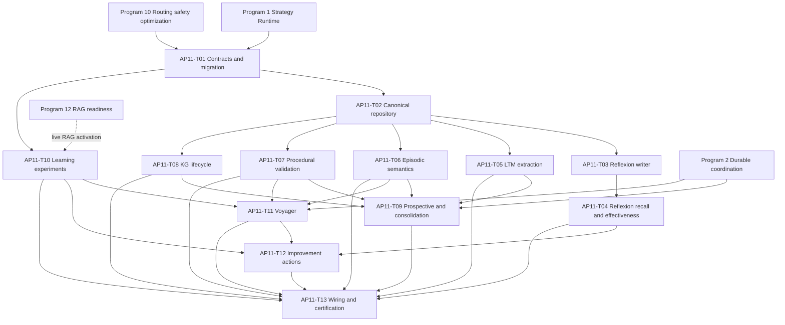

# Agent Pattern Program 11: Memory and Learning Implementation Plan

> **For agentic workers:** REQUIRED SUB-SKILL: use `superpowers:subagent-driven-development`
> or `superpowers:executing-plans` to execute this plan task by task. Every implementation task
> starts with a failing test and uses checkbox (`- [ ]`) tracking.

**Goal:** Complete durable, tenant-safe, evidence-backed memory and learning across Reflexion,
long-term, episodic, procedural, knowledge-graph, prospective, and consolidated memory; finish
governed prompt/model/RAG experiments, Voyager skill learning, and every self-improvement action.

**Architecture:** Introduce one typed async memory contract and PostgreSQL repository boundary
while retaining focused stores as domain services. Reflexion becomes the shared evidence-backed
lesson service with awaited semantic recall and usefulness feedback. Learning actions flow
through a durable experiment/action executor; Voyager synthesizes only validated, versioned
skills and reuses the Program 10 routing/policy/sandbox path.

**Tech Stack:** Python 3.12, FastAPI, Pydantic v2, SQLAlchemy 2 async, asyncpg,
PostgreSQL/pgvector, Redis, Celery, LangGraph, MCP, pytest, Ruff, mypy.

---

## Planning Assumptions

- Program 1 provides versioned strategy execution, checkpoints, limits, readiness, and
  certification evidence.
- Program 2 provides durable coordination sessions/events/work items, transactional outbox,
  cancellation, idempotency, and restart/resume semantics.
- Program 10 provides canonical model/tool/skill/embedding routing, prompt/context budgets,
  strict policy compilation, data classification, provenance, sandbox certification, and
  migration `0103_routing_safety_optimization`.
- Program 12 owns live readiness/certification of the 18 RAG algorithms. This plan owns the
  experiment contract against Program 1's readiness interface and must reject unavailable RAG
  candidates. Programs 11 and 12 may execute in parallel; Program 12 evidence gates live RAG
  experiment activation, not implementation of the experiment control plane.
- Migration head for this plan is `0103_routing_safety_optimization`. Create
  `0104_memory_learning` with `down_revision = "0103_routing_safety_optimization"`; do not
  create a second head from `0095_raft_lifecycle`.
- PostgreSQL is authoritative. Redis and in-memory collections are bounded caches only and
  cannot acknowledge accepted writes or return stale data as authoritative recall.
- Existing `long_term_memory`, `reflexion_lessons`, `episodic_memories`,
  `procedural_memories`, `memory_conflicts`, `knowledge_nodes`, `knowledge_edges`,
  `prompt_variants`, `improvement_experiments`, `improvement_results`,
  `agent_optimization_history`, `self_improvement_actions`, and `ab_test_results` contain
  accepted compatibility data and must be migrated forward, not replaced destructively.
- All memory content is classified before persistence and recall. Sensitive content uses
  encrypted content/artifact references according to existing platform policy.
- Recall returns safe summaries and evidence references, never hidden chain-of-thought.
- Public API, SDK, frontend, explainability UI, dashboards, and broad runbooks remain Program 13
  work. This plan stabilizes backend contracts and internal service wiring.
- Implementation agents must not commit unless the delivery owner separately requests it.

## Source Final Documents

- Approved design: `docs/superpowers/specs/2026-08-03-agent-pattern-completion-program-design.md`
- Repository guidance: `AGENTS.md`, `CLAUDE.md`
- Reflexion: `agent-verse-backend/app/state_runtime/reflexion_store.py`,
  `agent-verse-backend/app/agent/reflexion_wirer.py`,
  `agent-verse-backend/app/agent/patterns/reflexion.py`
- Memory stores: `agent-verse-backend/app/memory/long_term.py`,
  `agent-verse-backend/app/memory/episodic.py`,
  `agent-verse-backend/app/memory/procedural.py`,
  `agent-verse-backend/app/memory/execution.py`,
  `agent-verse-backend/app/state_runtime/session_memory.py`
- Memory v2/KG: `agent-verse-backend/app/memory_v2/models.py`,
  `agent-verse-backend/app/memory_v2/consolidation.py`,
  `agent-verse-backend/app/knowledge_graph/store.py`,
  `agent-verse-backend/app/knowledge_graph/models.py`,
  `agent-verse-backend/app/state_runtime/kg_query_engine.py`
- Learning: `agent-verse-backend/app/intelligence/experiment_registry.py`,
  `agent-verse-backend/app/intelligence/prompt_optimizer.py`,
  `agent-verse-backend/app/intelligence/self_optimizer_v2.py`,
  `agent-verse-backend/app/evals/self_improvement_engine.py`
- Persistence: `agent-verse-backend/app/db/models/memory.py`,
  `agent-verse-backend/app/db/models/orchestration.py`,
  `agent-verse-backend/app/db/models/knowledge_graph.py`,
  `agent-verse-backend/app/db/migrations/versions/0087_add_orchestration_tables.py`,
  `agent-verse-backend/app/db/migrations/versions/0088_add_memory_conflicts.py`,
  `agent-verse-backend/app/db/migrations/versions/0089_episodic_procedural_memory.py`,
  `agent-verse-backend/app/db/migrations/versions/0094_knowledge_graph_rls.py`
- Focused tests: `agent-verse-backend/tests/memory/`,
  `agent-verse-backend/tests/intelligence/`,
  `agent-verse-backend/tests/api/test_memory.py`,
  `agent-verse-backend/tests/api/test_memory_api.py`,
  `agent-verse-backend/tests/api/test_phase10_11_ai_ops_memory.py`

## Epics

| Epic | Title | Outcome |
|---|---|---|
| AP11-E1 | Canonical memory contracts | One async, classified, provenance-rich memory contract and forward migration. |
| AP11-E2 | Reflexion effectiveness | Lessons are evidence-backed, semantically recalled, quarantinable, and measured for usefulness. |
| AP11-E3 | Durable memory semantics | LTM, episodic, procedural, KG, prospective, and consolidation behavior is persisted and validated. |
| AP11-E4 | Governed experiments | Prompt/model/RAG assignments, outcomes, significance, promotion, rollback, and kill switches are durable. |
| AP11-E5 | Voyager and action completion | Skills are synthesized through sandbox validation and every improvement action reaches a terminal state. |
| AP11-E6 | Production certification | Restart, RLS, retention, poisoning, cancellation, observability, and canary evidence control readiness. |

## Workstreams

| Workstream | Tasks | Parallelism |
|---|---|---|
| Contracts and migration | AP11-T01 | First; blocks all other tasks. |
| Canonical repository and Reflexion | AP11-T02 through AP11-T04 | Sequential because writer/recall share one repository. |
| Memory types | AP11-T05 through AP11-T09 | T05-T08 can run in parallel after T02; T09 consumes all. |
| Experiments | AP11-T10 | Parallel with memory-type tasks after T01 and Program 10; Program 12 gates live RAG activation only. |
| Voyager/actions | AP11-T11 and AP11-T12 | T11 depends on T06/T10 and Program 10; T12 depends on T04/T10/T11. |
| Wiring/certification | AP11-T13 | Last; consumes every prior task. |

## Task Breakdown

### AP11-T01: Define memory/learning contracts and apply migration 0104 with complete RLS

**Files:**

- Create: `agent-verse-backend/app/memory/contracts.py`
- Create: `agent-verse-backend/app/memory/repository.py`
- Modify: `agent-verse-backend/app/memory/__init__.py`
- Modify: `agent-verse-backend/app/db/models/memory.py`
- Modify: `agent-verse-backend/app/db/models/orchestration.py`
- Modify: `agent-verse-backend/app/db/models/knowledge_graph.py`
- Create: `agent-verse-backend/app/db/migrations/versions/0104_memory_learning.py`
- Create: `agent-verse-backend/tests/memory/test_memory_contracts.py`
- Create: `agent-verse-backend/tests/memory/test_memory_migration_integration.py`
- Modify: `agent-verse-backend/tests/db/test_rls.py`

**Typed contracts:**

| Contract | Required fields |
|---|---|
| `MemoryRecord` | `memory_id`, `tenant_id`, `memory_kind`, `content_ref`, `safe_summary`, `source_goal_id`, `source_execution_id`, `evidence_refs`, `classification`, `confidence`, `lifecycle_state`, `version`, `embedding_model`, `embedding_dimension`, `created_at`, `updated_at`, `expires_at` |
| `MemoryWriteRequest` | `tenant_id`, `memory_kind`, `content`, `source_goal_id`, `source_execution_id`, `evidence_refs`, `classification`, `confidence`, `idempotency_key`, `retention_policy_id` |
| `MemoryRecallRequest` | `tenant_id`, `query`, `memory_kinds`, `top_k`, `min_confidence`, `allowed_data_classes`, `as_of`, `token_budget`, `include_disputed` |
| `MemoryRecallHit` | `record`, `semantic_score`, `recency_score`, `outcome_score`, `effectiveness_score`, `final_score`, `applicability_reason`, `provenance_status` |
| `MemoryFeedback` | `memory_id`, `execution_id`, `was_used`, `was_helpful`, `was_harmful`, `outcome_score`, `feedback_reason`, `recorded_at` |
| `ExperimentSpec` | `experiment_id`, `tenant_id`, `agent_id`, `kind`, `target_key`, `control_version`, `candidate_version`, `assignment_seed`, `traffic_percent`, `primary_metric`, `guardrail_metrics`, `min_samples_per_arm`, `confidence_threshold`, `status`, `kill_switch` |
| `ImprovementActionRecord` | `action_id`, `tenant_id`, `goal_id`, `action_type`, `payload`, `state`, `idempotency_key`, `attempts`, `result`, `error_code`, `created_at`, `completed_at` |

**Migration contract:**

- Pin memory indexes in this revision to a dedicated, versioned 1536-dimensional memory embedding profile. `MemoryRecord.embedding_model` and `embedding_dimension` must match that profile; Program 10's general embedding router cannot choose another dimension for these columns. A future dimension change requires a new model-specific column/table and online reindex migration, never silent coercion.

- Alter `reflexion_lessons` to add `goal_fingerprint`, `safe_summary`, `evidence_refs JSONB`,
  `classification`, `confidence`, `applicability_embedding vector(1536)`, `embedding_model`,
  `recall_count`, `helpful_count`, `harmful_count`, `effectiveness_score`, `lifecycle_state`,
  `version`, `expires_at`, and `updated_at`.
- Alter `long_term_memory` to add `safe_summary`, `evidence_refs`, `classification`,
  `lifecycle_state`, `version`, `retention_policy_id`, `expires_at`, and `updated_at` while
  preserving its existing vector column.
- Convert `episodic_memories.embedding` from JSONB to `vector(1536)` using a staged nullable
  vector column, validated backfill, swap, and retained-null fallback for incompatible rows.
  Add `embedding_model`, `outcome_score`, `effectiveness_score`, `classification`,
  `lifecycle_state`, and `updated_at`.
- Alter `procedural_memories` with `skill_version`, `required_capabilities JSONB`,
  `tool_schema_versions JSONB`, `policy_fingerprint`, `validation_state`, `last_validated_at`,
  `failure_count`, `classification`, `lifecycle_state`, and `updated_at`. Add unique index on
  `(tenant_id, goal_pattern, domain, skill_version)`.
- Create `prospective_memories` with tenant, intention, trigger type/spec, due/expiry timestamps,
  state, source goal/execution, policy snapshot, classification, idempotency key, attempts,
  completion result, cancellation reason, version, and timestamps.
- Create `memory_feedback` with tenant, memory, execution, used/helpful/harmful flags, outcome,
  reason, and timestamp; unique `(tenant_id, memory_id, execution_id)`.
- Create `learning_experiments` and `learning_experiment_outcomes` as the canonical prompt/model/
  RAG experiment tables while retaining compatibility links to existing improvement tables.
- Alter `self_improvement_actions` with `state`, `idempotency_key`, `attempts`, `result JSONB`,
  `error_code`, `updated_at`, and `completed_at`.
- Add lifecycle/provenance fields to `knowledge_nodes` and `knowledge_edges`: owner memory ID,
  evidence refs, classification, lifecycle state, version, expires/updated timestamps.
- Add tenant-leading recall, due-trigger, active-experiment, pending-action, and lifecycle indexes.
- Enable and force RLS for every altered/new memory/learning table. Every policy uses tenant
  equality in both `USING` and `WITH CHECK`.
- Add checks for enum-like states, confidence/effectiveness ranges, non-negative counters, and
  experiment percentages/sample thresholds.

- [ ] **Write failing model, migration, data-preservation, vector-conversion, index, RLS, and downgrade tests.**
- [ ] **Run the red tests:**

```bash
cd agent-verse-backend
uv run pytest tests/memory/test_memory_contracts.py \
  tests/memory/test_memory_migration_integration.py tests/db/test_rls.py -q --no-cov
```

Expected: collection fails because the new contracts and revision `0104_memory_learning` do not
exist.

- [ ] **Implement contracts, ORM changes, forward migration, forced RLS, and repository protocol.**
- [ ] **Run green migration and static checks:**

```bash
cd agent-verse-backend
uv run alembic upgrade head
uv run pytest tests/memory/test_memory_contracts.py \
  tests/memory/test_memory_migration_integration.py tests/db/test_rls.py -q --no-cov
uv run ruff check app/memory/contracts.py app/memory/repository.py app/db/models/memory.py \
  app/db/models/orchestration.py app/db/models/knowledge_graph.py \
  app/db/migrations/versions/0104_memory_learning.py tests/memory/test_memory_contracts.py
uv run mypy app/memory/contracts.py app/memory/repository.py app/db/models/memory.py
```

Expected: Alembic reaches `0104_memory_learning`; compatibility rows remain readable; invalid
cross-tenant reads/writes return no rows or raise; Ruff and mypy exit 0.

### AP11-T02: Implement one async PostgreSQL memory repository and reconcile working/session aliases

**Files:**

- Create: `agent-verse-backend/app/memory/postgres_repository.py`
- Modify: `agent-verse-backend/app/memory/repository.py`
- Modify: `agent-verse-backend/app/memory/execution.py`
- Modify: `agent-verse-backend/app/state_runtime/session_memory.py`
- Modify: `agent-verse-backend/app/state_runtime/state_context.py`
- Modify: `agent-verse-backend/app/state_runtime/memory_policy.py`
- Create: `agent-verse-backend/tests/memory/test_postgres_memory_repository.py`
- Modify: `agent-verse-backend/tests/memory/test_execution_memory.py`
- Modify: `agent-verse-backend/tests/memory/test_all_memory_types.py`

**Required behavior:** every accepted write is awaited inside tenant RLS context; idempotency
returns the existing record; optimistic version conflicts are explicit; classified content is
rejected or stored by encrypted reference according to policy; working memory stays checkpoint
state; session/execution memory becomes one named execution-memory service with goal/session
aliases; caches are bounded and invalidated after accepted writes; recall applies lifecycle,
classification, confidence, provenance, and token-budget filters.

- [ ] **Write failing async-write, idempotency, optimistic concurrency, RLS, classification, restart, alias, and bounded-cache tests.**
- [ ] **Run:**

```bash
cd agent-verse-backend
uv run pytest tests/memory/test_postgres_memory_repository.py \
  tests/memory/test_execution_memory.py tests/memory/test_all_memory_types.py -q --no-cov
```

Expected: current sync/in-memory paths acknowledge writes without PostgreSQL and alias behavior
diverges.

- [ ] **Implement the repository and compatibility adapters; remove fire-and-forget acceptance paths.**
- [ ] **Verify:**

```bash
cd agent-verse-backend
uv run pytest tests/memory/test_postgres_memory_repository.py tests/memory \
  tests/services/test_goal_service_memory.py -q --no-cov
uv run ruff check app/memory/postgres_repository.py app/memory/repository.py \
  app/memory/execution.py app/state_runtime/session_memory.py app/state_runtime/state_context.py
uv run mypy app/memory/postgres_repository.py app/memory/repository.py \
  app/memory/execution.py app/state_runtime/session_memory.py
```

Expected: tests pass; process restart reads accepted records from PostgreSQL; duplicate writes
return one memory ID.

### AP11-T03: Unify the Reflexion store and writer with evidence-backed extraction

**Files:**

- Create: `agent-verse-backend/app/memory/reflexion.py`
- Modify: `agent-verse-backend/app/state_runtime/reflexion_store.py`
- Modify: `agent-verse-backend/app/agent/reflexion_wirer.py`
- Modify: `agent-verse-backend/app/agent/patterns/reflexion.py`
- Modify: `agent-verse-backend/app/agent/graph.py`
- Create: `agent-verse-backend/tests/memory/test_reflexion_service.py`
- Modify: `agent-verse-backend/tests/agent/test_reflexion_wiring.py`
- Modify: `agent-verse-backend/tests/memory/test_all_memory_types.py`

**Required behavior:** one `ReflexionService` owns extraction, validation, persistence, recall,
and feedback; writer consumes terminal execution/verification evidence; lesson schema contains
failure class, goal fingerprint, applicability summary, evidence refs, confidence, classification,
expiry, and idempotency key; successful and failed goals may produce lessons only when evidence
supports a reusable conclusion; unsupported/poisoned/overgeneralized lessons are quarantined;
no sync writer or `asyncio.ensure_future` can acknowledge persistence.

- [ ] **Write failing evidence extraction, idempotency, quarantine, classification, success/failure, awaited-write, and compatibility-wrapper tests.**
- [ ] **Run:**

```bash
cd agent-verse-backend
uv run pytest tests/memory/test_reflexion_service.py \
  tests/agent/test_reflexion_wiring.py tests/memory/test_all_memory_types.py -q --no-cov
```

Expected: current store/wirer split lacks evidence, confidence, lifecycle, and awaited canonical
persistence.

- [ ] **Implement `ReflexionService`; make old store, wirer, and pattern delegate to it.**
- [ ] **Verify:**

```bash
cd agent-verse-backend
uv run pytest tests/memory/test_reflexion_service.py \
  tests/agent/test_reflexion_wiring.py tests/memory/test_all_memory_types.py -q --no-cov
uv run ruff check app/memory/reflexion.py app/state_runtime/reflexion_store.py \
  app/agent/reflexion_wirer.py app/agent/patterns/reflexion.py
uv run mypy app/memory/reflexion.py app/state_runtime/reflexion_store.py \
  app/agent/reflexion_wirer.py app/agent/patterns/reflexion.py
```

Expected: tests pass; one terminal execution produces at most one accepted lesson and poisoned
lessons remain quarantined.

### AP11-T04: Add awaited semantic Reflexion recall and effectiveness feedback

**Files:**

- Modify: `agent-verse-backend/app/memory/reflexion.py`
- Modify: `agent-verse-backend/app/agent/patterns/reflexion.py`
- Modify: `agent-verse-backend/app/state_runtime/state_context.py`
- Modify: `agent-verse-backend/app/agent/graph.py`
- Modify: `agent-verse-backend/app/evals/runtime_scorecard.py`
- Create: `agent-verse-backend/tests/memory/test_reflexion_semantic_recall.py`
- Create: `agent-verse-backend/tests/memory/test_reflexion_effectiveness.py`

**Ranking contract:** weighted semantic applicability, failure-class compatibility, evidence
confidence, effectiveness, recency, and diversity; lifecycle/classification/policy are hard
filters before scoring. Record recall exposure before prompt assembly and feedback after outcome;
helpful increases bounded effectiveness and unused is neutral. A high-severity safety/privacy
finding causes immediate quarantine; otherwise two independent trusted harmful outcomes within
the last three exposures quarantine the lesson. Feedback identities must be tenant-authorized,
non-sybil, and independent of the lesson writer. Release requires an audited review or new
validated evidence; expired lessons never recall.

- [ ] **Write failing awaited-recall, semantic-vs-keyword, ranking, diversity, classification, expiry, helpful, harmful, and quarantine tests.**
- [ ] **Run:**

```bash
cd agent-verse-backend
uv run pytest tests/memory/test_reflexion_semantic_recall.py \
  tests/memory/test_reflexion_effectiveness.py -q --no-cov
```

Expected: current synchronous recall returns before lazy DB hydration and has no semantic or
usefulness loop.

- [ ] **Implement pgvector recall, prompt-budget integration, exposure records, and atomic feedback counters.**
- [ ] **Verify:**

```bash
cd agent-verse-backend
uv run pytest tests/memory/test_reflexion_semantic_recall.py \
  tests/memory/test_reflexion_effectiveness.py tests/agent/test_agent_graph.py -q --no-cov
uv run ruff check app/memory/reflexion.py app/agent/patterns/reflexion.py \
  app/state_runtime/state_context.py app/evals/runtime_scorecard.py
uv run mypy app/memory/reflexion.py app/agent/patterns/reflexion.py \
  app/state_runtime/state_context.py
```

Expected: tests pass; a cold process awaits PostgreSQL recall before prompt assembly and harmful
feedback can remove a lesson from subsequent recall.

### AP11-T05: Replace truncation-based LTM with reflective extraction and lifecycle

**Files:**

- Create: `agent-verse-backend/app/memory/long_term_extractor.py`
- Modify: `agent-verse-backend/app/memory/long_term.py`
- Modify: `agent-verse-backend/app/state_runtime/memory_policy.py`
- Modify: `agent-verse-backend/app/agent/graph.py`
- Create: `agent-verse-backend/tests/memory/test_long_term_extractor.py`
- Modify: `agent-verse-backend/tests/memory/test_long_term_memory_comprehensive.py`

**Extraction contract:** provider returns typed candidate facts/procedures/preferences/patterns
with source spans, evidence refs, confidence, applicability, classification, retention class,
and contradiction keys. Deterministic validation rejects private reasoning, unsupported claims,
secrets, low confidence, duplicates, and prohibited classes; accepted memories are embedded and
persisted idempotently. Recall uses semantic, confidence, provenance, recency, effectiveness, and
lifecycle ranking with keyword fallback only as an explicit degraded mode.

- [ ] **Write failing typed extraction, evidence, duplicate, contradiction, classification, semantic recall, retention, and degraded-mode tests.**
- [ ] **Run:**

```bash
cd agent-verse-backend
uv run pytest tests/memory/test_long_term_extractor.py \
  tests/memory/test_long_term_memory_comprehensive.py -q --no-cov
```

Expected: current extractor stores a fixed `Goal -> Result` truncation and fails typed evidence
assertions.

- [ ] **Implement reflective extraction and repository-backed lifecycle/recall.**
- [ ] **Verify:**

```bash
cd agent-verse-backend
uv run pytest tests/memory/test_long_term_extractor.py \
  tests/memory/test_long_term_memory_comprehensive.py -q --no-cov
uv run ruff check app/memory/long_term_extractor.py app/memory/long_term.py \
  app/state_runtime/memory_policy.py
uv run mypy app/memory/long_term_extractor.py app/memory/long_term.py
```

Expected: tests pass; unsupported candidates create no rows; accepted memory retains source
span/evidence and survives restart.

### AP11-T06: Make episodic memory semantically and outcome aware

**Files:**

- Modify: `agent-verse-backend/app/memory/episodic.py`
- Modify: `agent-verse-backend/app/db/models/memory.py`
- Modify: `agent-verse-backend/app/agent/graph.py`
- Create: `agent-verse-backend/tests/memory/test_episodic_semantic_recall.py`
- Modify: `agent-verse-backend/tests/memory/test_all_memory_types.py`

**Required behavior:** store pgvector embeddings with model/version; persist safe action/outcome
summaries and evidence; rank by semantic similarity, outcome relevance, quality, effectiveness,
recency, and diversity; permit callers to prefer successful examples or failure warnings;
record exposure/usefulness; enforce classification/lifecycle/retention and token budget; use
keyword ranking only when an explicit degraded result identifies the reason.

- [ ] **Write failing vector persistence, semantic recall, outcome preference, diversity, restart, classification, effectiveness, and degraded-mode tests.**
- [ ] **Run:**

```bash
cd agent-verse-backend
uv run pytest tests/memory/test_episodic_semantic_recall.py \
  tests/memory/test_all_memory_types.py -q --no-cov
```

Expected: current DB recall orders quality/recency then keyword matches and never queries stored
embeddings.

- [ ] **Implement vector recall and outcome/effectiveness ranking through the canonical repository.**
- [ ] **Verify:**

```bash
cd agent-verse-backend
uv run pytest tests/memory/test_episodic_semantic_recall.py \
  tests/memory/test_all_memory_types.py -q --no-cov
uv run ruff check app/memory/episodic.py app/db/models/memory.py \
  tests/memory/test_episodic_semantic_recall.py
uv run mypy app/memory/episodic.py app/db/models/memory.py
```

Expected: tests pass; conceptually related episodes rank without lexical overlap; incompatible
classification never reaches context.

### AP11-T07: Version and validate procedural memory before reuse

**Files:**

- Create: `agent-verse-backend/app/memory/procedural_validator.py`
- Modify: `agent-verse-backend/app/memory/procedural.py`
- Modify: `agent-verse-backend/app/agent/skill_selector.py`
- Modify: `agent-verse-backend/app/routing_runtime/skill_router.py`
- Create: `agent-verse-backend/tests/memory/test_procedural_validation.py`
- Modify: `agent-verse-backend/tests/memory/test_all_memory_types.py`

**Required behavior:** learned sequences retain version, tool schema versions, required
capabilities, policy fingerprint, evidence, success/failure counts, and validation state; DB
upsert atomically updates usage/outcome statistics; before reuse, resolve every tool, compare
schema version, intersect policy, check connector health/readiness, and reject stale/denied/
missing sequences; successful reuse records effectiveness; repeated failure deprecates the
version without deleting evidence.

- [ ] **Write failing atomic-upsert, tool-schema drift, missing tool, denied capability, connector readiness, version, deprecation, and tenant-isolation tests.**
- [ ] **Run:**

```bash
cd agent-verse-backend
uv run pytest tests/memory/test_procedural_validation.py \
  tests/memory/test_all_memory_types.py -q --no-cov
```

Expected: current `ON CONFLICT DO NOTHING` loses updated success/use counts and recall does not
validate tools or policy.

- [ ] **Implement validator, atomic upsert, versioned recall, and Program 10 skill-router integration.**
- [ ] **Verify:**

```bash
cd agent-verse-backend
uv run pytest tests/memory/test_procedural_validation.py \
  tests/memory/test_all_memory_types.py tests/routing_runtime/test_skill_router.py -q --no-cov
uv run ruff check app/memory/procedural_validator.py app/memory/procedural.py \
  app/agent/skill_selector.py app/routing_runtime/skill_router.py
uv run mypy app/memory/procedural_validator.py app/memory/procedural.py
```

Expected: tests pass; stale or denied sequences are returned only as rejected alternatives and
are never injected into planning context.

### AP11-T08: Define knowledge-graph memory ownership and lifecycle

**Files:**

- Create: `agent-verse-backend/app/memory/knowledge_graph_memory.py`
- Modify: `agent-verse-backend/app/knowledge_graph/store.py`
- Modify: `agent-verse-backend/app/knowledge_graph/models.py`
- Modify: `agent-verse-backend/app/knowledge_graph/extractor.py`
- Modify: `agent-verse-backend/app/state_runtime/kg_query_engine.py`
- Modify: `agent-verse-backend/app/rag/agentic/patterns/graph.py`
- Modify: `agent-verse-backend/app/rag/contracts.py`
- Modify: `agent-verse-backend/app/rag/engine.py`
- Create: `agent-verse-backend/tests/memory/test_knowledge_graph_memory.py`
- Modify: `agent-verse-backend/tests/rag/test_rag_patterns_functional.py`

**Ownership boundary:** KG memory owns durable entity/relation memory writes, merge, conflict,
decay, deletion, and provenance. Graph RAG is a read-only retrieval strategy over eligible KG
state and may not create/update memory implicitly during query execution.

**Required behavior:** normalize entity identity per tenant; idempotently merge equivalent nodes/
edges; retain all evidence refs and confidence updates; detect contradictory relations and create
`memory_conflicts`; decay unsupported confidence by policy; archive/expire without orphaning
provenance; cascade privacy deletion through owned nodes/edges; expose only active, authorized,
classification-compatible state to Graph RAG.

- [ ] **Write failing ownership, idempotent merge, contradiction, decay, expiry, privacy deletion, provenance, Graph-RAG read-only, and RLS tests.**
- [ ] **Run:**

```bash
cd agent-verse-backend
uv run pytest tests/memory/test_knowledge_graph_memory.py \
  tests/rag/test_rag_patterns_functional.py -q --no-cov
```

Expected: lifecycle/ownership service is absent and Graph RAG boundaries are not explicit.

- [ ] **Implement KG memory lifecycle and restrict Graph RAG to authorized reads.**
- [ ] **Verify:**

```bash
cd agent-verse-backend
uv run pytest tests/memory/test_knowledge_graph_memory.py \
  tests/rag/test_rag_patterns_functional.py -q --no-cov
uv run ruff check app/memory/knowledge_graph_memory.py app/knowledge_graph \
  app/state_runtime/kg_query_engine.py app/rag/agentic/patterns/graph.py \
  app/rag/contracts.py app/rag/engine.py
uv run mypy app/memory/knowledge_graph_memory.py app/knowledge_graph \
  app/state_runtime/kg_query_engine.py
```

Expected: tests pass; query-only Graph RAG performs zero writes and conflicting relations retain
both evidence sets in disputed state.

### AP11-T09: Add prospective memory and durable consolidation

**Files:**

- Create: `agent-verse-backend/app/memory/prospective.py`
- Create: `agent-verse-backend/app/scaling/memory_tasks.py`
- Modify: `agent-verse-backend/app/scaling/celery_app.py`
- Modify: `agent-verse-backend/app/memory_v2/consolidation.py`
- Modify: `agent-verse-backend/app/memory_v2/models.py`
- Modify: `agent-verse-backend/app/services/goal_service.py`
- Create: `agent-verse-backend/tests/memory/test_prospective_memory.py`
- Create: `agent-verse-backend/tests/memory/test_memory_consolidation.py`
- Create: `agent-verse-backend/tests/integration/test_memory_tasks_restart.py`

**Prospective lifecycle:** `scheduled -> due -> claimed -> executing -> completed | failed |
cancelled | expired`, with lease/fencing token, idempotent trigger, policy reauthorization,
deadline, attempts, and completion evidence. Triggers are `at_time`, `after_event`, or
`condition`; free-form executable trigger code is prohibited.

**Consolidation behavior:** query canonical stores in RLS context; detect exact/semantic
duplicates and contradictions; merge evidence without losing source IDs; create conflicts rather
than overwriting incompatible facts; apply retention/decay/archive; update embeddings after merge;
checkpoint batches; publish outbox events; support cancellation and restart.

- [ ] **Write failing prospective lifecycle, duplicate delivery, lease, reauthorization, cancellation, expiry, consolidation merge/conflict, batch checkpoint, and restart tests.**
- [ ] **Run:**

```bash
cd agent-verse-backend
uv run pytest tests/memory/test_prospective_memory.py \
  tests/memory/test_memory_consolidation.py \
  tests/integration/test_memory_tasks_restart.py -q --no-cov
```

Expected: prospective service is absent and current consolidator only mutates an in-memory dict.

- [ ] **Implement prospective service/Celery tasks and repository-backed consolidation.**
- [ ] **Verify:**

```bash
cd agent-verse-backend
uv run pytest tests/memory/test_prospective_memory.py \
  tests/memory/test_memory_consolidation.py -q --no-cov
DOCKER_HOST=unix:///Users/harsh.kumar01/.colima/default/docker.sock \
TESTCONTAINERS_RYUK_DISABLED=true \
uv run pytest tests/integration/test_memory_tasks_restart.py -m integration -q --no-cov
uv run ruff check app/memory/prospective.py app/scaling/memory_tasks.py \
  app/memory_v2/consolidation.py
uv run mypy app/memory/prospective.py app/scaling/memory_tasks.py \
  app/memory_v2/consolidation.py
```

Expected: tests pass; duplicate Celery delivery completes one intention once; restart resumes the
accepted consolidation batch cursor.

### AP11-T10: Unify prompt, model, and RAG experiments under durable governance

**Files:**

- Create: `agent-verse-backend/app/intelligence/learning_experiments.py`
- Modify: `agent-verse-backend/app/intelligence/experiment_registry.py`
- Modify: `agent-verse-backend/app/intelligence/prompt_optimizer.py`
- Modify: `agent-verse-backend/app/intelligence/self_optimizer_v2.py`
- Modify: `agent-verse-backend/app/optimization/ab_testing.py`
- Modify: `agent-verse-backend/app/agent/graph.py`
- Create: `agent-verse-backend/tests/intelligence/test_learning_experiments.py`
- Modify: `agent-verse-backend/tests/intelligence/test_experiment_registry.py`
- Modify: `agent-verse-backend/tests/intelligence/test_prompt_optimizer.py`

**Required behavior:** deterministic sticky assignment by tenant/agent/goal fingerprint; immutable
control/candidate versions; prompt/model/RAG kinds; readiness and policy validation before
assignment; one active experiment per target key; stratified outcome recording with quality,
cost, latency, safety, and goal success; minimum samples and approved statistical decision;
guardrail regression forces rollback; promotion is atomic/versioned/audited; kill switch stops
new assignment and returns control; restart preserves assignment and counts; Program 12
unavailable RAG versions are rejected before experiment start.

- [ ] **Write failing persistence, sticky assignment, concurrent uniqueness, sample threshold, significance, guardrail rollback, promotion, kill switch, restart, and RAG-readiness tests.**
- [ ] **Run:**

```bash
cd agent-verse-backend
uv run pytest tests/intelligence/test_learning_experiments.py \
  tests/intelligence/test_experiment_registry.py \
  tests/intelligence/test_prompt_optimizer.py -q --no-cov
```

Expected: current registry is in-memory and prompt/model experiment paths use divergent tables
and status vocabularies.

- [ ] **Implement canonical service and make existing registries/optimizers compatibility adapters.**
- [ ] **Verify:**

```bash
cd agent-verse-backend
uv run pytest tests/intelligence/test_learning_experiments.py \
  tests/intelligence/test_experiment_registry.py \
  tests/intelligence/test_prompt_optimizer.py \
  tests/intelligence/test_self_optimizer_v2.py -q --no-cov
uv run ruff check app/intelligence/learning_experiments.py \
  app/intelligence/experiment_registry.py app/intelligence/prompt_optimizer.py \
  app/optimization/ab_testing.py
uv run mypy app/intelligence/learning_experiments.py \
  app/intelligence/experiment_registry.py app/intelligence/prompt_optimizer.py
```

Expected: tests pass; restart yields the same arm; guardrail regression atomically rolls back;
unready RAG candidates never receive traffic.

### AP11-T11: Implement governed Voyager curriculum and skill synthesis

**Files:**

- Create: `agent-verse-backend/app/agent/patterns/voyager.py`
- Create: `agent-verse-backend/app/memory/voyager_skills.py`
- Modify: `agent-verse-backend/app/agent/patterns/__init__.py`
- Modify: `agent-verse-backend/app/orchestration/strategy_registry.py`
- Modify: `agent-verse-backend/app/routing_runtime/skill_router.py`
- Create: `agent-verse-backend/tests/agent/patterns/test_voyager.py`
- Create: `agent-verse-backend/tests/memory/test_voyager_skills.py`
- Create: `agent-verse-backend/tests/agent/patterns/test_voyager_integration.py`

**State contract:** curriculum objective/version, mastered and pending task IDs, generated skill
candidate IDs, validation execution IDs, skill versions, evidence, failures, progress
fingerprint, checkpoint cursor, limits consumed, and terminal reason.

**Required behavior:** generate bounded curriculum tasks from capability gaps; execute each task
through governed Strategy Runtime; synthesize a skill candidate from successful evidence only;
classify instructions and intersect tools/policy; validate generated code exclusively in the
certified sandbox; run deterministic tests plus offline eval; version and persist accepted skills;
route reuse through Program 10 skill routing and AP11-T07 procedural validation; deprecate but do
not erase failing versions; stop on progress, cost, task, token, time, cancellation, or stagnation
limits.

- [ ] **Write failing curriculum, checkpoint/resume, evidence-only synthesis, sandbox, policy, version, reuse, deprecation, cancellation, and hard-limit tests.**
- [ ] **Run:**

```bash
cd agent-verse-backend
uv run pytest tests/agent/patterns/test_voyager.py \
  tests/memory/test_voyager_skills.py \
  tests/agent/patterns/test_voyager_integration.py -q --no-cov
```

Expected: Voyager modules do not exist.

- [ ] **Implement against Program 1/2/10 contracts and canonical skill persistence; do not add an unrestricted self-modifying loop.**
- [ ] **Verify:**

```bash
cd agent-verse-backend
uv run pytest tests/agent/patterns/test_voyager.py \
  tests/memory/test_voyager_skills.py \
  tests/agent/patterns/test_voyager_integration.py -q --no-cov
uv run ruff check app/agent/patterns/voyager.py app/memory/voyager_skills.py \
  tests/agent/patterns/test_voyager.py
uv run mypy app/agent/patterns/voyager.py app/memory/voyager_skills.py
```

Expected: tests pass; only validated versions are selectable and restart resumes at the accepted
curriculum checkpoint.

### AP11-T12: Complete every self-improvement action with durable bounded execution

**Files:**

- Create: `agent-verse-backend/app/intelligence/improvement_action_executor.py`
- Modify: `agent-verse-backend/app/evals/self_improvement_engine.py`
- Modify: `agent-verse-backend/app/intelligence/self_optimization.py`
- Modify: `agent-verse-backend/app/intelligence/self_optimizer_v2.py`
- Modify: `agent-verse-backend/app/agent/graph.py`
- Modify: `agent-verse-backend/app/db/models/orchestration.py`
- Create: `agent-verse-backend/tests/intelligence/test_improvement_action_executor.py`
- Modify: `agent-verse-backend/tests/intelligence/test_self_improvement_smoke.py`
- Modify: `agent-verse-backend/tests/intelligence/test_self_optimization.py`

**Action handlers:**

| Action | Required terminal operation |
|---|---|
| `store_reflexion_lesson` | Call AP11-T03 service and persist accepted/quarantined result. |
| `update_prompt_variant` | Propose AP11-T10 experiment; never mutate production prompt directly. |
| `update_model_routing` | Propose AP11-T10 model experiment using Program 10 candidates. |
| `update_rag_strategy` | Propose AP11-T10 RAG experiment after Program 12 readiness validation. |
| `blacklist_tool_pattern` | Create versioned tenant policy/trust change with expiry and rollback reference. |
| `create_regression_case` | Persist a deduplicated golden/regression case with evidence and classification. |

**Required behavior:** replace `pass`, broad exception swallowing, and fire-and-forget mutations
with persisted `pending -> running -> completed | rejected | failed | cancelled`; enforce
idempotency, authorization, policy, bounded retries, typed errors, audit, and rollback links;
record no action as complete until its downstream transaction commits.

- [ ] **Write failing handler, no-op detection, idempotency, retry, policy denial, rollback-link, restart, and terminal-state tests for all six action types.**
- [ ] **Run:**

```bash
cd agent-verse-backend
uv run pytest tests/intelligence/test_improvement_action_executor.py \
  tests/intelligence/test_self_improvement_smoke.py \
  tests/intelligence/test_self_optimization.py -q --no-cov
```

Expected: Reflexion/RAG actions remain no-op or suggestions mutate asynchronously without a
durable terminal record.

- [ ] **Implement the executor, handler registry, persisted state transitions, and graph dispatch.**
- [ ] **Verify:**

```bash
cd agent-verse-backend
uv run pytest tests/intelligence/test_improvement_action_executor.py \
  tests/intelligence/test_self_improvement_smoke.py \
  tests/intelligence/test_self_optimization.py \
  tests/intelligence/test_self_optimizer_v2.py -q --no-cov
uv run ruff check app/intelligence/improvement_action_executor.py \
  app/evals/self_improvement_engine.py app/intelligence/self_optimization.py \
  app/intelligence/self_optimizer_v2.py
uv run mypy app/intelligence/improvement_action_executor.py \
  app/evals/self_improvement_engine.py
```

Expected: tests pass; every emitted action reaches an explicit terminal state or remains visibly
retryable; no action handler contains a no-op branch.

### AP11-T13: Wire memory/learning services, backfill data, and certify production behavior

**Files:**

- Modify: `agent-verse-backend/app/main.py`
- Modify: `agent-verse-backend/app/main_services.py`
- Modify: `agent-verse-backend/app/observability/metrics.py`
- Modify: `agent-verse-backend/app/observability/runtime_decision_trace.py`
- Create: `agent-verse-backend/app/memory/backfill.py`
- Create: `agent-verse-backend/tests/integration/test_memory_learning_production_path.py`
- Create: `agent-verse-backend/tests/integration/test_memory_learning_restart.py`
- Create: `agent-verse-backend/tests/security/test_memory_poisoning.py`
- Create: `agent-verse-backend/tests/load/test_memory_recall_load.py`
- Modify: `agent-verse-backend/tests/test_main_comprehensive.py`

**Backfill contract:** batch by tenant and primary-key cursor; populate missing safe summaries,
classification, lifecycle, confidence, fingerprints, evidence arrays, embedding metadata, and
experiment/action states; convert compatible episodic vectors; quarantine invalid/unsupported
records; checkpoint each committed batch; emit counts and no raw content; reruns are idempotent.

**Required evidence:** awaited writes/recall, RLS, restart, duplicate delivery, retention,
classification, provenance, Reflexion usefulness/quarantine, LTM extraction, episodic semantic
ranking, procedural validation, KG lifecycle, prospective completion, consolidation, experiment
rollback, Voyager validation, action terminal states, metrics, traces, audit, and kill switches.

- [ ] **Write failing app-state, backfill, production-path, restart, poisoning, and load tests.**
- [ ] **Run focused red checks:**

```bash
cd agent-verse-backend
uv run pytest tests/integration/test_memory_learning_production_path.py \
  tests/integration/test_memory_learning_restart.py \
  tests/security/test_memory_poisoning.py tests/test_main_comprehensive.py -q --no-cov
```

Expected: canonical services/backfill are absent or restart/poisoning assertions fail.

- [ ] **Wire explicit in-memory test doubles and lifespan-backed PostgreSQL/Redis services; implement idempotent backfill, metrics, traces, and evidence-derived readiness.**
- [ ] **Run full Program 11 verification:**

```bash
cd agent-verse-backend
uv run pytest tests/memory tests/intelligence/test_learning_experiments.py \
  tests/intelligence/test_improvement_action_executor.py \
  tests/agent/patterns/test_voyager.py tests/security/test_memory_poisoning.py -q --no-cov
DOCKER_HOST=unix:///Users/harsh.kumar01/.colima/default/docker.sock \
TESTCONTAINERS_RYUK_DISABLED=true \
uv run pytest tests/integration/test_memory_learning_production_path.py \
  tests/integration/test_memory_learning_restart.py -m integration -q --no-cov
uv run pytest tests/load/test_memory_recall_load.py -q --no-cov
uv run ruff check app tests/memory tests/intelligence/test_learning_experiments.py \
  tests/intelligence/test_improvement_action_executor.py tests/agent/patterns/test_voyager.py
uv run mypy app
```

Expected: all commands exit 0; integration tests prove accepted memory/assignments/actions survive
restart; poisoning tests quarantine unsafe lessons; recall load remains bounded and avoids full
table scans.

## Dependency Graph



## Jira Mapping Plan

Use labels `agent-pattern-program`, `program-11`, `memory`, `learning`, `experiments`, and
`backend`. Create one epic per AP11 epic and one story per task.

| Jira type | Title | Dependencies | Acceptance notes |
|---|---|---|---|
| Epic | AP11-E1 Canonical memory contracts | Programs 1 and 10 | Async classified memory contract, migration 0104, complete RLS. |
| Story | AP11-T01 Define memory/learning contracts and migration | Program 10 | Forward data preservation, vector conversion, indexes, forced RLS pass. |
| Story | AP11-T02 Implement canonical PostgreSQL memory repository | AP11-T01 | Awaited writes, idempotency, versioning, restart, alias tests pass. |
| Epic | AP11-E2 Reflexion effectiveness | AP11-E1 | Evidence-backed lessons have semantic recall and usefulness lifecycle. |
| Story | AP11-T03 Unify Reflexion store and writer | AP11-T02 | One awaited service replaces split/no-op persistence paths. |
| Story | AP11-T04 Add Reflexion semantic recall/effectiveness | AP11-T03 | Semantic ranking, exposure, helpful/harmful feedback, quarantine pass. |
| Epic | AP11-E3 Durable memory semantics | AP11-E1 | LTM, episodic, procedural, KG, prospective, consolidation complete. |
| Story | AP11-T05 Replace LTM truncation with reflective extraction | AP11-T02 | Typed evidence extraction and lifecycle recall pass. |
| Story | AP11-T06 Add episodic semantic/outcome ranking | AP11-T02 | pgvector recall and effectiveness pass after restart. |
| Story | AP11-T07 Validate versioned procedural memory | AP11-T02, Program 10 | Tool/schema/policy/readiness checks gate every reuse. |
| Story | AP11-T08 Add KG memory lifecycle | AP11-T02 | Ownership, merge, conflict, decay, deletion, Graph-RAG read-only pass. |
| Story | AP11-T09 Add prospective memory and consolidation | AP11-T05-T08, Program 2 | Durable trigger/lease/restart and conflict-safe consolidation pass. |
| Epic | AP11-E4 Governed experiments | Program 10; Program 12 for live RAG activation | Prompt/model/RAG assignment and promotion are durable and reversible. |
| Story | AP11-T10 Unify learning experiments | AP11-T01 and Program 10 | Sticky assignment, samples, guardrails, kill switch, rollback pass; unavailable RAG versions are rejected until Program 12 certifies them. |
| Epic | AP11-E5 Voyager and action completion | AP11-E2-E4 | Validated versioned skills and terminal self-improvement actions. |
| Story | AP11-T11 Implement governed Voyager | AP11-T06, T07, T10, Programs 1/2/10 | Curriculum, sandbox validation, versioning, reuse, limits pass. |
| Story | AP11-T12 Complete self-improvement actions | AP11-T04, T10, T11 | All six handlers persist terminal states; no no-op branches remain. |
| Story | AP11-T13 Certify Program 11 production paths | All AP11 tasks | Backfill, restart, RLS, poisoning, load, observability, canary pass. |

## Migration Plan

1. Apply `0104_memory_learning` after `0103_routing_safety_optimization`.
2. Stage episodic vector conversion: add nullable pgvector column, backfill compatible 1536-value
   arrays in tenant/cursor batches, quarantine incompatible arrays, swap read path, then remove
   legacy JSONB only after one stable release.
3. Add defaults for existing rows: lifecycle `migration_pending`, classification `unclassified`,
   version `1`, confidence from existing values, empty evidence arrays, and pending/terminal
   action state derived from existing metadata. Exclude these rows from all new recall paths.
   Promote each row atomically to an active lifecycle only after classification, evidence,
   provenance, retention, embedding-profile compatibility, and policy validation succeed.
4. Deploy canonical repository in dual-write/shadow-read mode. Compare old/new recall IDs,
   ranking, latency, classification, and tenant isolation.
5. Run idempotent backfill by tenant and primary-key cursor; checkpoint every committed batch.
6. Switch Reflexion, LTM, episodic, procedural, KG, and experiment reads independently behind
   feature flags; retain compatibility adapters for one stable release.
7. Enable prospective/consolidation workers, Voyager, and action executor only after restart,
   duplicate delivery, policy, and sandbox tests pass.
8. Promote registry status only from executable production/certification evidence.

## Test Plan

- Unit: typed contracts, extraction validation, ranking, lifecycle, experiment statistics,
  action state machines, Voyager limits.
- Migration/integration: forward data preservation, vector conversion, RLS `USING`/`WITH CHECK`,
  optimistic concurrency, outbox, leases, duplicate Celery delivery, restart/resume.
- Security: cross-tenant access, classification, prompt/memory poisoning, malicious lesson,
  anti-sybil feedback, severity-based quarantine, reviewed release, and tenant erasure with
  tombstones/cascade coverage across lessons, embeddings, episodic/LTM/procedural/KG/prospective
  stores, semantic caches, experiment outcomes, artifacts, indexes, and documented backup expiry.
  unsupported claims, privacy deletion, policy changes between schedule and trigger.
- Performance: indexed semantic recall, bounded top-k/token budgets, no full-table scans,
  consolidation batches, experiment assignment latency.
- Certification: live embeddings/providers/connectors, prompt/model/RAG canaries, skill sandbox
  validation, rollback/kill switches, Reflexion precision/usefulness baseline.

## Release Plan

1. Release migration, canonical repository, and shadow reads/writes to internal tenants.
2. Enable Reflexion writer/semantic recall with conservative top-k and harmful-feedback
   quarantine.
3. Enable LTM, episodic, procedural, and KG lifecycle per tenant cohort.
4. Enable prospective workers and consolidation with low batch/concurrency limits.
5. Enable prompt experiments, then model experiments, then RAG experiments after Program 12
   readiness.
6. Enable Voyager for internal tenants and validated tool domains; enable action executor after
   every handler has rollback evidence.
7. Expand cohorts only when recall precision, usefulness, quality, cost, latency, policy denials,
   and poisoning indicators meet approved baselines.
8. Program 13 exposes public APIs, SDKs, UI, dashboards, alerts, and runbooks after stabilization.

## Rollback Plan

- Disable each memory type, experiment kind, Voyager, prospective worker, consolidation worker,
  or action handler independently with feature flags/kill switches.
- Revert reads to compatibility stores while keeping dual writes and all accepted audit/history
  rows.
- Cancel claimed prospective/consolidation/Voyager work; preserve leases/checkpoints and do not
  replay external actions automatically.
- Roll back experiments atomically to immutable control versions; stop new candidate assignment.
- Quarantine suspected poisoned lessons/memories without hard deletion; preserve evidence for
  operator review.
- Roll back `0104` only before accepted production writes. After acceptance, use forward
  corrective migrations and retain audit/effectiveness history.

## Risks and Blockers

| Risk/blocker | Mitigation |
|---|---|
| Program 10 migration/contracts are not merged | Block 0104 and routing/sandbox-dependent tasks; do not fork contracts. |
| Program 12 readiness API is unavailable | Permit prompt/model experiments only; reject RAG experiment creation explicitly. |
| Existing JSON embeddings have mixed dimensions | Staged conversion, dimension validation, quarantine, explicit degraded recall. |
| Reflexion reinforces harmful lessons | Evidence/confidence gates, classification, expiry, diversity, harmful feedback, quarantine. |
| Consolidation destroys provenance | Merge evidence arrays and source IDs; conflicts become disputed records rather than overwrite. |
| Procedural/Voyager skills drift from tools/policy | Version/schema/policy fingerprint validation before every reuse. |
| Experiment bias or premature promotion | Sticky assignment, stratification, minimum samples, guardrail metrics, audited decision rule. |
| Prospective memory executes stale authority | Reauthorize at claim/execution; carry no source privileges; cancellation/deadline fail closed. |
| Backfill overloads PostgreSQL | Tenant/cursor batches, checkpoints, bounded concurrency, pause/kill switch, lag metrics. |
| Self-improvement mutates production directly | Every mutable suggestion becomes an experiment or versioned policy change with rollback. |

## Definition of Done

- [ ] All AP11 tasks and focused TDD checks pass.
- [ ] `0104_memory_learning` preserves compatibility data, converts eligible episodic vectors,
  applies tenant-leading indexes, and enforces forced RLS with `USING` and `WITH CHECK`.
- [ ] One async repository owns accepted memory writes; no fire-and-forget path reports success.
- [ ] Reflexion store/writer/recall/effectiveness is unified, awaited, semantic, evidence-backed,
  classified, expirable, and quarantinable.
- [ ] LTM uses reflective typed extraction instead of result truncation.
- [ ] Episodic recall uses stored vectors and outcome/effectiveness semantics.
- [ ] Procedural memory validates tool/schema/policy/readiness before every reuse.
- [ ] KG memory has explicit ownership, merge/conflict/decay/deletion lifecycle, and Graph RAG is
  read-only over eligible state.
- [ ] Prospective memory and consolidation survive restart, reject duplicate delivery, honor
  cancellation, and preserve provenance.
- [ ] Prompt/model/RAG experiments have durable assignment, outcomes, sample/significance gates,
  promotion, rollback, and kill switches.
- [ ] Voyager emits only validated versioned skills through governed routing and sandbox paths.
- [ ] All six self-improvement actions reach explicit durable terminal states; no no-op branch or
  silent exception path remains.
- [ ] Ruff, mypy, focused tests, migration/integration tests, poisoning tests, load tests, and
  canary gates exit 0.
- [ ] No source code was changed while authoring this plan and no commit was created.
