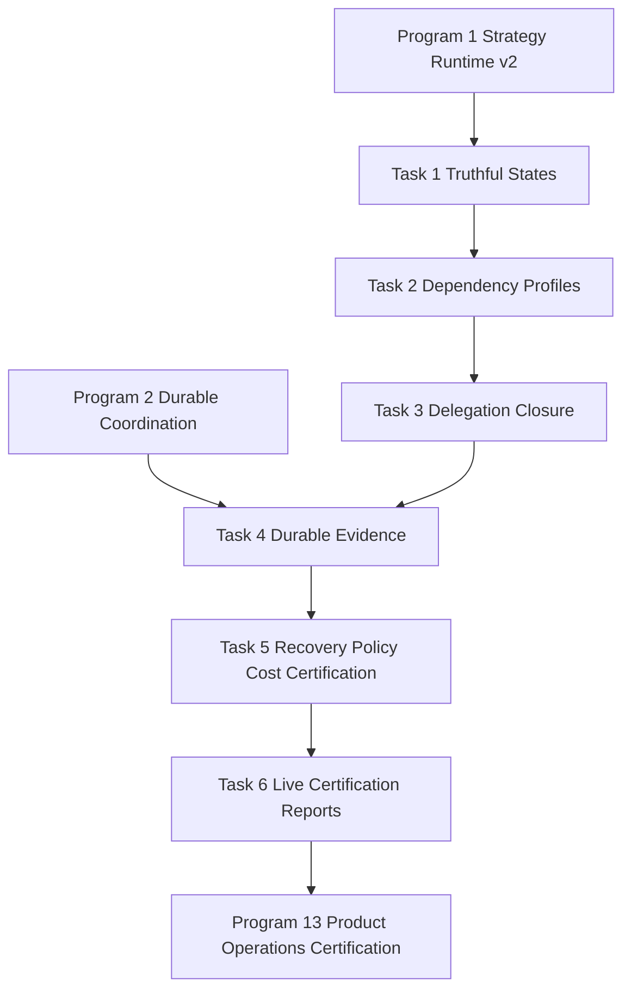

# Agent Pattern Program 12: RAG Readiness Certification Implementation Plan

> **For agentic workers:** REQUIRED SUB-SKILL: Use
> `superpowers:subagent-driven-development` (recommended) or
> `superpowers:executing-plans` to implement this plan task-by-task. Steps use checkbox
> (`- [ ]`) syntax for tracking.

**Goal:** Certify all 18 canonical RAG strategies through truthful implementation,
dependency, delegation, persistence, replay, policy, cost, restart, and live-capability
evidence without changing public strategy IDs.

**Architecture:** Keep `RAG_CAPABILITY_CATALOGUE` and `RetrievalGateway` authoritative for
adapter resolution. Separate executable adapter evidence from tenant-specific operational
readiness and from durable certification evidence. Persist every accepted execution and its
selected/delegated strategy, readiness trace, citations, cost, policy decision, checkpoint,
and certification run through the shared strategy-runtime records delivered by Programs 1
and 2.

**Tech Stack:** Python 3.12, FastAPI, Pydantic, SQLAlchemy 2 async, PostgreSQL/pgvector,
Redis, Celery, pytest, testcontainers, Ruff, mypy, Prometheus.

---

# Planning Assumptions

- Programs 1 and 2 provide the versioned `StrategySpec`, `StrategyExecution`, checkpoint,
  certification-evidence, coordination-event, and outbox persistence contracts before Task
  4 starts. Program 12 must not create a RAG-only duplicate of those records.
- The canonical public IDs remain exactly `naive`, `hybrid`, `hyde`, `multi_hop`, `graph`,
  `corrective`, `adaptive`, `modular`, `speculative`, `agentic`, `web_augmented`, `fusion`,
  `self_rag`, `flare`, `raptor`, `agentic_chunking`, `colbert`, and `raft`.
- Existing adapter behavior is retained unless a certification test proves the canonical
  path is mislabeled, silently degraded, non-persistent, or bypasses governance.
- `implemented` means executable through `RetrievalGateway` with runtime readiness enforced.
  `certified` additionally requires durable restart, isolation, policy, cost, timeout,
  cancellation, observability, and canary evidence. A local `probe_trace()` cannot certify a
  strategy.
- Fake providers are allowed for deterministic unit tests only. Live certification requires
  a configured non-fake provider, embedder, PostgreSQL/pgvector, Redis, and all profile-specific
  dependencies.
- Implementation agents must not commit while executing this plan unless the user separately
  requests commits.

# Source Final Documents

- Design authority:
  `docs/superpowers/specs/2026-08-03-agent-pattern-completion-program-design.md`
- Existing canonical runtime plan:
  `docs/superpowers/plans/2026-07-29-canonical-persisted-rag-runtime.md`
- Existing certification report format:
  `docs/testing/AVCERT-20260729-001-full-product-certification-report.md`
- Capability publication target: `docs/CAPABILITIES.md`
- Program 12 evidence output:
  `docs/testing/agent-pattern-program-12-rag-certification-report.md`
- Generated machine-readable evidence output:
  `docs/testing/agent-pattern-program-12-rag-certification.json`

# Epics

| Epic | Outcome | Depends on |
|---|---|---|
| RAG12-E1 | Truthful 18-strategy implementation and dependency profiles | Program 1 |
| RAG12-E2 | Delegated strategy readiness closure and degraded-mode enforcement | RAG12-E1 |
| RAG12-E3 | Durable execution, replay, cost, policy, timeout, and restart evidence | Programs 1-2, RAG12-E2 |
| RAG12-E4 | Profile-specific live certification and evidence-backed registry promotion | RAG12-E3 |

# Workstreams

| Workstream | Parallel scope | Files owned |
|---|---|---|
| WS-RAG-CONTRACT | Catalogue metadata and certification state semantics | `app/rag/catalogue.py`, `app/orchestration/strategy_registry.py` |
| WS-RAG-READINESS | Dependency probes, deployment profiles, delegation closure | `app/rag/readiness.py`, `app/rag/gateway.py` |
| WS-RAG-EVIDENCE | Durable execution/checkpoint/replay/cost/policy evidence | `app/rag/contracts.py`, `app/rag/gateway.py`, `app/rag/agentic/rag_trace.py` |
| WS-RAG-CERT | Certification runner, live tests, reports | `app/rag/certification.py`, `scripts/certify_rag_strategies.py`, `tests/rag/certification/` |

# Task Breakdown

## RAG12 Strategy and Dependency Matrix

This matrix is normative. Tests must parameterize over all rows and fail when the catalogue,
runtime, or generated report differs.

| Strategy | Implementation evidence | Required operational profile | Delegation/degraded certification |
|---|---|---|---|
| Naive | persisted vector retrieval | database + pgvector + embedder | no delegation; unavailable if vector persistence or embedder fails |
| Hybrid | vector + FTS + trigram + BM25 legs and RRF | database + pgvector + pg_trgm + FTS + embedder | no relabeled vector-only success; each leg and degraded leg set recorded |
| HyDE | hypothetical document generation and embedding | database + embedder + provider | provider absence is unavailable; no fallback labeled HyDE |
| Multi-Hop | decomposition, per-hop retrieval, merged evidence | database + embedder + provider | every hop bounded and persisted; partial-hop result is explicit degraded state |
| Graph | graph evidence merged with retrieval | database + embedder + tenant-scoped graph capability | graph absence is unavailable; vector-only fallback cannot retain `graph` ID |
| Corrective | grade, reformulate, retry, optional web remediation | database + embedder + provider; web profile when remediation enabled | web target must be ready and policy-authorized before selection |
| Adaptive | readiness-aware route selection | database + embedder plus selected target profile | selected downstream strategy and rejected unavailable targets persisted |
| Modular | validated module graph and execution | database + embedder + provider plus every configured module dependency | graph validation rejects cycles and unavailable modules before execution |
| Speculative | concurrent draft/retrieval and claim verification | database + embedder + provider | bounded concurrency; verifier failure cannot become grounded success |
| Agentic | bounded retrieve/reformulate/fallback/stop loop | database + embedder + provider plus selected fallback | every delegated action readiness-checked; loop/cost/timeout stop persisted |
| Web-Augmented | policy-authorized safe web retrieval | database + embedder + web capability | fail closed on policy, SSRF, host, or web readiness denial |
| Fusion | expanded-query retrieval and RRF | database + embedder + provider | each expansion has independent DB session and cost reservation |
| Self-RAG | relevance/support/usefulness critique and retry | database + embedder + provider | unsupported evidence remains ungrounded; retry bounded |
| FLARE | uncertainty-triggered follow-up retrieval | database + embedder + provider | follow-up text is embedded; no original-query substitution |
| RAPTOR | persisted hierarchical summaries | database + embedder + completed RAPTOR artifacts | artifact/version mismatch unavailable; restart reads existing tree |
| Agentic Chunking | persisted semantic propositions and parent links | database + embedder + completed proposition artifacts | artifact/version mismatch unavailable; query path does not rebuild chunks |
| ColBERT | late-interaction scoring | database + embedder + RAGatouille library + local checkpoint | no network download during readiness; checkpoint digest/version recorded |
| RAFT | compatible completed trained-model inference | database + embedder + RAFT service + evaluated model | job completion alone is insufficient; model compatibility and eval gate required |

## Task 1: Replace Boolean Catalogue Claims with Truthful Evidence States

**Files:**

- Modify: `agent-verse-backend/app/rag/catalogue.py`
- Modify: `agent-verse-backend/app/orchestration/strategy_registry.py`
- Modify: `agent-verse-backend/app/api/rag_platform.py`
- Modify: `agent-verse-backend/tests/rag/test_registry_complete_rag.py`
- Create: `agent-verse-backend/tests/rag/test_rag_certification_states.py`

- [ ] **Step 1: Write failing state-separation tests.** Assert all 18 entries expose adapter
  version, implementation evidence type, operational profile IDs, degraded modes, delegated
  targets, and certification requirements. Assert `probe_trace()` can establish
  `implemented` evidence but never `certified` evidence. Assert `/rag/strategies` returns
  separate `implementation_state`, `operational_readiness`, and `certification_state` fields
  while retaining existing fields for compatibility.
- [ ] **Step 2: Run the red tests.**

  Run: `cd agent-verse-backend && uv run pytest tests/rag/test_rag_certification_states.py tests/rag/test_registry_complete_rag.py -q --no-cov`

  Expected: FAIL because catalogue entries do not expose versioned implementation,
  deployment-profile, delegation, or certification metadata and all registry RAG entries are
  currently asserted as `IMPLEMENTED` without durable evidence.
- [ ] **Step 3: Implement the minimal metadata and state derivation.** Add immutable metadata
  to `RAGCapabilityCatalogueEntry`; derive registry state from canonical-path evidence and
  durable certification status; keep administrative disablement authoritative; return only
  sanitized readiness reasons from the API.
- [ ] **Step 4: Run focused verification.**

  Run: `cd agent-verse-backend && uv run pytest tests/rag/test_rag_certification_states.py tests/rag/test_registry_complete_rag.py -q --no-cov`

  Expected: PASS with exactly 18 parameterized strategies and no strategy promoted by an
  adapter identity probe alone.
- [ ] **Step 5: Run static checks.**

  Run: `cd agent-verse-backend && uv run ruff check app/rag/catalogue.py app/orchestration/strategy_registry.py app/api/rag_platform.py tests/rag/test_rag_certification_states.py && uv run mypy app/rag/catalogue.py app/orchestration/strategy_registry.py app/api/rag_platform.py`

  Expected: both commands exit 0.

## Task 2: Define and Probe Deployment Dependency Profiles

**Files:**

- Modify: `agent-verse-backend/app/rag/readiness.py`
- Modify: `agent-verse-backend/app/rag/catalogue.py`
- Modify: `agent-verse-backend/app/rag/gateway.py`
- Modify: `agent-verse-backend/app/core/config.py`
- Modify: `agent-verse-backend/infra/docker-compose.yml`
- Modify: `agent-verse-backend/helm/agentverse/values.yaml`
- Modify: `agent-verse-backend/helm/agentverse/templates/configmap.yaml`
- Create: `agent-verse-backend/tests/rag/test_dependency_profiles.py`
- Modify: `agent-verse-backend/tests/rag/test_safe_web_capability.py`
- Modify: `agent-verse-backend/tests/rag/test_colbert_runtime.py`
- Modify: `agent-verse-backend/tests/rag/test_raft_lifecycle.py`

- [ ] **Step 1: Write failing profile tests.** Cover `core`, `provider`, `graph`, `web`,
  `raptor`, `colbert`, and `raft` profiles; require sanitized per-dependency facts, probe
  timestamps, artifact/model version and digest where applicable, timeout-bounded probes,
  and no network access during ColBERT readiness.
- [ ] **Step 2: Run the red tests.**

  Run: `cd agent-verse-backend && uv run pytest tests/rag/test_dependency_profiles.py tests/rag/test_safe_web_capability.py tests/rag/test_colbert_runtime.py tests/rag/test_raft_lifecycle.py -q --no-cov`

  Expected: FAIL because only ColBERT has a dedicated local artifact probe and readiness does
  not expose profile-level graph, web, RAPTOR artifact, or RAFT evaluated-model evidence.
- [ ] **Step 3: Implement profile probes.** Keep probes side-effect free; require PostgreSQL
  extension/schema/index checks, embedder/provider health, tenant-scoped graph query health,
  safe-web policy and endpoint health, RAPTOR artifact compatibility, local ColBERT library
  and checkpoint, and completed/evaluated RAFT model compatibility. Wire explicit profile
  configuration through settings, Compose, and Helm.
- [ ] **Step 4: Verify deterministic profiles.**

  Run: `cd agent-verse-backend && uv run pytest tests/rag/test_dependency_profiles.py tests/rag/test_safe_web_capability.py tests/rag/test_colbert_runtime.py tests/rag/test_raft_lifecycle.py -q --no-cov`

  Expected: PASS; each unavailable dependency yields one stable reason code and no probe
  executes retrieval, model generation, training, or artifact download.
- [ ] **Step 5: Validate configuration and types.**

  Run: `cd agent-verse-backend && uv run ruff check app/rag/readiness.py app/rag/catalogue.py app/rag/gateway.py app/core/config.py tests/rag/test_dependency_profiles.py && uv run mypy app/rag/readiness.py app/rag/catalogue.py app/rag/gateway.py app/core/config.py`

  Expected: both commands exit 0.

## Task 3: Enforce Delegated Strategy Readiness Closure

**Files:**

- Modify: `agent-verse-backend/app/rag/gateway.py`
- Modify: `agent-verse-backend/app/rag/agentic/patterns/adaptive.py`
- Modify: `agent-verse-backend/app/rag/agentic/patterns/corrective.py`
- Modify: `agent-verse-backend/app/rag/agentic/patterns/agentic.py`
- Modify: `agent-verse-backend/app/rag/agentic/patterns/modular.py`
- Modify: `agent-verse-backend/app/rag/agentic/fallback_chain.py`
- Create: `agent-verse-backend/tests/rag/test_delegated_strategy_readiness.py`

- [ ] **Step 1: Write failing delegation tests.** Parameterize Adaptive, Corrective, Agentic,
  and Modular RAG. Assert downstream candidates are evaluated before selection; unavailable
  candidates are rejected with reasons; delegated strategy/version/profile is returned in
  `RAGStrategyTrace`; recursive delegation and cycles are rejected; no fallback may retain
  the requested strategy ID while executing another strategy invisibly.
- [ ] **Step 2: Run the red tests.**

  Run: `cd agent-verse-backend && uv run pytest tests/rag/test_delegated_strategy_readiness.py -q --no-cov`

  Expected: FAIL because readiness is evaluated primarily for the requested strategy and
  delegated target closure is not represented as a canonical contract.
- [ ] **Step 3: Implement readiness closure.** Resolve a bounded acyclic delegation plan in
  the gateway, intersect tenant policy and available dependency profiles at every edge, and
  pass only approved targets to adapters. Record selected and rejected targets without
  exposing private reasoning.
- [ ] **Step 4: Verify delegation behavior.**

  Run: `cd agent-verse-backend && uv run pytest tests/rag/test_delegated_strategy_readiness.py tests/rag/test_adaptive_rag.py tests/rag/test_corrective_rag.py tests/rag/test_modular_rag.py tests/rag/test_reasoning_retrieval_strategies.py -q --no-cov`

  Expected: PASS; every delegation edge is readiness checked, policy checked, bounded, and
  traceable.
- [ ] **Step 5: Run static checks.**

  Run: `cd agent-verse-backend && uv run ruff check app/rag/gateway.py app/rag/agentic/patterns app/rag/agentic/fallback_chain.py tests/rag/test_delegated_strategy_readiness.py && uv run mypy app/rag/gateway.py app/rag/agentic/patterns app/rag/agentic/fallback_chain.py`

  Expected: both commands exit 0.

## Task 4: Persist Execution, Readiness, Citation, Cost, and Policy Evidence

**Files:**

- Modify: `agent-verse-backend/app/rag/contracts.py`
- Modify: `agent-verse-backend/app/rag/gateway.py`
- Modify: `agent-verse-backend/app/rag/agentic/rag_trace.py`
- Modify: `agent-verse-backend/app/services/event_store.py`
- Create: `agent-verse-backend/tests/rag/test_rag_certification_persistence.py`
- Modify: `agent-verse-backend/tests/rag/test_rag_migration_roundtrip.py`
- Modify: `agent-verse-backend/tests/rag/test_rag_db.py`

- [ ] **Step 1: Write failing PostgreSQL tests.** For each strategy, execute through the
  gateway and assert durable requested/resolved/delegated strategy IDs, adapter and state
  schema versions, readiness profile and facts, policy decision IDs, cost reservations and
  actuals, retrieval legs, citation provenance, checkpoint cursor, terminal state, and safe
  trace summary. Restart the application and reconstruct the same result by execution ID.
- [ ] **Step 2: Run the red integration tests.**

  Run: `cd agent-verse-backend && DOCKER_HOST=unix:///Users/harsh.kumar01/.colima/default/docker.sock TESTCONTAINERS_RYUK_DISABLED=true uv run pytest tests/rag/test_rag_certification_persistence.py tests/rag/test_rag_migration_roundtrip.py -m integration -q --no-cov`

  Expected: FAIL because canonical RAG results and readiness traces are returned in memory
  but are not fully represented in shared durable strategy-execution evidence.
- [ ] **Step 3: Implement durable evidence writes.** Use the shared Program 1/2 repository
  and outbox transaction; store bounded structured evidence and artifact references, never
  prompts, secrets, private chain-of-thought, or unbounded page content. Preserve citation
  provenance through synthesis and corrective remediation.
- [ ] **Step 4: Verify restart and tenant isolation.**

  Run: `cd agent-verse-backend && DOCKER_HOST=unix:///Users/harsh.kumar01/.colima/default/docker.sock TESTCONTAINERS_RYUK_DISABLED=true uv run pytest tests/rag/test_rag_certification_persistence.py tests/rag/test_rag_migration_roundtrip.py tests/rag/test_rag_db.py -m integration -q --no-cov`

  Expected: PASS; accepted evidence survives process restart and cross-tenant reads/writes are
  denied by RLS `USING` and `WITH CHECK` policies.
- [ ] **Step 5: Run static checks.**

  Run: `cd agent-verse-backend && uv run ruff check app/rag/contracts.py app/rag/gateway.py app/rag/agentic/rag_trace.py app/services/event_store.py tests/rag/test_rag_certification_persistence.py && uv run mypy app/rag/contracts.py app/rag/gateway.py app/rag/agentic/rag_trace.py app/services/event_store.py`

  Expected: both commands exit 0.

## Task 5: Certify Replay, Duplicate Delivery, Cancellation, Timeout, Cost, and Policy

**Files:**

- Create: `agent-verse-backend/app/rag/certification.py`
- Create: `agent-verse-backend/tests/rag/certification/__init__.py`
- Create: `agent-verse-backend/tests/rag/certification/test_replay_restart.py`
- Create: `agent-verse-backend/tests/rag/certification/test_policy_cost_limits.py`
- Create: `agent-verse-backend/tests/rag/certification/test_degraded_modes.py`
- Create: `agent-verse-backend/tests/rag/certification/test_citation_provenance.py`

- [ ] **Step 1: Write failing certification scenarios.** Parameterize all 18 strategies and
  prove checkpoint/restart equivalence, idempotent duplicate delivery, parent cancellation,
  deadline enforcement, hard token/call/cost limits, tenant policy denial, kill switch,
  unavailable dependency handling, and citation/provenance integrity. Add strategy-specific
  cases for web SSRF denial, graph tenant isolation, ColBERT artifact loss, RAPTOR artifact
  mismatch, and RAFT model withdrawal.
- [ ] **Step 2: Run the red suite.**

  Run: `cd agent-verse-backend && uv run pytest tests/rag/certification -q --no-cov`

  Expected: FAIL until the certification runner can collect every required evidence class
  and the canonical path handles interruption and dependency loss deterministically.
- [ ] **Step 3: Implement the certification runner.** Produce one immutable result per
  strategy/version/profile with required checks `unit`, `integration`, `restart`, `duplicate`,
  `tenant_isolation`, `policy`, `cost`, `timeout`, `cancellation`, `observability`, and
  `canary`. Refuse promotion when any required check is absent, stale, failed, or from a fake
  provider in a live profile.
- [ ] **Step 4: Run focused certification.**

  Run: `cd agent-verse-backend && uv run pytest tests/rag/certification tests/rag/test_all_rag_patterns_comprehensive.py -q --no-cov`

  Expected: PASS with 18 strategy records and explicit degraded/unavailable outcomes rather
  than silent substitutions.
- [ ] **Step 5: Run static checks.**

  Run: `cd agent-verse-backend && uv run ruff check app/rag/certification.py tests/rag/certification && uv run mypy app/rag/certification.py`

  Expected: both commands exit 0.

## Task 6: Add Opt-In Live Certification and Evidence Reports

**Files:**

- Create: `agent-verse-backend/scripts/certify_rag_strategies.py`
- Create: `agent-verse-backend/tests/live/test_rag_live_certification.py`
- Create: `agent-verse-backend/tests/rag/test_certification_report.py`
- Create: `docs/testing/agent-pattern-program-12-rag-certification-report.md`
- Create: `docs/testing/agent-pattern-program-12-rag-certification.json`
- Modify: `agent-verse-backend/.github/workflows/ci.yml`

- [ ] **Step 1: Write failing report-contract tests.** Require all 18 IDs, adapter version,
  dependency profile, delegated targets, implementation state, operational state,
  certification state, evidence timestamps, quality/cost/latency baseline comparison, and
  sanitized failure reasons. Reject duplicate, missing, stale, or fake-live evidence.
- [ ] **Step 2: Run the red tests.**

  Run: `cd agent-verse-backend && uv run pytest tests/rag/test_certification_report.py -q --no-cov`

  Expected: FAIL because no deterministic Program 12 report generator exists.
- [ ] **Step 3: Implement deterministic report generation.** The script must accept
  `--profile core|provider|graph|web|raptor|colbert|raft|all`, `--output-json`, and
  `--output-markdown`; it must exit non-zero when a required profile is unavailable or any
  certification gate fails. CI runs deterministic non-live checks; credentialed live jobs
  remain protected and opt-in.
- [ ] **Step 4: Run deterministic report generation.**

  Run: `cd agent-verse-backend && uv run python scripts/certify_rag_strategies.py --profile core --output-json ../docs/testing/agent-pattern-program-12-rag-certification.json --output-markdown ../docs/testing/agent-pattern-program-12-rag-certification-report.md`

  Expected: exit 0 only when every core-profile strategy has complete current evidence; both
  output files contain stable sorted strategy IDs and no secrets or private reasoning.
- [ ] **Step 5: Run the credentialed live gate.**

  Run: `cd agent-verse-backend && AGENTVERSE_RUN_LIVE_RAG_CERTIFICATION=1 uv run pytest tests/live/test_rag_live_certification.py -m slow -q --no-cov`

  Expected: PASS only with configured real provider/embedder and ready dependencies; otherwise
  SKIP with an explicit missing-profile reason, never a false PASS.

# Dependency Graph

# Jira Mapping Plan

| Jira type | Title | Description | Dependency | Acceptance notes | Labels |
|---|---|---|---|---|---|
| Epic | RAG12: Certify all canonical RAG strategies | Deliver evidence-backed readiness and live certification for 18 strategies | Programs 1-2 | No registry state can overstate runtime readiness | `agent-pattern`, `rag`, `certification` |
| Story | RAG12-1: Separate implementation and certification state | Add versioned evidence semantics and compatible API fields | Program 1 | 18-row state tests pass | `backend`, `contract` |
| Story | RAG12-2: Add RAG dependency profiles | Probe core/provider/graph/web/RAPTOR/ColBERT/RAFT profiles | RAG12-1 | Side-effect-free deterministic probes pass | `readiness`, `operations` |
| Story | RAG12-3: Enforce delegation readiness closure | Prevent unavailable delegated targets | RAG12-2 | Adaptive/Corrective/Agentic/Modular tests pass | `routing`, `policy` |
| Story | RAG12-4: Persist RAG certification evidence | Store replayable trace/cost/policy/citation records | Programs 1-2, RAG12-3 | Restart and RLS integration tests pass | `persistence`, `security` |
| Story | RAG12-5: Certify recovery and limits | Prove restart, duplicate, timeout, cancellation, cost, policy | RAG12-4 | 18-strategy matrix passes | `reliability`, `governance` |
| Story | RAG12-6: Publish live certification reports | Add opt-in live runner and deterministic artifacts | RAG12-5 | Reports include all strategies and reject stale/fake evidence | `live-test`, `documentation` |

# Migration Plan

1. Deploy catalogue metadata and state derivation without changing existing strategy IDs.
2. Run new readiness and delegation closure in shadow mode; compare decisions to current
   gateway readiness and log mismatches with bounded reason labels.
3. Enable durable evidence writes after Program 1/2 migrations are at head; do not dual-write
   to a RAG-specific table.
4. Backfill existing strategy executions only as `historical_unverified`; never synthesize
   certification evidence from old registry labels.
5. Enable readiness enforcement per tenant allowlist, then per deployment profile.
6. Promote `implemented` and `certified` independently after the corresponding evidence gate.

# Test Plan

- Unit: catalogue completeness, aliases, state derivation, dependency profiles, delegation
  cycles, sanitized reasons, report schema.
- Integration: PostgreSQL/pgvector, RLS `USING`/`WITH CHECK`, outbox, restart/replay,
  duplicate delivery, artifact compatibility, Redis unavailable at admission, Redis loss during
  retrieval/provider execution, restart without Redis, and Redis recovery with pending stream
  entries. Reconstruction must use PostgreSQL and must not duplicate retrieval or provider calls.
- Governance: policy denial, data classification, web SSRF/allowlist, cost reservations,
  timeout, cancellation, kill switch.
- Live: real provider/embedder plus profile-specific Graph, web, ColBERT, RAPTOR, and RAFT
  dependencies; quality, cost, and latency compared with approved baselines.
- Full backend gate:

  Run: `cd agent-verse-backend && uv run pytest tests/rag tests/api/test_phase6_7_rag_runtime.py -q --no-cov && uv run ruff check app tests/rag && uv run mypy app`

  Expected: all tests pass; Ruff and mypy exit 0.

# Release Plan

1. Shadow readiness and report-only evidence collection.
2. Canary core profile for internal tenants.
3. Canary provider strategies, then Graph/web, then artifact-backed ColBERT/RAPTOR/RAFT.
4. Expand only when success, groundedness, citation validity, p95 latency, and cost remain
   within the approved baseline and no tenant-isolation or policy regression occurs.
5. Generate Program 12 reports at each promotion boundary and retain evidence by
   strategy/version/profile.

# Rollback Plan

- Disable the affected strategy/version/profile through the registry kill switch.
- Stop new selection while allowing accepted executions to cancel or complete safely.
- Revert tenant cohorts to the prior certified adapter version; never relabel fallback output
  as the disabled strategy.
- Keep persisted execution and certification evidence immutable for incident analysis.
- Re-run the prior version's certification report before reopening traffic.

# Risks and Blockers

| Risk or blocker | Mitigation |
|---|---|
| Programs 1/2 evidence contracts are not finalized | Block Task 4; complete Tasks 1-3 without creating duplicate persistence |
| Current registry claims all 18 strategies are implemented | Separate states and require durable promotion evidence |
| Delegating adapters select unavailable targets | Compute readiness closure before adapter execution |
| Optional dependencies make CI nondeterministic | Split deterministic profile tests from credentialed live certification |
| ColBERT probe downloads artifacts | Enforce local-files-only readiness and record artifact digest |
| RAFT job completion is mistaken for model readiness | Require completed, evaluated, compatible model evidence |
| RAG traces leak prompts or retrieved sensitive text | Persist bounded safe summaries and classified artifact references |
| Live quality varies by provider/model | Version baselines by strategy, adapter, provider, model, and profile |

# Definition of Done

- [ ] Exactly 18 canonical strategies appear in catalogue, API, test matrix, and generated
  certification outputs.
- [ ] Implementation state, operational readiness, and certification state are separate and
  evidence-backed.
- [ ] Every dependency and deployment profile has a side-effect-free readiness probe and a
  stable sanitized failure reason.
- [ ] Adaptive, Corrective, Agentic, and Modular RAG cannot delegate to unavailable or
  policy-denied strategies.
- [ ] Requested, resolved, and delegated strategy IDs plus citations, cost, policy,
  readiness, checkpoints, and safe traces persist and replay after restart.
- [ ] Duplicate delivery, cancellation, timeout, budget, kill-switch, RLS, policy, and
  degraded-mode tests pass for all applicable strategies.
- [ ] Live certification uses real capabilities, rejects fake/stale evidence, and publishes
  deterministic Markdown and JSON reports.
- [ ] No public strategy ID or existing goal result field is removed.
- [ ] Full backend test, Ruff, and mypy gates pass.
- [ ] No source changes are committed as part of planning.