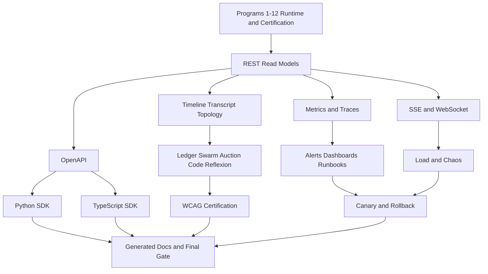

# Agent Pattern Program 13: Product Operations Certification Implementation Plan

> **For agentic workers:** REQUIRED SUB-SKILL: Use
> `superpowers:subagent-driven-development` (recommended) or
> `superpowers:executing-plans` to implement this plan task-by-task. Steps use checkbox
> (`- [ ]`) syntax for tracking.

**Goal:** Deliver and certify the additive REST, SSE, WebSocket, OpenAPI, Python SDK,
TypeScript SDK, frontend, accessibility, observability, runbook, resilience, canary,
rollback, and generated-documentation surfaces for every completed agent pattern.

**Architecture:** Add one `/coordination` API boundary over the durable strategy and
coordination services produced by Programs 1-12. REST owns commands and read models, SSE
owns persisted replayable progress, and WebSocket is restricted to authorized human group
chat participation. Extend the existing goal detail and a new coordination feature slice
with safe structured read models; do not expose private chain-of-thought or create a second
coordination runtime.

**Tech Stack:** FastAPI, Pydantic, SQLAlchemy 2 async, PostgreSQL, Redis Streams, Celery,
OpenAPI 3, Python 3.11+ SDK with httpx, TypeScript SDK with fetch/vitest, React 19, Vite,
TanStack Query, Tailwind, Vitest, Testing Library, Playwright, axe-core, Prometheus, Grafana,
k6, Kubernetes, Helm.

---

# Planning Assumptions

- Programs 1-12 are prerequisites. Their services own strategy execution, coordination
  sessions, messages, ledgers, work items, handoffs, claims, bids, allocations, artifacts,
  Reflexion evidence, checkpoints, outbox delivery, and certification. Program 13 adds
  product contracts and operational certification, not duplicate domain logic.
- All API changes are additive. Existing `/goals` request fields, response fields, SSE event
  types, Python SDK methods, TypeScript SDK methods, and frontend goal routes remain valid.
- The API prefix is `/coordination`; session resources use plural nouns and lower-case,
  hyphen-free path segments already represented by resource names.
- SSE events use the Program 2 versioned event envelope and persisted monotonic sequence.
  `Last-Event-ID` resumes after the supplied sequence without duplicates or gaps.
- WebSocket is available only at
  `/api/v1/coordination/sessions/{session_id}/group-chat/ws`, accepts human messages and control
  acknowledgements only, and cannot invoke tools or grant authority.
- Frontend explanations contain safe rationale, evidence, cost, readiness, delegation,
  allocation, and memory summaries. Hidden chain-of-thought is never returned or rendered.
- WCAG target is 2.2 AA. Automated axe/Playwright checks, keyboard testing, VoiceOver on
  macOS, and NVDA on Windows are release evidence.
- Implementation agents must not commit while executing this plan unless the user separately
  requests commits.

# Source Final Documents

- Design authority:
  `docs/superpowers/specs/2026-08-03-agent-pattern-completion-program-design.md`
- Program 12 dependency:
  `docs/superpowers/plans/2026-08-03-agent-pattern-program-12-rag-readiness-certification.md`
- Published API contract: `agent-verse-backend/openapi.json`
- Product capability source: `docs/CAPABILITIES.md`
- Root operating guide: `RUNBOOK.md`
- Program 13 certification report:
  `docs/testing/agent-pattern-program-13-product-operations-certification-report.md`
- Generated capability manifest: `docs/generated/agent-pattern-capabilities.json`
- Generated capability reference: `docs/generated/agent-pattern-capabilities.md`

# Epics

| Epic | Outcome | Depends on |
|---|---|---|
| AP13-E1 | Additive REST, SSE, WebSocket, and OpenAPI contracts | Programs 1-12 |
| AP13-E2 | Python and TypeScript SDK contract parity | AP13-E1 |
| AP13-E3 | Complete accessible coordination and explainability frontend | AP13-E1 |
| AP13-E4 | Metrics, alerts, dashboards, and actionable runbooks | AP13-E1 |
| AP13-E5 | Load, chaos, canary, rollback, and generated documentation certification | AP13-E2-E4 |

# Workstreams

| Workstream | Parallel scope | Primary files |
|---|---|---|
| WS-API | REST/read models/OpenAPI | `app/api/coordination.py`, `app/api/goals.py`, `openapi.json` |
| WS-STREAM | SSE replay and group-chat WebSocket | `app/api/coordination.py`, `app/coordination/streaming.py` |
| WS-SDK-PY | Python models/client/streaming | `agent-verse-sdk-python/agentverse/` |
| WS-SDK-TS | TypeScript types/client/streaming | `agent-verse-sdk-typescript/src/` |
| WS-UI | Coordination page and goal explainability | `agent-verse-frontend/src/features/coordination/`, `src/features/goals/` |
| WS-A11Y | axe, keyboard, responsive, screen-reader evidence | frontend unit and E2E tests |
| WS-OPS | Metrics, Prometheus, Grafana, runbooks | `app/observability/metrics.py`, `infra/` |
| WS-RELEASE | load, chaos, canary, rollback, generated docs | `infra/loadtest/`, `infra/chaos/`, `scripts/` |

# Task Breakdown

## Task 1: Add Goal Overrides and Versioned Coordination REST Read Models

**Files:**

- Modify: `agent-verse-backend/app/api/coordination.py`
- Create: `agent-verse-backend/app/coordination/read_models.py`
- Modify: `agent-verse-backend/app/api/goals.py`
- Modify: `agent-verse-backend/app/main.py`
- Create: `agent-verse-backend/tests/api/test_coordination_api.py`
- Modify: `agent-verse-backend/tests/api/test_goals.py`

- [ ] **Step 1: Write failing API tests.** Require additive `strategy_override` and
  `pattern_limits` on `POST /goals`; create/read/cancel/resume on
  `/api/v1/coordination/sessions`; approval and human-response commands; and tenant-scoped read
  models for messages, ledgers, handoffs, claims, bids, allocations, artifacts, and explain.
  Assert `202` plus `Location` for asynchronous session creation and create/cancel/resume commands, `200` for reads, `404` for
  missing tenant-owned resources, `409` for invalid lifecycle transitions, and `422` for
  incompatible overrides or invalid limits.
- [ ] **Step 2: Run the red tests.**

  Run: `cd agent-verse-backend && uv run pytest tests/api/test_coordination_api.py tests/api/test_goals.py -q --no-cov`

  Expected: FAIL because the coordination router and typed read models do not exist and goal
  creation lacks the versioned strategy override and common pattern limits.
- [ ] **Step 3: Consolidate and certify the existing additive endpoints.** Program 02 owns the canonical router and Programs 07-09 extend it through feature modules with stable operation IDs. Resolve the authenticated tenant from
  middleware, call Program 1/2 command/query services from `app.state`, enforce
  authorization on every transition, use cursor pagination with default 20 and maximum 100,
  and return structured safe summaries. Register the router in both in-memory and lifespan
  application assembly without changing existing routes.
- [ ] **Step 4: Run API verification.**

  Run: `cd agent-verse-backend && uv run pytest tests/api/test_coordination_api.py tests/api/test_goals.py tests/api/test_app.py -q --no-cov`

  Expected: PASS; existing goal submissions remain valid and every coordination resource is
  tenant-scoped and paginated.
- [ ] **Step 5: Run static checks.**

  Run: `cd agent-verse-backend && uv run ruff check app/api/coordination.py app/coordination/read_models.py app/api/goals.py app/main.py tests/api/test_coordination_api.py && uv run mypy app/api/coordination.py app/coordination/read_models.py app/api/goals.py`

  Expected: both commands exit 0.

## Task 2: Add Replayable Coordination SSE and Authorized Group-Chat WebSocket

**Files:**

- Create: `agent-verse-backend/app/coordination/streaming.py`
- Modify: `agent-verse-backend/app/api/coordination.py`
- Create: `agent-verse-backend/tests/api/test_coordination_sse.py`
- Create: `agent-verse-backend/tests/api/test_coordination_websocket.py`
- Modify: `agent-verse-backend/tests/api/test_governance_streams.py`

- [ ] **Step 1: Write failing transport tests.** SSE tests require persisted event IDs,
  schema version, tenant/run/session/correlation/causation IDs, sequence, producer,
  classification, typed payload, heartbeat, `Last-Event-ID` replay, duplicate suppression,
  slow-consumer disconnect, and PostgreSQL polling during Redis loss. WebSocket tests require
  pre-upgrade authentication, participant authorization, bounded message size/rate/queue,
  typed human messages, replay cursor, ping/pong, disconnect cleanup, and rejection of tool,
  policy, privilege, cross-session, and cross-tenant messages.
- [ ] **Step 2: Run the red transport tests.**

  Run: `cd agent-verse-backend && uv run pytest tests/api/test_coordination_sse.py tests/api/test_coordination_websocket.py -q --no-cov`

  Expected: FAIL because coordination streaming and group-chat participation endpoints are
  absent.
- [ ] **Step 3: Implement transport adapters.** Expose
  `GET /api/v1/coordination/sessions/{session_id}/events` and
  `WS /api/v1/coordination/sessions/{session_id}/group-chat/ws`. Read persisted events before live
  Redis events, resume strictly after the cursor, bound per-connection buffers, sanitize all
  payloads, and close with stable codes for auth, policy, rate, and backpressure failures.
- [ ] **Step 4: Verify replay and authorization.**

  Run: `cd agent-verse-backend && uv run pytest tests/api/test_coordination_sse.py tests/api/test_coordination_websocket.py tests/api/test_governance_streams.py -q --no-cov`

  Expected: PASS; reconnect reproduces the ordered persisted stream once and WebSocket cannot
  cross tenant/session boundaries or issue privileged commands.
- [ ] **Step 5: Run static checks.**

  Run: `cd agent-verse-backend && uv run ruff check app/coordination/streaming.py app/api/coordination.py tests/api/test_coordination_sse.py tests/api/test_coordination_websocket.py && uv run mypy app/coordination/streaming.py app/api/coordination.py`

  Expected: both commands exit 0.

## Task 3: Freeze and Validate the OpenAPI Contract

**Files:**

- Modify: `agent-verse-backend/scripts/export_openapi.py`
- Modify: `agent-verse-backend/openapi.json`
- Modify: `agent-verse-backend/tests/api/test_openapi_schema.py`
- Create: `agent-verse-backend/tests/api/test_coordination_openapi.py`

- [ ] **Step 1: Write failing schema tests.** Assert every REST route, request, response,
  pagination envelope, error response, strategy override, pattern limit, coordination read
  model, SSE content type/header, and WebSocket handshake documentation is represented.
  Snapshot existing goal fields and fail on removal or type narrowing.
- [ ] **Step 2: Run the red schema tests.**

  Run: `cd agent-verse-backend && uv run pytest tests/api/test_coordination_openapi.py tests/api/test_openapi_schema.py -q --no-cov`

  Expected: FAIL until response models and OpenAPI metadata are explicit and the checked-in
  document is regenerated.
- [ ] **Step 3: Stabilize models and regenerate OpenAPI.** Add explicit FastAPI response
  models and operation IDs, document SSE headers and WebSocket path semantics, sort output
  deterministically, and preserve all existing public goal fields.
- [ ] **Step 4: Regenerate and verify.**

  Run: `cd agent-verse-backend && uv run python scripts/export_openapi.py && uv run pytest tests/api/test_coordination_openapi.py tests/api/test_openapi_schema.py -q --no-cov`

  Expected: exit 0; `openapi.json` is deterministic and contains additive coordination
  contracts with no existing goal contract removals.
- [ ] **Step 5: Check schema drift.**

  Run: `cd agent-verse-backend && uv run python scripts/export_openapi.py --check`

  Expected: exit 0 with no OpenAPI drift.

## Task 4: Add Python SDK Models, Commands, Replay, Cancellation, and Idempotency

**Files:**

- Modify: `agent-verse-sdk-python/agentverse/models.py`
- Modify: `agent-verse-sdk-python/agentverse/client.py`
- Modify: `agent-verse-sdk-python/agentverse/streaming.py`
- Modify: `agent-verse-sdk-python/agentverse/__init__.py`
- Create: `agent-verse-sdk-python/tests/test_coordination_client.py`
- Modify: `agent-verse-sdk-python/tests/test_streaming.py`
- Modify: `agent-verse-sdk-python/tests/test_client_parity.py`

- [ ] **Step 1: Write failing SDK tests.** Cover typed strategy override/limits, session
  create/get/cancel/resume, all read models, explain, approval/human response, cursor
  pagination, `Idempotency-Key`, request retry only for safe/transient operations,
  cancellation propagation, SSE `Last-Event-ID`, reconnection deduplication, and existing
  `submit_goal`, `get_goal`, `wait_for_goal`, and `stream_goal` behavior.
- [ ] **Step 2: Run the red Python SDK tests.**

  Run: `cd agent-verse-sdk-python && uv run pytest tests/test_coordination_client.py tests/test_streaming.py tests/test_client_parity.py -q`

  Expected: FAIL because coordination models and client operations are absent and streaming
  does not expose a reusable persisted cursor contract.
- [ ] **Step 3: Implement typed SDK parity.** Add Pydantic models, async client methods,
  `async for` event streaming with cursor state, explicit cancellation, stable exceptions,
  and idempotency headers. Keep existing method signatures backward compatible.
- [ ] **Step 4: Run Python SDK verification.**

  Run: `cd agent-verse-sdk-python && uv run pytest -q`

  Expected: all Python SDK tests pass.
- [ ] **Step 5: Run Python SDK static checks.**

  Run: `cd agent-verse-sdk-python && uv run ruff check agentverse tests && uv run mypy agentverse`

  Expected: Ruff and mypy exit 0.

## Task 5: Add TypeScript SDK Types, Commands, Replay, Cancellation, and Idempotency

**Files:**

- Modify: `agent-verse-sdk-typescript/src/types.ts`
- Modify: `agent-verse-sdk-typescript/src/client.ts`
- Modify: `agent-verse-sdk-typescript/src/index.ts`
- Create: `agent-verse-sdk-typescript/src/streaming.ts`
- Create: `agent-verse-sdk-typescript/tests/coordination.test.ts`
- Modify: `agent-verse-sdk-typescript/tests/client.test.ts`

- [ ] **Step 1: Write failing TypeScript tests.** Mirror every Python SDK operation and model;
  assert `AbortSignal`, `Idempotency-Key`, encoded cursors, transient retry rules, SSE ID
  parsing, `Last-Event-ID` reconnection, duplicate suppression, malformed-frame failure
  policy, and backward compatibility for existing goal methods.
- [ ] **Step 2: Run the red TypeScript SDK tests.**

  Run: `cd agent-verse-sdk-typescript && npm test -- --run tests/coordination.test.ts tests/client.test.ts`

  Expected: FAIL because coordination types/client operations and a reusable streaming module
  do not exist.
- [ ] **Step 3: Implement TypeScript parity.** Export exact discriminated unions for lifecycle
  and event payloads, add client operations matching Python names idiomatically, and use a
  shared stream parser with abort and replay support. Do not use `any` for public contracts.
- [ ] **Step 4: Run TypeScript SDK verification.**

  Run: `cd agent-verse-sdk-typescript && npm run build && npm test -- --run`

  Expected: TypeScript build and all Vitest tests pass.
- [ ] **Step 5: Verify Python/TypeScript operation parity.**

  Run: `cd agent-verse-backend && uv run pytest tests/api/test_coordination_openapi.py tests/api/test_phase12_13_skills_frontend.py -q --no-cov`

  Expected: PASS; every public coordination operation has matching Python and TypeScript SDK
  coverage.

## Task 6: Build the Coordination Run Timeline, Transcript, and Parent/Child Topology

**Files:**

- Create: `agent-verse-frontend/src/features/coordination/types.ts`
- Create: `agent-verse-frontend/src/features/coordination/api.ts`
- Create: `agent-verse-frontend/src/features/coordination/useCoordinationStream.ts`
- Create: `agent-verse-frontend/src/features/coordination/CoordinationRunPage.tsx`
- Create: `agent-verse-frontend/src/features/coordination/RunTimeline.tsx`
- Create: `agent-verse-frontend/src/features/coordination/SharedTranscript.tsx`
- Create: `agent-verse-frontend/src/features/coordination/ParentChildTopology.tsx`
- Create: `agent-verse-frontend/src/features/coordination/CoordinationRunPage.test.tsx`
- Modify: `agent-verse-frontend/src/features/goals/components/MissionGoalComposer.tsx`
- Create: `agent-verse-frontend/src/features/goals/components/MissionGoalComposer.test.tsx`
- Modify: `agent-verse-frontend/src/app/App.tsx`
- Modify: `agent-verse-frontend/src/components/ui/AppLayout.tsx`

- [ ] **Step 1: Write failing component tests.** Require route
  `/coordination/:sessionId`; ordered timeline with status and safe summaries; parent/child
  topology with current focus; transcript speaker, recipient, trust label, citations,
  classification, and compaction markers; live replay/dedup status; loading, empty, error,
  reconnecting, awaiting-human, cancelled, failed, and completed states; cancel/resume and
  approval controls with confirmation and disabled pending states. Require the existing goal
  composer to load available strategies, show implementation/readiness/certification state,
  submit an optional strategy override, and expose bounded controls for calls, nodes, edges,
  depth, fan-out, rounds, tokens, duration, and cost without changing the default submission.
- [ ] **Step 2: Run the red component tests.**

  Run: `cd agent-verse-frontend && npm run test -- --run src/features/coordination/CoordinationRunPage.test.tsx src/features/goals/components/MissionGoalComposer.test.tsx`

  Expected: FAIL because the feature slice and route do not exist.
- [ ] **Step 3: Implement the page and shared stream hook.** Use TanStack Query for REST,
  fetch-based SSE for authenticated replay, semantic landmarks and lists, stable topology
  dimensions, no nested cards, and bounded virtualization/pagination for long transcripts.
  Add a lazy route and one navigation entry. Extend `MissionGoalComposer` with an accessible
  strategy option menu and numeric limit inputs sourced from the backend contract; omit
  override/limit fields when the user leaves defaults unchanged.
- [ ] **Step 4: Run focused frontend verification.**

  Run: `cd agent-verse-frontend && npm run test -- --run src/features/coordination/CoordinationRunPage.test.tsx src/features/goals/components/MissionGoalComposer.test.tsx && npm run typecheck`

  Expected: component tests and typecheck pass.
- [ ] **Step 5: Run lint.**

  Run: `cd agent-verse-frontend && npm run lint`

  Expected: ESLint exits 0.

## Task 7: Build Ledger, Swarm, Auction, Code, and Reflexion Views

**Files:**

- Create: `agent-verse-frontend/src/features/coordination/MagenticLedgerView.tsx`
- Create: `agent-verse-frontend/src/features/coordination/SwarmTopologyView.tsx`
- Create: `agent-verse-frontend/src/features/coordination/AuctionBidView.tsx`
- Create: `agent-verse-frontend/src/features/coordination/CodeExecutionView.tsx`
- Create: `agent-verse-frontend/src/features/coordination/ReflexionEvidenceView.tsx`
- Create: `agent-verse-frontend/src/features/coordination/PatternViews.test.tsx`
- Modify: `agent-verse-frontend/src/features/coordination/CoordinationRunPage.tsx`
- Modify: `agent-verse-frontend/src/features/goals/components/GoalExplainPanel.tsx`
- Create: `agent-verse-frontend/src/features/goals/components/GoalExplainPanel.test.tsx`

- [ ] **Step 1: Write failing pattern-view tests.** Magentic shows ledger versions, facts,
  assumptions, open/completed work, blockers, next actor, stall count, and replan markers.
  Swarm shows work advertisements, claims, leases, fencing state, expiry, reclaim, and
  convergence. Auction shows sealed-bid summary after deadline, deterministic score factors,
  fairness/load, winner lease, fallback, settlement, and rebid. Code shows language,
  lifecycle, policy validation, bounded stdout/stderr, exit/resource state, and sanitized
  artifacts. Reflexion shows recall/write evidence, applicability, confidence, provenance,
  quarantine, usefulness, and expiry without lesson prompt internals.
- [ ] **Step 2: Run the red pattern-view tests.**

  Run: `cd agent-verse-frontend && npm run test -- --run src/features/coordination/PatternViews.test.tsx src/features/goals/components/GoalExplainPanel.test.tsx`

  Expected: FAIL because the five structured views and expanded safe explain contract are
  absent.
- [ ] **Step 3: Implement discriminated pattern views.** Render a view only when its typed
  read model exists; preserve explicit unavailable/denied/failed states; use tables for bid
  and ledger data, semantic lists for evidence, and stable responsive topology dimensions.
- [ ] **Step 4: Run focused verification.**

  Run: `cd agent-verse-frontend && npm run test -- --run src/features/coordination/PatternViews.test.tsx src/features/goals/components/GoalExplainPanel.test.tsx && npm run typecheck`

  Expected: tests and typecheck pass; no private reasoning is rendered.
- [ ] **Step 5: Run the frontend unit suite.**

  Run: `cd agent-verse-frontend && npm run test -- --run`

  Expected: all Vitest tests pass.

## Task 8: Certify WCAG 2.2 AA, Keyboard, Screen Reader, Reduced Motion, and Responsive Layouts

**Files:**

- Create: `agent-verse-frontend/e2e/coordination-accessibility.spec.ts`
- Create: `agent-verse-frontend/e2e/coordination-responsive.spec.ts`
- Modify: `agent-verse-frontend/e2e/accessibility.spec.ts`
- Modify: `agent-verse-frontend/src/app/globals.css`
- Create: `docs/testing/agent-pattern-program-13-accessibility-evidence.md`

- [ ] **Step 1: Write failing accessibility E2E tests.** Run axe at WCAG 2.2 AA against
  timeline, transcript, topology, ledger, auction, code, and Reflexion states; test logical
  tab order, visible focus, Enter/Space activation, Escape close, focus restoration, arrow
  navigation for tabs, live-region announcements, 44x44 touch targets, 200% zoom, reduced
  motion, high contrast, and no overlap at 375x667, 768x1024, 1280x720, and 1440x900.
- [ ] **Step 2: Run the red accessibility suite.**

  Run: `cd agent-verse-frontend && npm run test:e2e -- coordination-accessibility.spec.ts coordination-responsive.spec.ts --project=chromium`

  Expected: FAIL on missing routes/components or specific accessibility assertions before UI
  corrections.
- [ ] **Step 3: Correct semantics and interaction.** Use one page `h1`, sequential headings,
  native buttons/links/tables/lists, named icon controls, polite live regions, non-color
  status text/icons, visible focus, reduced-motion media queries, stable responsive tracks,
  and bounded text wrapping.
- [ ] **Step 4: Run automated accessibility and responsive verification.**

  Run: `cd agent-verse-frontend && npm run test:e2e -- coordination-accessibility.spec.ts coordination-responsive.spec.ts accessibility.spec.ts --project=chromium`

  Expected: all Playwright and axe checks pass at every viewport with no serious or critical
  violations.
- [ ] **Step 5: Record manual assistive-technology evidence.** Test the same session journey
  with VoiceOver on macOS Safari and NVDA on Windows Chrome; record date, browser, reader
  version, keyboard path, announcements, defects, and retest result in the evidence file.

  Expected: both journeys can inspect every view, send a human group-chat response, approve
  or reject a request, cancel/resume a run, and return focus without pointer use.

## Task 9: Add Pattern Metrics and Trace Instrumentation

**Files:**

- Modify: `agent-verse-backend/app/observability/metrics.py`
- Modify: `agent-verse-backend/app/observability/tracing.py`
- Create: `agent-verse-backend/tests/observability/test_coordination_metrics.py`
- Create: `agent-verse-backend/tests/observability/test_coordination_tracing.py`

- [ ] **Step 1: Write failing observability tests.** Require bounded-label counters,
  histograms, and gauges for strategy success/cost/tokens/latency, fan-out, depth, rounds,
  quorum failures, handoff latency, claim contention/reclaim, ledger stalls, outbox lag,
  sandbox denial, fallback, allocation, and Reflexion lesson usefulness. Require spans for
  selection, phase, handoff, message read, speaker choice, claim, bid, allocation, sandbox,
  memory recall, checkpoint, and fallback with correlation IDs and no tenant IDs, prompts,
  secrets, or raw content as metric labels.
- [ ] **Step 2: Run the red observability tests.**

  Run: `cd agent-verse-backend && uv run pytest tests/observability/test_coordination_metrics.py tests/observability/test_coordination_tracing.py -q --no-cov`

  Expected: FAIL because the complete pattern metric and span vocabulary is absent.
- [ ] **Step 3: Implement bounded instrumentation.** Use enumerated strategy/family/status
  labels, histograms for latency, counters for totals, gauges for current lag/leases, and
  safe trace attributes. Instrument owning services from Programs 1-12, not API wrappers
  alone.
- [ ] **Step 4: Verify exposition and traces.**

  Run: `cd agent-verse-backend && uv run pytest tests/observability/test_coordination_metrics.py tests/observability/test_coordination_tracing.py tests/observability/test_metrics.py -q --no-cov`

  Expected: PASS; `/metrics` exposes all required names with bounded labels and traces contain
  correlated safe spans.
- [ ] **Step 5: Run static checks.**

  Run: `cd agent-verse-backend && uv run ruff check app/observability/metrics.py app/observability/tracing.py tests/observability/test_coordination_metrics.py tests/observability/test_coordination_tracing.py && uv run mypy app/observability/metrics.py app/observability/tracing.py`

  Expected: both commands exit 0.

## Task 10: Add Alerts, Dashboards, and Actionable Runbooks

**Files:**

- Modify: `agent-verse-backend/infra/prometheus/alerts.yml`
- Create: `agent-verse-backend/infra/grafana/dashboards/agent-pattern-platform-health.json`
- Create: `agent-verse-backend/infra/grafana/dashboards/agent-pattern-quality-outcomes.json`
- Create: `agent-verse-backend/infra/runbooks/coordination-delivery-lag.md`
- Create: `agent-verse-backend/infra/runbooks/coordination-lease-reclaims.md`
- Create: `agent-verse-backend/infra/runbooks/agent-pattern-runaway-limits.md`
- Create: `agent-verse-backend/infra/runbooks/sandbox-denial-outage.md`
- Create: `agent-verse-backend/infra/runbooks/magentic-stalls-fallbacks.md`
- Create: `agent-verse-backend/infra/runbooks/auction-anomalies.md`
- Create: `agent-verse-backend/infra/runbooks/reflexion-quality-poisoning.md`
- Create: `agent-verse-backend/infra/runbooks/tenant-policy-anomalies.md`
- Create: `agent-verse-backend/tests/observability/test_agent_pattern_operations_assets.py`

- [ ] **Step 1: Write failing asset tests.** Parse Prometheus rules and Grafana JSON; require
  alerts for outbox/stream lag, dead letters, stuck/reclaimed leases, runaway fan-out/tokens/
  cost/duration, sandbox outage/denials, Magentic stalls/fallbacks, auction no-bid/collusion/
  fairness, Reflexion degradation/poisoning, and RLS/policy/auth anomalies. Require every
  alert to reference an existing runbook and each runbook to include symptoms, impact,
  dashboard queries, diagnosis, mitigation, recovery, verification, escalation, and rollback.
- [ ] **Step 2: Run the red asset tests.**

  Run: `cd agent-verse-backend && uv run pytest tests/observability/test_agent_pattern_operations_assets.py -q --no-cov`

  Expected: FAIL because current alert rules and runbooks cover only a small subset of the
  required pattern operations.
- [ ] **Step 3: Implement operations assets.** Separate platform health from pattern quality
  and business outcomes; use p50/p95/p99 latency, rate, error, saturation, cost, quality,
  fallback, and policy panels; set sustained windows and severities; link every alert to the
  exact repository runbook path.
- [ ] **Step 4: Validate assets.**

  Run: `cd agent-verse-backend && uv run pytest tests/observability/test_agent_pattern_operations_assets.py -q --no-cov && promtool check rules infra/prometheus/alerts.yml`

  Expected: tests pass and Prometheus reports `SUCCESS` for the rules file.
- [ ] **Step 5: Verify dashboard JSON.**

  Run: `cd agent-verse-backend && jq empty infra/grafana/dashboards/agent-pattern-platform-health.json infra/grafana/dashboards/agent-pattern-quality-outcomes.json`

  Expected: exit 0 with valid JSON.

## Task 11: Add Load, Soak, and Chaos Certification

**Files:**

- Create: `agent-verse-backend/infra/loadtest/coordination_sessions.js`
- Create: `agent-verse-backend/infra/loadtest/coordination_streams.js`
- Create: `agent-verse-backend/infra/loadtest/group_chat_ws.js`
- Create: `agent-verse-backend/infra/chaos/coordination-pod-kill.yaml`
- Create: `agent-verse-backend/infra/chaos/coordination-redis-loss.yaml`
- Create: `agent-verse-backend/infra/chaos/coordination-worker-loss.yaml`
- Create: `agent-verse-backend/tests/reliability/test_coordination_chaos_contracts.py`
- Create: `docs/testing/agent-pattern-program-13-load-chaos-results.md`

- [ ] **Step 1: Write failing harness-contract tests.** Require tenant-safe test data,
  idempotency keys, cleanup, deterministic thresholds, SSE cursor continuity, WebSocket
  backpressure, 10,000-event replay without full-table scans, API/worker/Redis restart,
  duplicate Celery delivery, cancellation propagation, lease reclaim/fencing, outbox drain,
  and no accepted-work loss.
- [ ] **Step 2: Run the red harness tests.**

  Run: `cd agent-verse-backend && uv run pytest tests/reliability/test_coordination_chaos_contracts.py -q --no-cov`

  Expected: FAIL because the Program 13 load and chaos assets do not exist.
- [ ] **Step 3: Implement k6 and chaos assets.** Set thresholds: coordination event write p95
  below 100 ms excluding model latency, REST error rate below 1%, no SSE sequence gaps,
  bounded WebSocket queue memory, zero duplicate authority transitions, zero accepted-work
  loss, and cancellation reaching active children/sandboxes within the configured SLO.
- [ ] **Step 4: Run local load smoke tests.**

  Run: `cd agent-verse-backend && k6 run --vus 10 --duration 60s infra/loadtest/coordination_sessions.js && k6 run --vus 25 --duration 60s infra/loadtest/coordination_streams.js && k6 run --vus 20 --duration 60s infra/loadtest/group_chat_ws.js`

  Expected: all thresholds pass against the running local stack and no sequence-gap or
  duplicate-transition checks fail.
- [ ] **Step 5: Run chaos certification in the test namespace.**

  Run: `cd agent-verse-backend && kubectl apply -f infra/chaos/coordination-pod-kill.yaml -f infra/chaos/coordination-redis-loss.yaml -f infra/chaos/coordination-worker-loss.yaml && uv run pytest tests/reliability/test_coordination_chaos_contracts.py -m integration -q --no-cov`

  Expected: PASS after each injected failure; PostgreSQL remains canonical, streams recover,
  leases fence stale workers, and accepted work is replayable.

## Task 12: Add Canary Gates and Tested Rollback

**Files:**

- Modify: `agent-verse-backend/infra/k8s/backend-deployment-blue.yaml`
- Modify: `agent-verse-backend/infra/k8s/backend-deployment-green.yaml`
- Modify: `agent-verse-backend/infra/k8s/switch-traffic.sh`
- Modify: `agent-verse-backend/helm/agentverse/values.yaml`
- Modify: `agent-verse-backend/infra/helm/agentverse/values-staging.yaml`
- Modify: `agent-verse-backend/infra/helm/agentverse/values-production.yaml`
- Create: `agent-verse-backend/scripts/check_agent_pattern_canary.py`
- Create: `agent-verse-backend/tests/reliability/test_agent_pattern_canary.py`
- Create: `agent-verse-backend/infra/runbooks/agent-pattern-canary-rollback.md`

- [ ] **Step 1: Write failing canary tests.** Require tenant allowlist, per-family feature
  flags, adapter-version pin, kill switch, cohort percentage, minimum sample size, quality/
  cost/latency/policy thresholds, automatic halt, old-version compatibility, and rollback
  that does not delete accepted state or scale down the previous color before the observation
  window completes.
- [ ] **Step 2: Run the red canary tests.**

  Run: `cd agent-verse-backend && uv run pytest tests/reliability/test_agent_pattern_canary.py -q --no-cov`

  Expected: FAIL because the current traffic switch checks health then immediately scales
  down the old color without pattern certification gates or an observation window.
- [ ] **Step 3: Implement gated blue/green rollout.** Require readiness, migration, OpenAPI,
  SDK, frontend, load, chaos, and Program 12 evidence before switching; query Prometheus for
  canary baselines; keep prior color warm through the observation window; halt or reverse on
  threshold breach; preserve the legacy AgentGraph fallback for one stable release only.
- [ ] **Step 4: Verify dry-run canary decisions.**

  Run: `cd agent-verse-backend && uv run python scripts/check_agent_pattern_canary.py --environment staging --dry-run && uv run pytest tests/reliability/test_agent_pattern_canary.py -q --no-cov`

  Expected: exit 0 with a deterministic `promote`, `hold`, or `rollback` decision and all
  canary tests passing.
- [ ] **Step 5: Verify rollback command.**

  Run: `cd agent-verse-backend && NAMESPACE=agentverse-staging infra/k8s/switch-traffic.sh status`

  Expected: prints active color and ready replica counts; the runbook's reverse-color command
  restores traffic without schema downgrade or evidence deletion.

## Task 13: Generate Capability Documentation and Final Product Certification

**Files:**

- Create: `agent-verse-backend/scripts/generate_agent_pattern_capabilities.py`
- Create: `agent-verse-backend/tests/docs/test_generated_agent_pattern_capabilities.py`
- Modify: `docs/architecture/agent-pattern-capability-inventory.json`
- Modify: `docs/CAPABILITIES.md`
- Create: `docs/generated/agent-pattern-capabilities.json`
- Create: `docs/generated/agent-pattern-capabilities.md`
- Create: `docs/testing/agent-pattern-program-13-product-operations-certification-report.md`
- Modify: `README.md`
- Modify: `RUNBOOK.md`

- [ ] **Step 1: Write failing generation tests.** Derive capability IDs, family, version,
  implementation state, operational readiness, certification state, required dependencies,
  API/SDK/frontend availability, safe explanation fields, limits, and evidence links from
  registries and certification stores. Reject stale hand-authored counts, unknown IDs,
  duplicate aliases, missing evidence, broken links, and claims that exceed certification.
  Compare every row with the normative Program 01 inventory and fail on missing, duplicated,
  unowned, unresolved, stale-source, stale-task, or stronger-than-evidence rows.
- [ ] **Step 2: Run the red documentation tests.**

  Run: `cd agent-verse-backend && uv run pytest tests/docs/test_generated_agent_pattern_capabilities.py -q --no-cov`

  Expected: FAIL because no generated capability manifest/reference exists and current
  capability prose can drift from runtime evidence.
- [ ] **Step 3: Implement deterministic generation.** Sort by phase/family/ID; emit Markdown
  and JSON from the normative inventory, executable registries, and current certification
  evidence; update hand-written
  docs to link to generated truth rather than repeat volatile counts or states.
- [ ] **Step 4: Generate and verify docs.**

  Run: `cd agent-verse-backend && uv run python scripts/generate_agent_pattern_capabilities.py --json ../docs/generated/agent-pattern-capabilities.json --markdown ../docs/generated/agent-pattern-capabilities.md && uv run pytest tests/docs/test_generated_agent_pattern_capabilities.py -q --no-cov`

  Expected: exit 0; outputs are stable, complete, link-valid, and do not overstate readiness.
- [ ] **Step 5: Run the final product certification gate.**

  Run: `cd agent-verse-backend && uv run pytest -q --no-cov && uv run ruff check . && uv run mypy app`

  Expected: backend tests, Ruff, and mypy pass.

  Run: `cd agent-verse-sdk-python && uv run pytest -q`

  Expected: all Python SDK tests pass.

  Run: `cd agent-verse-sdk-typescript && npm run build && npm test -- --run`

  Expected: TypeScript SDK build and tests pass.

  Run: `cd agent-verse-frontend && npm run lint && npm run typecheck && npm run test -- --run && npm run build && npm run test:e2e -- coordination-accessibility.spec.ts coordination-responsive.spec.ts --project=chromium`

  Expected: lint, typecheck, unit tests, production build, and focused Playwright suites pass.

## Task 14: Certify Tamper-Evident Audit And Quantitative Rollout Gates

**Files:**
- Modify: `agent-verse-backend/app/governance/audit_v3.py`
- Create: `agent-verse-backend/app/evals/certification_policy.py`
- Create: `agent-verse-backend/scripts/verify_security_audit.py`
- Create: `agent-verse-backend/tests/governance/test_agent_pattern_audit_integrity.py`
- Create: `agent-verse-backend/tests/evals/test_certification_policy.py`
- Modify: `RUNBOOK.md`

- [ ] **Step 1: Write failing audit and rollout-policy tests.** Audit every approval issuance/consumption, policy compilation, budget mutation, replay/redrive, key rotation, context disclosure, memory quarantine/deletion, bid unseal, Governor authority change, feature-flag change, and rollout decision. Require actor, tenant, object/version digests, reason, correlation/causation, synchronized timestamp, and outcome without prompt/secrets/private reasoning. Require hash-chain or signed-batch integrity, immutable retention/WORM export, access audit, break-glass dual control, and verification tooling.
- [ ] **Step 2: Define quantitative promotion policy.** Version per-pattern thresholds before canary: statistically justified minimum samples/confidence, 24-hour internal and 72-hour cohort observation windows, approved maximum quality/cost/p95/p99 regression, zero tenant-isolation/sandbox-escape/approval-bypass events, bounded policy-denial anomaly rate, outbox/lease/rollback SLOs, named approval authority, and automatic `hold` for missing, stale, unsigned, mismatched, or expired baselines/evidence.
- [ ] **Step 3: Run red tests.** Run `cd agent-verse-backend && uv run pytest tests/governance/test_agent_pattern_audit_integrity.py tests/evals/test_certification_policy.py -q`. Expected: missing event coverage, integrity export, and quantitative hold decisions fail.
- [ ] **Step 4: Implement and verify.** Extend the existing append-only audit chain instead of creating a competing audit store. Implement policy evaluation and dry-run promotion/hold/rollback decisions. Run the Step 3 command and `uv run python scripts/verify_security_audit.py --verify-only`. Expected: all tests pass and integrity verification exits 0.
- [ ] **Step 5: Commit.** Run `git add agent-verse-backend/app/governance/audit_v3.py agent-verse-backend/app/evals/certification_policy.py agent-verse-backend/scripts/verify_security_audit.py agent-verse-backend/tests/governance/test_agent_pattern_audit_integrity.py agent-verse-backend/tests/evals/test_certification_policy.py RUNBOOK.md && git commit -m "feat(governance): certify audit and rollout evidence"`.

# Dependency Graph

# Jira Mapping Plan

| Jira type | Title | Description | Dependencies | Acceptance notes | Labels |
|---|---|---|---|---|---|
| Epic | AP13: Certify agent-pattern product and operations | Deliver additive product surfaces and release evidence | Programs 1-12 | All DoD gates pass | `agent-pattern`, `product`, `operations` |
| Story | AP13-1: Add coordination REST read models | Goal overrides plus session commands/read models | Programs 1-12 | API and tenant-isolation tests pass | `backend`, `api` |
| Story | AP13-2: Add replayable SSE and group-chat WebSocket | Versioned replay and authorized human participation | AP13-1 | Replay/backpressure/security tests pass | `sse`, `websocket` |
| Story | AP13-3: Freeze additive OpenAPI | Explicit stable schemas and drift check | AP13-1-2 | OpenAPI tests and `--check` pass | `openapi`, `contract` |
| Story | AP13-4: Add Python SDK parity | Typed operations, streaming, retry, idempotency | AP13-3 | Python SDK suite passes | `sdk-python` |
| Story | AP13-5: Add TypeScript SDK parity | Typed operations, streaming, abort, replay | AP13-3 | TS build/tests pass | `sdk-typescript` |
| Story | AP13-6: Build coordination timeline and transcript | Run timeline, shared transcript, parent/child topology | AP13-1-2 | Unit/typecheck tests pass | `frontend`, `coordination` |
| Story | AP13-7: Build pattern-specific views | Ledger, swarm, auction, code, Reflexion | AP13-6 | Pattern view tests pass | `frontend`, `explainability` |
| Story | AP13-8: Certify WCAG 2.2 AA | Automated and two-reader evidence | AP13-6-7 | axe, keyboard, responsive, VoiceOver, NVDA pass | `accessibility`, `wcag` |
| Story | AP13-9: Add pattern observability | Complete bounded metrics and safe traces | AP13-1 | Metrics/tracing tests pass | `observability` |
| Story | AP13-10: Add alerts dashboards runbooks | Actionable operations package | AP13-9 | Asset tests and promtool pass | `sre`, `runbook` |
| Story | AP13-11: Certify load and chaos | k6 and failure-injection evidence | AP13-2 | thresholds and chaos tests pass | `performance`, `chaos` |
| Story | AP13-12: Gate canary and rollback | Evidence-driven blue/green promotion | AP13-8,10,11 | dry-run decisions and rollback pass | `canary`, `rollback` |
| Story | AP13-13: Generate capability truth and final report | Runtime-derived docs and final certification | AP13-4,5,8,10,12 | generated docs and all suites pass | `documentation`, `certification` |

# Migration Plan

1. Deploy API response models and goal request additions with all new fields optional.
2. Publish OpenAPI and SDK prereleases; run old and new SDK clients against the same backend.
3. Enable coordination REST reads first, then SSE, then allowlisted WebSocket participation.
4. Release frontend routes hidden behind the coordination feature flag; existing goal views
   continue to work without coordination data.
5. Provision metrics, recording rules, dashboards, and alerts before traffic expansion.
6. Run load/chaos certification, internal canary, low-risk tenant cohort, then staged
   percentage expansion.
7. Retain previous adapter/API/frontend color and legacy AgentGraph fallback for one stable
   release; remove only after the rollback window and compatibility telemetry are clean.

# Test Plan

- Backend contracts: REST status/envelopes, pagination, authorization, lifecycle conflicts,
  SSE replay, WebSocket auth/backpressure, OpenAPI compatibility.
- SDK contracts: operation/model parity, retries, idempotency, cancellation, stream cursors,
  malformed frames, old goal methods.
- Frontend: all lifecycle states, timeline, transcript, topology, ledger, swarm, auction,
  code, Reflexion, safe explainability, controls, replay, responsive behavior.
- Accessibility: axe WCAG 2.2 AA, keyboard-only, focus, live regions, reduced motion, 200%
  zoom, four viewports, VoiceOver and NVDA.
- Operations: metric cardinality, traces, Prometheus syntax, dashboard JSON, runbook links and
  required response sections.
- Resilience: 10,000-event replay, load, soak, Redis/API/worker loss, duplicate delivery,
  cancellation, fencing, outbox drain, canary, rollback.

# Release Plan

1. Contract freeze and compatibility tests.
2. SDK prerelease against staging OpenAPI.
3. Internal frontend and operations dogfood with feature flags.
4. Credentialed Program 12 and Program 13 certification.
5. Blue/green internal canary with the previous color warm.
6. Low-risk cohort expansion after minimum sample size.
7. Percentage expansion only when quality, cost, p95/p99 latency, policy denial, fallback,
   outbox lag, and accessibility gates remain within baseline.
8. General availability after one stable observation window and tested rollback.

# Rollback Plan

- Use the pattern-family kill switch to stop new selection without deleting accepted work.
- Disable group-chat WebSocket while retaining REST/SSE read-only operations during abuse or
  backpressure incidents.
- Switch Kubernetes service traffic to the previous warm color using
  `infra/k8s/switch-traffic.sh`; do not downgrade forward-only database migrations.
- Keep additive API fields and SDK parsing compatible while reverting behavior behind flags.
- Replay accepted sessions from PostgreSQL/outbox after rollback and verify no sequence gaps.
- Preserve certification, audit, cost, policy, and incident evidence immutably.

# Risks and Blockers

| Risk or blocker | Mitigation |
|---|---|
| Programs 1-12 contracts drift | Freeze Program 13 against approved service/read-model interfaces and block API work on unresolved schema changes |
| API and SDK implementations diverge | OpenAPI operation parity and cross-SDK contract tests gate release |
| SSE replay duplicates or drops events | Persist monotonic sequence, resume strictly after cursor, deduplicate by event ID |
| WebSocket becomes privileged control channel | Restrict typed human messages, reauthorize every action, deny tools/policies/privilege messages |
| Long transcripts/topologies degrade the UI | Cursor pagination, bounded stream retention, virtualization, stable dimensions |
| Frontend exposes chain-of-thought | Render only safe structured summaries from explicit read models |
| Metric labels cause cardinality explosion | Enumerated strategy/family/status labels; no tenant/session/run/raw-content labels |
| Alert volume causes fatigue | Symptom-based sustained windows, severity, dashboard context, tested runbooks |
| Current blue/green script scales down too early | Add evidence gate and observation window before previous-color scale-down |
| Accessibility evidence is platform-dependent | Automate axe/keyboard/responsive; record VoiceOver macOS and NVDA Windows manual evidence |

# Definition of Done

- [ ] Goal creation accepts optional strategy override and common limits without breaking old
  clients.
- [ ] Coordination REST commands/read models are tenant-scoped, authorized, paginated, and
  lifecycle-safe.
- [ ] SSE is versioned, persisted, replayable with `Last-Event-ID`, backpressured, and
  lossless across Redis restart through PostgreSQL polling.
- [ ] Group-chat WebSocket is authorized, rate/size/queue bounded, replayable, and incapable
  of privileged control or cross-tenant access.
- [ ] Checked-in OpenAPI is deterministic, drift-checked, and backward compatible.
- [ ] Python and TypeScript SDKs have typed parity for REST, streaming, retry, idempotency,
  replay cursors, and cancellation while preserving existing goal APIs.
- [ ] Frontend ships timelines, transcripts, parent/child topology, Magentic ledgers, swarm
  claims/leases, auction bids/scoring, code execution, and Reflexion evidence views.
- [ ] Frontend passes WCAG 2.2 AA automated checks, keyboard and responsive tests, reduced
  motion, VoiceOver, and NVDA journeys.
- [ ] Metrics and traces cover every required pattern event with bounded labels and safe
  attributes.
- [ ] Alerts, two dashboards, and eight runbooks validate and link correctly.
- [ ] Load, 10,000-event replay, soak, chaos, duplicate-delivery, cancellation, canary, and
  rollback gates pass with no accepted-work loss.
- [ ] Capability Markdown and JSON are generated from registry plus certification evidence
  and cannot overstate readiness.
- [ ] Backend, Python SDK, TypeScript SDK, frontend, OpenAPI, accessibility, and focused E2E
  certification commands pass.
- [ ] No source changes are committed as part of planning.