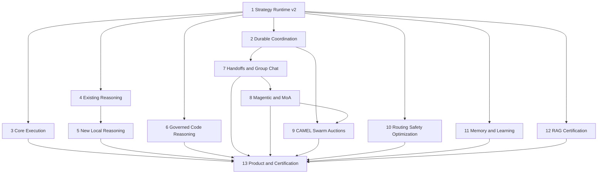

# Agent Pattern Completion Program Design

**Date:** 2026-08-03  
**Status:** Approved design, pending implementation-plan approval  
**Scope:** End-to-end product completion across backend, persistence, APIs, SDKs, frontend,
observability, security, operations, documentation, and rollout  
**Handoff boundary:** Same civilization only for the first production release

## 1. Executive Summary

AgentVerse already contains a capable single-agent kernel, dynamic runtime profiles, a
multi-agent civilization control plane, governed tool execution, durable goal state, and a
large catalogue of reasoning, retrieval, memory, and optimization strategies. The remaining
problem is not simply to add more algorithms. The platform needs one production contract that
turns a registered strategy into a bounded, observable, resumable, policy-enforced runtime.

This program completes every planned, partial, scaffold-level, and materially misclassified
capability across the six AgentVerse learning phases. It uses a modular-monolith architecture:

1. `AgentGraph` remains the trusted single-agent execution kernel.
2. Civilization becomes the durable multi-agent coordination boundary.
3. The execution environment remains the only boundary for generated code.
4. A versioned strategy runtime selects and executes local, sandboxed, or distributed adapters.
5. Reflexion becomes an evidence-backed learning service shared by every execution tier.

PostgreSQL remains canonical. Redis provides streams, leases, wakeups, caches, and checkpoints.
Celery remains the background execution engine. Every new path preserves tenant isolation,
budgets, policies, HITL, audit, rollback, and backward-compatible public APIs.

## 2. Goals

- Complete the ten named capability gaps and all additional planned or partial capabilities in
  the six learning phases.
- Replace registry-label certification with executable adapter, readiness, behavior, and
  production-path evidence.
- Make runtime-profile selection authoritative before graph compilation.
- Provide durable pause, resume, replay, cancellation, recovery, and migration for every
  long-running strategy.
- Prevent unbounded agent count, reasoning search, generated code, context growth, latency,
  token consumption, and cost.
- Deliver complete APIs, SDKs, frontend experiences, observability, runbooks, and rollout
  controls for production operation.

## 3. Non-Goals

- Creating one deployable service per pattern.
- Replacing FastAPI, LangGraph, PostgreSQL, Redis, Celery, MCP, or the existing provider layer.
- Supporting cross-tenant agent handoffs in the first release.
- Exposing private chain-of-thought. Only safe rationale summaries and structured traces are
  persisted or returned.
- Introducing Kafka or a graph database before measured scale requires either dependency.
- Treating catalogue membership or a passing unit test as production certification.

## 4. Architecture Decisions

### 4.1 Selected approach

Use composable, versioned strategy adapters over existing AgentVerse kernels.

Rejected alternatives:

- Extending `AgentGraph` with a boolean and branch for every pattern would couple local
  reasoning, distributed coordination, memory, and code execution in one class.
- Independent microservices for every pattern would duplicate governance and introduce
  premature distributed-system complexity.

### 4.2 Execution tiers

| Tier | Capabilities | Owning runtime |
|---|---|---|
| Local reasoning | CoT variants, Self-Consistency, Tree/Graph of Thoughts, Least-to-Most, ReWOO, LATS, LLM Compiler | Strategy Runtime + AgentGraph |
| Governed sandbox | Program of Thought, CodeAct | Strategy Runtime + Execution Environment |
| Distributed coordination | Handoffs, Group Chat, Magentic, MoA, Supervisor, Debate, Goal Tree, CAMEL, Swarm, Auctions, BabyAGI, AutoGPT, Generative Agents | Strategy Runtime + Civilization |
| Cross-cutting learning | Reflexion, episodic/procedural/LTM/KG/prospective memory, consolidation, Voyager, A/B optimization | Memory and Intelligence runtimes |

### 4.3 Authority boundaries

- `StrategyRegistry` owns metadata, versions, compatibility, required capabilities, and adapter
  resolution.
- `RuntimeProfileBuilder` owns goal classification, strategy selection, limits, and rejected
  alternatives.
- `StrategyRunner` owns lifecycle, deadlines, cancellation, checkpoints, and traces.
- `AgentGraph` owns one governed agent execution.
- Civilization owns multi-agent membership, routing, coordination, shared context, and authority.
- Governor owns admission, spawning, retirement, budgets, and policy inheritance.
- PostgreSQL owns accepted state. Redis is never the sole record of accepted work.
- The Execution Environment is the only allowed generated-code runtime.

## 5. Shared Foundation A: Strategy Runtime v2

Introduce an executable strategy contract rather than adding more graph flags.

### 5.1 Core contracts

- `StrategySpec`: ID, version, family, state schema, dependencies, compatibility, exclusions,
  risk, cost, latency, and readiness requirements.
- `StrategyExecutionRequest`: tenant, goal, agent, runtime profile, context snapshot, policy
  envelope, budget, deadline, cancellation token, and idempotency key.
- `StrategyExecutionResult`: terminal state, answer, evidence, artifacts, costs, next action,
  safe rationale, and trace summary.
- `StrategyCheckpoint`: adapter version, state schema version, cursor, state reference, and
  migration metadata.
- `PatternLimits`: maximum calls, nodes, edges, depth, fan-out, rounds, tokens, duration, and
  cost.
- `ReadinessProbe`: static contract evidence plus operational dependency evidence.
- `CertificationEvidence`: unit, integration, restart, policy, cost, load, and canary results.

### 5.2 Runtime-profile corrections

- Build one profile for the specific goal before constructing the graph.
- Select one primary reasoning strategy and explicitly compatible auxiliary strategies.
- Reject incompatible combinations with a recorded reason.
- Persist the selected profile and its version with the goal.
- Pass the profile into `AgentGraph`; do not rebuild it during initialization.
- Consolidate the production selector with legacy pattern/dynamic graph assemblers.
- Unify overlapping model-router ownership and workflow execution paths.

### 5.3 State semantics

Registry states become evidence-backed:

- `planned`: contract only; no executable adapter.
- `partial`: executable in a bounded non-production or incomplete path.
- `implemented`: executable through the canonical production path with readiness enforcement.
- `certified`: implemented plus required restart, security, policy, cost, and canary evidence.
- `disabled`: administratively unavailable regardless of readiness.

## 6. Shared Foundation B: Coordination Runtime

### 6.1 Canonical entities

- `coordination_sessions`: pattern, lifecycle, participants, policy snapshot, budget, deadline.
- `strategy_executions`: adapter/version, profile snapshot, state, checkpoint, result, cost.
- `context_messages`: monotonic sequence, sender, recipients, type, content reference,
  provenance, data classification, redaction state.
- `progress_ledgers`: objective, facts, assumptions, completed work, open work, blockers,
  stall count, next actor, version.
- `work_items`: dependencies, priority, state, owner, deadline, provenance.
- `handoffs`: source, target, context snapshot, policy envelope, budget, state, expiry.
- `claims`: work item, owner, lease, fencing token, heartbeat, state.
- `agent_bids`: work item, bidder, capability, quality, cost, latency, confidence, signature.
- `allocations`: selected bid, scoring policy, explanation, lease, fallback reason.
- `thought_nodes` and `thought_edges`: bounded thought graph and provenance.
- `strategy_artifacts`: programs, plans, observations, proposals, aggregates, safe traces.
- `coordination_outbox`: committed domain events awaiting delivery.

Every table is tenant-scoped, RLS-protected with `USING` and `WITH CHECK`, versioned where
mutable, and indexed from `tenant_id` into the dominant query dimensions.

### 6.2 Event envelope

Every coordination event contains:

- `event_id` and `schema_version`
- `tenant_id`, `run_id`, and `session_id`
- monotonic `sequence`
- `correlation_id` and `causation_id`
- `occurred_at` and `producer`
- typed payload and data classification
- idempotency key and optional expiry

PostgreSQL outbox delivery is canonical. Redis Streams provides low-latency consumption and
acknowledgements. Postgres polling is the degraded delivery path.

### 6.3 Public interaction model

- REST creates, reads, configures, approves, cancels, and resumes runs.
- SSE streams replayable one-way progress using persisted sequence cursors.
- WebSocket supports bidirectional human participation in group chat only.
- MCP/A2A carries governed agent work, never unstructured privileged control messages.

## 7. Six-Phase Capability Scope

### 7.1 Phase 1: Core Execution

| Capability | Required completion |
|---|---|
| ReAct and Plan-and-Execute | Preserve as canonical kernel; certify profile/version propagation and replay. |
| Structured planning | Unify structured plan contracts and dependency validation. |
| Wave execution | Consolidate duplicate DAG executors; add bounded concurrency and resume. |
| Loop-until | Standardize condition evaluation, backoff, cancellation, and iteration budgets. |
| Loop Engineering | Reclassify as a bundle of loop and wave capabilities, not a separate runtime. |
| Persistent strategy rotation | Persist attempts, strategy transitions, and terminal evidence. |
| Workflow DAG | Consolidate legacy and new workflow APIs on one executor. |
| Legacy AgentLoop | Retire after production parity, migration, and rollback validation. |
| Runtime topology selection | Make the selected runtime profile authoritative before graph compilation. |

### 7.2 Phase 2: Reasoning And Evaluation

| Capability | Required completion |
|---|---|
| Chain of Thought | Certify the existing conditional path and persist only safe summaries. |
| Zero-Shot CoT | Model as CoT configuration, not a duplicate adapter. |
| Few-Shot CoT | Add governed example retrieval, provenance, injection screening, and evaluation. |
| Reflection | Preserve failed-step critique and bounded replan integration. |
| Self-Refine | Fix profile-to-graph propagation and add production selection evidence. |
| Self-Consistency | Add automatic selection, quorum policy, disagreement trace, and cost limits. |
| Tree of Thoughts | Add automatic selection, bounded search, checkpointing, and certification. |
| Peer Review | Add automatic selection, reviewer independence policy, and production E2E tests. |
| Graph of Thoughts | Add typed DAG generation, cycle validation, scoring, pruning, merge, synthesis. |
| Least-to-Most | Add simple-first decomposition, dependency validation, cumulative context, synthesis. |
| ReWOO | Freeze and validate tool plans, resolve variables, execute waves, then synthesize. |
| Program of Thought | Generate one bounded program, execute in sandbox, validate output, synthesize. |
| CodeAct | Interleave bounded code actions and observations with stagnation and resume controls. |
| LATS | Add bounded Monte Carlo search, evaluator policy, rollout budget, and checkpoint state. |
| LLM Compiler | Compile dependency-aware tool tasks, validate schemas, execute waves, aggregate. |
| EvalRunner | Preserve seven-dimension persisted evaluation and correlate to strategy version. |
| Runtime scorecard | Replace fixed/fallback evidence with actual retrieval and execution evidence. |
| Regression gate | Gate promotion and canary expansion on versioned baselines. |

### 7.3 Phase 3: Retrieval

All 18 RAG adapters remain in scope: Naive, Hybrid, HyDE, Multi-Hop, Graph, Corrective,
Adaptive, Modular, Speculative, Agentic, Web-Augmented, Fusion, Self-RAG, FLARE, RAPTOR,
Agentic Chunking, ColBERT, and RAFT.

Completion work is cross-cutting rather than algorithm replacement:

- Separate adapter implementation from deployment readiness.
- Certify each dependency combination and degraded mode.
- Persist selected strategy, delegated strategy, evidence, citations, cost, and readiness trace.
- Add deployment profiles for Graph, web, ColBERT, RAPTOR artifacts, and RAFT-trained models.
- Add restart, policy, timeout, and live-capability tests.
- Ensure adaptive/delegating strategies cannot select unavailable downstream adapters.
- Preserve citation and provenance verification through synthesis and remediation.

### 7.4 Phase 4: Multi-Agent

| Capability | Required completion |
|---|---|
| Goal Tree | Fix selector propagation; persist parent/child run DAG and restart state. |
| Supervisor | Replace in-memory-only orchestration with durable assignments and synthesis. |
| Debate | Persist rounds, critiques, votes, consensus, and disagreement escalation. |
| Consensus verification | Version quorum, cross-model policy, judge policy, and HITL escalation. |
| True handoffs | Request, accept, reject, expire, context transfer, reauthorization, resume. |
| Shared-context group chat | Canonical ordered transcript, speaker policy, compaction, termination, replay. |
| Magentic-One | Durable task/progress ledgers, stall detection, replanning, next-speaker selection. |
| Mixture-of-Agents | Layered proposer fan-out, model diversity, quorum, aggregation, provenance. |
| CAMEL | Role contracts, inception prompts, bounded dialogue, termination, safety controls. |
| Generative Agents | Persona memory, observation, reflection, planning, simulation-time controls. |
| Decentralized swarm | Peer advertisements, gossip dedupe, claims, leases, hop limits, convergence. |
| Market/auction allocation | Sealed bids, deterministic scoring, fairness controls, winner lease, rebid. |
| A2A | Complete tenant configuration, signatures, context persistence, callback wiring, SSRF controls. |

Handoffs are limited to agents in the same civilization for the first release. Cross-civilization
and cross-tenant federation require a later trust-negotiation design.

### 7.5 Phase 5: Routing, Control, Safety, And Optimization

| Capability | Required completion |
|---|---|
| Goal classification/profile | Add task-shape, risk, freshness, code, collaboration, and cost signals. |
| Pattern selection | Apply selections to production topology with compatibility explanations. |
| Agent routing | Add capacity, deadlines, confidence, and allocation provenance. |
| Model routing | Unify role router and AI registry router; add health, cost, latency, and fallback. |
| Skill routing | Add semantic selection, versioning, trust, and tool-policy intersection. |
| Tool selection/ranking | Wire semantic and trust-weighted selectors into governed dispatch. |
| Meta-agent planner | Certify existing API path and validate generated configurations. |
| Embedding routing | Route by content/query type, dimensions, cost, latency, and compatibility. |
| Cost optimization | Close feedback from actual outcomes into bounded selection policy. |
| Latency optimization | Add percentile-aware routing, deadlines, hedging policy, and saturation signals. |
| Token/prompt compression | Add canonical stage, fidelity evaluation, provenance, and fallback. |
| Context budgeting | Allocate token budgets across instructions, memory, retrieval, tools, and output. |
| Constitutional AI | Add critique/revision policy without replacing deterministic governance. |
| Policy compiler | Compile declarative policy into validated runtime constraints with deny-by-default. |
| Sandbox | Enforce profiles, canonical paths, exact host rules, output caps, cancellation, audit. |
| Plan verification | Wire feasibility, risk, cost, policy, and HITL analysis before execution. |
| Data classification | Classify before prompts, messages, artifacts, handoffs, and memory writes. |
| Provenance verification | Verify claim-level evidence through retrieval, synthesis, and sharing. |
| BabyAGI | Durable task creation, prioritization, deduplication, bounded execution, completion. |
| AutoGPT | Long-horizon controller using the strategy runtime, not a separate unrestricted loop. |

### 7.6 Phase 6: Memory And Learning

| Capability | Required completion |
|---|---|
| Working memory | Keep checkpoint-safe strategy state with compaction and classification. |
| Session/execution memory | Reconcile aliases; add semantic ranking and retention. |
| Long-term memory | Replace truncation with reflective extraction, evidence, confidence, lifecycle. |
| Episodic memory | Use stored embeddings for semantic recall and outcome-aware ranking. |
| Procedural memory | Version learned sequences; validate tools/policies before reuse. |
| Reflexion | Unify stores and writers; awaited semantic recall; evidence and effectiveness loop. |
| Knowledge-graph memory | Define ownership versus Graph RAG and add write/merge/decay lifecycle. |
| Prospective memory | Persist future intentions, triggers, deadlines, cancellation, and completion. |
| Memory consolidation | Consolidate canonical stores with conflict detection and provenance. |
| Semantic cache | Reclassify under optimization and preserve cache-specific semantics. |
| Prompt A/B | Complete assignment, outcome recording, significance, promotion, rollback. |
| Model/RAG A/B | Complete experimental governance, sample thresholds, promotion, kill switches. |
| Voyager | Add governed skill synthesis, curriculum, validation, versioning, and reuse. |
| Self-improvement actions | Replace no-op actions with explicit bounded operations or remove them. |

## 8. Flagship Protocol Designs

### 8.1 Handoff lifecycle

`requested -> accepted | rejected | expired -> executing -> completed | failed | cancelled`

- Snapshot only relevant context and artifacts.
- Carry remaining budget, deadline, policy, connector allowlist, and classification.
- Reauthorize the target agent; never transfer source privileges.
- Resume the source or parent strategy with the target result and evidence.
- Make every transition idempotent and auditable.

### 8.2 Group chat lifecycle

`created -> active -> awaiting_human | compacting -> completed | failed | cancelled`

- Persist append-only messages with monotonic sequence.
- Support round-robin, rule-based, and agent-based speaker selection.
- Synchronize bounded context before each turn.
- Compact without losing decisions, unresolved questions, evidence, or provenance.
- Terminate by explicit condition and hard round/cost/time limits.

### 8.3 Magentic lifecycle

- Create an initial task ledger and optional human review request.
- Select the next participant based on open work and capability.
- Record progress after every round.
- Detect repeated no-progress revisions.
- Replan within bounded reset limits; escalate or terminate after limits.
- Synthesize only after the ledger records request satisfaction.

### 8.4 Swarm lifecycle

- Publish bounded work advertisements.
- Discover eligible peers from Society.
- Claim work using expiring leases and fencing tokens.
- Gossip only typed, deduplicated, TTL-limited messages.
- Reclaim abandoned work after lease expiry.
- Stop on convergence, terminal objective, deadline, or budget exhaustion.

### 8.5 Auction lifecycle

`announced -> bidding -> sealed -> scored -> allocated -> executing -> settled | rebid`

- Use deterministic policy weights for quality, cost, latency, confidence, fairness, and load.
- Keep bids sealed until the deadline.
- Detect sybil, reciprocal, collusive, stale, and forged bids.
- Fall back to Society routing, then Governor-authorized spawning when no valid bid exists.

### 8.6 Code execution lifecycle

- Generate typed program/action specification.
- Validate language, code size, imports, policy, and resource limits.
- Execute only in the isolated environment.
- Capture bounded stdout, stderr, exit state, artifacts, and resource usage.
- Sanitize observations before returning them to the model.
- Fail closed when the sandbox is unavailable.

## 9. Security And Threat Model

### 9.1 Mandatory controls

- RLS and tenant context on every new table and raw SQL path.
- Authorization on every command and state transition.
- Reauthorization after handoff and before every tool call.
- Prompt-injection screening and typed trust labels for shared messages.
- Data classification before model calls, persistence, sharing, and memory writes.
- Connector allowlist intersection across parent and child runs.
- Structured audit records without secrets, private reasoning, or unnecessary PII.
- Encryption for sensitive content and artifact references.
- Signed internal/A2A dispatch and replay protection.
- Default-deny generated-code network, filesystem, secret, process, and package access.

### 9.2 Pattern-specific threats

- Context poisoning and instruction laundering in group chat and handoffs.
- Agent impersonation, forged reputation, sybil identities, and collusive auctions.
- Gossip storms, replay loops, stale leases, and split-brain claims in swarms.
- Cost amplification and denial of wallet through fan-out/search/round explosion.
- Sandbox escape, dependency confusion, output flooding, and secret exfiltration.
- Poisoned or overgeneralized Reflexion lessons.
- Biased routing and allocation caused by historical reputation feedback loops.

## 10. Reliability And Recovery

- Transactional outbox before event delivery.
- At-least-once consumers with idempotency and duplicate suppression.
- Checkpoint after every authority-changing transition and bounded strategy phase.
- Adapter/state-schema compatibility checks before resume.
- Cancellation propagation from parent to children, leases, sandbox jobs, and streams.
- Lease expiry, fencing tokens, heartbeat monitoring, and deterministic reclaim.
- Dead-letter handling and operator replay for poison events.
- Quorum-based MoA degradation to the highest-quality valid proposal.
- No-bid auction fallback and bounded rebid.
- Redis outage degrades to Postgres polling without losing accepted work.
- Sandbox outage fails CodeAct and PoT closed.
- Legacy AgentGraph fallback remains available during canary rollout only.

## 11. Non-Functional Requirements

### 11.1 Performance and scale

- Default coordination event write p95 below 100 ms excluding model latency.
- Replay one 10,000-event run without full-table scans.
- Configurable per-plan fan-out, depth, rounds, concurrent workers, tokens, duration, and cost.
- Backpressure when worker saturation, outbox lag, or budget pressure exceeds policy.
- Partition or archive high-volume message, event, and trace tables based on measured growth.

### 11.2 Availability and durability

- No accepted coordination work is lost after API, worker, or Redis restart.
- Authority-changing transitions are transactional and replayable.
- Duplicate Celery delivery cannot execute a tool, allocation, or settlement twice.
- Cancellation reaches active children and sandboxes within the configured operational SLO.

### 11.3 Explainability

- Expose selected and rejected strategies with compatibility/readiness reasons.
- Expose safe plan, delegation, bid-scoring, ledger, memory-recall, and fallback summaries.
- Never expose hidden chain-of-thought.
- Correlate parent goal, child goal, session, strategy execution, artifact, and event IDs.

## 12. API, SDK, And Frontend Surface

### 12.1 Backend API

- Additive strategy override and limits on goal creation.
- Coordination session create/read/cancel/resume endpoints.
- Message, ledger, handoff, claim, bid, allocation, and artifact read models.
- Approval and human-response endpoints.
- Explain endpoint with profile, readiness, trace, cost, evidence, and memory summaries.
- Versioned SSE events with `Last-Event-ID` replay.
- WebSocket group-chat participation with authorization and backpressure.

### 12.2 SDKs

- Regenerate OpenAPI after backend contracts stabilize.
- Add equivalent typed models and operations to Python and TypeScript SDKs.
- Add retry, idempotency, replay cursor, cancellation, and streaming helpers.
- Preserve existing goal submission and result fields.

### 12.3 Frontend

- Strategy selection and limits in goal composition.
- Coordination run timeline and parent/child topology.
- Shared transcript with speaker, trust label, citations, and compaction markers.
- Magentic ledger revision and stall/replan view.
- Swarm work/claim topology and lease state.
- Auction bid summary, scoring explanation, and winner state.
- Code execution status and sanitized artifacts.
- Reflexion recall/write evidence in explainability views.
- WCAG 2.2 AA, keyboard access, screen-reader labels, reduced motion, responsive layouts.

## 13. Observability And Operations

### 13.1 Traces and metrics

- Trace every strategy selection, phase, handoff, message read, speaker choice, claim, bid,
  allocation, sandbox run, memory recall, checkpoint, and fallback.
- Metrics include success, cost, tokens, latency, fan-out, depth, rounds, quorum failures,
  handoff latency, claim contention, ledger stalls, outbox lag, sandbox denial, and lesson
  usefulness.
- Dashboards separate platform health from pattern quality and business outcomes.

### 13.2 Alerts and runbooks

Create alerts and runbooks for:

- Outbox/stream lag and dead-letter growth.
- Stuck or repeatedly reclaimed leases.
- Runaway fan-out, token use, cost, and duration.
- Sandbox outage or denial spikes.
- Repeated Magentic stalls and strategy fallback spikes.
- Auction no-bid/collusion/fairness anomalies.
- Reflexion precision degradation or poisoning indicators.
- RLS/policy/authorization denials and cross-tenant anomaly detection.

## 14. Testing And Certification

### 14.1 Required test layers

- Pure contract and state-machine unit tests.
- Adapter behavior and limit tests.
- AgentGraph topology and checkpoint tests.
- Database migration, RLS, optimistic concurrency, and outbox integration tests.
- Redis Streams, lease, duplicate delivery, and Redis-loss tests.
- Celery retry, worker crash, cancellation, and restart/resume tests.
- Sandbox escape, network, filesystem, timeout, output, and resource-limit tests.
- Policy, HITL, data classification, provenance, and audit tests.
- Adversarial multi-agent tests for poisoning, impersonation, collusion, and loops.
- API, OpenAPI, SDK contract, SSE replay, and WebSocket tests.
- Frontend unit, accessibility, responsive, and Playwright E2E tests.
- Load, soak, chaos, cost-budget, and canary evaluation suites.

### 14.2 Promotion gate

A capability may be marked `implemented` only after canonical production-path tests pass. It
may be marked `certified` only after:

1. Required dependencies report ready.
2. Restart/resume and duplicate-delivery tests pass.
3. Tenant isolation and authorization tests pass.
4. Budget, timeout, cancellation, and kill-switch tests pass.
5. Observability and safe explainability are verified.
6. SDK and frontend contracts pass when user-facing.
7. Canary quality, cost, and latency meet the approved baseline.

## 15. Delivery Workstreams And Dependency Order

The program is implemented through separately executable plans:

1. Registry reconciliation, executable strategy contracts, and runtime-profile v2.
2. Durable coordination context, sequencing, outbox, replay, and common APIs.
3. Core execution consolidation and certification.
4. Existing reasoning/evaluation wiring and scorecard truthfulness.
5. New local reasoning: Few-Shot CoT, GoT, Least-to-Most, ReWOO, LATS, LLM Compiler.
6. Governed code reasoning: PoT, CodeAct, sandbox hardening.
7. Handoffs, shared-context group chat, durable Supervisor/Debate/Goal Tree, A2A.
8. Magentic-One and Mixture-of-Agents.
9. CAMEL, Generative Agents, governed swarm, and auctions.
10. Routing/control/safety/optimization completion, BabyAGI, and AutoGPT.
11. Memory and learning completion, including full Reflexion, consolidation, experiments,
    prospective memory, and Voyager.
12. RAG readiness and live certification across all 18 strategies.
13. End-to-end APIs, SDKs, frontend, observability, operations, migration, and certification.

## 16. Rollout And Migration

1. Add versioned contracts and profile v2 without changing execution.
2. Run new resolution and certification logic in shadow mode.
3. Add coordination tables, RLS, outbox, streams, replay, and checkpoint infrastructure.
4. Dual-read/dual-write where existing Reflexion or civilization state must migrate.
5. Enable each capability behind a tenant allowlist, feature flag, and kill switch.
6. Canary internal tenants, then low-risk plans, then broader cohorts.
7. Compare quality, cost, latency, failure, and policy metrics against legacy baselines.
8. Promote registry state only after evidence gates pass.
9. Retain legacy fallback for one stable release, then remove after rollback-window expiry.
10. Backfill structured Reflexion metadata and reclassify duplicate/misnamed registry entries.

## 17. Required ADRs

1. Versioned executable strategy adapter contract.
2. AgentGraph as single-agent kernel and Civilization as distributed coordinator.
3. PostgreSQL canonical state, transactional outbox, and Redis Streams.
4. Canonical conversation log with Blackboard as a projection.
5. At-least-once delivery with idempotency, leases, and fencing tokens.
6. Governor-constrained swarm and deterministic market allocation.
7. Mandatory isolated execution for CodeAct and Program of Thought.
8. Structured, evidence-backed Reflexion memory.
9. Runtime-profile v2 composition and incompatibility rules.
10. Modular-monolith-first deployment and extraction criteria.

## 18. Acceptance Criteria

- Every planned, partial, scaffold-level, alias, and stale classification in the six phases has
  an explicit implementation, certification, reconciliation, or deprecation task.
- The ten named gaps are executable through canonical production paths.
- No new pattern bypasses governance, RLS, budgets, HITL, audit, or sandbox controls.
- All long-running patterns survive worker and Redis restarts without losing accepted work.
- APIs remain backward compatible and SDK/OpenAPI contract tests pass.
- User-facing patterns are operable through accessible frontend experiences.
- Operators can explain, replay, cancel, recover, disable, and measure every strategy.
- Registry state is derived from evidence and cannot overstate operational readiness.

## 19. Risks And Mitigations

| Risk | Mitigation |
|---|---|
| Pattern combinations create invalid topology | Primary strategy plus declared auxiliary compatibility and deterministic rejection. |
| Fan-out/search causes runaway cost | Hard pre-dispatch limits, per-plan ceilings, live metering, cancellation, kill switches. |
| Shared context spreads malicious instructions | Typed trust labels, classification, screening, least-context snapshots, policy rechecks. |
| Coordination increases database writes | Indexing, bounded traces, artifact references, retention, measured partitioning. |
| Swarm conflicts with governance | Governor remains authority; peer coordination cannot grant privilege or exceed budgets. |
| Auction amplifies reputation bias | Transparent weights, exploration quota, confidence bounds, fairness metrics, audit. |
| Reflexion recalls harmful lessons | Quarantine, evidence, semantic applicability, expiry, usefulness feedback, deletion. |
| Adapter upgrades break resume | Versioned checkpoints, state migrations, controlled restart when migration is impossible. |
| Catalogue drifts from reality | Automated behavior/readiness certification and generated capability documentation. |

## 20. Final Design Position

AgentVerse should not become a collection of unrelated pattern demos. The completed platform
will expose advanced algorithms through one governed strategy lifecycle, one durable
coordination model, one code-execution trust boundary, and one evidence-backed certification
system. This keeps simple goals inexpensive while allowing complex goals to opt into increasingly
powerful reasoning and collaboration under explicit operational limits.