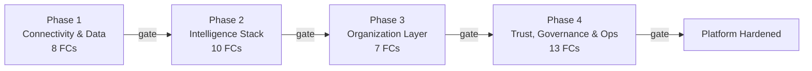

# AgentVerse — Platform Hardening Design (Per-Phase)

> **For agentic workers:** REQUIRED SUB-SKILL: Use `superpowers:writing-plans` **only when the user explicitly instructs** — not automatically after spec approval. Then use `superpowers:executing-plans` to execute each phase in a separate session. All phases use checkbox (`- [ ]`) syntax for tracking.

**Date:** 2026-08-20
**Status:** Approved (design) → pending plan generation
**Author:** Brainstorming session (user + copilot)
**Companion doc:** `agent-verse-backend/docs/superpowers/specs/2026-08-20-hitl-gap-analysis.md` (the gold-standard gap analysis that informs every phase)

---

## 1. Goal

Every feature in AgentVerse, across both `agent-verse-backend/` (73 `app/` packages) and `agent-verse-frontend/` (62 `src/features/` directories), is **hardened** end-to-end:

- Deep code analysis surfaces gaps (broken contracts, auth bypasses, silent failures, missing tests, missing spans, missing retries).
- Gaps are fixed with **test-first discipline** — the test is red before the fix makes it green.
- **If a gap requires a code change, that change MUST be made.** Writing the test and stopping is not acceptable — the fix must be applied until the test is green and coverage passes. The loop is: write test (red) → write fix → run tests → if still failing, fix again → repeat until green.
- Coverage, type safety, and lint gates hold — coverage ≥85% backend / ≥80% frontend, mypy 0, ruff 0, tsc 0, eslint 0.
- **A phase does not close until every failing test is green.** If a fix introduces a new failure, that failure must also be fixed before the phase can pass its gate.
- A hard **stage gate** blocks the next phase until the current one is provably green.
- **No invented work.** If a phase's deep read shows zero gaps, the phase logs "verification-only" and passes its gate.

---

## 2. Doc Structure — Per Phase, Not Per FC

This master spec points at **one phase doc per phase**:

```
docs/superpowers/specs/platform-hardening/
  MASTER-SPEC.md                          ← this file (overview + phase index + gate definitions)
  phase-1-connectivity-and-data.md        ← Stage 1: 8 FCs (FC-01..FC-08) collapsed into one phase doc
  phase-2-intelligence-stack.md           ← Stage 2: 10 FCs (FC-09..FC-18) collapsed into one phase doc
  phase-3-organization-layer.md           ← Stage 3: 7 FCs (FC-19..FC-25) collapsed into one phase doc
  phase-4-trust-governance-ops.md         ← Stage 4: 13 FCs (FC-26..FC-38) collapsed into one phase doc
```

**Why per phase instead of per FC:**
- FCs within a phase are tightly coupled (they share the same dependency layer and stage gate).
- A single phase doc lets the executing session keep a single coherent gap table instead of fragmenting context across 38 files.
- The HITL gap analysis (`2026-08-20-hitl-gap-analysis.md`) proved the format — one doc, many gaps, one acceptance criteria section.
- Phase docs are still small enough to fit comfortably in a single executing session's context window.

Each phase doc contains:
1. **Scope** — every backend package and frontend feature in the phase
2. **FC Catalog** — the FCs covered, with file ownership
3. **Phase Gap Table** — every gap found across every FC, with severity (P0/P1/P2) + file:line + fix approach
4. **Test Plan** — one row per gap
5. **Acceptance Criteria** — what the phase gate requires to pass

---

## 3. The Four Phases (Dependency-Ordered)

The phases are ordered by dependency layer. Within a phase, FCs may be executed in any order (they share a gate, not a sequence). **We do not start phase N+1 until phase N's gate passes.**



### Phase Index

| Phase | Name | FCs | Backend packages | Frontend features | Gate |
|-------|------|-----|------------------|-------------------|------|
| **1** | Connectivity & Data | 8 (FC-01..FC-08) | mcp, knowledge, knowledge_graph, triggers, embedding, rpa, voice, chat | connectors, knowledge, knowledge-graph, schedules, rpa, chat, onboarding | Stage 1 gate |
| **2** | Intelligence Stack | 10 (FC-09..FC-18) | agent, orchestration, org, services, rag, marketplace, providers, governance, skills_runtime | agents, goals, workflow-builder, workflow-engine, marketplace, models, governance, approvals, skills, prompt-variants, eval, eval-suites | Stage 2 gate |
| **3** | Organization Layer | 7 (FC-19..FC-25) | coordination, civilization, org/domains, billing, sla, auth, notifications, integrations | coordination, civilization, domains, billing-compliance, auth, notifications, channels, integrations | Stage 3 gate |
| **4** | Trust, Governance & Ops | 13 (FC-26..FC-38) | governance, guardrails_v2, red_team, observability, analytics, gateway, execution_environment, reliability, lifecycle, memory_v2, context, optimization, plan_runtime, orchestration, tool_runtime, capabilities, state_runtime, sdk, testing, bootstrap | governance, audit, red-team, observability, analytics, gateway, security, compliance, simulation, lab, admin, settings, status, tools, training | Stage 4 gate (final) |

---

## 4. FC Catalog (All 38 FCs)

### Stage 1 — Connectivity & Data (FC-01 to FC-08)

| FC # | Name | Backend (app/) | Frontend (src/features/) |
|------|------|----------------|--------------------------|
| FC-01 | MCP Connectors | `mcp/` (registry, client, oauth) | `connectors/` |
| FC-02 | Knowledge Base & RAG | `knowledge/`, `rag/` | `knowledge/` |
| FC-03 | Knowledge Graph | `knowledge_graph/` | `knowledge-graph/` |
| FC-04 | Triggers & Schedules | `triggers/` | `schedules/`, `triggers/` |
| FC-05 | Embedding & Multimodal | `embedding/`, `multimodal/` | (consumed via `lib/api/`) |
| FC-06 | RPA & Perception | `rpa/`, `perception/` | `rpa/` |
| FC-07 | Voice OS | `voice/` | (consumed via `lib/`) |
| FC-08 | Chat Engine & Chat-based Goals | `chat/` | `chat/` |

### Stage 2 — Intelligence Stack (FC-09 to FC-18)

| FC # | Name | Backend (app/) | Frontend (src/features/) |
|------|------|----------------|--------------------------|
| FC-09 | Agent Loop Planner/Executor/Verifier | `agent/` (loop, graph, prompts, nodes, state) | `agents/` |
| FC-10 | Workflow Builder & Engine | `workflow/`, `pipeline/`, `plan_runtime/`, `orchestration/` | `workflow-builder/`, `workflow-engine/`, `state-machines/` |
| FC-11 | AI Org Layer | `org/` (router, services, meta_orchestrator, team_formation, approval_chain, events) | `org/`, `builder/` |
| FC-12 | Goals Lifecycle / SSE / Queue | `services/` (goal_service, event_store, goal_queue, notification_service) | `goals/` |
| FC-13 | RAG Platform | `rag_platform/`, `rag/`, `ingestion/`, `ocr/` | (admin surfaces in `admin/`) |
| FC-14 | Goal & Chat Templates | `services/`, `content/` | `templates/`, `playground/`, `prompt-variants/` |
| FC-15 | Marketplace | `enterprise/` (marketplace) | `marketplace/` |
| FC-16 | Models & Provider Management | `providers/`, `services/llm_config_store.py`, `ai_router/`, `ai_ops/` | `models/` |
| **FC-17** | **✅ Approvals HITL Regression Hardening** | `governance/hitl.py`, `org/events.py`, `org/approval_chain.py`, `services/notification_service.py` | `approvals/`, `governance/`, `org/ApprovalCenter.tsx` |
| FC-18 | Skills Runtime | `skills_runtime/`, `capabilities/`, `tool_runtime/` | `skills/`, `tools/` |

### Stage 3 — Organization Layer (FC-19 to FC-25)

| FC # | Name | Backend (app/) | Frontend (src/features/) |
|------|------|----------------|--------------------------|
| FC-19 | C2C Coordination | `coordination/`, `gateway/` | `coordination/`, `gateway/` |
| FC-20 | Civilization Sim | `civilization/` | `civilization/` |
| FC-21 | Domains | `org/domains/`, `lifecycle/` | `domains/` |
| FC-22 | Billing & GST | `enterprise/` (billing), `db/models/` | `billing-compliance/` |
| FC-23 | SLA Monitoring | `governance/` (sla), `observability/` | `observability/` (SLA widgets) |
| FC-24 | Sessions & Auth | `auth/`, `tenancy/` | `auth/`, `onboarding/`, `rbac/` |
| FC-25 | Notifications & Channels | `services/`, `integrations/`, `net/` | `notifications/`, `channels/` |

### Stage 4 — Trust, Governance & Ops (FC-26 to FC-38)

| FC # | Name | Backend (app/) | Frontend (src/features/) |
|------|------|----------------|--------------------------|
| FC-26 | Governance Audit/Cost/Policies | `governance/` (audit, cost, policies, permissions) | `governance/`, `audit/`, `compliance/` |
| FC-27 | Guardrails v2 & Intelligence Safety | `guardrails_v2/`, `intelligence/`, `explainability_runtime/` | `security/`, `red-team/` (safety widgets) |
| FC-28 | Red Team & Simulation | `enterprise/` (red_team, simulation), `sandbox_runtime/` | `red-team/`, `simulation/`, `lab/` |
| FC-29 | Observability & Analytics | `observability/`, `analytics/`, `qos/` | `observability/`, `analytics/` |
| FC-30 | Gateway & Routing | `gateway/`, `routing_runtime/`, `ai_router/` | `gateway/` |
| FC-31 | Execution Environment & Sandbox | `execution_environment/`, `sandbox_runtime/`, `recovery/` | `simulation/` |
| FC-32 | Reliability | `reliability/`, `runtime_readiness/` | (consumed in `admin/`) |
| FC-33 | Lifecycle & Memory v2 | `lifecycle/`, `memory_v2/`, `memory/` | `memory/` |
| FC-34 | Context & Optimization | `context/`, `optimization/` | (consumed in `dashboard/`) |
| FC-35 | Plan Runtime & Orchestration | `plan_runtime/`, `orchestration/`, `collaboration_runtime/` | `state-machines/`, `collaboration/` |
| FC-36 | Tool Runtime & Capabilities | `tool_runtime/`, `capabilities/`, `tools/` | `tools/`, `training/` |
| FC-37 | State Runtime & SDK | `state_runtime/`, `sdk/`, `provenance/` | (sdk consumed via `lib/`) |
| FC-38 | Testing Infra & Bootstrap | `testing/`, `bootstrap/`, `cli/`, `data_classification/`, `api/` | `admin/`, `settings/`, `status/` |

---

## 5. Phase Doc Template

Every phase doc follows the **HITL gap-analysis format** (the proven gold standard from `2026-08-20-hitl-gap-analysis.md`). No exceptions.

```markdown
# Phase N — <Name> Hardening Spec

**Date:** 2026-08-20
**Stage:** <N>
**Status:** in-progress | complete
**Coverage target:** ≥85% (backend) / ≥80% (frontend)
**Companion:** docs/superpowers/specs/platform-hardening/MASTER-SPEC.md

## Scope
Backend packages (app/):
  - app/<domain-a>/
  - app/<domain-b>/

Frontend features (src/features/):
  - src/features/<feature-a>/
  - src/features/<feature-b>/

## FC Catalog (this phase)
| FC # | Name | Files | Coverage before |
|------|------|-------|-----------------|
| FC-NN | <name> | <files> | <X%> |

## Phase Gap Table
| ID | FC | Severity | Description | File:Line | Fix Approach |
|----|-----|----------|-------------|-----------|-------------|
| P<phase>-G-01 | FC-NN | P0 | <broken contract / auth bypass / data loss> | <file>:<line> | <how to fix> |
| P<phase>-G-02 | FC-NN | P1 | <missing test / missing retry / missing span> | <file>:<line> | <how to fix> |
| P<phase>-G-03 | FC-NN | P2 | <missing docstring / unused import / cosmetic lint> | <file>:<line> | <how to fix> |
| P<phase>-G-04 | FC-NN | — | No gaps found — verification only | — | — |

## Severity Rubric
- P0 — Blocked: broken contract · auth bypass · data loss · RLS missing · silent data corruption
- P1 — Must-fix: missing test · missing error handling · missing timeout · missing retry · missing OTel span
- P2 — Nice-to-have: missing docstring · unused import · cosmetic lint · missing type hint

## Test Plan
- [ ] P<N>-G-01: <test that asserts <behavior>>
- [ ] P<N>-G-02: <test that asserts <behavior>>
...

## Files to Create
| File | Purpose |
|------|---------|
| tests/<domain>/test_<name>.py | regression test for <gap> |
| src/features/<feature>/__tests__/<name>.test.tsx | component test for <gap> |

## Files to Modify
| File | Change |
|------|--------|
| app/<domain>/<file>.py | <one-line description> |
| src/features/<feature>/<file>.tsx | <one-line description> |

## Acceptance Criteria (Phase-N Gate)
- [ ] All P0 gaps closed
- [ ] All P1 gaps closed
- [ ] P2 gaps documented or closed
- [ ] Coverage ≥85% (backend) / ≥80% (frontend) for this phase's packages
- [ ] `uv run mypy app/<this phase's packages>` → 0 errors
- [ ] `uv run ruff check app/<this phase's packages>` → 0 errors
- [ ] `npm run test -- src/features/<this phase's features>` → PASS, coverage ≥80%
- [ ] `npm run typecheck` → 0 errors
- [ ] `npm run lint` → 0 errors
- [ ] No regressions in adjacent phases (run full suite: `uv run pytest tests/`)
- [ ] Spec committed: docs/superpowers/specs/platform-hardening/phase-N-<slug>.md
```

### Gap ID Convention

Within a phase, gaps are numbered with a phase prefix to avoid collisions with the HITL gap IDs (G-01..G-29):

```
P1-G-01, P1-G-02, ...     (Phase 1)
P2-G-01, P2-G-02, ...     (Phase 2)
P3-G-01, P3-G-02, ...     (Phase 3)
P4-G-01, P4-G-02, ...     (Phase 4)
```

FC-17 (HITL) keeps its original G-01..G-29 IDs because that gap analysis already exists and the regression tests already cover those gaps. Phase 2's gap table simply references the HITL gap IDs for FC-17's rows.

---

## 6. Per-FC Workflow (Inside a Phase)

Each phase doc's gap table is built by applying this 5-step workflow to every FC in the phase. **One branch per phase**, not per FC (the phase doc is the tracked artifact).

```
1. Branch
     git checkout -b feature/phase-N-<slug>-hardening

2. Deep-read
     Read every file in each FC's app/<domain>/ + src/features/<feature>/
     For each FC, log a row in the phase gap table:
       ID | FC | Severity | Description | File:Line | Fix Approach

3. Write the spec
     Write / update docs/superpowers/specs/platform-hardening/phase-N-<slug>.md
     Commit the spec BEFORE writing any tests:
       git commit -m "docs(phase-N): add hardening spec with <X> gaps"

4. Test-first per gap (TDD) — LOOP UNTIL GREEN
     For each P0/P1 gap in the phase table:
       a. Write a red test (test fails because the bug exists)
       b. Commit: git commit -m "test(phase-N FC-NN G-XX): assert <behavior>"
       c. Apply the code fix — the fix MUST be written, not just the test
       d. Run: uv run pytest tests/<domain>/test_<file>.py::test_<name> -q
       e. If still red → dig deeper, fix again, run again → repeat until green
       f. If the fix causes a new failure elsewhere → fix that too before continuing
       g. Commit only when green: git commit -m "fix(phase-N FC-NN G-XX): <one-line fix description>"

5. Coverage check
     uv run pytest tests/<phase>/ --cov=app/<pkgs> --cov-fail-under=85
     If coverage still below 85%: add more tests for untested branches → go back to step 4
     Repeat until coverage gate passes

6. Verify & gate
     Run the full verification commands in section 7
     Apply the phase gate (section 8)
     If gate fails on any criterion: loop back to step 4 for the failing criterion
     The phase is NOT complete until every gate criterion is met
```

### TDD Discipline (Hard Rule)

- A test must be **red** before the fix makes it green. This catches the "test passes even if you delete the code" anti-pattern.
- Tests are written **before** fixes — no exceptions.
- **Fixing the code is mandatory.** A test that documents a bug but is left red is not acceptable. The loop continues until the test is green.
- One commit per test batch, one commit per fix batch. Never bundle a test and its fix in the same commit (that hides the red→green transition in code review).
- If a gap is P2 (cosmetic), no test is required — the fix goes directly in the spec acceptance checkbox.
- **Coverage is a hard gate.** If running `--cov-fail-under=85` fails after all gap fixes, more tests must be written for untested branches and the loop repeats. The phase does not close until the coverage gate passes.

### "No Invented Work" Rule

If a phase's deep read shows **zero gaps** for an FC (coverage ≥85%, mypy clean, ruff clean, tests pass), the FC gets a row in the phase gap table like:

```
| P<N>-G-04 | FC-NN | — | No gaps found — verification only | — | — |
```

That FC is marked DONE with its verification commands in the acceptance criteria. **We never invent work.** Hardening means: prove it's solid, fix what's broken, don't touch what works.

---

## 7. Verification Commands

### 7.1 Backend (per phase)

```bash
cd agent-verse-backend

# Branch
git checkout -b feature/phase-N-<slug>-hardening

# Install / sync deps (uv-only, per AGENTS.md)
uv sync

# Per-phase test run (replace <phase-packages> with the phase's app/ packages)
uv run pytest tests/<phase-test-dirs>/ \
  --cov=app/<package-1> --cov=app/<package-2> ... \
  --cov-fail-under=85 -q

# Type safety
uv run mypy app/<package-1> app/<package-2> ...

# Lint
uv run ruff check app/<package-1> app/<package-2> ...

# Full-suite regression check (must remain green — proves no regressions in other phases)
uv run pytest tests/ -q --cov=app --cov-fail-under=85
```

### 7.2 Frontend (per phase)

```bash
cd agent-verse-frontend

# Type check
npm run typecheck

# Lint
npm run lint

# Unit + component tests with coverage
npm run test -- --coverage --run src/features/<feature-1> src/features/<feature-2> ...

# E2E (only for phases that touch user flows — Stages 1-3 need e2e for chat/goals/org)
npm run test:e2e
```

### 7.3 Integration Suite

When a phase touches persistence, RLS, Redis, or Celery (i.e., almost every phase), run the integration suite once before the gate:

```bash
cd agent-verse-backend

# Docker via colima is NOT auto-started — start it first (per AGENTS.md)
colima start

# Testcontainers env vars (per AGENTS.md)
export DOCKER_HOST="unix:///Users/harsh.kumar01/.colima/default/docker.sock"
export TESTCONTAINERS_RYUK_DISABLED=true

# Start minimum infra (Postgres+pgvector, Redis)
docker-compose -f infra/docker-compose.yml up -d postgres redis

# Apply migrations to a clean DB
uv run alembic upgrade head

# Run integration-marked tests for this phase
uv run pytest -m integration tests/<phase-test-dirs>/ -q
```

### 7.4 Conventions Enforced (per AGENTS.md + copilot-instructions.md)

- Always prefix backend Python with `uv run` (pytest, mypy, ruff, alembic, uvicorn, agentverse).
- `filterwarnings = ["error"]` — only testcontainers/asyncpg deprecations are scoped-ignored; any new test warning becomes a test failure.
- `httpx2` is required for Starlette's `TestClient` — never use plain `httpx` for ASGI tests.
- Use `AsyncSession` — never sync `Session` (per copilot-instructions.md "Backend Module Contract").
- Frontend: never call the API directly in a component — use TanStack Query hooks (per copilot-instructions.md rule 9).
- Frontend: never use `useEffect` for data fetching — use TanStack Query (rule 9).
- Frontend: every heavy route is `lazy(() => import(...))` wrapped in `<Suspense>` (rule 9).

---

## 8. Phase Gates

A phase gate is a **hard stop**. We do not start Phase N+1 until **every** FC in Phase N passes its gate. The gate is a command that runs and either prints `0` problems or blocks.

### 8.1 Gate Definition (per phase)

For each phase, the gate requires:

| Criterion | Command | Expected |
|-----------|---------|----------|
| Phase spec committed | `git log --oneline -- docs/superpowers/specs/platform-hardening/phase-N-<slug>.md` | at least one commit |
| All P0 gaps closed | phase doc acceptance criteria | all P0 checkboxes checked |
| All P1 gaps closed | phase doc acceptance criteria | all P1 checkboxes checked |
| Backend tests green | `uv run pytest tests/<phase-test-dirs>/ -q` | `0 failed` |
| Backend coverage met | `uv run pytest tests/<phase>/ --cov=app/<pkgs> --cov-fail-under=85` | passes |
| Backend types clean | `uv run mypy app/<phase-packages>` | `0 errors` |
| Backend lint clean | `uv run ruff check app/<phase-packages>` | `0 errors` |
| Frontend tests green | `npm run test -- --run src/features/<phase-features>` | passing |
| Frontend coverage met | `npm run test -- --coverage src/features/<phase-features>` | ≥80% |
| Frontend types clean | `npm run typecheck` | `0 errors` |
| Frontend lint clean | `npm run lint` | `0 errors` |
| No regressions | `uv run pytest tests/ -q` (full suite) | no previously-green test now red |

### 8.2 Gate Blockers (Cannot Pass If…)

1. **Any P0 gap still open** — no exceptions, no "we'll fix it in the next phase"
2. **Any previously-green test is now red** — this is a regression, the phase isn't done
3. **Coverage dropped below 85%** (backend) or 80% (frontend) — even if tests pass
4. **mypy reports any error** — strict mode, zero tolerance
5. **ruff reports any error** — zero tolerance
6. **The phase spec doc doesn't exist** — no spec, no phase, no merge

### 8.3 Stage 2 — Extra HITL Gate Check

Because FC-17 (HITL) is the gold-standard reference and its 29 gaps (G-01..G-29) are already fixed in commits `1c57fc44` and `e3b46e82`, the Phase 2 gate has an extra regression check:

```bash
cd agent-verse-backend

# The 29 HITL gaps' regression suite must remain green
uv run pytest tests/org/test_hitl_new_endpoints.py tests/org/test_approval_chains.py -q

# The HITL gap-analysis spec must still exist and reference the latest commit
test -f docs/superpowers/specs/2026-08-20-hitl-gap-analysis.md
```

If either check fails, Phase 2 does not pass its gate. The HITL fixes are load-bearing for the whole platform — any regression there must block.

### 8.4 Per-Phase Gate Commands

The exact commands per phase will live in each phase doc's "Acceptance Criteria" section. They follow the same template, substituting the phase's package list.

---

## 9. Final Completion Definition

When all 4 phases have passed their gates, the platform is **hardened**. Run this block to verify:

```bash
# === BACKEND ===
cd agent-verse-backend

# Full test suite — no skips, no xfails that hide bugs
uv run pytest tests/ -q --cov=app --cov-fail-under=85 --cov-report=term-missing

# Type safety — strict mode, zero tolerance
uv run mypy app

# Lint — zero tolerance
uv run ruff check .

# Integration suite (requires Docker/testcontainers)
colima start
export DOCKER_HOST="unix:///Users/harsh.kumar01/.colima/default/docker.sock"
export TESTCONTAINERS_RYUK_DISABLED=true
docker-compose -f infra/docker-compose.yml up -d postgres redis
uv run alembic upgrade head
uv run pytest -m integration -q

# === FRONTEND ===
cd ../agent-verse-frontend
npm run test -- --coverage
npm run typecheck
npm run lint
npm run test:e2e

# === SPEC INVENTORY ===
# All four phase docs must exist
ls docs/superpowers/specs/platform-hardening/phase-*.md | wc -l
# Expected: 4
```

### Definition of Done (per phase)

A phase is **DONE** when all of the following are true:

1. The phase spec doc is committed at `docs/superpowers/specs/platform-hardening/phase-N-<slug>.md`
2. All P0 gaps in its gap table are closed
3. All P1 gaps in its gap table are closed
4. Coverage ≥85% (backend) / ≥80% (frontend) for the phase's packages
5. mypy 0 errors on the phase's packages
6. ruff 0 errors on the phase's packages
7. vitest + tsc + eslint all clean on the phase's frontend features
8. No regressions in adjacent phases (full-suite run stays green)

The platform is **hardened** when all 4 phase DoD checks pass.

---

## 10. Commit Conventions

Branch name per phase: `feature/phase-N-<slug>-hardening` (not per-FC).

Commit format follows conventional commits (per `.claude/rules/git-workflow.md`):

```
docs(phase-N): add hardening spec with <X> gaps

test(phase-N FC-NN G-XX): assert <behavior>

fix(phase-N FC-NN G-XX): <one-line description of the fix>

test(phase-N): add integration test for <feature>

chore(phase-N): mark Phase N complete — coverage <NN>%, 0 mypy, 0 ruff
```

**Rules (from git-workflow.md):**
- `<type>` from the allowed set: `feat, fix, test, docs, refactor, chore, perf, style, ci`
- `phase-N` scope always present
- `FC-NN G-XX` in the scope when fixing a specific gap (e.g., `fix(phase-1 FC-01 P1-G-03): ...`)
- Subject line ≤72 chars, imperative mood, lowercase, no period
- Body explains **why**, not what (per the git-workflow rule)
- One logical change per commit (no bundling test + fix)

---

## 11. Reporting Cadence

After each FC inside a phase, post a one-line status:

```
✅ FC-01 (MCP Connectors) — gaps cataloged
   3 gaps found (1 P0, 2 P1) · deep-read complete
   row added to phase-1-connectivity-and-data.md gap table
```

After each gap fix inside a phase, post a one-line status:

```
✅ P1-G-03 fixed — added retry/backoff to MCP client
   test: tests/mcp/test_connectors_hardening.py::test_retry_on_503 — PASS
   fix:  app/mcp/client.py:147
```

After each phase gate, post:

```
✅ Phase N GATE PASSED — <Name>
   <K>/K FCs complete · <X> gaps found · <Y> fixed
   backend coverage: <NN>% · frontend coverage: <MM>%
   mypy: 0 · ruff: 0 · tsc: 0 · eslint: 0
   Moving to Phase N+1: <Next Name>
```

---

## 12. Skills Workflows Enforced

This design phase is the **brainstorming** skill's final output.

### Plan Generation — BLOCKED until user says so

**Do NOT invoke `writing-plans` until the user explicitly instructs.** The spec is approved but plan generation is gated on explicit user command. The workflow steps are:

1. Spec written and committed ✅ (done — this file)
2. User reviews spec ✅ (done)
3. **User explicitly says: "write the plan" or "proceed to plan"** ← WAITING
4. Only then invoke `superpowers:writing-plans`
5. Only then use `superpowers:executing-plans` per phase

### Code-Change Mandate During Execution

When `executing-plans` runs a phase:

- **If any gap requires a code change, that change MUST be made.** The loop is: test (red) → fix → test (green). A red test that is abandoned is a failure, not a completion.
- **The phase does not close until every test is green AND coverage ≥85%/≥80%.** If coverage is below the gate after all fixes, add more tests for untested branches and fix until the gate passes.
- **Code fixes cascade.** If a fix causes a new failure, fix the new failure before moving on. The gate is the full test suite, not just the FC's tests.
- `superpowers:executing-plans` — executes each phase plan in a separate session with review checkpoints between phases. Phase N+1 does not start until Phase N passes its gate (per section 8).

**HARD GATE**: No plan generation until user explicitly instructs. Design is approved and frozen.

---

## 13. Out of Scope (Explicitly Excluded)

To prevent scope creep during execution:

- **`agent-verse-sdk-python/`** — Python SDK is out of scope (per AGENTS.md). It is consumed by the backend tests but its own hardening is a separate effort.
- **`agent-verse-sdk-typescript/`** — TS SDK is out of scope. Its hardening is a separate effort.
- **`agent-verse-github-action/`** — GitHub Action is out of scope. It is a thin wrapper tested via CI.
- **`helm/agentverse/`** — Helm charts are out of scope. Hardening manifests and values files is a separate infrastructure effort.
- **`.github/workflows/`** — CI workflows are out of scope for feature hardening. CI improvements may be a side effect (e.g., adding coverage gates), but they are not primary deliverables.
- **`infra/docker-compose.yml`** — Infra services are out of scope. They are prerequisites (section 7.3), not hardening targets.
- **`Archived/`** — Archived materials are out of scope entirely.

If a phase's deep read surfaces a gap in one of these out-of-scope areas, the gap is recorded in the phase spec with severity `out-of-scope` and tracked separately — it does not block the phase gate.

---

## 14. Open Questions (to Resolve Before Plan Generation)

These are decisions that will be settled when the `writing-plans` skill converts this spec into an executable plan:

1. **Plan granularity:** Should `writing-plans` produce **one plan file** (`2026-08-20-platform-hardening-plan.md`) covering all 4 phases, or **four plan files** (one per phase)? Recommendation: **four**, one per phase, so each executing session has clean scope and the gates map 1:1 to files.
2. **Subagent dispatching:** Should each phase be executed by a single `executing-plans` session, or should the phase's FCs be dispatched to parallel subagents via `superpowers:subagent-driven-development`? Recommendation: **parallel within a phase where FCs don't share files**; sequential otherwise. This will be settled per-phase during planning.
3. **Git worktrees:** Should each phase use a separate git worktree (via `superpowers:using-git-worktrees`)? Recommendation: **yes** — phases are isolated enough that worktrees prevent crossover between phase branches. To be confirmed at plan time.

---

## 15. Acceptance Summary

This spec is **approved** when the user has confirmed:

- [x] Phase structure (4 phases, dependency-ordered, with stage gates)
- [x] FC catalog (38 FCs covering all 73 backend + 62 frontend features)
- [x] Phase doc template (gap-table format matching the HITL gold standard)
- [x] Per-phase branch + per-FC TDD workflow
- [x] Verification commands (uv run, mypy, ruff, vitest, tsc, eslint, integration)
- [x] Phase gate criteria + blockers + HITL extra gate
- [x] Final completion definition (all 4 phase DoD checks pass)
- [x] Out-of-scope list (SDKs, Helm, CI, infra)

**Next action:** Wait for user to explicitly say "write the plan" or "proceed". Do NOT invoke `superpowers:writing-plans` until that instruction is given.
